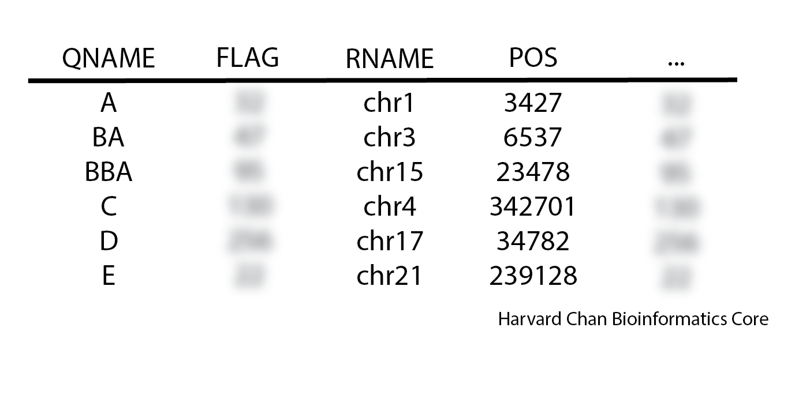

# Self-learning Answer Key

## File Formats

Using our knowledge of FLAGs in SAM files let's decode a few using the [tool on the Broad's Website](https://broadinstitute.github.io/picard/explain-flags.html). 

**1.** An alignment has a FLAG of 115. What do we know about this read?

<details>
  <summary><b>Click here to see the answer</b></summary>
    <ul><li>Read paired</li>
    <li>Read mapped in proper pair</li>
    <li>Read reverse strand</li>
    <li>Mate reverse strand</li>
    <li>First in pair</li></ul>
</details>

**2.** What would be the FLAG for a read alignment for the first read in a pair-end read, where the first read was unmapped while the second read was mapped to the reverse strand?

<details>
  <summary><b>Click here to see the answer</b></summary>
  101
</details>

**3.** Below is an alignment, what would be the CIGAR string for this alignment?

<p align="center">

</p>

<details>
  <summary><b>Click here to see the answer</b></summary>
  3M1X2M1X1D4M2X2M1M1I1M
</details>

**4.** Using `grep`, extract only the meta-information lines from the VCF file. 

<details>
  <summary><b>Click here to see the answer</b></summary>
  <pre>
  grep &#39;^##&#39; sample.vcf</pre>
</details>

**5.** using `grep`, extract the lines containing the names of all of the software packages that were used in the creation of this VCF file?

<details>
  <summary><b>Click here to see the answer</b></summary>
  <pre>
  grep &#39;^##source&#39; sample.vcf</pre>
</details>

**Bonus Challenge** 6. For the sample at position 806262 on chromosome 19, what is the reference allele?

<details>
  <summary><b>Click here to see the answer</b></summary>
  C
  <pre>
  less sample.vcf</pre>
  Then search the <code>less</code> buffer with:
  <pre>
  /19<kbd>Tab</kbd>806262</pre>
  <b>OR</b>
  <pre>
  grep -e $&#39;^19\t806262&#39; sample.vcf</pre>
</details>

**7.** Create a BED file within `~/variant_calling/` called `my_file.bed` and have it contain these three ranges:

Chromosome 1 from 84573 to 94573

Chromosome 2 from 465352 to 466352

Chromosome 19 from 111237 to 111238

<details>
  <summary><b>Click here to see the answer</b></summary>
  Open <code>vim</code> with:
  <pre>
  vim my_file.bed</pre>
  Enter insert mode and type:
  <pre>
  1 84573 94573
  2 465352  466352
  19  111237 111238</pre>
  Exit insert mode by pressing <kbd>Esc</kbd>, then save and quit the file by typing <code>:wq</code> while in Command mode. 
</details>

## Evaluating Read Qualities with `FastQC`

**1.** If the probability of a incorrect base call is 1 in 3,981, what is the associated PHRED score?

<details>
  <summary><b>Click here to see the answer</b></summary>
  -10 x log10(1/3981) &asymp; 36
</details>

**2.** Assign the path, `/The/path/to/my/vcf_file.vcf`, to a variable named `VCF_PATH` and replace the `.vcf` extension with `.filtered.vcf`.

<details>
  <summary><b>Click here to see the answer</b></summary>
  <pre>
  VCF_PATH=/The/path/to/my/vcf_file.vcf
  echo ${VCF_PATH%.vcf}.filtered.vcf</pre>
</details>

**3.** Assign the new path with the `.filtered.vcf` extension to a variable named `FILTERED_VCF_PATH` then `echo` this variable.

<details>
  <summary><b>Click here to see the answer</b></summary>
  <pre>
  FILTERED_VCF_PATH=`echo ${VCF_PATH%.vcf}.filtered.vcf`
  echo $FILTERED_VCF_PATH</pre>
</details>

**4.** Copy the BED file from  `/n/groups/hbctraining/variant_calling/sample_data/sample.bed` to `~/variant_calling/` directory. Move to the `~/variant_calling/` directory and use `sed` to stripe `chr` from the chromosome names and have the output look like:

```
1	200	300
1	600	900
2	10	1000
```

<details>
  <summary><b>Click here to see the answer</b></summary>
  <pre>
  cp /n/groups/hbctraining/variant_calling/sample_data/sample.bed ~/variant_calling/
  cd ~/variant_calling/
  sed &#39;s/chr//g&#39; sample.bed</pre>
</details>

**5.** Redirect this output to a new file called `sample.without_chr.bed`

<details>
  <summary><b>Click here to see the answer</b></summary>
  <pre>
  sed &#39;s/chr//g&#39; sample.bed &gt; sample.without_chr.bed</pre>
</details>

## Sequence Alignment Theory

**1.** The read group field LB (Library) is a required field to when adding read groups using `Picard`'s `AddOrReplaceReadGroups`, but we don't currently have this field in our read group information. How would we alter out `bwa` command to include `LB` as well?

<details>
  <summary><b>Click here to see the answer</b></summary>
  Change: 
  <pre>
  -R &quot;@RG\tID:$SAMPLE\tPL:illumina\tPU:$SAMPLE\tSM:$SAMPLE&quot;</pre>
  To:
  <pre>
  -R &quot;@RG\tID:$SAMPLE\tPL:illumina\tPU:$SAMPLE\tSM:$SAMPLE\tLB:$SAMPLE&quot;</pre>
</details>

**2.** If we wanted to increase the number of threads used by `bwa` for processing our alignment to 12, where are the two places we would need to modify our `SBATCH` script to accommodate this?

<details>
  <summary><b>Click here to see the answer</b></summary>
  Change with the <code>SBATCH</code> directives:
  <pre>
  #SBATCH -c 8</pre>
  To: 
  <pre>
  #SBATCH -c 12</pre>
  AND
  Change the <code>bwa</code> command:
  <pre>
  -t 8 \</pre>
  To:
  <pre>
  -t 12 \</pre>
</details>

## Alignment File Processing

**1.** When inspecting a SAM file you see the following order:

<p align="center">

</p>
Is this SAM file's sort order: unsorted, query-sorted, coordinate-sorted or is it ambiguous?

<details>
  <summary><b>Click here to see the answer</b></summary>
  Query-sorted
</details>

**2.** We are comparing our `SortSam` command with our colleague's command. Is there anything wrong with their syntax? Why or why not?

**Our syntax**
```
java -jar $PICARD/picard.jar SortSam \
--INPUT $SAM_FILE \
--OUTPUT $QUERY_SORTED_BAM_FILE \
--SORT_ORDER queryname
```

**Our colleague's syntax**
```
java -jar $PICARD/picard.jar SortSam \
I=$SAM_FILE \
O=$QUERY_SORTED_BAM_FILE \
SO=queryname
```

<details>
  <summary><b>Click here to see the answer</b></summary>
  No, it is just using the traditional syntax with abbreviations.
</details>

## Alignment Quality Control

**1.** Inspect your coordinate-sorted BAM file with `ViewSam` package within `Picard`. What version of `bwa` was used in the alignment?

<details>
  <summary><b>Click here to see the answer</b></summary>
  bwa version 0.7.17-r1188
</details>

**2.** Inspect your coordinate-sorted BAM file with `ViewSam` package within `Picard`. What is the flag for your first aligned read? Using the [Broad's decoding FLAG tool](https://broadinstitute.github.io/picard/explain-flags.html), what does this flag mean?

<details>
  <summary><b>Click here to see the answer</b></summary>
  129
  <ul><li>Read paired</li>
  <li>Second in pair</li></ul>
</details>

## Automation of Variant Calling

**1.** If we submit Job_A.sh and `SLURM` returns:

`Submitted batch job 213489`

And we want to start Job_B.sh after Job_A.sh finishes without error, what command would we use to do this?

<details>
  <summary><b>Click here to see the answer</b></summary>
  <pre>
  sbatch --dependency=afterok:213489 Job_B.sh</pre>
</details>

**2.** If we submit Job_X.sh and `SLURM` returns:

```
Submitted batch job 213489
```

Then we submit Job_Y.sh and `SLURM` returns:

```
Submitted batch job 213496
```

And we want to start Job_Z.sh after Job_X.sh and Job_Y.sh finishes without error, what command would we use to do this?

<details>
  <summary><b>Click here to see the answer</b></summary>
  <pre>
  sbatch --dependency=afterok:213489:213496 Job_Z.sh</pre>
</details>

**3.** If you want to submit Job_M.sh, and provide `reference.fa` as the first positional parameter and `input.bam` as the second positional parameter, how could you do this?

<details>
  <summary><b>Click here to see the answer</b></summary>
  <pre>
  sbatch Job_M.sh reference.fa input.bam</pre>
</details>

***

[Back to Schedule](../schedule/README.md)
