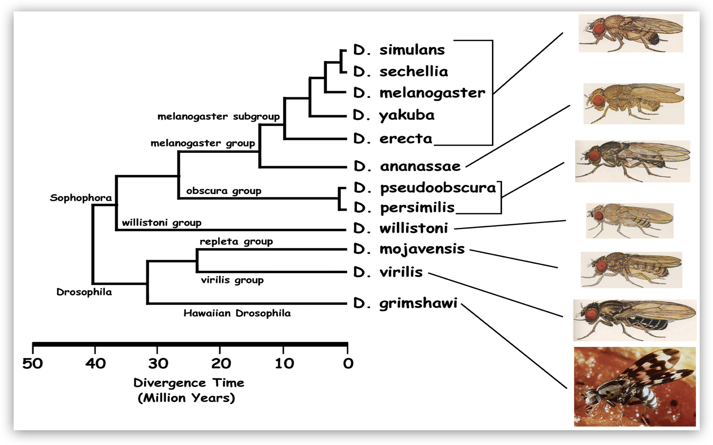
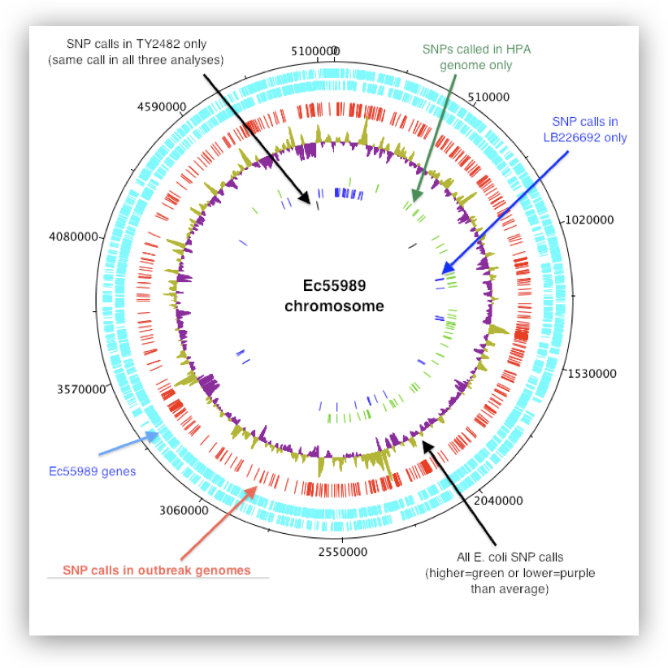
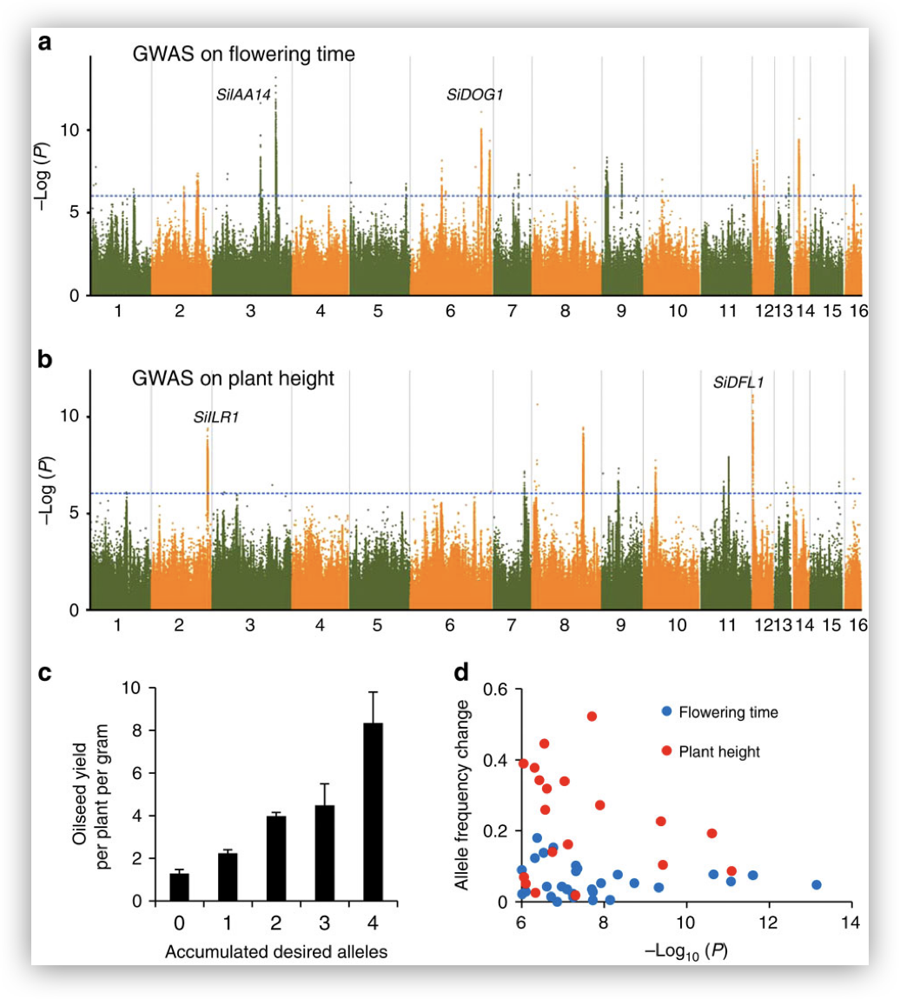
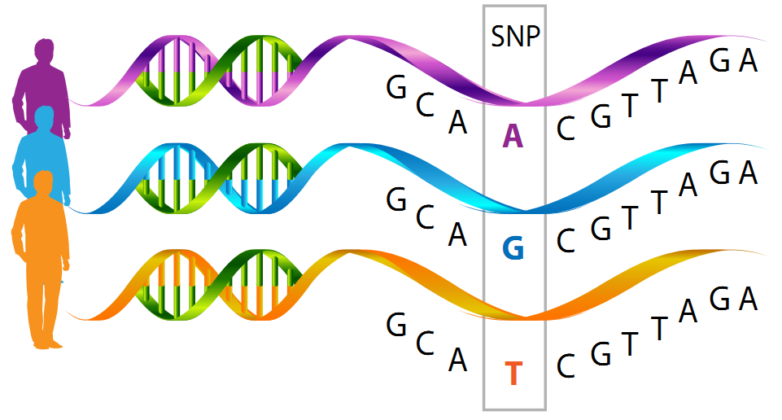
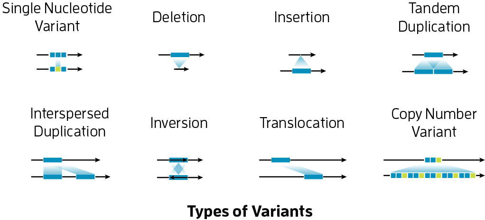
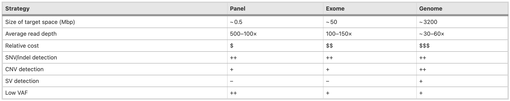
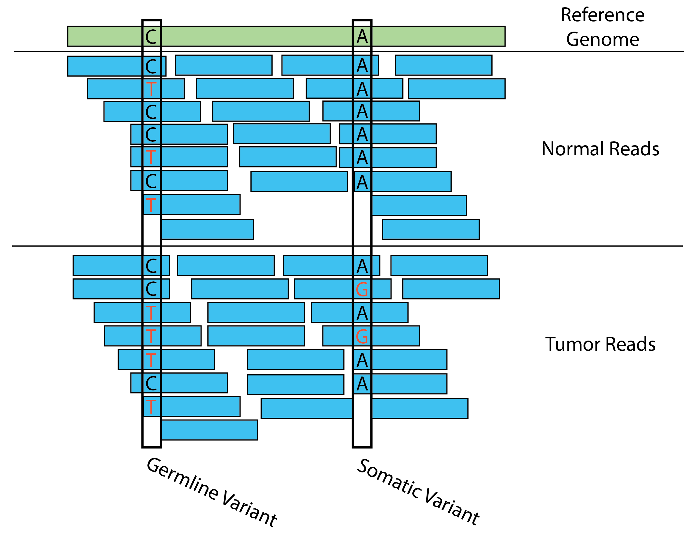
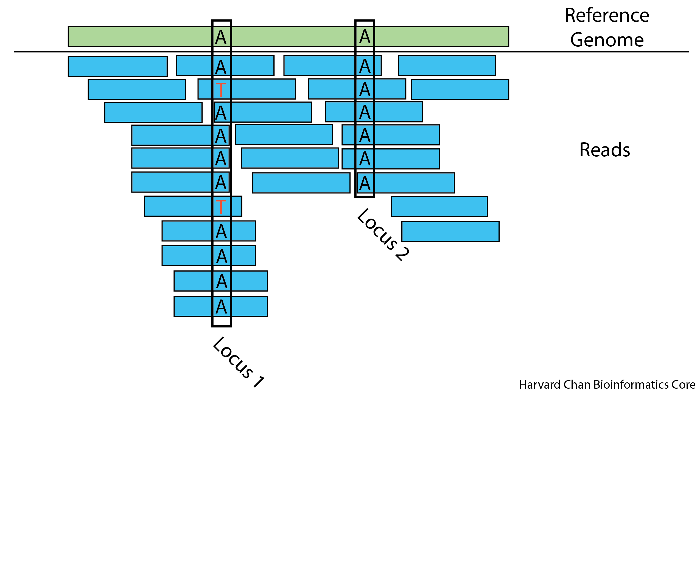

Approximate time: 45 minutes

## Learning Objectives 

- Describe different types of variants
- Differentiate between somatic and germline variants
- Describe the key steps in the variant calling pipeline

## What is genomic variation?

Genomic variation refers to differences in DNA sequences among individuals or species. Genomic variants hold significant information that can benefit many fields.

* Evolutionary biologists leverage variant calling to further our understanding of how life has diversified over time. Comparing variant profiles across different species aids in reconstructing phylogenetic relationships.

  
  Image source: http://insects.eugenes.org/DroSpeGe/

* Conservation geneticists similarly analyze variant landscapes to gauge genetic diversity in populations. Whole-genome sequencing and identification of bacteria can be useful in tracking the transmission and evolution of pathogens during outbreaks, as well as in predicting clinically relevant phenotypes such as antimicrobial resistance.

  
  Image source: https://bacpathgenomics.wordpress.com/tag/snp/

*  Variant calling also supports agricultural research aimed at developing resilient crop varieties which are well-suited for specific environmental conditions. By pinpointing variants that confer traits like drought tolerance or increased nutrient uptake, scientists can guide plant breeding efforts.

  
  Image source: Wei X, et al, Nature Comm 2015

* In medicine, the ability to precisely identify variants allows clinicians to gain insights into disease. Variant calling can reveal pathogenic mutations underlying monogenic disorders or highlight risk factors for complex multi-factorial diseases. This genomic information empowers precision approaches to diagnosis and treatment. **This area of genomic variation is the focus of this workshop.**

## Types of variants 
There are several different types variants that require their own consideration. These include:

- **Single Nucleotide Polymorphisms (SNPs)** - These are positions in the genome where a single base has been mutated. For example, perhaps most individuals in a population have a Thymine in a given position, while an individual of interest has a Adenine in this position.
- **Small Insertions/Deletions (Indels)** - Small indels are loci where a few bases have been added or removed relative to the larger population. For example, if an individual has an extra `GA` at a location relative to the rest of the population, then this would be considered a small insertion.
- **Structural Variants (SVs)** - This class refers to a broad collection of variants, including inversions, translocations and large insertions or deletions. 
- **Copy Number Variants (CNVs)** - These types of variants often occur in repetitive regions of the genome and involve having more of few copies of a given sequence. For example, the *AMY1* gene which encodes for an enzyme that is important in breaking down starches has been shown to have variable numbers of copies across human populations. Further work has shown that the number of copy numbers correlates with the levels of starch in various cultures (Perry et al., 2007). Depending on the size, copy number variants are sometimes considered a subcategory of structural variants.

  
  Image source: https://www.pacb.com/human-genetics-research/

## The Importance of Coverage

One of the **most important considerations of experimental design** when carrying out a study to identify variants is to sequence your samples to an adequate level of coverage. High coverage is helpful for two reasons:

**1)** It helps distinguish sequencing errors and artifacts from true low frequency alleles in the tumor samples.

**2)** It helps distinugish germline variants from somatic variants.

Coverage simply means for a given position, what is the average number of sequencing reads that span (or "cover") that position and it is abbreviated as the integer value followed by "X". For example, if the average position in the genome was covered by 22 reads, this sample would be considered to have 22X. **The coverage guidelines are based on which sequencing strategy you implement, as described below.**

## Sequencing strategies for variant calling

The choice of sequencing strategy for a clinical sample has important impact for variant calling, and your choice will tend to be guided based on your study design.

  
  Image source: Koboldt DC, Genome Medicine 2020

### Whole Genome Sequencing (WGS) 
Whole-genome sequencing offers the most comprehensive approach and typically yields ~ 30–60× average sequence depth across the entire genome. This is the most expensive approach.
 
* Calls variants across the entire genome, including coding and non-coding regions.
* Typically has the highest depth of coverage to reliably detect variants.
* Variant calling considers all positions simultaneously genome-wide
* Allows for structural variant detection 

### Exome sequencing
Exome sequencing, which targets virtually all ~ 20,000 protein-coding genes, typically achieves > 100× average depth across the target regions.

* Targets the protein-coding regions of genes (exons). Covers ~1-2% of genome.
* Lower coverage than WGS since focusing on smaller region.
* Variant calling is performed separately for each exon/gene region
* Good for SNP and CNV detection

### Gene panels
Single- or multi-gene panels are increasingly cost-effective means of testing for subsets of genes associated with specific clinical phenotypes. 

* Targets specific genes/loci of interest, often for clinical diagnostic purposes.
* Very focused, high coverage (1000X) of target regions
   * Enables more sensitive detection of variants at low allele frequencies
* Variant calling is done independently for each amplicon/target region due to low overlap.
* Good for SNP and CNV detection

## Germline versus Somatic Variant Calling

Variant calling can be broadly **broken up into two groups, germline and somatic**. 

**Germline variant calling** refers to the process of calling variants that are ubiquitous across the organism (i.e. almost all cells carry these variants) and these are the types of variants that can be passed through the germline. Studies that evaluate population genetics are often concerned with germline variant calling. 

**Somatic variant calling** refers to the process of calling variants that differ between cells within a single organism and these variants are not passed through the germline. Somatic variant calling is often used when studying the progression of various cancers. 

_Example of a germline variant on the left, and somatic variant on the right._ 

These two types of variant calling methods have different assumptions regarding in the input data and thus are handled differently. For example, germline variant calling for the most part expects at most two alleles in relatively equal frequencies, while a single tumor sample could have various cancer lineages with various allele frequencies. This makes **somatic variant calling more difficult than germline variant calling** because low frequency variants and sequencing artifacts are difficult to distinguish from sequencing errors. Additionally, oftentimes within somatic variant calling, you are also trying to avoid calling the germline variants. 

## Variant Calling Workflow
Depending on the sequencing strategy and whether we are looking at germline or somatic variants, the workflow will need to be modified. Typically, there will be some similarities in the processing of the raw FASTQ data through to aligned BAM files. The variant calling itself will vary based on study design, and we can address that later in this workshop.

Analyzing variants takes the form of three main steps: 

1. **Data preparation**
2. **Variant calling** 
3. **Variant evaluation** 

The detailed workflow for variant analysis that many researchers follow looks like:

**Sequence Samples** - This is the work of your sequencing facility and they should provide you with FASTQ files. 

**Read Quality Control** - It is important to assess the quality of your reads before you further analyze them. In this step, we are looking to ensure that there aren't major errors that occurred in the sequencing and that the quality of the reads is high. 

**Align Reads** - We need to match our raw FASTQ reads to the place in the genome where they most likely originated from. 

**Processing Alignment Files** - While our reads have now been assigned to a place in the genome, the files holding this information are not in the format that we need in order to call variants. We will be reformatting the alignment files in order to be useable for variant calling.

**Alignment Quality Control** - This is a second opportunity to evaluate the quality of our data. Here we are ensuring that the data aligns well with our genome.

**Call Variants** - Now we are able to call the raw variants from our data. 

**Filter Variants** - Our raw variants may have some artifacts in them and need to be processed to remove them.

**Annotate Variants** - We would be interested to know where our variants fall within the context of current gene models. We will be using existing gene models to predict the impact of a variant. We will be asking questions such as, is this a variant that creates a premature stop codon or is it in a intergenic region?

**Prioritize Variants** - Assess the annotated variants based upon their predicted functional impacts and narrow the search for important genes that may be causing a disease or trait.

***

**Exercise**

Use the figure above to try to make inferences answer the following questions:

1. If we assume there are no sequencing errors, are you more inclined to speculate that Locus 1 is a germline or somatic variant? Why?
2. Given the existence of sequencing errors, how confident are you that Locus 1 represents a heterozygous locus in the germline?
3. Given the existence of sequencing errors, how confident are you that Locus 1 represents a polymorphic locus in a somatic tissue?
4. How confident are you that Locus 2 is homozygous?
5. What additional information might you want in order to better assess these loci?

***

[Next Lesson >>](01_data_organization.md)

[Back to Schedule](../schedule/README.md)
  
***

*This lesson has been developed by members of the teaching team at the [Harvard Chan Bioinformatics Core (HBC)](http://bioinformatics.sph.harvard.edu/). These are open access materials distributed under the terms of the [Creative Commons Attribution license](https://creativecommons.org/licenses/by/4.0/) (CC BY 4.0), which permits unrestricted use, distribution, and reproduction in any medium, provided the original author and source are credited.*

