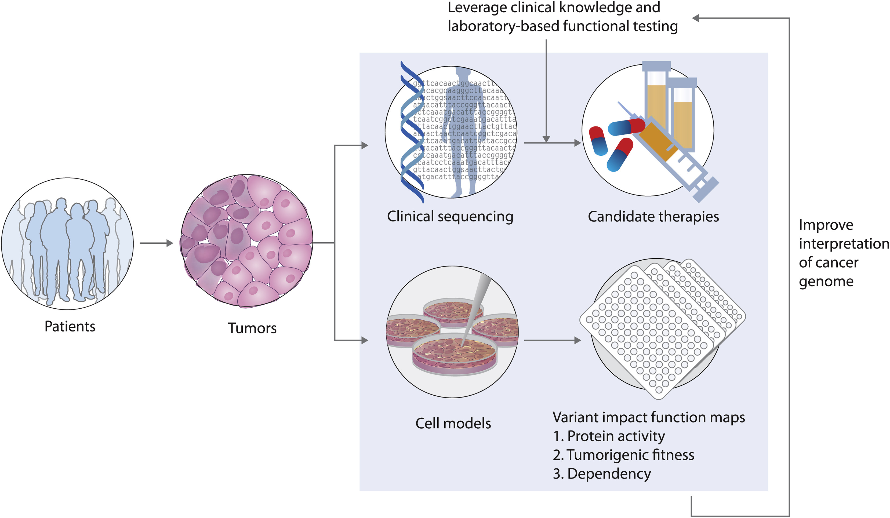
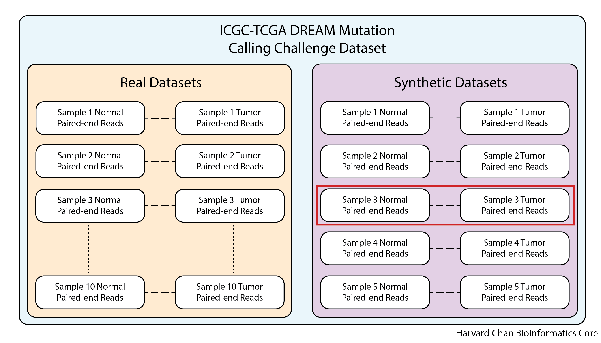

Approximate time: 45 minutes

## Learning Objectives
- Describe the ICGC-TCGA DREAM Mutation Calling Challenge Dataset
- Configure a workspace on the `/n/scratch` drive
- Organize dataset for analysis
- Differentiate between using `/home` and `/n/scratch` drives

## Cancer genomics and the application of variant calling

Cancer is the [second leading cause of death globally](https://www.who.int/health-topics/cancer#tab=tab_1), so understandably there have been considerable efforts put forth to study and treat cancer. Cancer is abnormal cell growth stemming from alterations in an individual's DNA sequence. Thus, understanding the variants observed in a given cancer can provide insight into the potential treatment options a person may undergo. 

<p align="center">
 <br>
  Image source: Johannessen CM and Boehm JS. Curr, Current Opinions in Systems Biology 2017
</p>

There is a vast amount of **cancer genomic data deposited in public repositories** which are available to researchers. These resources involve a range of large scale datasets and analysis tools, and require differing levels of computational expertise among users. Access to these resources allows us to:

* Obtain data to re-analyze and explore different questions posed from original studies
* Compare our results to large cancer databases for variant annotation
* Obtain reference datasets for benchmarking of variant calling algorithms

### [Genomics Data Commons](https://portal.gdc.cancer.gov/)
The GDC is a data repository funded by the National Cancer Institute (NCI) which provides researchers with access to genomic and clinical data from cancer patients. There is no original research conducted as part of the GDC; their main purpose is to provide centralized access to the data generated by other projects for broader research use. It contains data submitted by researchers and large scale cancer sequencing projects (such as the TCGA). The datasets go beyond whole genome sequencing, with data from RNA-seq, proteomics, imaging and other modalities. Researchers can access and query the data through the portal using built-in analysis tools, or raw data can be obtained after getting authorized access.

### [The Cancer Genome Atlas(TCGA)](https://www.cancer.gov/ccg/research/genome-sequencing/tcga)
The TCGA is a joint effort between the National Cancer Institute (NCI) and the National Human Genome Research Institute (NHGRI). The TCGA has profiled and analyzed large numbers of human tumors (across 33 different cancer types) at the DNA, RNA , protein and epigenetic levels. Researchers at the TCGA conduct the original research which includes collecting tumor samples, performing various omics analyses, and analyzing the resulting data. TCGA research has led to many discoveries about the molecular basis of cancer and identified potential biomarkers and therapeutic targets.

### [cBioPortal](https://www.cbioportal.org/)
cBioPortal is a free online resource for exploring, visualizing and analyzing cancer genomics data.

### The ICGC-TCGA DREAM Mutation Calling Challenge

While it may not be obvious at this point, calling variants is not a simple task. As a result, International Cancer Genome Consortium (ICGC) and The Cancer Genome Atlas (TCGA) co-sponsered the [DREAM Mutation Calling Challenge](https://www.synapse.org/#!Synapse:syn312572/wiki/) in order **to help develop methods to more accuarately predict cancer-associated mutations from whole genome resequencing data**. The idea was to allow software designers to compete to see who could most accuarately identify cancer-associated mutations in real normal/tumor datasets.

There are a few datasets that the ICGC-TCGA DREAM Mutation Calling Challenge made availible:

1) 10 Real Normal/Tumor datasets from anonymous cancer patients

2) 5 Synthetic Normal/Tumor datasets developed *in silico*

<p align="center">

</p>

As would be expected, due to ethical standards, using the real data requires approval from ICGC and would be difficult to use in a workshop like this where we need to able to distribute the datasets to participants. Fortunately, **the synthetic datasets are freely availble for use and do not require ICGC approval**, so this workshop will be using a single synthetic normal/tumor sample (synthetic dataset 3) which has multiple subclones, enabling detection of lower frequency variants. 

In order to expedite our methodologies and minimize resource usage in the O2 computing cluster, **we will just be using the whole exome sequencing (WES) dataset rather than a whole genome sequencing (WGS) dataset**, but all of the methods that we will be using will be applicable to both WES and WGS datasets. 


## Logging into O2

For this workshop we will be using training accounts to log into O2. These have been created for us by the [HMS Research Computing (HMS-RC) team](https://it.hms.harvard.edu/our-services/research-computing) and they are the folks that manage the O2 cluster. We will be providing each of you with your own training account associated with a password for the duration of this workshop. Your training account and password can be found [here](https://docs.google.com/spreadsheets/d/1kBlYowhjjHJC9ZovmbBULmbqozKpprM17vZ2wPlhNg0/edit#gid=0).

> If you are interested in getting your own personal account on O2, please follow the instructions provided [here](https://harvardmed.atlassian.net/wiki/spaces/O2/pages/1918304257/How+to+request+or+retain+an+O2+account) after this workshop.

Let's get started with the hands-on component by typing in the following command to log into our command-line:

<p align="center">

</p>

```
ssh username@o2.hms.harvard.edu
```

You will receive a prompt for your password, and you should type in your associated password. 

***Note: that the cursor will not move as you type in your password***.

A warning might pop up the first time you try to connect to a remote machine, type <kbd>Yes</kbd> or <kbd>Y</kbd>, then hit <kbd>Enter/Return</kbd>.

Once logged in, you should see the O2 icon, some news, and the command prompt, e.g. [rc_training10@login01 ~]$.

> Note 1: ssh stands for secure shell. All of the information (like your password) going between your computer and the O2 login computer is encrypted when using ssh.


### Creating a scratch space

> Due to the limited storage space on `/home`, we are going to take advantage of `scratch` to hold some of our intermediate files for this workshop. This is a very common use of the scratch space as many analyses will have large intermediate files, which would otherwise fill up our home directories.

While on the login node, we will create our space on `/n/scratch`. In order to do so, we will need to run a script provided by the HMS Research Computing team:

```
$ sh /n/cluster/bin/scratch_create_directory.sh 
```

> Note: You *MUST* be on a login node in order to create a space on `/n/scratch`.

It will prompt you with the following:

```
Do you want to create a scratch directory under /n/scratch/users? [y/N]> 
```

To this you will respond <kbd>y</kbd>, then hit <kbd>Enter/Return</kbd>.


Next, it will prompt you with:

```
By typing 'YES' I will comply with HMS RC guidelines for using scratch.
I also confirm that I understand that files in my scratch directory WILL NOT BE BACKED UP IN ANY WAY.
I also understand that THIRTY DAYS after I last access a given file or directory in my scratch directory,
it will be DELETED with NO POSSIBILITY of retrieval.

I understand HMS RC guidelines for using scratch: 
```

Type <kbd>YES</kbd>, then hit <kbd>Enter/Return</kbd>.

It should return:

```
Your scratch directory was created at /n/scratch/users/r/rc_trainingXX.
This has a limit of 10TiB of storage and 1 million files.
You can check your scratch quota using the scratch_quota.sh command.
```

Now that we have created our `scratch` space, you will need to start an interactive session. A login node's primary function is to enable users to log in to a cluster, it is not meant to be used for any actual work/computing. Since we will be doing some work, let's get on to a compute node:

```
$ srun --pty -p interactive -t 0-3:00 --mem 1G  /bin/bash
````

Make sure that your command prompt is now preceded by a character string that contains the word `compute`.

## Implementing data management best practices

In a [previous lesson](https://hbctraining.github.io/Intro-to-rnaseq-hpc-salmon-flipped/lessons/04a_data_organization.html), we describe the data lifecycle and the **different aspects to consider when working on your own projects**. Here, we implement some of those strategies to get ourselves setup before we begin with any analysis. 

<p align="center">

</p>

_Image acquired from the [Harvard Biomedical Data Management Website](https://datamanagement.hms.harvard.edu/data-lifecycle)_


### Organizing our project
For each experiment you work on and analyze data for, it is considered best practice to get organized by creating a planned storage space (directory structure). We will start by creating a directory that we can use for the rest of the workshop. First, make sure that you are in your home directory.

```
$ cd 
$ pwd
```

This should let us know that we are located at: `/home/rc_trainingXX`

Once we have established our location, let's begin by making the directory for our project (i.e. the analysis in this workshop):

```
$ mkdir variant_calling
```

Next, we are going to move into this newly created directory and create some additional sub-directories to hold our work:

```
$ cd variant_calling
$ mkdir scripts results figures raw_data reports
```

Our project directory now has the following structure within it to keep files organized:

```bash
variant_calling/
├── figures/
├── raw_data/
├── reports/
├── results/
└── scripts/
```

Let's move into our `raw_data` directory and copy the FASTQ files that we are going to use for our analysis:

```
$ cd raw_data
$ cp /n/groups/hbctraining/variant_calling/raw_data/*.fq.gz .
```

This may take up to a minute as there is a lot of data to copy. Now that we have created the directories that we are going to use in our `home` space. Let's move to our `/n/scratch` space so that we can set up the directories that we are going to there to hold our intermediate files:

```
$ cd /n/scratch/users/${USER:0:1}/$USER
```

> #### A quick explanation on the use of `${USER:0:1}`
> The `users` on the scratch space are organized into subdirectories starting with the first letter of their username. `${USER:0:1}` will return the first letter of the username. Test this using `echo ${USER:0:1}` at the command line.
>
> This is syntax for creating substrings in `bash`:
>`{VARIABLE:START:LENGTH}`
>  - `VARIABLE` is the variable that you would like to create a substring of
>  - `START` is the 0-based indexing of the position to start the substring
 > - `LENGTH` is the number of characters following the starting position to include in the substring

Now that we have navigated to our `scratch` space, let's go ahead and create a directory for our analysis:

```
$ mkdir variant_calling
```

Now, move inside this newly created directory and create the following directories to hold our intermediate files:

```
$ cd variant_calling
$ mkdir alignments vcf_files
```

Excellent! Our project space has now been organized and is ready for the analysis to begin!

[Next Lesson >>](02_fastqc.md)

[Back to Schedule](../schedule/README.md) 
  
***

*This lesson has been developed by members of the teaching team at the [Harvard Chan Bioinformatics Core (HBC)](http://bioinformatics.sph.harvard.edu/). These are open access materials distributed under the terms of the [Creative Commons Attribution license](https://creativecommons.org/licenses/by/4.0/) (CC BY 4.0), which permits unrestricted use, distribution, and reproduction in any medium, provided the original author and source are credited.*
