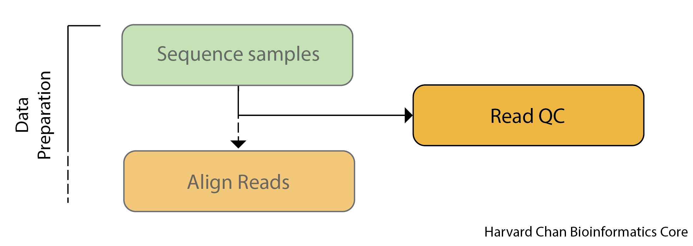
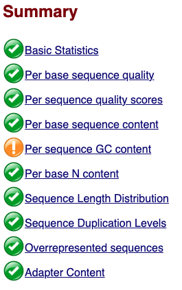
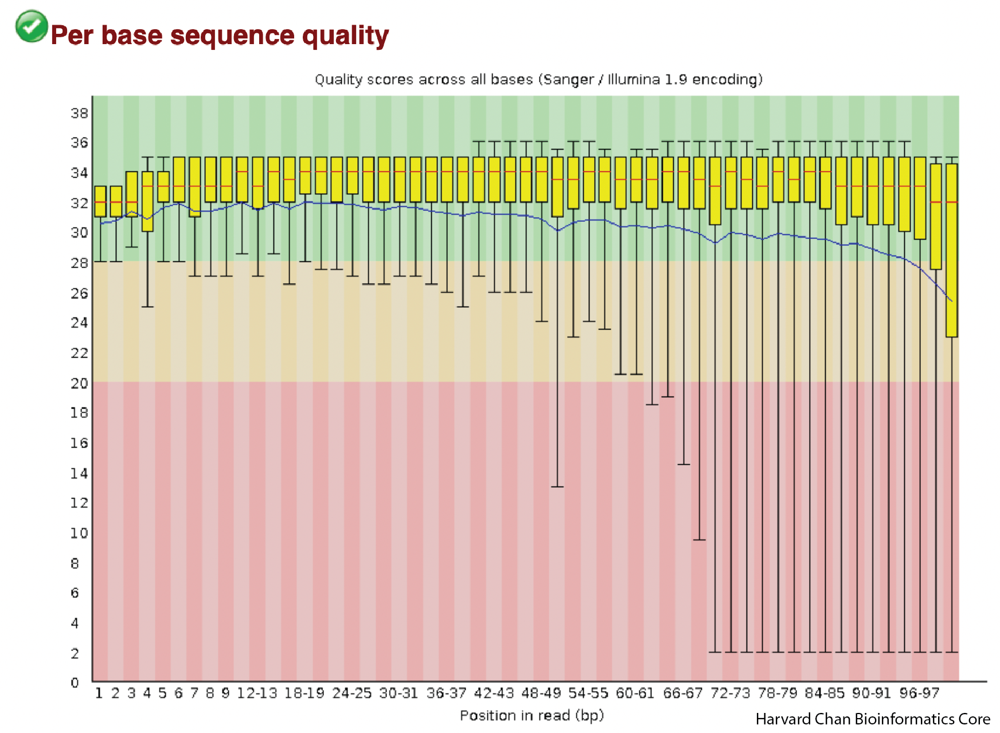
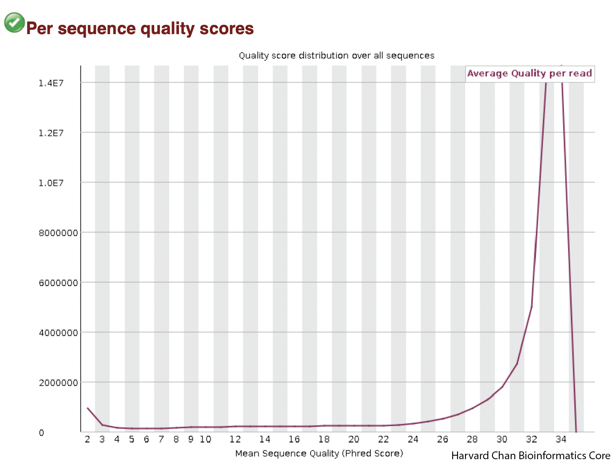
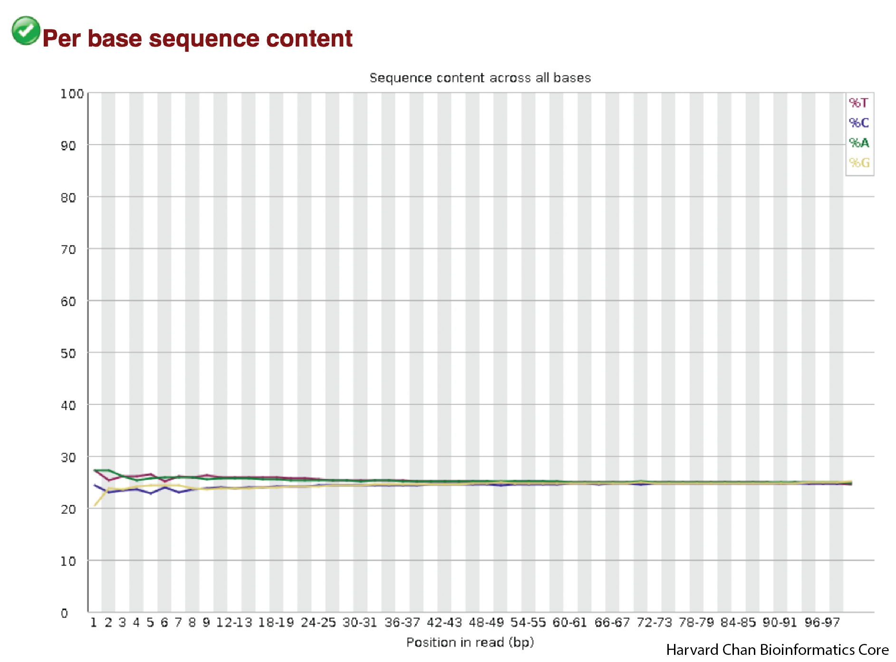
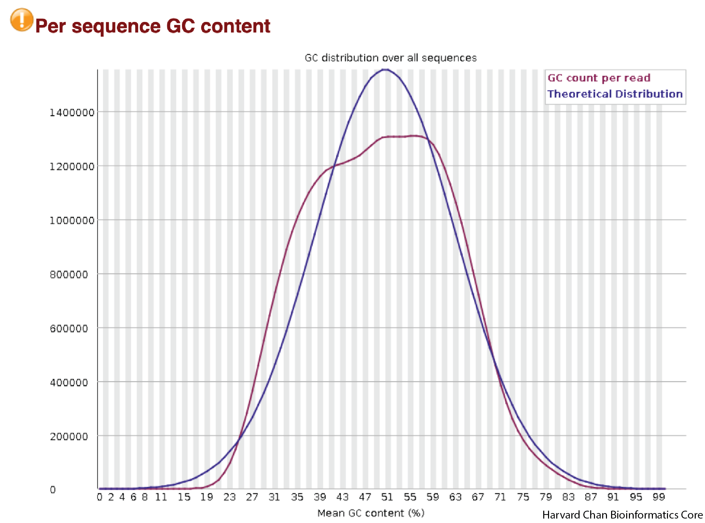
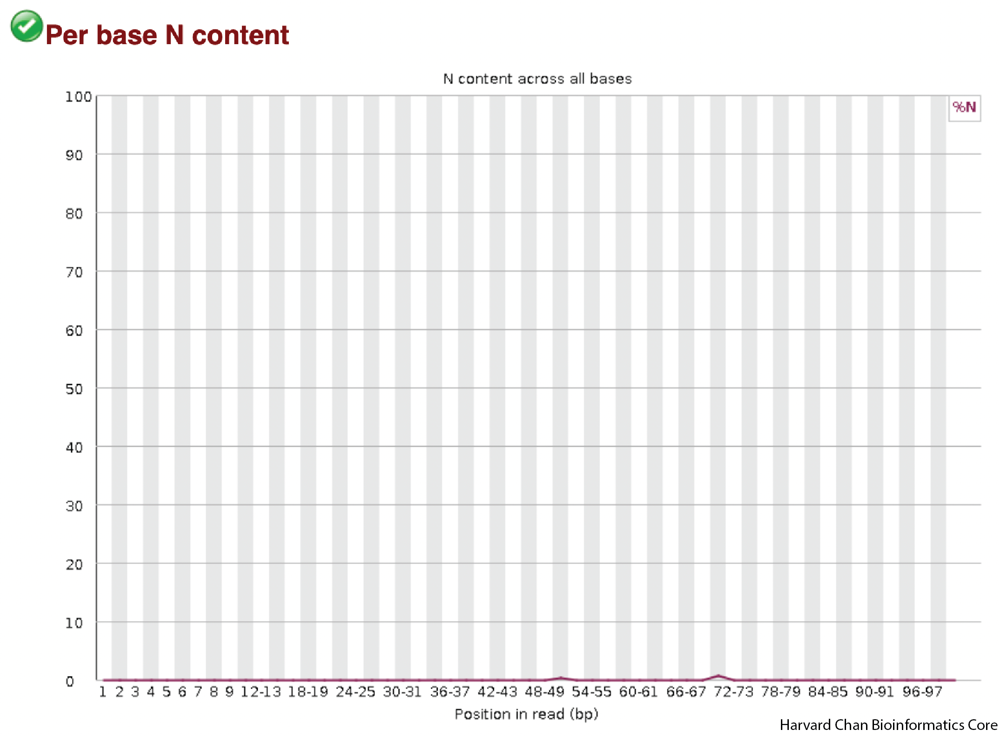
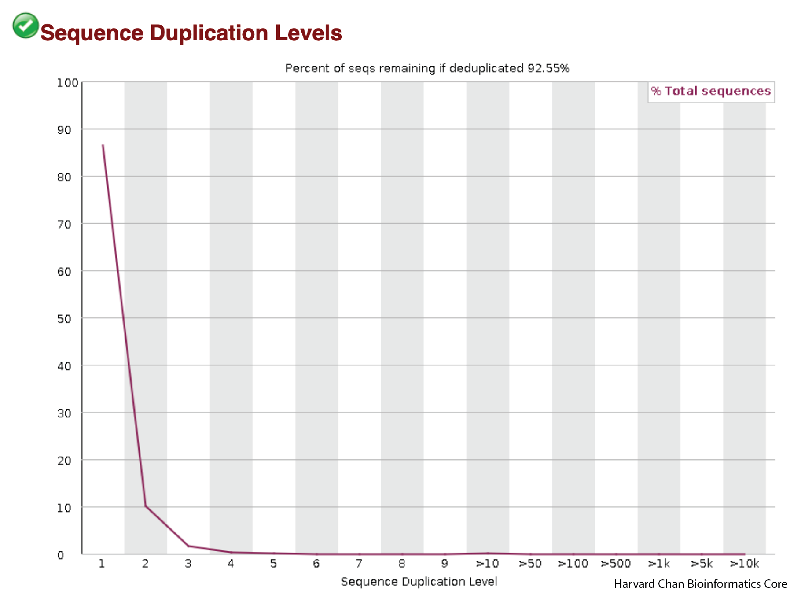
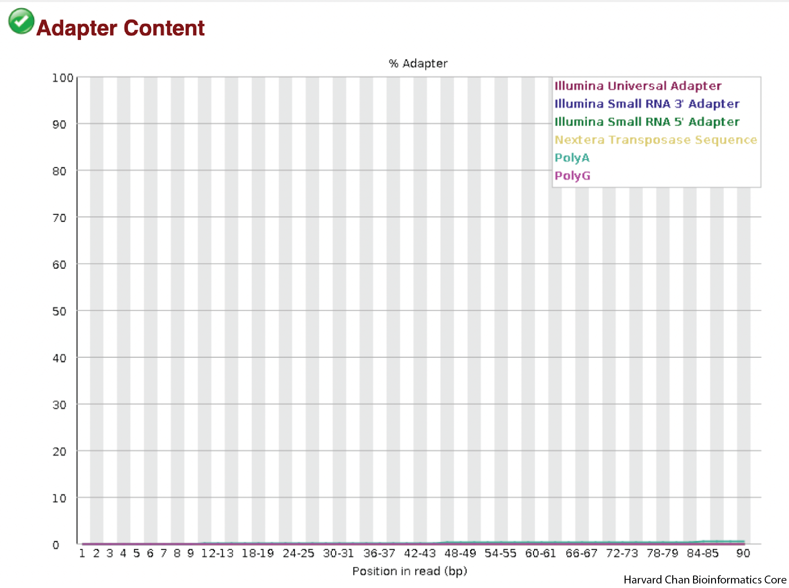

# Evaluating Read Qualities with FastQC

## Learning objectives
- Implement FastQC to evaluate read quality
- Evaluate FastQC metrics

## Importance of Evaluating Read Qualities

Before engaging in any high-throughput sequencing project is it best practice to **inspect your sequence reads to ensure that they are of high-quality**. 

<p align="center">

</p>

Sources of error include problems with library construction (most likely), a bad run on the sequencer or even a malfunctioning sequencer (very rare). Therefore, it is critically important that you **evaluate your sequenced reads** to ensure that they are high-quality before you devote time and resources to any downstream analyses.

This is **especially critical for variant calling**, since we are comparing base-by-base differences to the reference (i.e. variants). We want to be sure this is biologically meaningful and not just an artifact of a sequencing issue! 


## Unmapped read data (FASTQ)

Before we dive into QC, we need to understand the format of the files output by the sequencing pipeline. The [FASTQ](https://en.wikipedia.org/wiki/FASTQ_format) file format is the *de facto* file format for sequence reads generated by high-throughput sequencers. This file format evolved from [FASTA](https://en.wikipedia.org/wiki/FASTA_format) which is commonly used for representing nucleotide and protein sequences. The FASTQ file contains sequence data, but also contains quality information (hence the `Q` at the end). 

Similar to FASTA, the FASTQ file begins with a header line. The difference is that the FASTQ header is denoted by a `@` character. For a single record (1 sequence read), there are four lines, each of which are described below:

|Line|Description|
|----|-----------|
|1|Always begins with '@', followed by information about the read|
|2|The actual DNA sequence|
|3|Always begins with a '+', and sometimes the same info as in line 1|
|4|Has a string of characters representing the quality scores; must have same number of characters as line 2|

Let's use the following read as an example:

```
@HWI-ST330:304:H045HADXX:1:1101:1111:61397
CACTTGTAAGGGCAGGCCCCCTTCACCCTCCCGCTCCTGGGGGANNNNNNNNNNANNNCGAGGCCCTGGGGTAGAGGGNNNNNNNNNNNNNNGATCTTGG
+
@?@DDDDDDHHH?GH:?FCBGGB@C?DBEGIIIIAEF;FCGGI#########################################################
```

The line 4 has characters encoding the quality of each nucleotide in the read. The legend below provides the mapping of quality scores (Phred-33) to the quality encoding characters. *Different quality encoding scales exist (differing by offset in the ASCII table), but note the most commonly used one is fastqsanger, which is the scale output by Illumina since mid-2011.* 
```
 Quality encoding: !"#$%&'()*+,-./0123456789:;<=>?@ABCDEFGHI
                   |         |         |         |         |
    Quality score: 0........10........20........30........40                                
```
 
Using the above quality encoding character legend, the first nucelotide in the read (C) is called with a quality score of 31 (corresponding to encoding character `@`), and our Ns are called with a score of 2 (corresponding to encoding character `#`). **As you can tell by now, this is a bad read.** 

Each PHRED quality score represents the probability that the corresponding nucleotide call is incorrect, with higher PHRED scores representing lower probabilities of incorrect base calls. This quality score is logarithmically based and is calculated as:

	Q = -10 x log10(P), where P is the probability that a base call is erroneous

These probabaility values are the results from the base calling algorithm and dependent on how much signal was captured for the base incorporation. The score values can be interpreted as follows:

|Phred Quality Score |Probability of incorrect base call |Base call accuracy|
|:-------------------:|:---------------------------------:|:-----------------:|
|10	|1 in 10 |	90%|
|20	|1 in 100|	99%|
|30	|1 in 1000|	99.9%|
|40	|1 in 10,000|	99.99%|

Therefore, for the first nucleotide in the read (C), there is less than a 1 in 1000 chance that the base was called incorrectly. Whereas, for the the end of the read there is greater than 50% probabaility that the base is called incorrectly.

***

**Exercise**

**1.** If the probability of an incorrect base call is 1 in 3,981, what is the associated PHRED score?

***

## FastQC

Now we understand what information is stored in a FASTQ file, the next step is to generate quality metrics for our sequence data.

[FastQC](https://www.bioinformatics.babraham.ac.uk/projects/fastqc/) is a popular **tool for analyzing read quality for NGS data**. It can evaluate many aspects of your NGS data including:
- Read quality by position
- GC distribution
- Overrepresented sequences
- More

When working in a cluster environment, you will find that generally many tools and software are pre-installed for your use. On the O2 cluster, these tools are available through the LMOD system. Let's first check to see if the tool FastQC exists as a module:

```bash
$ module avail fastqc
```

We can decide on the version we would like to use and go ahead and load the FastQC module to use:

```bash
$ module load fastqc/0.12.1
```

You should now see that the module is loaded when you run:

```bash
$ module list
```

Now that we have loaded the module, FastQC is directly available to you like any other basic Unix command; which means we just need to provide the name of the tool to use it. _This is because the path to the executable file for FastQC has now been added to our $PATH variable._ 

> Check your $PATH variable to see whether or not you see a relevant path. Is it appended to the beginning or end? Do you see any additional paths added?
>
> `echo $PATH`

Before we actually run this QC tool on our files, let's check what options are available:

```bash
$ fastqc -h
```

It will give us an idea of the varous options we have available to modify the default behavior of the tool!


To run FastQC we need to specify two arguments: 
1. the file name(s) of our **FASTQ input** (can be a single or multiple files separated by spaces)
2. the directory where the **results (output)** will be stored, which is indicated after the `-o` flag

Since we have the FASTQ input, we just need to make the directory to hold the output:

```bash
mkdir ~/variant_calling/reports/fastqc/
```

**Example code is provided below. DO NOT RUN!**

```bash
## DO NOT RUN!

$ fastqc -o ~/variant_calling/reports/fastqc/ \
      --threads 2 \
     ~/variant_calling/raw_data/file1.fq.gz \
     ~/variant_calling/raw_data/file2.fq.gz 
```

This command is pretty strightforward, but we will explain each part:

- `fastqc` This calls the `FastQC` software package
- `--outdir` or `-o`: This is the directory for the output files to be written to
- `--threads` This specifies the number of threads that `FastQC` can use. *NOTE: FastQC cannot split up a single file to run on multiple threads, so providing it with more threads than files will be moot.*

**We are going to run FastQC on all 4 of our raw data samples using 4 cores**. To do this we need to request 4 cores for our interactive session so that FastQC is able to process all 4 files in parallel.

**If you are already on a compute node, please `exit` first.**

```bash
$ srun --pty -p interactive -t 0-3:00 --mem 1G -c 4 /bin/bash
```

Now, check that you have an interactive session with 4 cores:

```bash
$ O2squeue
```

### Running FastQC

Before we do anything else, we need to reload the module since we exited out of our single core interactive session.

```bash
$ module load fastqc/0.12.1

$ fastqc -o ~/variant_calling/reports/fastqc/ -t 4 ~/variant_calling/raw_data/*.gz 
```

Once it has finished running, we can take a look at the output files generated:

```bash
$ ls -l ~/variant_calling/reports/fastqc/
```

The FastQC output that we are most interested in is the `html` file for each sample. These reports should be inspected carefully as part of the analysis pipeline.

## Evaluate QC metrics from FastQC

The FastQC html reports are not viewable on the O2 Cluster, so we will need connect our local computers to the O2 Computing Cluster with a file transfer program in order to help us download the FastQC reports from O2. We will be using [FileZilla](https://filezilla-project.org/) in order to do this, but other file transfer software exists and can also be down through the command-line [`scp`](https://linux.die.net/man/1/scp) command.

> ### **What is FileZilla?**
>
>FileZilla is a file transfer (FTP) client with lots of useful features and an intuitive graphical user interface. It basically allows you to reliably move files securely between two computers using a point and click environment. It has cross-platform compatability so you can install it on any operating system.

### Filezilla - Step 1

Open up _FileZilla_, and click on the File tab. Choose 'Site Manager'.

<p align="center">

</p>

### Filezilla - Step 2

Within the 'Site Manager' window, do the following:

1. Click on 'New Site', and name it something intuitive (e.g. O2)
2. Host: transfer.rc.hms.harvard.edu
3. Protocol: SFTP - SSH File Transfer Protocol
4. Logon Type: Normal
5. User: Username (i.e rc_trainingXX)
6. Password: O2 password
7. Click 'Connect'

> NOTE: While using the temporary training accounts on the O2 cluster, two-factor authentication **IS NOT** required. However, if you explore this lesson when using your personal account, two-factor authentication **IS** required.
>
>In order to connect your laptop using _FileZilla_ to the O2 cluster for your personal account (non-training account), follow steps 1-7 as outlined above. Once you have clicked 'Connect', you will receive a Duo push notification (but no indication in _Filezilla_) which you must approve within the short time window. Following Duo approval, _FileZilla_ will connect to the O2 cluster.

<p align="center">

</p>

### Filezilla Interface

You will see messages printed in the message window in the top window pane, giving a you an indication of whether or not you have successfully connected to O2. Next, if this if your first time using Filezilla we recommend that you take some time to get familiar withe the basics of the interface. This [tutorial](https://wiki.filezilla-project.org/FileZilla_Client_Tutorial_(en)) is a helpful resource.

You will see two panels in the interface. On the left hand side you will see your the files in your laptop and on the right hand side you have your home directory on O2. Both panels have a directory tree at the top and a detailed listing of the selected directory's contents underneath. In the right hand panel, navigate to where the HTML files are located on O2 `~/variant_calling/results/fastqc/`. Then decide where you would like to copy those files to on your computer and move to that directory on the left hand panel.

Once you have found the html output for `syn3_normal_1_fastqc.html` **copy it over** by double clicking it or drag it over to right hand side panel. Once you have the HTML file copied over to your laptop, you can leave the Filezilla interface. You can then locate the HTML file on your computer and open it up in a browser. 

## Interpreting the HTML report

Now we can take a look at the metrics and assess the quality of our sequencing data! `FastQC` provides a green checkmark if it thinks a plot looks good, a yellow exclamation mark if it thinks a plot has some concerns and a red X if it believes that the data has failed a test. 

<p align="center">

</p>

It is exceedingly **uncommon to have green checkmarks for everything** and even data with a **few red X's can still be good data**. You should not consider FastQC's scoring very strongly, but rather interpret the data yourself and make your own judgement. This is for two reasons:

1) `FastQC` and the associated metrics are used as a first QC step for virtually all NGS analysis, but how RNA-seq, ChIP-seq, WGS sequencing look in these plots is going to vary widely. A "failure" in one or a handful of metrics could simply be the result of the type of experiement you are running.

2) Similar to the previous point, your experiment could have some peculiarities to it. While this doesn't apply as much to WGS and WES data, you could imagine if you somehow biased your subset of reads sequenced that this could have biases in the QC of the reads. This is oftentimes more applicable to other types of NGS data analysis, but can also be true for WGS and WES as well. For example, the GC content of protein coding sequences is also generally higher than the GC content of the genome at large, so WES is introducing a GC bias that you might not see in WGS data.

In general, when looking at at your data within `FastQC`, always keep your experimental design and dataset in consideration and don't read too much into the assessments that `FastQC` provides. 

### Sequence Quality

As we continue down the report, we can skip a few figures until we get to the sequence quality figure. A few things we should know about this figure:
  
  1) X-axis is position in the read and the y-axis is PHRED score
  
  2) Typically, the shape of these figures have a steep incline in the first few bases before plateauing and finally tapering off a bit. The shape should be mostly smooth. If we saw large, abrupt drops in quality this could be reason to contact your sequencing facility.
  
  3) The right read (or R2) often has low-quality than the left read (or R1) and this difference in quality if just an artifact of pair-end Illumina sequencing.

<p align="center">

</p>

The shape that we see is very typical of a good sequencing run. Imporantly, their aren't any sudden drops in read quality in these samples.

### Average Sequence Quality

The next plot is a distribution highlighting average sequence quality for a read. As opposed to the previous plot, the PHRED score is now on the x-axis and number of reads in on the y-axis.

<p align="center">

</p>

We can see that our average quality scores peak well-above 28 and they appear to be mostly unimodal. If the average PHRED score peak was lower or perhaps we saw a bimodal distribution for PHRED scores then we might have some concerns.

### Per Base Sequence Content

The next plot is showing the sequence content across the reads. The x-axis is the position in the read and the y-axis is the percent of each base. The red line is percent Thymine, the blue line is percent cytosine, green is percent Adenine and yellow is percent guanine, Ideally, you should see pretty flat lines free from spikes, but the beginning (~10 bases) can often be a bit bumpy due to primer bias. We can see this primer bias in our samples and the effect appears quite small. If you know the expected GC content of your sample, this could also be a place that you could check that your sample is in the range of what you would be expecting.

<p align="center">

</p>

As you look across out sample the lines have a bit of primer bias on the front and flatten out fairly quickly. 

### GC Content Distribution

Similar to the previous plots on sequence content, we are mostly looking to make sure that there is a reasonably normally-shaped distribution around what the expected GC content is for a reference genome/exome. Strong skews, multi-modal shapes or aburpt spikes could indicate errors in sequencing or contamination. 

<p align="center">

</p>

In the above figure, we see the shape that we would expect to see. It is mostly smooth, normally-centered around a GC-percentage reasonable for the human exome. We don't see any abrupt peaks and the curve looks mostly unimodal.

### Per base N content

When a seqeuncer is unable to make a base call at a position, it assigns the base call of N. As a result, we would hope our sample would have very few N calls. The x-axis is the position in the read and the y-axis is the percent of reads with an N in that position. We are hoping to see a mostly flat line as close to 0 as we can get. Many N calls or abrupt spikes with an abundance of N calls would be concerning.

<p align="center">

</p>

In our data, we see that it is mostly a flat line close to 0, so we don't have any concerns.

### Duplication Levels

This next plot is going to help us visualize the amount of duplicate sequence we see in the reads. The x-axis is the number of times a sequence is duplicated and the y-axis is the percentage of reads that are duplicated. This figure would ideally be strongly left-ward shifted with a tail that quickly tapers down. This would indicate that much of the sequence in the reads in not duplicated and is present in single copy.   

<p align="center">

</p>

This figure appears to be about what one would hope to see as most of the reads don't show high levels of duplication.

### Overrepresented Sequences

This table will display any overrepresented sequences and potential sources. It is not uncommon to get adaptor sequences in this table. In general, as long as their are only a handful or fewer overrepresented sequences with all of them being less than ~1%, then your sample should be fine. 

<p align="center">

</p>

These samples don't show any overrepresented sequences, which is great.

FastQC has a really well documented [manual page](http://www.bioinformatics.babraham.ac.uk/projects/fastqc/) with [detailed explanations](http://www.bioinformatics.babraham.ac.uk/projects/fastqc/Help/) about every plot in the report. 

### Adapter Content

One large source of overrepresented sequences can be the adapters used in library construction. On the x-axis we will plot the position in the read and on the y-axis it is th percent of adapter contamination for various adapter sets in that position, with each color line being a different potential adapter set. Since no adapters came up in our previous overrepresented sequences evaluation, we would not expect to see any sign of them in this plot. 

<p align="center">

</p>

We don't see any signs of adapters in our data. 

### Overall conclusions

It looks like our data looks good and there weren't any concerning issues that we need to address with the sequencing facility! We can proceed with our analysis!

***

[Next Lesson >>](03_sequence_alignment_theory.md)

[Back to Schedule](../schedule/README.md)

***

*This lesson has been developed by members of the teaching team at the [Harvard Chan Bioinformatics Core (HBC)](http://bioinformatics.sph.harvard.edu/). These are open access materials distributed under the terms of the [Creative Commons Attribution license](https://creativecommons.org/licenses/by/4.0/) (CC BY 4.0), which permits unrestricted use, distribution, and reproduction in any medium, provided the original author and source are credited.*
