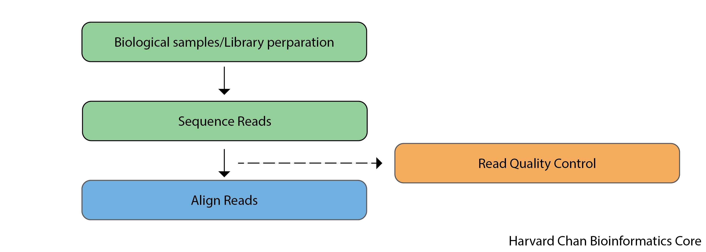

# Evaluating Read Qualities with FastQC

## Learning objectives
- Implement FastQC to evaluate read quality

## Importance of Evaluating Read Qualities

Before engaging in any high-throughput sequencing project is it best practice to inspect your sequence reads to ensure that they are of high-quality. Sources of error are be numerous and include problems with library construction (most likely), a bad run on the sequencer or even a malfunctioning sequencer (very rare). Therefore, it is critically important that you analyze your sequenced reads to ensure that they are high-quality before you devote time and resources to any downstream analyses.

This is especially critical for variant calling, since we want to be aware of whether a certain base or a series of bases look different from the reference (i.e. why they vary) due to an issue with the sequencing versus being a real/biological difference!

<p align="center">

</p>

## Unmapped read data (FASTQ)

Before we dive into QC, we need to understand the format of the files output by the sequencing pipeline. The [FASTQ](https://en.wikipedia.org/wiki/FASTQ_format) file format is the *de facto* file format for sequence reads generated by high-throughput sequencers. This file format evolved from [FASTA](https://en.wikipedia.org/wiki/FASTA_format) which is commonly used for representing nucleotide and protein sequences. The FASTQ file contains sequence data, but also contains quality information (hence the `Q` at the end). 

Similar to FASTA, the FASTQ file begins with a header line. The difference is that the FASTQ header is denoted by a `@` character. For a single record (1 sequence read), there are four lines, each of which are described below:

|Line|Description|
|----|-----------|
|1|Always begins with '@', followed by information about the read|
|2|The actual DNA sequence|
|3|Always begins with a '+', and sometimes the same info as in line 1|
|4|Has a string of characters representing the quality scores; must have same number of characters as line 2|

Let's use the following read as an example:

```
@HWI-ST330:304:H045HADXX:1:1101:1111:61397
CACTTGTAAGGGCAGGCCCCCTTCACCCTCCCGCTCCTGGGGGANNNNNNNNNNANNNCGAGGCCCTGGGGTAGAGGGNNNNNNNNNNNNNNGATCTTGG
+
@?@DDDDDDHHH?GH:?FCBGGB@C?DBEGIIIIAEF;FCGGI#########################################################
```

The line 4 has characters encoding the quality of each nucleotide in the read. The legend below provides the mapping of quality scores (Phred-33) to the quality encoding characters. *Different quality encoding scales exist (differing by offset in the ASCII table), but note the most commonly used one is fastqsanger, which is the scale output by Illumina since mid-2011.* 
```
 Quality encoding: !"#$%&'()*+,-./0123456789:;<=>?@ABCDEFGHI
                   |         |         |         |         |
    Quality score: 0........10........20........30........40                                
```
 
Using the above quality encoding character legend, the first nucelotide in the read (C) is called with a quality score of 31 (corresponding to encoding character `@`), and our Ns are called with a score of 2 (corresponding to encoding character `#`). **As you can tell by now, this is a bad read.** 

Each PHRED quality score represents the probability that the corresponding nucleotide call is incorrect, with higher PHRED scores representing lower probabilities of incorrect base calls. This quality score is logarithmically based and is calculated as:

	Q = -10 x log10(P), where P is the probability that a base call is erroneous

These probabaility values are the results from the base calling algorithm and dependent on how much signal was captured for the base incorporation. The score values can be interpreted as follows:

|Phred Quality Score |Probability of incorrect base call |Base call accuracy|
|:-------------------:|:---------------------------------:|:-----------------:|
|10	|1 in 10 |	90%|
|20	|1 in 100|	99%|
|30	|1 in 1000|	99.9%|
|40	|1 in 10,000|	99.99%|

Therefore, for the first nucleotide in the read (C), there is less than a 1 in 1000 chance that the base was called incorrectly. Whereas, for the the end of the read there is greater than 50% probabaility that the base is called incorrectly.

***

**Exercise**

**1.** If the probability of a incorrect base call is 1 in 3,981, what is the associated PHRED score?

***

## FastQC

Now we understand what information is stored in a FASTQ file, the next step is to generate quality metrics for our sequence data.

[FastQC](https://www.bioinformatics.babraham.ac.uk/projects/fastqc/) is a popular **tool for analyzing read quality for NGS data**. It can evaluate many aspects of your NGS data including:
- Read quality by position
- GC distribution
- Overrepresented sequences
- More

When working in a cluster environment, you will find that generally many tools and software are pre-installed for your use. On the O2 cluster, these tools are available through the LMOD system. Let's first check to see if the tool FastQC exists as a module:

```bash
$ module avail fastqc
```

We can decide on the version we would like to use and go ahead and load the FastQC module to use:

```bash
$ module load fastqc/0.11.9
```

You should now see that the module is loaded when you run:

```bash
$ module list
```

Now that we have loaded the module, FastQC is directly available to you like any other basic Unix command; which means we just need to provide the name of the tool to use it. _This is because the path to the executable file for FastQC has now been added to our $PATH variable._ 

> Check your $PATH variable to see whether or not you see a relevant path. Is it appended to the beginning or end? Do you see any additional paths added?
>
> `echo $PATH`

Before we actually run this QC tool on our files, let's check what options are available:

```bash
$ fastqc -h
```

It will give us an idea of the varous options we have available to modify the default behavior of the tool!


To run FastQC we need to specify two arguments: 
1. the file name(s) of our FASTQ input (can be a single or multiple files separated by spaces)
2. the directory where the results (ouput) will be stored, which is indicated after the -o flag

**Example code is provided below. DO NOT RUN!**

```bash
## DO NOT RUN!

$ fastqc -o ~/variant_calling/results/fastqc/ \
      --threads 2 \
     ~/variant_calling/raw_data/file1.fq.gz \
     ~/variant_calling/raw_data/file2.fq.gz 
```

This command is pretty strightforward, but we will explain each part:

- `fastqc` This calls the `FastQC` software package
- `--outdir` or `-o`: This is the directory for the output files to be written to
- `--threads` This specifies the number of threads that `FastQC` can use. *NOTE: FastQC cannot split up a single file to run on multiple threads, so providing it with more threads than files will be moot.*


### Confirm that we have 4 cores available to us

We are going to run FastQC on all 4 of our raw data samples using 4 cores. To do this we need to request 4 cores for our interactive session so that FastQC is able to process all 4 files in parallel.

Check whether you are in an interactive session or not by checking your command prompt for the word `compute` or `login`:
1. Does your command prompt have the word `login`?
	```bash
	$ srun --pty -p interactive -t 0-3:00 --mem 1G -c 4 /bin/bash
	```
3. Does your command prompt have the word `compute`?
	```bash
	$ exit
	```
	Now your command prompt should have the word `login` in it
	```bash
	$ srun --pty -p interactive -t 0-3:00 --mem 1G -c 4 /bin/bash
	```

Check that you have an interactive session with 4 cores:

```bash
$ O2squeue
```

### Running FastQC

Before we do anything else, we need to reload the module since we exited out of our single core interactive session.

```bash
$ module load fastqc/0.11.9

$ fastqc -o ~/variant_calling/results/fastqc/ -t 4 ~/variant_calling/raw_data/*.gz 
```

Once it has finished running, we can take a look at the output files generated:

```bash
$ ls -l ~/variant_calling/results/fastqc/
```

The FastQC output that we are most interested in is the `html` file for each sample. These reports should be inspected carefully as part of the analysis pipeline, and we are going to review one file to give you an idea of the QC metrics collected by FastQC. However, it is valuable to compare the outputs for all files together and we will show you how to do that using another tool called MultiQC after a few more steps in the analysis pipeline.

### Batch script for FastQC

We ran the analysis in an interactive session above, but what if we had many more samples? It is common for variant analysis projects, especially exome-seq projects to have 100s of samples. 

In that case, best practice is to set up one, or several, batch jobs on the cluster. *More information about batch jobs can be [found in this lesson](https://hbctraining.github.io/Intro-to-rnaseq-hpc-salmon-flipped/lessons/03_working_on_HPC.html).*

Below is an example of the script you could set up.

```bash
#!/bin/bash
## This sbatch script is for running FastQC to evaluate read qualities
## This script will used 4 cores to perform the QC analysis for all files in the raw_data/ folder within the folder specified with $folder

## Assign sbatch directives
#SBATCH -p priority
#SBATCH -t 0-00:30:00
#SBATCH -c 4
#SBATCH --mem 8G
#SBATCH -o fastqc_normal_%j.out
#SBATCH -e fastqc_normal_%j.err

## set variable(s) and 
folder=~/variant_calling/

## create output folder using the -p parameter
mkdir -p ${folder}/reports/fastqc/

## Load module
module load fastqc/0.11.9

## Run FastQC
fastqc -o ${folder}/results/fastqc/ -t 4 ${folder}/raw_data/*.gz 
```

Some notes for the above script:
* If you wanted to run more than 4 samples, you should change the number of cores you are requesting `#SBATCH -c` AND the `-t` parameter for the `fastqc` command. 
* Keep in mind the limit of [how many cores can be requested](https://harvardmed.atlassian.net/wiki/spaces/O2/pages/1586793632/Using+Slurm+Basic#Time-limits) for a given partition (`-p`).
* FastQC does not need 4 threads for 4 files, but it is utilized to speed things up. So, if you have 50 files, you can still get the FastQC run done successfully with 20 cores.

***

**Exercise**

1. What would you call the above script?
2. Where would you save the above script?
3. What command will you use to run the script?

## Review QC metrics from FastQC

[NEEDS WORK] 
* Connect to local computer using filezilla
* download 1 html file
* go through QC metrics

[NEEDS WORK]

***

[Next Lesson >>](05_sequence_alignment_theory.md)

[Back to Schedule](../schedule/README.md)

***

*This lesson has been developed by members of the teaching team at the [Harvard Chan Bioinformatics Core (HBC)](http://bioinformatics.sph.harvard.edu/). These are open access materials distributed under the terms of the [Creative Commons Attribution license](https://creativecommons.org/licenses/by/4.0/) (CC BY 4.0), which permits unrestricted use, distribution, and reproduction in any medium, provided the original author and source are credited.*
