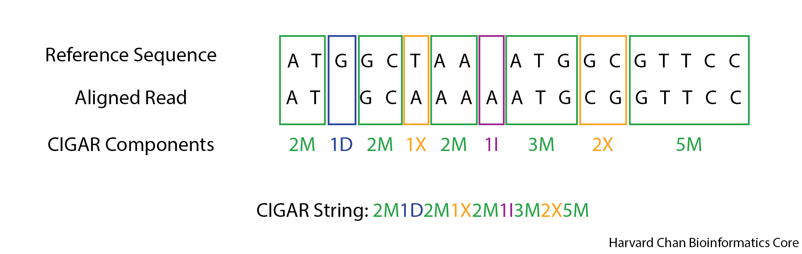

# File Formats

## Learning Objectives

- Describe the difference between 0-based and 1-based indexing
- Decode a FLAG in a SAM file in order to reveal information about the nature of the read's alignment
- Create a CIGAR string for an alignment
- Parse out variant information from a VCF file
- Create a BED file

## Indexing

Depending on your file format, position data for next-generation analyses is stored in one of two ways. 

- **Zero-based** is shown at the top of the image
- **One-based** is shown at the bottom of the image

<p align="center">

</p>

The benefits to having a **zero-based** system is the ease of calculating distance or length of sequences. We can easily determine the length of the `ATG` sequence using the zero-based coordinates by subtracting the start from the end, whereas for one-based coordinates we would need to add one after the subtraction. As we go through the various file formats, it will be important to note which are 0-based and which are 1-based.


## Alignment Files

### SAM

SAM files are files that hold alignment information. There are two main parts of components to a SAM file are:

1) Header section
2) Alignment section

#### Header section

The header section of a SAM file has several parts.

##### Metadata `@HD`

This is the first line of the SAM file and begins with `@HD`. It is optional, but it will usually have information about format version of the SAM file and the way the alignments are organized (the sort order). We will discuss sort order more when we discuss [processing alignment files](06_alignment_file_processing.md#sorting-and-removing-duplicates).

##### Sequence `@SQ`

This section of the header enumerates the sequence names (`SN`) included in the reference used for the alignment and their lengths (`LN`). One nice use of these fields, is if you ever have to evaluate the reference sequence used in an alignment, you can see which sequences were included in the alignment. This is particularly relevant if you make a custom reference.

##### Read Group `@RG`

This section of the header provides the read group metadata. This can include information on the sample, platform used for sequencing, platform unit, etc. We will discuss read groups more when we discuss [read alignment](05_sequence_alignment_theory.md#short-read-alignment) and briefly when during [alignment processing](06_alignment_file_processing.md#pipeline-for-processing-alignment-file-with-picard) in case you need to add or alter a read group.

##### Program `@PG`

This section will give you a history of the program names (`PN`) used to make the SAM file, the commands used (`CL`) and the version number (`VN`) of the program used. This can be helpful when trying to recreate an alignment file if the alignment command isn't availible to you.

##### Comments `@CO`

This section is rarely used and just contains comments regarding the alignment file. We will not be adding comments to our alignments, but once the SAM file has been converted to its binary equivalent (BAM), you can use `Picard` (a tool developed by the Broad Institute that we will use extensively in this workshop) to add comments using the [`AddCommentsToBam`](https://broadinstitute.github.io/picard/command-line-overview.html#AddCommentsToBam) package.

#### Alignment Section

The alignment section of a SAM file stores alignment data for reads that have attempted to be aligned (sometimes also referred to as mapped) to a reference sequence, such as a reference genome or transcriptome. They also store information on reads that were unable to be aligned to the reference sequence. The section has 11 mandatory fields (columns) with additional optional fields. The fields are:

|  Field Name  | Description |
|--------------|-------------|
| QNAME | Read Identifier | 
| FLAG | Bit-wise flag (see below for more information) |
| RNAME | Reference sequence name, such as the chromosome or contig of an alignment | 
| POS | 1-based position of the leftmost alignment |
| MAPQ | Mapping quality |
| CIGAR | CIGAR String (see below for more information) | 
| RNEXT | Reference sequence name for the mate pair or next read |
| PNEXT | Position for the mate pair or next read | 
| TLEN | The observed distance of the alignment |
| SEQ | The nucleotide sequence. If '\*' then the sequence is not stored. If '=', the seqeunce matches the reference. |
| QUAL | The base quality in Phred +33 standard. If '\*' base quality is not stored.

Information on the additional optional fields can be found [here](https://samtools.github.io/hts-specs/SAMv1.pdf).

##### FLAG

The bit-wise flags that SAM files use are very helpful for giving the user a rough understanding of the read. Details such as whether the read is paired, has an alignment to the provided reference sequence or is a PCR duplicate can all be encoded into the FLAG. 

The simplest way to consider a unique flag is that it is the sum of many bit-wise toggle. The table below tries to illustrate this concept.

|  Value   | Interpretation |  Value  | Interpretation |
|----------|----------------|---------|----------------|
| 0 | Unpaired read | 1 | Paired read |
| 0 | Reads were not properly paired | 2 | Paired-end reads both mapped and were near each other |
| 0 | Read is unmapped | 4 | Read is mapped |
| 0 | Mate-pair read is unmapped | 8 | Mate-pair read is mapped  |
| 0 | Read is on the forward strand | 16 | Read is on the reverse strand |
| 0 | Mate-pair read is on the forward strand | 32 | Mate-pair read is on the reverse strand |
| 0 | Read is not the first read in a pair | 64 | Read is the first read in a pair |
| 0 | Read is not the second read in a pair | 128 | Read is the second read in a pair |
| 0 | This is the primary alignment | 256 | This is not the primary alignment |
| 0 | Read passing QC checks | 512 | Read not passing QC checks |
| 0 | Read is not a PCR or optical duplicate | 1028 | Read is a PCR or optical duplicate |
| 0 | This is a supplementary alignment | 2056 | This is not a supplementary alignment |

For each alignment, an aligner goes through this table and assigns the alignement a score for each row. The scores are summed up and that produces the flag. This [tool on the Broad's Website](https://broadinstitute.github.io/picard/explain-flags.html) can be very helpful for decoding the SAM FLAGs that you can encounter.

---

**Exercise**

Using our knowledge of FLAGs in SAM files let's decode a few using the [tool on the Broad's Website](https://broadinstitute.github.io/picard/explain-flags.html). 

1. An alignment has a FLAG of 115. What do we know about this read?

2. What would be the FLAG be for a read alignment for the first read in a pair-end read, where the first read was unmapped while the second read was mapped to the reverse strand?

---

##### CIGAR

The CIGAR string is an alphanumeric string to help give the user a better understanding of the alignment. There are several categories used in the CIGAR string, but the four most common ones that we are likely to encounter are:

| Abbreviation | Explanation |
|----------|----------------|
| M | Match |
| X | Mismatch |
| I | Insertion |
| D | Deletion |

A CIGAR string is expressed from the left of the read and going to the right. It will describe the bases observed or not observed in the read. Each base is categorized and then the categorizations are notated by a value representing the number of consecutive bases with a given categorization followed by the abbreviation for that categorization. This is continued until the end of the read. An example alignment and resulting CIGAR string can be found below: 

<p align="center">

</p>

---

**Exercise**

1. Below is an alignment, what would be the CIGAR string for this alignment?

<p align="center">

</p>

---

### BAM

As you might suspect, because SAM files hold alignment information for all of the reads in an sequencing run and there are oftentimes millions of sequence reads, SAM files are very large and cumbersome to store. As a result, SAM files are often stored in a binary compressed version called a BAM file. Most software packages are agnostic to this difference and will accept both SAM and BAM files, despite BAM files not being human readable. It is generally considered best practice to your data in BAM format for long periods of time unless you specifically need the SAM version of the alignment in order to reduce unnecessary storage on a shared computing cluster.

## VCF

The [Variant Call Format (VCF)](https://samtools.github.io/hts-specs/VCFv4.2.pdf) is a standardized, text-file format for describing variants identifed from a sequencing experiment. This allows for downstream processes to be streamlined and also allows for researchers to easily collaborate and manipulate a shared set of variant calls. A VCF file is composed of three main parts:
- Meta-information Lines
- Header Line
- Data Lines

### Meta-information Lines

The first lines in a VCF file are called the ***meta-information lines***. These lines contain information regarding how the file was made and what the file contains. A sample of the meta-information lines can be found below:

```
##fileformat=VCFv4.2
##FILTER=<ID=FAIL,Description="Fail the site if all alleles fail but for different reasons.">
##FILTER=<ID=PASS,Description="Site contains at least one allele that passes filters">
##FILTER=<ID=base_qual,Description="alt median base quality">
...
##FORMAT=<ID=AD,Number=R,Type=Integer,Description="Allelic depths for the ref and alt alleles in the order listed">
##FORMAT=<ID=AF,Number=A,Type=Float,Description="Allele fractions of alternate alleles in the tumor">
##FORMAT=<ID=DP,Number=1,Type=Integer,Description="Approximate read depth (reads with MQ=255 or with bad mates are filtered)">
...
##GATKCommandLine=<ID=FilterMutectCalls,CommandLine="FilterMutectCalls --output /n/scratch3/users/w/wig051/variant_calling/vcf_files/mutect2_syn3_normal_syn3_tumor_GRCh38.p7-filt.vcf --variant /n/scratch3/users/w/wig051/variant_calling/vcf_files/mutect2_syn3_normal_syn3_tumor_GRCh38.p7-raw.vcf --reference /n/groups/hbctraining/variant_calling/reference/GRCh38.p7.fa ... Version="4.1.9.0",Date="February 15, 2023 10:32:47 PM EST">
##GATKCommandLine=<ID=Mutect2,CommandLine="Mutect2 --tumor-sample syn3_tumor --normal-sample syn3_normal --output /n/scratch3/users/w/wig051/variant_calling/vcf_files/mutect2_syn3_normal_syn3_tumor_GRCh38.p7-raw.vcf --input /n/scratch3/users/w/wig051/variant_calling/alignments/syn3_normal_GRCh38.p7.coordinate_sorted.bam --input /n/scratch3/users/w/wig051/variant_calling/alignments/syn3_tumor_GRCh38.p7.coordinate_sorted.bam --reference /n/groups/hbctraining/variant_calling/reference/GRCh38.p7.fa --sequence-dictionary /n/groups/hbctraining/variant_calling/reference/GRCh38.p7.dict --annotation ClippingRankSumTest --annotation DepthPerSampleHC --annotation MappingQualityRankSumTest --annotation MappingQualityZero --annotation QualByDepth --annotation ReadPosRankSumTest --annotation RMSMappingQuality --annotation FisherStrand --annotation MappingQuality --annotation DepthPerAlleleBySample --annotation Coverage ... Version="4.1.9.0",Date="February 15, 2023 7:55:01 PM EST">
##INFO=<ID=AS_FilterStatus,Number=A,Type=String,Description="Filter status for each allele, as assessed by ApplyRecalibration. Note that the VCF filter field will reflect the most lenient/sensitive status across all alleles.">
##INFO=<ID=AS_SB_TABLE,Number=1,Type=String,Description="Allele-specific forward/reverse read counts for strand bias tests. Includes the reference and alleles separated by |.">
##INFO=<ID=AS_UNIQ_ALT_READ_COUNT,Number=A,Type=Integer,Description="Number of reads with unique start and mate end positions for each alt at a variant site">
...
##MutectVersion=2.2
##contig=<ID=1,length=248956422>
##contig=<ID=HSCHR1_CTG1_UNLOCALIZED,length=175055>
##contig=<ID=HSCHR1_CTG2_UNLOCALIZED,length=32032>
...
##filtering_status=These calls have been filtered by FilterMutectCalls to label false positives with a list of failed filters and true positives with PASS.
##normal_sample=syn3_normal
##source=FilterMutectCalls
##source=Mutect2
##tumor_sample=syn3_tumor
#CHROM  POS     ID      REF     ALT     QUAL    FILTER  INFO    FORMAT  syn3_normal     syn3_tumor
1       137221  .       T       G       .       normal_artifact;strand_bias;weak_evidence       AS_FilterStatus=weak_evidence,strand_bias;AS_SB_TABLE=44,40|0,6;ClippingRankSum=1.739;DP=91;ECNT=1;FS=15.787;GERMQ=93;MBQ=32,32;MFRL=334,339;MMQ=22,35;MPOS=26;MQ=30.08;MQ0=0;MQRankSum=1.446;NALOD=-4.708e+00;NLOD=2.44;POPAF=6.00;ReadPosRankSum=-0.866;TLOD=4.45     GT:AD:AF:DP:F1R2:F2R1:SB        0/0:40,3:0.089:43:21,2:18,1:22,18,0,3   0/1:44,3:0.081:47:25,1:18,2:22,22,0,3
1       186370  .       C       T       .       map_qual;normal_artifact;weak_evidence  AS_FilterStatus=weak_evidence,map_qual;AS_SB_TABLE=111,70|10,3;ClippingRankSum=1.928;DP=207;ECNT=1;FS=4.234;GERMQ=93;MBQ=33,31;MFRL=341,342;MMQ=25,25;MPOS=14;MQ=25.66;MQ0=0;MQRankSum=-0.158;NALOD=-7.956e+00;NLOD=10.68;POPAF=6.00;ReadPosRankSum=-1.732;TLOD=5.07    GT:AD:AF:DP:F1R2:F2R1:SB        0/0:96,7:0.075:103:45,4:50,3:56,40,6,1  0/1:85,6:0.067:91:42,1:43,4:55,30,4,2
1       187019  .       G       A       .       map_qual;normal_artifact;weak_evidence  AS_FilterStatus=weak_evidence,map_qual;AS_SB_TABLE=56,76|6,3;ClippingRankSum=-4.266;DP=149;ECNT=1;FS=7.413;GERMQ=93;MBQ=34,33;MFRL=344,351;MMQ=50,20;MPOS=1;MQ=42.64;MQ0=0;MQRankSum=-4.743;NALOD=-1.314e+00;NLOD=10.65;POPAF=6.00;ReadPosRankSum=-4.367;TLOD=4.26      GT:AD:AF:DP:F1R2:F2R1:SB        0/0:60,3:0.061:63:27,3:30,0:25,35,3,0   0/1:72,6:0.085:78:31,4:39,2:31,41,3,3
```

Meta-information lines always begin with `##`. Let's analyze a few of the meta-information lines to understand what they are describing:

- The first line `##fileformat=VCFv4.2` is telling us the version of the VCF file. 

- The next sets of lines  starting with `##FILTER` can tell us about filters that we have applied and these can be seen in the `FILTER` field in the data lines (see below). The `ID` is what will appear in the `FILTER` field and the `Description` is a bit deeper description of what this filter tag means.

- Similiarly to our `##FILTER` lines, the `##FORMAT` lines can tell us about the format used in the `FORMAT` field. The `ID` is the abbreviation that will be seen in the `FORMAT` field and the `Description` is a bit deeper explaination of what the formatting is.

- This VCF file was made with two commands from the package `GATK` and so it has a pair of `##GATKCommandLine` lines. VCF files should list each command that was used to produce them. These lines should contain all of the parameters used to create the VCF files along with the version of the program used to create the VCF file.

- Like the `##FILTER` and `##FORMAT` fields prior, `##INFO` fields outline the abbreviations (the `ID`s) that can be found in the `INFO` field of the VCF file along with their `Description`.

- The `##MutectVersion=2.2` is just telling the user the version of the `GATK` package, `MuTect2`, that was used to make the variant calls.

- The `##contig` lines outline the name (`ID`) and length (`length`) of each contig in the reference sequence.

- The `##filtering_status` is a bit unique to `MuTect2`. We will discuss this process a bit more when we discuss [variant filtering](10_variant_filtering.md). In short, `MuTect2` has a "call everything, filter later" approach and this is signifying that the filtering step to add the FILTER tags to the FILTER fields has been done. Prior to this step this field read:

```
##filtering_status=Warning: unfiltered Mutect 2 calls.  Please run FilterMutectCalls to remove false positives.
```

- The `##normal_sample=syn3_normal` and `##tumor_sample=syn3_tumor` sample lines are defining which samples are our normal and tumor samples.

- The `##source=FilterMutectCalls` and `##source=Mutect2` lines give us a brief idea of the two software packages that have been run to create our VCF file, but these are not as in-depth as the `##GATKCommandLine` lines.


### Header Line

The header line is a single line between the meta-information lines and the data lines that provies a brief desciption of each field in the following data lines. An example header line could look like:

```
#CHROM  POS ID  REF ALT QUAL  FILTER  INFO  FORMAT  syn3_normal     syn3_tumor
```

The header line always starts with just a single `#` followed by eight mandatory fields:

- **CHROM** - Chromosome where the variant was found
- **POS** - A 1-based index for the position on the chromosome where the variant was found. For multibase variants, this corresponds to the first base's position.
- **ID** - If a SNP has an identifier (i.e. such as an rs number(s) from dbSNP), then it is put here. Otherwise, it will be a `.`.
- **REF** - The reference base(s) for the given position
- **ALT** - The variant base(s) for the given position. In the case of multiple variants present, they will be comma separated.
- **QUAL** - A PHRED-scaled quality score for the variant
- **FILTER** - A status of 'PASS' is given for any variant passing all filters. If a variant fails, then a semi-colon separated list will enumerate the filter(s) that the variant failed.
- **INFO** -  Additional information about the variant. Common catergories can be found in the table below:

| Abbreviation | Data Type |
|--------------|-----------|
| AF | Allele Frequency for the ALT allele |
| DP | Combined Depth across all samples |
| NS | Number of samples with data |

- **FORMAT** - A colon-separated list of abbreviated catergories corresponding to the colon-separated genotype fields. For example, this colon-separated list generally begins with `GT`, which stands for genotype. Thus, the first element in the subsequent genotype field(s) for each sample will be the inferred genotype. If the second element in the colon-sperated list is `GQ`, then the second element in each of the colon-separated genotype fieds will be a genotype quality score. Common catergories include:

| Abbreviation | Data Type |
|--------------|-----------|
| GT* | Genotype |
| DP | Depth of the sample |
| GQ | Genotype Quality |
| HQ | Commma-separated list of Haplotype Qualities |

\* The genotype field will have two integers for a diploid sample separated by either a `/` or a `|`. The integers correspond to the alleles with 0 being the reference allele, 1 being the first allele listed in the ALT field, 2 being the second allele listed in the ALT field, etc. A `/` denotes an unphased genotype, while `|` denotes a phased genotype.
- **Genotype Fields** - A colon-separated list of genotype information about a given sample that corresponds to the categories outlined in the FORMAT field. The fields will be equal to the number of samples investigated. In the case of the sample VCF, these are the fields titled `syn3_normal` and `syn3_tumor`.

The abbreviations for the INFO and FORMAT fields given in the aforementioned tables is not exhaustive. Generally, these abbreviations with be outlined in the meta-information lines at the top of the file or can be found on pages 5 and 6 of the [VCF manual](https://samtools.github.io/hts-specs/VCFv4.2.pdf).

### Data Lines

The data lines are where the variant calls will be found with each field corresponding to its column in the header line. 

```
1       137221  .       T       G       .       normal_artifact;strand_bias;weak_evidence       AS_FilterStatus=weak_evidence,strand_bias;AS_SB_TABLE=44,40|0,6;ClippingRankSum=1.739;DP=91;ECNT=1;FS=15.787;GERMQ=93;MBQ=32,32;MFRL=334,339;MMQ=22,35;MPOS=26;MQ=30.08;MQ0=0;MQRankSum=1.446;NALOD=-4.708e+00;NLOD=2.44;POPAF=6.00;ReadPosRankSum=-0.866;TLOD=4.45     GT:AD:AF:DP:F1R2:F2R1:SB        0/0:40,3:0.089:43:21,2:18,1:22,18,0,3   0/1:44,3:0.081:47:25,1:18,2:22,22,0,3
1       186370  .       C       T       .       map_qual;normal_artifact;weak_evidence  AS_FilterStatus=weak_evidence,map_qual;AS_SB_TABLE=111,70|10,3;ClippingRankSum=1.928;DP=207;ECNT=1;FS=4.234;GERMQ=93;MBQ=33,31;MFRL=341,342;MMQ=25,25;MPOS=14;MQ=25.66;MQ0=0;MQRankSum=-0.158;NALOD=-7.956e+00;NLOD=10.68;POPAF=6.00;ReadPosRankSum=-1.732;TLOD=5.07    GT:AD:AF:DP:F1R2:F2R1:SB        0/0:96,7:0.075:103:45,4:50,3:56,40,6,1  0/1:85,6:0.067:91:42,1:43,4:55,30,4,2
1       187019  .       G       A       .       map_qual;normal_artifact;weak_evidence  AS_FilterStatus=weak_evidence,map_qual;AS_SB_TABLE=56,76|6,3;ClippingRankSum=-4.266;DP=149;ECNT=1;FS=7.413;GERMQ=93;MBQ=34,33;MFRL=344,351;MMQ=50,20;MPOS=1;MQ=42.64;MQ0=0;MQRankSum=-4.743;NALOD=-1.314e+00;NLOD=10.65;POPAF=6.00;ReadPosRankSum=-4.367;TLOD=4.26      GT:AD:AF:DP:F1R2:F2R1:SB        0/0:60,3:0.061:63:27,3:30,0:25,35,3,0   0/1:72,6:0.085:78:31,4:39,2:31,41,3,3
...
1       1324300 .       G       A       .       PASS    AS_FilterStatus=SITE;AS_SB_TABLE=47,6|11,0;ClippingRankSum=0.390;DP=68;ECNT=1;FS=2.373;GERMQ=93;MBQ=27,27;MFRL=337,338;MMQ=60,60;MPOS=27;MQ=60.00;MQ0=0;MQRankSum=0.000;NALOD=1.54;NLOD=9.88;POPAF=6.00;ReadPosRankSum=-0.125;TLOD=24.65        GT:AD:AF:DP:F1R2:F2R1:SB        0/0:33,0:0.028:33:12,0:20,0:32,1,0,0    0/1:20,11:0.367:31:6,6:12,5:15,5,11,0
```

Let's analyze this last line more closely:

```
1       1324300 .       G       A       .       PASS    AS_FilterStatus=SITE;AS_SB_TABLE=47,6|11,0;ClippingRankSum=0.390;DP=68;ECNT=1;FS=2.373;GERMQ=93;MBQ=27,27;MFRL=337,338;MMQ=60,60;MPOS=27;MQ=60.00;MQ0=0;MQRankSum=0.000;NALOD=1.54;NLOD=9.88;POPAF=6.00;ReadPosRankSum=-0.125;TLOD=24.65        GT:AD:AF:DP:F1R2:F2R1:SB        0/0:33,0:0.028:33:12,0:20,0:32,1,0,0    0/1:20,11:0.367:31:6,6:12,5:15,5,11,0
```

This variant is on chromosome `1` at position `1324300`. It has a `.` in the third field because it hasn't been annotated with dbSNP yet, but that may change if we annotate this file. The reference allele in the position was a `G` and a variant allele, `A`, was found. The fifth field `.` signifies that it doesn't have a PHRED quality score associated with this variant. This variant passed all of the filters. For each sample we will have information on the genotype, allele depths listed in order, the alternate allele frequency, depth at this site, counts of reads in F1R2 pair orientation supporting each allele, counts of reads in F2R1 pair orientation supporting each allele and some statistics on strand bias. 

### Exercises

Let's analzye this sample VCF file found here `/n/groups/hbctraining/variant_calling/sample_data/sample.vcf `. First let's move into out `variant_calling` directory and copy over the file:

```
cd ~/variant_calling/
cp /n/groups/hbctraining/variant_calling/sample_data/sample.vcf .
```

1. Using `grep`, extract only the meta-information lines from the VCF file. 

Answer: `grep '^##' sample.vcf`

2. using `grep`, extract the lines containing the names of all of the software packages that were used in the creation of this VCF file?

Answer: `grep '^##source' sample.vcf`

**Bonus Challenge**3. For the sample at position 806262 on chromosome 19, what is the reference allele?

Answer: C, `less sample.vcf` then search `/19<Press Tab here to create ^I>806262` or `grep -e $'^19\t806262' sample.vcf` 

## BED

**B**rowser **E**xtensible **D**ata (BED) is a tab-delimited file format that contains information on genomic features. A BED file's first three columns (Chromosome, Starting Position and Ending Position) are required fields. Some BED files have additional columns but these are not required.

<p align="center">

</p>

It is important to note that BED files positioning have ***zero-based indexing***. 


[Next Lesson >>](04_fastqc.md)

[Back to Schedule](../schedule/README.md)

***

*This lesson has been developed by members of the teaching team at the [Harvard Chan Bioinformatics Core (HBC)](http://bioinformatics.sph.harvard.edu/). These are open access materials distributed under the terms of the [Creative Commons Attribution license](https://creativecommons.org/licenses/by/4.0/) (CC BY 4.0), which permits unrestricted use, distribution, and reproduction in any medium, provided the original author and source are credited.*
