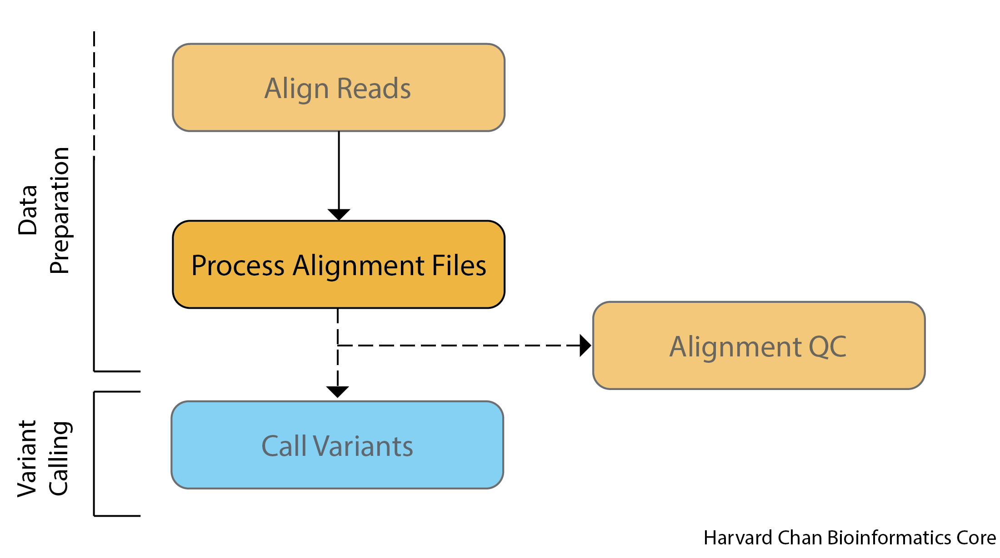
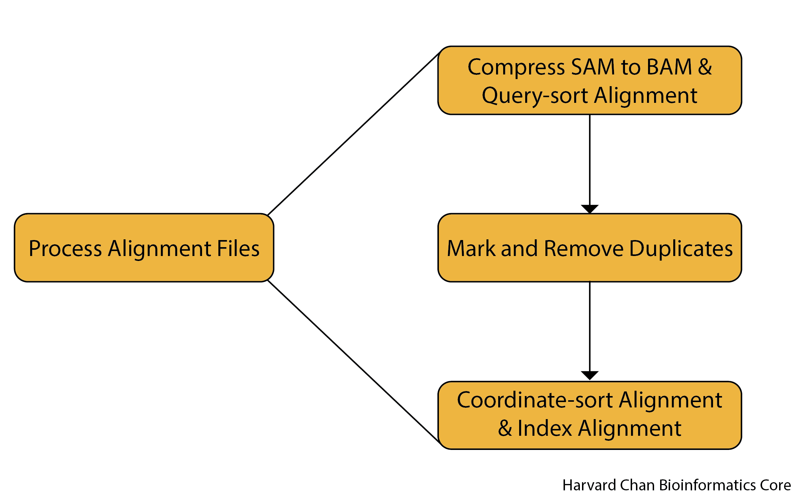
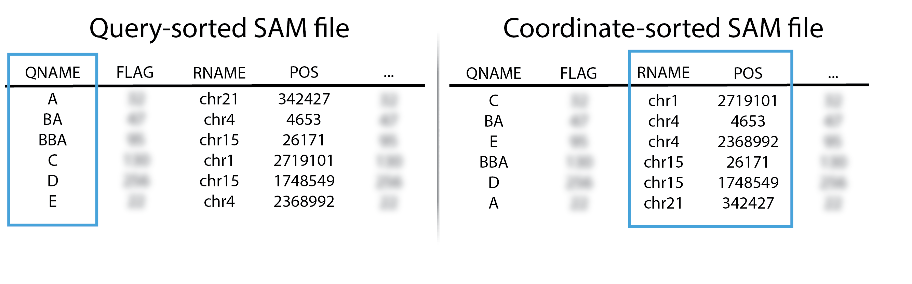
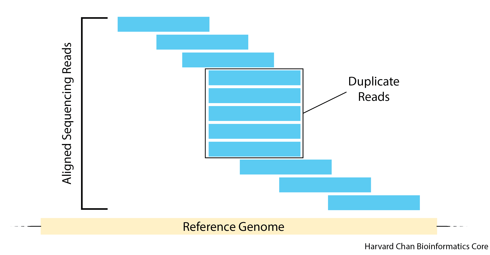
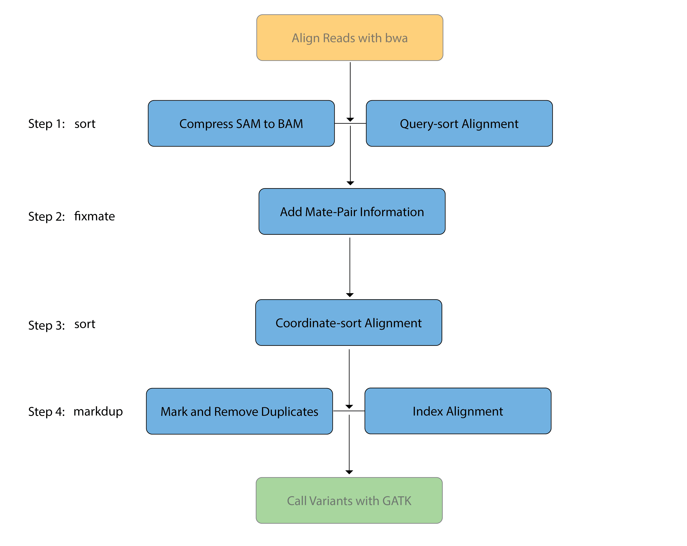

# Alignment File Processing

## Learning objectives

- Differentiate between query-sorted and coordinate-sorted alignment files
- Describe and remove duplicate reads
- Process a raw SAM file for input into a BAM for GATK

## Alignment file processing

The alignment files that come from `bwa` are raw alignment and need some processing before they can be used for variant calling. While all of the data is present, we need to format it in a way that helps the variant calling algorithm process it. This process is very similar to flipping all of the pieces of a puzzle over to the correct side and group edge pieces or pieces by a similar color or pattern when starting a jigsaw puzzle. 

<p align="center">

</p>

[Picard](https://broadinstitute.github.io/picard/) is a set of command line tools for processing high-throughput sequencing (HTS) data and formats such as SAM/BAM/CRAM and VCF. It is maintained by the Broad Institute, and is open-source under the MIT license and free for all uses. Picard is written in Java and does not have functionality for multi-threading.

> ### Why not use `samtools`?
> The processing of the alignment files (SAM/BAM files) can also be done with [`samtools`](https://github.com/samtools/samtools). While there are some advantages to using samtools (i.e. more user-friendly, multi-threading capability), there are slight formatting differences which can cause errors downstream. Since we will be using GATK later in this workshop (also from the Broad Institute), Picard seemed like a more suitable fit.
>
> **For each step the `samtools` code will be provided in a dropdown for each section if you would like to know how to do the step in `samtools`.**


## Pipeline for processing alignment file with Picard

Before we start processing our alignment SAM file provided by `bwa`, let's briefly discuss the steps that we will be doing in this pipeline. 

<p align="center">

</p>

Several goals need to be accomplished:

1. **Compress SAM file to BAM file.** The output of `bwa` is a SAM file and it is human readbale. However, it is quite large and we need to compress it to a binary version (BAM) which is much smaller.
2. **Query-sort our alignment file.** Alignment file are initally ordered by the order of the reads in the FASTQ file, which is not particularly useful. `Picard` can more exhaustively look for duplicates if the file is sorted by read-name (query-sorted). We will discuss **query**-sorted and **coordinate**-sorted alignment files soon.
3. **Mark and Remove Duplicates.** Duplicates can introduce bias into our analysis so it is considered best practice to remove them prior to variant calling.
4. **Coordinate-sort our alignment file.** Most downstream software packages require that alignment files be **coordinate**-sorted, so we will need to re-sort our alignment file by **coordinates** now that we have removed the duplicates.
5. **Index the alignment file.** Like the index for a book, indices for alignment files help direct downstream software packages to where to they can find specific reads. Many software packages require the alignment file that you are analyzing to have an index file, usually with the same name as your alignment file, with the additional `.bai` (BAM-index) extension or a `.bai` extension instead of `.bam`. 


> #### Do I need to add read groups?
> Some pipelines will have you add read groups while procressing your alignment files. It is usually not necessary because the alignmnet tool typically does for you. If you are needing to add read groups, we recommend doing it first (before all the processing steps outlined above ). You can use Picard `AddOrReplaceReadGroups`, which has the added benefit of allowing you to also sort your alignment file (our first step anyways) in the same step as adding the read group information. The dropdown below discusses how to add or replace read groups within `Picard`.
>
><details>
>  <summary><b>Click here if you need to add or replace read groups using <code>Picard</code></b></summary>
>    In order to add or replace read groups, we are going to use <code>Picard</code>'s <code>AddOrReplaceReadGroups</code> tool. First we would need to load the <code>Picard</code> module:
>  <pre>
>  # Load module
>  module load picard/2.27.5</pre>
>  
>  The general syntax for <code>AddOrReplaceReadGroups</code> is:
>  <pre>
>  # Add or replace read group information
>  java -jar $PICARD/picard.jar AddOrReplaceReadGroups \
>  --INPUT $SAM_FILE \
>  --OUTPUT $BAM_FILE \
>  --RGID $READ_GROUP_ID \
>  --RGLB $READ_GROUP_LIBRARY \
>  --RGPL $READ_GROUP_PLATFORM \
>  --RGPU $READ_GROUP_PLATFORM_UNIT \
>  --RGSM $READ_GROUP_SAMPLE</pre>
>  
>  <ul><li><code>java -jar $PICARD/picard.jar AddOrReplaceReadGroups</code> This calls the <code>AddOrReplaceReadGroups</code> package within <code>Picard</code></li>
>    <li><code>--INPUT $SAM_FILE</code>This is your input file. It could be a BAM/SAM alignment file, but because we recommend doing this first if you need to do it, this would be a SAM file. You don't need to specifiy that it is a BAM/SAM file, <code>Picard</code> with figure that out from the provided extension.</li>
>    <li><code>--OUTPUT $BAM_FILE</code>This would be your output file. It could be BAM/SAM, but you would mostly likely pick BAM because you'd like to save space on the cluster. You don't need to specifiy that it is a BAM/SAM file, <code>Picard</code> with figure that out from the provided extension.</li>
>    <li><code>--RGID $READ_GROUP_ID</code>This is your read group ID and must be unique</li>
>    <li><code>--RGLB $READ_GROUP_LIBRARY</code>This is your read group library</li>
>    <li><code>--RGPL $READ_GROUP_PLATFORM</code>This is the platform used for the sequencing</li>
>    <li><code>--RGPU $READ_GROUP_PLATFORM_UNIT</code>This is the unit used to do the sequencing</li>
>    <li><code>--RGSM $READ_GROUP_SAMPLE</code>This is the sample name that the sequencing was done on</li></ul>
>    
>    We discussed the Read Group tags previously in the <a href="https://hbctraining.github.io/variant_analysis/lessons/05_sequence_alignment_theory.html#short-read-alignment">Sequence Alignment Theory</a> and more information on them can be found <a href="https://gatk.broadinstitute.org/hc/en-us/articles/360035890671-Read-groups">here</a>.
>  
>
>  If you would also sort your SAM/BAM file at the same time, you just need to add the <code>--SORT_ORDER</code> option to your command. If you don't add it, it will leave your reads in the same order as they were provided. The main two sort orders to be aware of are query-sorted and coordinate-sorted. A full discussion  of them can be found shortly below. If you wanted the output to be query-sorted, then you could use:
>    
>  <pre>--SORT_ORDER queryname</pre>
>  
>  Or if you wanted them to be coordinate-sorted than you could use:
>  
>  <pre>--SORT_ORDER coordinate</pre>
>  <hr />
></details>


## Creating a script for alignment processing

Let's go ahead and start making a new `sbatch` script within `vim`:

```
$ cd ~/variant_calling/scripts/
$ vim picard_alignment_processing_normal.sbatch
```

As always, we start the `sbatch` script with our shebang line, description of the script and our `sbatch` directives to request appropriate resources from the O2 cluster. 

```
#!/bin/bash
# This sbatch script is for processing the alignment output from bwa and preparing it for use in GATK using Picard 

# Assign sbatch directives
#SBATCH -p priority
#SBATCH -t 0-04:00:00
#SBATCH -c 1
#SBATCH --mem 32G
#SBATCH -o picard_alignment_processing_normal_%j.out
#SBATCH -e picard_alignment_processing_normal_%j.err
```

Next we load the `Picard` module: 

```
# Load module
module load picard/2.27.5
```

**Note: `Picard` is software that does NOT require gcc/6.2.0 to also be loaded** 

Next, let's define some variables that we will be using:

```
# Assign file paths to variables
SAM_FILE=/n/scratch3/users/${USER:0:1}/${USER}/variant_calling/alignments/syn3_normal_GRCh38.p7.sam
REPORTS_DIRECTORY=/home/${USER}/variant_calling/reports/picard/syn3_normal/
SAMPLE_NAME=syn3_normal
QUERY_SORTED_BAM_FILE=`echo ${SAM_FILE%sam}query_sorted.bam`
REMOVE_DUPLICATES_BAM_FILE=`echo ${SAM_FILE%sam}remove_duplicates.bam`
METRICS_FILE=${REPORTS_DIRECTORY}/${SAMPLE_NAME}.remove_duplicates_metrics.txt
COORDINATE_SORTED_BAM_FILE=`echo ${SAM_FILE%sam}coordinate_sorted.bam`
```

Finally, we also make a directory to hold the `Picard` reports:

```
# Make reports directory
mkdir -p $REPORTS_DIRECTORY
```

### BAM

As you might suspect, because SAM files hold alignment information for all of the reads in an sequencing run and there are oftentimes millions of sequence reads, SAM files are very large and cumbersome to store. As a result, **SAM files are often stored in a binary compressed version called a BAM file**. Most software packages are agnostic to this difference and will accept both SAM and BAM files, despite BAM files not being human readable. It is generally considered best practice to your data in BAM format for long periods of time, unless you specifically need the SAM version of the alignment, in order to reduce unnecessary storage on a shared computing cluster.

### Sorting and Removing Duplicates

In order to appropriately flag and remove duplicates, we first need to ***query*** sort our SAM file. Oftentimes, when people discuss sorted BAM/SAM files, they are refering to **coordinate**-sorted BAM/SAM files. 

- **Query**-sorted BAM/SAM files are sorted based upon their read names and order lexiographically
- **Coordinate**-sorted BAM/SAM files are sorted by their sequence name (chromosome/linkage group/scaffold) and position 

<p align="center">

</p>

Picard can mark and remove duplicates in either coordinate-sorted or query-sorted BAM/SAM files, however, if the alignments are query-sorted it can test secondary alignments for duplicates. A brief discussion of this nuance is discussed in the [`MarkDuplicates` manual of `Picard`](https://gatk.broadinstitute.org/hc/en-us/articles/360037052812-MarkDuplicates-Picard-). As a result, we will first **query**-sort our SAM file and convert it to a BAM file:

#### Query-sort the Alignment File

If we opened up the SAM file, we would see that the alignments are not in any particular order and just a consequence of how they were processed by `bwa`. We are going to ***sort them into order by query (read) name for the downstream `MarkDuplicates` tool***. 

> **NOTE:** At **a later step, we will also sort our BAM file by coordinates**. This is typically the type of sort that people are referring to when they discuss coordinate-sorted.

Additionally, SAM files are quite large files and it is not an efficient use of space on the cluster. Fortunately, there is a binary compression version of SAM called BAM. **While we sort the reads, we are also going to convert our SAM file to a BAM file**. We don't need to specify this conversion explicitly, because `Picard` will make this change by interpreting the file extensions that we provide in the `INPUT` and `OUTPUT` file options.

```
# Query-sort alginment file and convert to BAM
java -jar $PICARD/picard.jar SortSam \
--INPUT $SAM_FILE \
--OUTPUT $QUERY_SORTED_BAM_FILE \
--SORT_ORDER queryname
```

The components of this command are:

- `java -jar $PICARD/picard.jar SortSam ` Calls Picard's `SortSam` software package

- `--INPUT $SAM_FILE` This is where we provide the SAM input file

- `--OUTPUT $QUERY_SORTED_BAM_FILE` This is the BAM output file. Because the extension is `.bam` rather than `.sam`, Picard will recognize this and create the output as a BAM file rather than as a SAM file like the input we have provided it.

- `--SORT_ORDER queryname` The options here are either `queryname` or `coordinate`.

> #### Different types of syntax for Picard
> The syntax that `Picard` uses is quite particular and the syntax shown in the documentation is not always consistent. There are two main ways for providing input for `Picard`:
> 
> 1. The **Traditional Syntax**
>  * When providing inputs in this fashion you will provide the option followed immediately without any whitespace by an `=` sign followed once again immediately without whitespace by the argument for that option.
>  * It will work and produce a valid output, but your error file might contain a warning
>
> 2. The **New (Barclay) Syntax**
>  * Picard migrated to a new syntax several years back and this is the syntax we are demonstrating in this workshop. 
>  * It uses a double hyphen (`--`) followed by the long-form name for the option _followed by whitespace_ followed by the argument for that option. 
> 
>  For either syntax, you can also provide a single/couple letter abbreviations for an option (as is the case with many other software). However, we have elected to write out the full names of options wherever possible to increase readabilty of the code. 
>  Commands written in either syntax are equally valid and produce the same output. However, we think you should be aware of the differences as Picard's documentation will sometimes use the New (Barclay) syntax is one place and the Traditional syntax in another place, sometimes even on the same page! 

#### Mark and Remove Duplicates

An important step in processing a BAM file is to mark and remove PCR duplicates. These PCR duplicates can introduce artifacts because regions that have preferential PCR amplification could be over-represented. These reads are flagged by having identical mapping locations in the BAM file. Importantly, it is impossible to distinguish between PCR duplicates and identical fragments. However, one can reduce the latter by doing paired-end sequencing and providing appropriate amounts of input material. 

<p align="center">

</p>

Now we will add the command to our script that allows us to mark and remove duplicates in Picard:

```
# Mark and remove duplicates
java -jar $PICARD/picard.jar MarkDuplicates \
--INPUT $QUERY_SORTED_BAM_FILE \
--OUTPUT $REMOVE_DUPLICATES_BAM_FILE \
--METRICS_FILE $METRICS_FILE \
--REMOVE_DUPLICATES true
```

The components of this command are:

- `java -jar $PICARD/picard.jar MarkDuplicates` Calls `Picard`'s `MarkDuplicates` program

- `--INPUT $QUERY_SORTED_BAM_FILE` Uses our query-sorted BAM file as input

- `--OUTPUT $REMOVE_DUPLICATES_BAM_FILE` Write the output to a BAM file

- `--METRICS_FILE $METRICS_FILE` Creates a metrics file (required by `Picard MarkDuplicates`)

- `--REMOVE_DUPLICATES true` Not only are we going to mark/flag our duplicates, we can also remove them. By setting the `REMOVE_DUPLICATES` parameter equal to `true` to can remove the duplicates.

#### Coordinate-sort the Alignment File

For most downstream processes, coordinate-sorted alignment files are required. As a result, we will need to **change our alignment file from being query-sorted to being coordinate-sorted** and we will once again use the `SortSam` command within `Picard` to accomplish this. Since this BAM file will be the final BAM file that we make and will use for downstream analyses, **we will need to create an index for it at the same time**. The command we will be using for coordinate-sorting and indexing our BAM file is:

```
# Coordinate-sort BAM file and create BAM index file
java -jar $PICARD/picard.jar SortSam \
--INPUT $REMOVE_DUPLICATES_BAM_FILE \
--OUTPUT $COORDINATE_SORTED_BAM_FILE \
--SORT_ORDER coordinate \
--CREATE_INDEX true
```

The components of this command are:

- `java -jar $PICARD/picard.jar SortSam` Calls `Picard`'s `SortSam` program

- `--INPUT $REMOVE_DUPLICATES_BAM_FILE` Our BAM file once we have removed the duplicate reads. **NOTE: Even though the software is called `SortSam`, it can use BAM or SAM files as input and also BAM or SAM files as output.**

- `--OUTPUT COORDINATE_SORTED_BAM_FILE` Our BAM output file sorted by coordinates.

- `--SORT_ORDER coordinate` Sort the output file by **coordinates**

- `--CREATE_INDEX true` Setting the `CREATE_INDEX` equal to `true` will create an index of the final BAM output. The index creation can also be accomplished by using the `BuildBamIndex` command within `Picard`, but this `CREATE_INDEX` functionality is built into many `Picard` functions, so you can often use it at the last stage of processing your BAM file to save having to run `BuildBamIndex` after.

---

Your final `sbatch` script for `Picard` should look like:

```
#!/bin/bash
# This sbatch script is for processing the alignment output from bwa and preparing it for use in GATK using Picard 

# Assign sbatch directives
#SBATCH -p priority
#SBATCH -t 0-04:00:00
#SBATCH -c 1
#SBATCH --mem 32G
#SBATCH -o picard_alignment_processing_normal_%j.out
#SBATCH -e picard_alignment_processing_normal_%j.err

# Load module
module load picard/2.27.5

# Assign file paths to variables
SAM_FILE=/n/scratch3/users/${USER:0:1}/${USER}/variant_calling/alignments/syn3_normal_GRCh38.p7.sam
REPORTS_DIRECTORY=/home/${USER}/variant_calling/reports/picard/syn3_normal/
SAMPLE_NAME=syn3_normal
QUERY_SORTED_BAM_FILE=`echo ${SAM_FILE%sam}query_sorted.bam`
REMOVE_DUPLICATES_BAM_FILE=`echo ${SAM_FILE%sam}remove_duplicates.bam`
METRICS_FILE=${REPORTS_DIRECTORY}/${SAMPLE_NAME}.remove_duplicates_metrics.txt
COORDINATE_SORTED_BAM_FILE=`echo ${SAM_FILE%sam}coordinate_sorted.bam`

# Make reports directory
mkdir -p $REPORTS_DIRECTORY

# Query-sort alginment file and convert to BAM
java -jar $PICARD/picard.jar SortSam \
--INPUT $SAM_FILE \
--OUTPUT $QUERY_SORTED_BAM_FILE \
--SORT_ORDER queryname

# Mark and remove duplicates
java -jar $PICARD/picard.jar MarkDuplicates \
--INPUT $QUERY_SORTED_BAM_FILE \
--OUTPUT $REMOVE_DUPLICATES_BAM_FILE \
--METRICS_FILE $METRICS_FILE \
--REMOVE_DUPLICATES true

# Coordinate-sort BAM file and create BAM index file
java -jar $PICARD/picard.jar SortSam \
--INPUT $REMOVE_DUPLICATES_BAM_FILE \
--OUTPUT $COORDINATE_SORTED_BAM_FILE \
--SORT_ORDER coordinate \
--CREATE_INDEX true
```

<details>
  <summary><b>Click here for alignment file processing using <code>Samtools</code></b></summary>
<br><code>Samtools</code> is another popular tool used for processing BAM/SAM files. The output from <code>Samtools</code> compared to <code>Picard</code> is largely the same. Below is the pipeline and explanation for how you would carry out the similar SAM/BAM processing steps within <code>Samtools</code>.<br>
<p align="center">

</p><br>
<ol><li><details>
    <summary><b>Click here for setting up a <code>sbatch</code> script BAM/SAM Processing for the <code>Samtools</code> pipeline</b></summary>
<h2>Setting up <code>sbatch</code> Script</h2>
First, we are going to navigate to our scirpts folder and open a new <code>sbatch</code> submission script in <code>vim</code>:
<pre>
cd ~/variant_calling/scripts/
vim samtools_processing_normal.sbatch
</pre>
Next, we are going to need to set-up our <code>sbatch</code> submission script with our shebang line, description, <code>sbatch</code> directives, modules to load and file variables.
<pre>
#!/bin/bash
# This sbatch script is for processing the alignment output from bwa and preparing it for use in GATK using Samtools<br>
# Assign sbatch directives
#SBATCH -p priority
#SBATCH -t 0-04:00:00
#SBATCH -c 8
#SBATCH --mem 16G
#SBATCH -o samtools_processing_normal_%j.out
#SBATCH -e samtools_processing_normal_%j.err<br>
# Load modules
module load gcc/6.2.0
module load samtools/1.15.1<br>
# Assign file paths to variables
SAM_FILE=/n/scratch3/users/${USER:0:1}/${USER}/variant_calling/alignments/syn3_normal_GRCh38.p7.sam
QUERY_SORTED_BAM_FILE=`echo ${SAM_FILE%sam}query_sorted.bam`
FIXMATE_BAM_FILE=`echo ${QUERY_SORTED_BAM_FILE%query_sorted.bam}fixmates.bam`
COORDINATE_SORTED_BAM_FILE=`echo ${QUERY_SORTED_BAM_FILE%query_sorted.bam}coordinate_sorted.bam`
REMOVED_DUPLICATES_BAM_FILE=`echo ${QUERY_SORTED_BAM_FILE%query_sorted.bam}removed_duplicates.bam`<br>
</pre>
<hr />
</details></li>
<li><details>
    <summary><b>Click here for <b>query</b>-sorting a SAM file and converting it to BAM for the <code>Samtools</code> pipeline</b></summary>
Similarly to <code>Picard</code>, we are going to need to initally <b>query</b>-sort our alignment. We are also going to be converting the SAM file into a BAM file at this step. Also similarly to <code>Picard</code>, we don't need to specify that our input files are BAM or SAM files. <code>Samtools</code> will use the extensions you provide it in your file names as guidance for whether you are providing it a BAM/SAM file. Below is the code we will use to <b>query</b>-sort our SAM file and convert it into a BAM file:<br>
<pre>
# Sort SAM file and convert it to a query name sorted BAM file
samtools sort \
-@ 8 \
-n \
-o $QUERY_SORTED_BAM_FILE \
$SAM_FILE
</pre>
    
The components of this line of code are:
    
<ul><li><code>samtools sort</code> This calls the sort function within <code>samtools</code>.</li>

<li><code>-@ 8</code> This tells <code>samtools</code> to use 8 threads when it multithreads this task. Since we requested 8 cores for this <code>sbatch</code> submission, let's go ahead and use them all.</li>

<li><code>-n</code> This argument tells <code>samtools sort</code> to sort by read name as opposed the the default sorting which is done by coordinate.</li>

<li><code>-O bam</code> This is declaring the output format of <code>.bam</code>.</li>

<li><code>-o $QUERY_SORTED_BAM_FILE</code> This is a <code>bash</code> variable that holds the path to the output file of the <code>samtools sort</code> command.</li>

<li><code>$SAM_FILE</code> This is a <code>bash</code> variable holding the path to the input SAM file.</li></ul>
<hr />
</details></li>

<li><details>    
<summary><b>Click here for fixing mate information for the <code>Samtools</code> pipeline</b></summary>
Next, we are going to add more mate-pair information to the alignments including the insert size and mate pair coordinates. It is important to note that for this command <code>samtools</code> relies on positional parameters for assigning the input and output BAM files. In this case the input BAM file (<code>$QUERY_SORTED_BAM_FILE</code>) needs to come before the output file (<code>$FIXMATE_BAM_FILE</code>):
    
<pre>
# Score mates
samtools fixmate \
-@ 8 \
-m \
$QUERY_SORTED_BAM_FILE \
$FIXMATE_BAM_FILE
</pre>

The parts of this command are:

<ul><li><code>samtools fixmate</code> This calls the <code>fixmate</code> command in <code>samtools</code></li>
  
<li><code>-@ 8</code> This tells <code>samtools</code> to use 8 threads when it multithreads this task.</li>

<li><code>-m</code> This will add the mate score tag that will be critically important later for <code>samtools markdup</code></li>

<li><code>$QUERY_SORTED_BAM_FILE</code> This is our input file</li>

<li><code>$FIXMATE_BAM_FILE</code> This is our output file</li></ul>
<hr />
</details></li>

<li><details>
<summary>Click here for <b>coordinate</b>-sorting a BAM file for the <code>Samtools</code> pipeline</summary>
    
Now that we have added the <code>fixmate</code> information, we need to <b>coordinate</b>-sort the BAM file. We can do that by: 

<pre>
# Sort BAM file by coordinate   
samtools sort \
-@ 8 \
-o $COORDINATE_SORTED_BAM_FILE \
$FIXMATE_BAM_FILE
</pre>

We have gone through all of the these paramters already in the previous <code>samtools sort</code> command. The only difference in this command is that we are not using the <code>-n</code> option, which tells <code>samtools</code> to sort by read name. Now, we are excluding this and thus sorting by coordinates, the default setting.
<hr />
</details></li>
    
<li><details>
<summary><b>Click here for marking and removing duplicates for the <code>Samtools</code> pipeline</b></summary>

Now we are going to mark and remove the duplicate reads:
  
<pre>
# Mark and remove duplicates and then index the output file
samtools markdup \
-r \
--write-index \
-@ 8 \
$COORDINATE_SORTED_BAM_FILE \
${REMOVED_DUPLICATES_BAM_FILE}##idx##${REMOVED_DUPLICATES_BAM_FILE}.bai
</pre> 

The components of this command are:    
    
<ul><li><code>samtools markdup</code> This calls the mark duplicates software in <code>samtools</code></li>
    
<li><code>-r</code> This removes the duplicate reads</li>
    
<li><code>--write-index</code> This writes an index file of the output</li>
    
<li><code>-@ 8</code> This sets that we will be using 8 threads</li>
    
<li><code>$BAM_FILE</code> This is our BAM input file</li>
    
<li><code>${REMOVED_DUPLICATES_BAM_FILE}##idx##${REMOVED_DUPLICATES_BAM_FILE}.bai</code>This has two parts:
<ol><li>The first part (<code>${REMOVED_DUPLICATES_BAM_FILE}</code>) is our BAM output file with the duplicates removed from it</li>
<li>The second part (<code>##idx##${REMOVED_DUPLICATES_BAM_FILE}.bai</code>) is a shortcut to creating a <code>.bai</code> index of the BAM file. If we use the <code>--write-index</code> option without this second part, it will create a <code>.csi</code> index file. <code>.bai</code> index files are a specific type of <code>.csi</code> files, so we need to specify it with the second part of this command to ensure that a <code>.bai</code> index file is created rather than a <code>.csi</code> index file.</li></ol></li></ul>
<hr />
</details></li>

<li><details>
<summary><b>Click here for the final normal sample <code>sbatch</code> script to do the BAM/SAM processing for the <code>Samtools</code> pipeline</b></summary>

The final script should look like:
    
<pre>
#!/bin/bash
# This sbatch script is for processing the alignment output from bwa and preparing it for use in GATK using Samtools<br>
# Assign sbatch directives
#SBATCH -p priority
#SBATCH -t 0-04:00:00
#SBATCH -c 8
#SBATCH --mem 16G
#SBATCH -o samtools_processing_normal_%j.out
#SBATCH -e samtools_processing_normal_%j.err<br>
# Load modules
module load gcc/6.2.0
module load samtools/1.15.1<br>
# Assign file paths to variables
SAM_FILE=/n/scratch3/users/${USER:0:1}/${USER}/variant_calling/alignments/syn3_normal_GRCh38.p7.sam
QUERY_SORTED_BAM_FILE=`echo ${SAM_FILE%sam}query_sorted.bam`
FIXMATE_BAM_FILE=`echo ${QUERY_SORTED_BAM_FILE%query_sorted.bam}fixmates.bam`
COORDINATE_SORTED_BAM_FILE=`echo ${QUERY_SORTED_BAM_FILE%query_sorted.bam}coordinate_sorted.bam`
REMOVED_DUPLICATES_BAM_FILE=`echo ${QUERY_SORTED_BAM_FILE%query_sorted.bam}removed_duplicates.bam`<br>
# Sort SAM file and convert it to a query name sorted BAM file
samtools sort \
-@ 8 \
-n \
-o $QUERY_SORTED_BAM_FILE \
$SAM_FILE<br>
# Score mates
samtools fixmate \
-@ 8 \
-m \
$QUERY_SORTED_BAM_FILE \
$FIXMATE_BAM_FILE<br>
# Sort BAM file by coordinate   
samtools sort \
-@ 8 \
-o $COORDINATE_SORTED_BAM_FILE \
$FIXMATE_BAM_FILE<br>
# Mark and remove duplicates and then index the output file
samtools markdup \
-r \
--write-index \
-@ 8 \
$COORDINATE_SORTED_BAM_FILE \
${REMOVED_DUPLICATES_BAM_FILE}##idx##${REMOVED_DUPLICATES_BAM_FILE}.bai<br>
</pre>
<hr />
</details></li>
<li><details>
<summary><b>Click here for the final tumor sample <code>sbatch</code> script to do the BAM/SAM processing for the <code>samtools</code> pipeline</b></summary>
In order to create the tumor <code>sbatch</code> submission script to process the BAM/SAM file using <code>samtools</code>, we will once again use <code>sed</code>:<br>
<pre>
sed &#39;s/normal/tumor/g&#39; samtools_processing_normal.sbatch &gt; samtools_processing_tumor.sbatch  
</pre>
The final <code>sbatch</code> submission script for the tumor sample should look like:
<pre>
#!/bin/bash
# This sbatch script is for processing the alignment output from bwa and preparing it for use in GATK using Samtools<br>
# Assign sbatch directives
#SBATCH -p priority
#SBATCH -t 0-04:00:00
#SBATCH -c 8
#SBATCH --mem 16G
#SBATCH -o samtools_processing_tumor_%j.out
#SBATCH -e samtools_processing_tumor_%j.err<br>
# Load modules
module load gcc/6.2.0
module load samtools/1.15.1<br>
# Assign file paths to variables
SAM_FILE=/n/scratch3/users/${USER:0:1}/${USER}/variant_calling/alignments/syn3_tumor_GRCh38.p7.sam
QUERY_SORTED_BAM_FILE=`echo ${SAM_FILE%sam}query_sorted.bam`
FIXMATE_BAM_FILE=`echo ${QUERY_SORTED_BAM_FILE%query_sorted.bam}fixmates.bam`
COORDINATE_SORTED_BAM_FILE=`echo ${QUERY_SORTED_BAM_FILE%query_sorted.bam}coordinate_sorted.bam`
REMOVED_DUPLICATES_BAM_FILE=`echo ${QUERY_SORTED_BAM_FILE%query_sorted.bam}removed_duplicates.bam`<br>
# Sort SAM file and convert it to a query name sorted BAM file
samtools sort \
-@ 8 \
-n \
-o $QUERY_SORTED_BAM_FILE \
$SAM_FILE<br>
# Score mates
samtools fixmate \
-@ 8 \
-m \
$QUERY_SORTED_BAM_FILE \
$FIXMATE_BAM_FILE<br>
# Sort BAM file by coordinate   
samtools sort \
-@ 8 \
-o $COORDINATE_SORTED_BAM_FILE \
$FIXMATE_BAM_FILE<br>
# Mark and remove duplicates and then index the output file
samtools markdup \
-r \
--write-index \
-@ 8 \
$COORDINATE_SORTED_BAM_FILE \
${REMOVED_DUPLICATES_BAM_FILE}##idx##${REMOVED_DUPLICATES_BAM_FILE}.bai<br>
</pre>
</details></li></ol>
<hr />
</details>


<details>
<summary><b>Click here for information on indexing a <code>BAM</code> file</b></summary>
<br>Many software packages want an index of your BAM file in order to facilitate fast look-ups of a BAM file. While not all software packages that use a BAM file will require this, many will and thus it is a good practice to index your BAM file while processing it. In our previous line of <code>Picard</code> command, we provided it with the <code>CREATE_INDEX=true</code> option, so it automatically created an index for us after <b>coordinate</b>-sorting our BAM file. If for some reason we needed to create an BAM-index for a <b>coordinate</b>-sorted BAM file, we can do this in <code>Picard</code> or <code>samtools</code>.
<details>
<summary><b>BAM-Indexing within <code>Picard</code></b></summary>  
The code for indexing a BAM file in <code>Picard</code> would look like:
<pre>
# SKIP THIS STEP
# Index the BAM file
java -jar $PICARD/picard.jar BuildBamIndex \
--INPUT $BAM_FILE
</pre>
    
The components of this command are:

<ul><li><code>java -jar $PICARD/picard.jar BuildBamIndex</code> This calls the <code>BuildBamIndex</code> tools within <code>Picard</code></li>
<li><code>--INPUT $BAM_FILE</code> This is the BAM file that you wish to index.</li></ul>
<hr />
</details>
<details>
<summary><b>BAM-Indexing within <code>samtools</code></b></summary> 
The command to index a BAM file with <code>samtools</code> would be:
<pre>
#### SKIP THIS STEP
# Index the BAM file
samtools index \
$BAM_FILE
</pre>

The components of this command are:
    
<ul><li><code>samtools index</code> Calls the <code>index</code> function within <code>samtools</code></li>

<li><code>$BAM_FILE</code> This is a <code>bash</code> variable that holds the path to the BAM file that we want to index.</li></ul>

We don't need to provide an output file for <code>samtools index</code>, by default it will generate a new file using the same path and filename as the BAM file, but add <code>.bai</code> as the extension instead of <code>.bam</code> to denote that it is a BAM-index file.
</details>
<b>NOTE: BAM indexes can only be made from coordinate-sorted BAM files.</b>
<hr />
</details>

---

## Exercises

**1.** When inspecting a SAM file you see the following order:

<p align="center">

</p>
Is this SAM file's sort order likely: unsorted, query-sorted, coordinate-sorted or is it ambiguous?


**2.** We are comparing our `SortSam` command with our colleague's command. Is there anything wrong with their syntax? Why or why not?

**Our syntax**
```
java -jar $PICARD/picard.jar SortSam \
--INPUT $SAM_FILE \
--OUTPUT $QUERY_SORTED_BAM_FILE \
--SORT_ORDER queryname
```

**Our colleague's syntax**
```
java -jar $PICARD/picard.jar SortSam \
I=$SAM_FILE \
O=$QUERY_SORTED_BAM_FILE \
SO=queryname
```

---

## Creating the Tumor SAM/BAM procressing
    
Similarly to the `bwa` script, we will now need use `sed` to create a `sbatch` script that will be used for processing the tumor SAM file into a BAM file that can be used as input to GATK. The `sed` command to do this would be:
  
```
sed 's/normal/tumor/g' picard_alignment_processing_normal.sbatch > picard_alignment_processing_tumor.sbatch  
```

As a result your tumor `Picard` alignment processing script should look like:
  
```
#!/bin/bash
# This sbatch script is for processing the alignment output from bwa and preparing it for use in GATK using Picard 

# Assign sbatch directives
#SBATCH -p priority
#SBATCH -t 0-04:00:00
#SBATCH -c 1
#SBATCH --mem 32G
#SBATCH -o picard_alignment_processing_tumor_%j.out
#SBATCH -e picard_alignment_processing_tumor_%j.err

# Load module
module load picard/2.27.5

# Assign file paths to variables
SAM_FILE=/n/scratch3/users/${USER:0:1}/${USER}/variant_calling/alignments/syn3_tumor_GRCh38.p7.sam
REPORTS_DIRECTORY=/home/${USER}/variant_calling/reports/picard/syn3_tumor/
SAMPLE_NAME=syn3_tumor
QUERY_SORTED_BAM_FILE=`echo ${SAM_FILE%sam}query_sorted.bam`
REMOVE_DUPLICATES_BAM_FILE=`echo ${SAM_FILE%sam}remove_duplicates.bam`
METRICS_FILE=${REPORTS_DIRECTORY}/${SAMPLE_NAME}.remove_duplicates_metrics.txt
COORDINATE_SORTED_BAM_FILE=`echo ${SAM_FILE%sam}coordinate_sorted.bam`

# Make reports directory
mkdir -p $REPORTS_DIRECTORY

# Query-sort alginment file and convert to BAM
java -jar $PICARD/picard.jar SortSam \
--INPUT $SAM_FILE \
--OUTPUT $QUERY_SORTED_BAM_FILE \
--SORT_ORDER queryname

# Mark and remove duplicates
java -jar $PICARD/picard.jar MarkDuplicates \
--INPUT $QUERY_SORTED_BAM_FILE \
--OUTPUT $REMOVE_DUPLICATES_BAM_FILE \
--METRICS_FILE $METRICS_FILE \
--REMOVE_DUPLICATES true

# Coordinate-sort BAM file and create BAM index file
java -jar $PICARD/picard.jar SortSam \
--INPUT $REMOVE_DUPLICATES_BAM_FILE \
--OUTPUT $COORDINATE_SORTED_BAM_FILE \
--SORT_ORDER coordinate \
--CREATE_INDEX true
```  

# Submitting Picard processing
  
Now we are ready to submit our normal and tumor `Picard` processing scripts to the O2 cluster. However, we might have a problem. If you managed to go quickly into this lesson from the previous lesson, your `bwa` alignment scripts may still be running and your SAM files are not complete yet!
  
First, we need to check the status of our `bwa` scripts and we can do this with the command:
  
```
squeue -u $USER
```
  
**If you have `bwa` jobs still running,** then wait for them to complete (less than 2 hours) before continuing. There are ways to queue jobs together in SLURM using the `--dependency` option in `sbatch`. We will go over this in the automation lesson, but for now just hang tight until your jobs have finished.
  
**If the only job running is your interactive job,** then it should be time to start your `Picard` processing scripts. You can go ahead and submit your `sbatch` scripts for `Picard` processing with:
  
```
sbatch picard_alignment_processing_normal.sbatch
sbatch picard_alignment_processing_tumor.sbatch
```
  
[Next Lesson >>](07_alignment_QC.md)

[Back to Schedule](../schedule/README.md)
  
***

*This lesson has been developed by members of the teaching team at the [Harvard Chan Bioinformatics Core (HBC)](http://bioinformatics.sph.harvard.edu/). These are open access materials distributed under the terms of the [Creative Commons Attribution license](https://creativecommons.org/licenses/by/4.0/) (CC BY 4.0), which permits unrestricted use, distribution, and reproduction in any medium, provided the original author and source are credited.*
