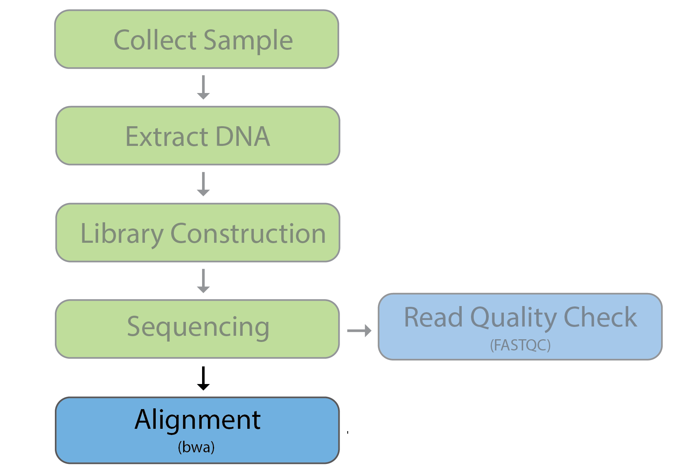

# Sequence Alignment 

## Learning Objectives

- Enumerate difficulties with alignment
- Describe the advanatgaes of using the bwa aligner
- Create an `sbatch` script to align reads

<p align="center">

</p>

## The importance of alignment for variant calling

Read alignment is an essential first step in the characterization of DNA sequence variation. The accuracy of variant-calling results can be highly impacted by a low quality of read alignment. In theory, aligning reads sounds like a simple case of string matching to identify where in the genome each read originated from. However, this task is complicated by a multitude of factors including:

- Errors in the sequencing reads
- Errors in the reference genome
- Repetitive areas of the genome
- Variants in the sample

<p align="center">

</p>

The largest and most difficult part of this task is creating an alignment algorithm that can account for these factors and still provide alignment for ***millions*** of reads within a reasonable time frame. There are a multitude of alignment tools availible today; each has strengths and weakness and some are more appropriate for particular types of analysis. In this course, we will be using BWA. 

## BWA

Many modern alignment tools rely on the Burrows-Wheeler Transform as part of their alignment algorithm; BWA is one of those tools. BWA is a software package for mapping low-divergent sequences against a large reference genome, such as the human genome. It consists of three algorithms: BWA-backtrack, BWA-SW and BWA-MEM. In this workshop we will demonstrate BWA-MEM.

No matter which algorith you choose, **there are two steps to runnning `bwa`**:

1. Create an index of the reference sequence (done once)
    1. Create a Suffix Array Index
    2. Generate a Burrows-Wheeler Transform from the suffix array
2. Query reads against the index to get alignments

> The Burrows-Wheeler Transform and Suffix Arrays are outside of the scope of this course, but a great place to get information on these methods are on [Dr. Ben Langmead's YouTube Channel](https://www.youtube.com/user/BenLangmead/videos). Dr. Langmead developed the algorithm for a similar alignment tool, Bowtie, and he makes many useful videos explaining how the components of these alignment tools work. 

**We have already created an index for you.** So we will jump right into running the alignments.

<details> 
<summary><b>Click here for details on creating your own <code>bwa</code> index</b></summary>
While we will be using an index that has already been made for us, if you need to create an index for a reference sequence using <code>bwa</code>, the steps for this are laid out below.
<ol><li><b>Navigate to your reference sequence directory</b><br>
<pre>
cd ~/path/to/reference/sequence/directory/
</pre></li>
<li><b>Create a <code>bwa</code> index:</b>
<pre>
bwa index reference_sequence.fasta
</pre></li></ol><br>
This process may take up to 30+ minutes to run depending on the reference sequence size. The output of this command will produce five files:<br>
<ul><li><code>reference_sequence.fasta.sa</code> This is the binary version of the Suffix Array Index</li>
<li><code>reference_sequence.fasta.bwt</code> This is the binary version of the Burrows-Wheeler Transform of the reference sequence</li>
<li><code>reference_sequence.fasta.pac</code> A special binary compression of the reference sequence</li>
<li><code>reference_sequence.fasta.ann</code> Notations regarding the reference sequence</li>
<li><code>reference_sequence.fasta.amb</code> Notations regarding base ambiguities (mostly Ns, but also other base ambiguities) in the reference sequence</li></ul>
<hr />
</details>

### Aligning reads with `bwa-mem`

<p align="center">

</p>

BWA-MEM is the latest algorithm of thee three available, and is generally recommended for high-quality queries as it is faster and more accurate. Other features include:

* Performs local alignment (rather than end-over-end)
* Can clip ends of reads, if they do not match
* Can split a read into pieces, mapping each separately (the best aligned piece is then the primary alignment)
* Performs gapped alignment 
* Moderate memory requirement (few GB of RAM to hold reference genome)

Let's begin by looking at the command used to run the alignment, and describing each of the parameters. _Do not run the code below_, as this just **example code**.

```bash
# Align reads with bwa-mem
bwa mem \
-M \
-t 8 \
-R "@RG\tID:C6C0TANXX_2\tSM:ZW177\tPL:ILLUMINA\tPU:ZW177" \
/path/to/reference.fa \
LEFT_read_1.fq \
RIGHT_read_2.fq \
-o /path/to/outputfile.sam
```

Let's breakdown this `bwa` command.

* `mem` This is the **specific algorithm** we want to use within `bwa`
* `-M` This will mark shorter split hits as secondary
* `-t 8` We are going to take advantage of **multithreading**. In order to do this, we need to specifiy the number of threads that we are going to use as 8.
* `-R` This adds what is called **read group information**. Some software packages, such as `GATK`, require read groups, while others are agnostic towards them. However, they can provide important metadata about your reads and thus it is considered best practice to include read group information at the alignment step. This read group information consists of several fields separated by tab-characters (\t), which will be described a little bit later in this lesson.
* Reference sequence (indexed)
* Input FASTQ files
* Output file name and path (if different from working directory)
  
> **A note on paired-end reads:** In this case you can see that the reads are paired-end reads because we have provided two FASTQ files as input and they have `_1`/`_2` right before the `.fq`/`.fastq` extension. 
> 
> This is a very common annotation for paired-end reads. Alternatively, sometimes they might also be annotated as `_R1`/`_R2`, but once again, they will almost always be placed right before the `.fq`/`.fastq` extension. 


### Read groups

The term Read Group refers to **a set of reads that were generated from a single run of a sequencing instrument**.

* **Simple case**: A single library preparation derived from a single biological sample was run on a single lane of a flowcell. All the reads from that lane run belong to the same read group.
* **Complex case**: When samples are barcoded and pooled, and run across multiple lanes in a flowcell. In this case, each subset of reads originating from a separate library run on that lane will constitute a separate read group.

**Read groups are identified in the SAM/BAM file by a number of tags** that are defined in the official SAM specification. These tags, when assigned appropriately, allow us to differentiate not only samples, but also various technical features that are associated with artifacts. Having this information allows to take steps towards mitigating the effects of artifacts in downstream analyses [[1]](https://sites.google.com/a/broadinstitute.org/legacy-gatk-documentation/dictionary/6472-Read-groups).

Let's use the read group from our example `bwa` command above to demonstrate the use of tags:

<p align="center">

</p>

* **ID**: This is the **identification for a given batch of reads**. This MUST be unique to your experiment.
* **SM**: This is to mark which **sample** your reads are coming from. Note, this does not need to be unique like the **ID** field, since you may have multiple Read Group IDs coming from a single sample. 
* **PL**: This is the **platform** that the sequencing was run on. For aligning Illumina reads, you should use "illumina" here.
* **PU**: This is the platform unit and it is **ideally supposed to hold `<FLOWCELL_BARCODE>.<LANE>.<SAMPLE_BARCODE>`**
  * `<FLOWCELL_BARCODE>` is the barcode of the flowcell
  * `<LANE>` is the lane the data was run on and
  * `<SAMPLE_BARCODE>` is supposed to be a library/sample specific identifer. In some software packages PU can take precedence over the ID field. *
  * *If you don't happen to have the `<FLOWCELL_BARCODE>.<LANE>.<SAMPLE_BARCODE>`, just make this field something useful that will help identify the sample**. In this case, we didn't have that information so we are re-using the **ID** field here. 

 **More information about read groups and some fields we didn't discuss can be found [here](https://gatk.broadinstitute.org/hc/en-us/articles/360035890671-Read-groups).**


***

**Exercises**

**1.** The read group field LB (Library) is a required field to when adding read groups using `Picard`'s `AddOrReplaceReadGroups`, but we don't currently have this field in our read group information. How would we alter out the `bwa` command to include `LB` as well?

**2.** If we wanted to increase the number of threads used by `bwa` for processing our alignment to 12, where  would we need to modify our `bwa` command to accommodate this?

***

### Creating a script for alignment

To align reads to the reference sequence, we will need to give ourselves an appropriate amount of resources and so we will need to create an `sbatch` job submission script. Move into the scripts directory and open up `vim`.

```
$ cd ~/variant_calling/scripts/
$ vim bwa_alignment_normal.sbatch
```

Now, we can copy and paste the following **shebang line and `sbatch` directives** into our script file:

```
#!/bin/bash
# This script is for aligning sequencing reads against a reference genome using bwa

# Assign sbatch directives
#SBATCH -p priority
#SBATCH -t 0-04:00:00
#SBATCH -c 8
#SBATCH --mem 16G
#SBATCH -o bwa_alignment_normal_%j.out
#SBATCH -e bwa_alignment_normal_%j.err
```

Next, we need to **add the modules** that we will be using for alignment:

```
# Load modules
module load gcc/6.2.0
module load bwa/0.7.17
```

> NOTE: On O2, many of the common tools were compiled using `GCC` version 6.2.0, so to be able to access them, we first need to load the `GCC` module.

Finally, we need the `bwa` command we are going to run. Displayed below is the code we would use specifically for the `syn3_normal_1`. **DO NOT paste this code in your script!** 


```bash
## DO NOT PASTE THIS CODE: EXAMPLE ONLY
bwa mem \
    -M \
    -t 8 \
    -R "@RG\tID:$SAMPLE\tPL:illumina\tPU:$SAMPLE\tSM:$SAMPLE" \
    /n/groups/hbctraining/variant_calling/reference/GRCh38.p7.fa \
    ~/variant_calling/raw_data/syn3_normal_1.fq.gz \
    ~/variant_calling/raw_data/syn3_normal_2.fq.gz \
    -o /n/scratch3/users/${USER:0:1}/${USER}/variant_calling/alignments/syn3_normal_GRCh38.p7.sam
```

**Instead we will introduce bash variables** in our script which will allow us to quickly adapt this for use on all other samples we have in our dataset. The varaibles are described in more detail below:

* `REFERENCE_SEQUENCE`: the path to the bwa index
* `LEFT_READS`: path to the left read FASTQ file (R1 or 1)
* `RIGHT_READS`:  path to the left read FASTQ file (R1 or 1)
* `SAMPLE`: sample prefix (for naming output file and providing read group information)
* `SAM_FILE`: Path and filename for the output alignment file

```
# Assign files to bash variables
REFERENCE_SEQUENCE=/n/groups/hbctraining/variant_calling/reference/GRCh38.p7.fa
LEFT_READS=/home/$USER/variant_calling/raw_data/syn3_normal_1.fq.gz
RIGHT_READS=`echo ${LEFT_READS%1.fq.gz}2.fq.gz`
SAMPLE=`basename $LEFT_READS _1.fq.gz`
SAM_FILE=/n/scratch3/users/${USER:0:1}/${USER}/variant_calling/alignments/${SAMPLE}_GRCh38.p7.sam
```

> **NOTE:** `$RIGHT_READS` uses the string manipulation we discussed in the `FastQC` lesson in order to swap the last parts of their filename. We also use `basename` to parse out the path from a file and when coupled with an argument after the filename, it will trim the end of the file as well as we can see with the `$SAMPLE` variable.
  

We can **now add our command for running `bwa`** and utilize the variables we created above:

```
# Align reads with bwa
bwa mem \
    -M \
    -t 8 \
    -R "@RG\tID:$SAMPLE\tPL:illumina\tPU:$SAMPLE\tSM:$SAMPLE" \
    $REFERENCE_SEQUENCE \
    $LEFT_READS \
    $RIGHT_READS \
    -o $SAM_FILE
```

### Submitting `sbatch` bwa script

Now your `sbatch` script for `bwa` is ready to submit:

```
$ sbatch bwa_alignment_normal.sbatch
```

***

**Excercise: Creating Tumor `sbatch` script**

We are going to **replace all of the instances of "normal" with "tumor" using a `sed` command** just like we did in the previous `FastQC` exercise. Therefore, we can call `sed` and redirect the output to a file called `bwa_alignment_tumor.sbatch` using:

```bash
$ sed 's/normal/tumor/g' bwa_alignment_normal.sbatch >  bwa_alignment_tumor.sbatch
```

If we look at the output with `cat` we will see the following scripts:

```
$ cat bwa_alignment_tumor.sbatch 
```

```
#!/bin/bash
# This script is for aligning sequencing reads against a reference genome using bwa

# Assign sbatch directives
#SBATCH -p priority
#SBATCH -t 0-04:00:00
#SBATCH -c 8
#SBATCH --mem 16G
#SBATCH -o bwa_alignment_tumor_%j.out
#SBATCH -e bwa_alignment_tumor_%j.err

# Load modules
module load gcc/6.2.0
module load bwa/0.7.17

# Assign files to bash variables
REFERENCE_SEQUENCE=/n/groups/hbctraining/variant_calling/reference/GRCh38.p7.fa
LEFT_READS=/home/$USER/variant_calling/raw_data/syn3_tumor_1.fq.gz
RIGHT_READS=`echo ${LEFT_READS%1.fq.gz}2.fq.gz`
SAMPLE=`basename $LEFT_READS _1.fq.gz`
SAM_FILE=/n/scratch3/users/${USER:0:1}/${USER}/variant_calling/alignments/${SAMPLE}_GRCh38.p7.sam

# Align reads with bwa
bwa mem \
-M \
-t 8 \
-R "@RG\tID:$SAMPLE\tPL:illumina\tPU:$SAMPLE\tSM:$SAMPLE" \
$REFERENCE_SEQUENCE \
$LEFT_READS \
$RIGHT_READS \
-o $SAM_FILE
```

Once we have created this script we can go ahead and submit it for processing:

```
sbatch bwa_alignment_tumor.sbatch 
```

[Next Lesson >>](05_alignment_file_processing.md)

[Back to Schedule](../schedule/README.md)

***

*This lesson has been developed by members of the teaching team at the [Harvard Chan Bioinformatics Core (HBC)](http://bioinformatics.sph.harvard.edu/). These are open access materials distributed under the terms of the [Creative Commons Attribution license](https://creativecommons.org/licenses/by/4.0/) (CC BY 4.0), which permits unrestricted use, distribution, and reproduction in any medium, provided the original author and source are credited.*
