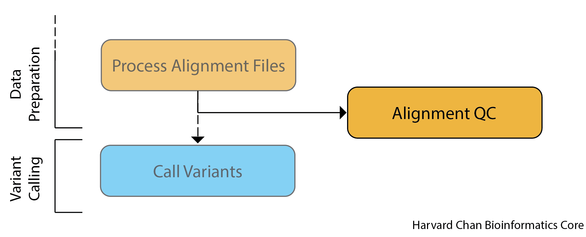

Approximate time: 30 minutes

## Learning Objectives

- Verify alignment rates using `Picard`
- Merge `Picard` QC metrics with `FastQC` metrics using `MultiQC`

## Collecting Alignment Statistics

The next step of QC is where we need to evaluate the quality of the alignments. We will start by running the code required to compute metrics, then we will discuss the metrics and evaluate our results against the general expecations.

<p align="center">

</p>

We are going to use `Picard` once again in order to collect our alignment statistics. `Picard` has many packages for collecting different types of data, but the one we will be using is [`CollectAlignmentSummaryMetrics`](https://gatk.broadinstitute.org/hc/en-us/articles/360040507751-CollectAlignmentSummaryMetrics-Picard). This tool takes a **SAM/BAM file input** and **produces metrics** (in a tab delimited `.txt` file) detailing the quality of the read alignments. _Note that these quality filters are specific to Illumina data._  

Some examples of metrics reported include (but, are not limited to):

* Total number of reads 
* Total number of PF (pass-filter) reads (reads that pass an internal qualty fitering on the Illumina sequencer)
* Total aligned PF reads (any PF read that has a sequence and position)
* High-quality aligned PF reads (high-quality means a mapping quality >= 20)
* Reads aligned in pairs (vs. reads aligned with mate unaligned/not present)
* Read length

  
> **NOTE:** This lesson assumes **you have successfuly completed the code for [alignment processing](04_alignment_file_processing.md).**  If for some reason you did not successfully run the Picard alignment processing steps scripts you will want to copy over the required files using the commands provided below:
>
> ```bash
>  cp /n/groups/hbctraining/variant_calling/intermediate_files/alignments/syn3_*_GRCh38.p7.coordinate_sorted.bam /n/scratch/users/${USER:0:1}/${USER}/variant_calling/alignments/
> ```
> 

### Normal sample script

Let's start creating an `sbatch` script for collecting metrics:

```
cd ~/variant_calling/scripts/
vim picard_metrics_normal.sbatch
```

First, we need to add our shebang line, description and `sbatch` directives to the script:

```
#!/bin/bash
# This sbatch script is for collecting alignment metrics using Picard 

# Assign sbatch directives
#SBATCH -p priority
#SBATCH -t 0-00:30:00
#SBATCH -c 1
#SBATCH --mem 16G
#SBATCH -o picard_metrics_normal_%j.out
#SBATCH -e picard_metrics_normal_%j.err
```

Next, we need to load `Picard`:

```
# Load picard
module load picard/2.27.5
```

Next, let's assign our files to variables:

```
# Assign variables
INPUT_BAM=/n/scratch/users/${USER:0:1}/${USER}/variant_calling/alignments/syn3_normal_GRCh38.p7.coordinate_sorted.bam
REFERENCE=/n/groups/hbctraining/variant_calling/reference/GRCh38.p7.fa
OUTPUT_METRICS_FILE=/home/${USER}/variant_calling/reports/picard/syn3_normal/syn3_normal_GRCh38.p7.CollectAlignmentSummaryMetrics.txt
```

Lastly, we can add the `Picard` command to gather the alignment metrics. 

```
# Run Picard CollectAlignmentSummaryMetrics
java -jar $PICARD/picard.jar CollectAlignmentSummaryMetrics \
  --INPUT $INPUT_BAM \
  --REFERENCE_SEQUENCE $REFERENCE \
  --OUTPUT $OUTPUT_METRICS_FILE
```

We can breakdown this command into each of its components:

* `java -jar $PICARD/picard.jar CollectAlignmentSummaryMetrics` Calls the `CollectAlignmentSummaryMetrics` package from within `Picard`
* `--INPUT $INPUT_BAM` This is the output BAM file from our previous `Picard` alignment processing steps.
* `--REFERENCE_SEQUENCE $REFERENCE` This isn't a required parameter, but `Picard` can do a subset of mismatch-related metrics if this is provided.
* `--OUTPUT $OUTPUT_METRICS_FILE` This is the file to write the output metrics to.


Now this script is all set to run! **Go ahead and save and quit.**

<details>
  <summary><b>Click here to see what our final <code>sbatch</code>code script for collecting the normal sample alignment metrics should look like</b></summary> 
  <pre>
#!/bin/bash
# This sbatch script is for collecting alignment metrics using Picard<br>
# Assign sbatch directives
#SBATCH -p priority
#SBATCH -t 0-00:30:00
#SBATCH -c 1
#SBATCH --mem 16G
#SBATCH -o picard_metrics_normal_%j.out
#SBATCH -e picard_metrics_normal_%j.err<br>
# Load picard
module load picard/2.27.5<br>
# Assign variables
INPUT_BAM=/n/scratch/users/${USER:0:1}/${USER}/variant_calling/alignments/syn3_normal_GRCh38.p7.coordinate_sorted.bam
REFERENCE=/n/groups/hbctraining/variant_calling/reference/GRCh38.p7.fa
OUTPUT_METRICS_FILE=/home/${USER}/variant_calling/reports/picard/syn3_normal/syn3_normal_GRCh38.p7.CollectAlignmentSummaryMetrics.txt<br>
# Run Picard CollectAlignmentSummaryMetrics
java -jar $PICARD/picard.jar CollectAlignmentSummaryMetrics \
  --INPUT $INPUT_BAM \
  --REFERENCE_SEQUENCE $REFERENCE \
  --OUTPUT $OUTPUT_METRICS_FILE
</pre>
</details>

### Tumor sample script

Now we will want to **create the tumor version of this submission script using `sed`** (as we have done previously):

```
sed 's/normal/tumor/g' picard_metrics_normal.sbatch > picard_metrics_tumor.sbatch
```

<details>
  <summary><b>Click here to see what our final <code>sbatch</code>code script for collecting the tumor sample alignment metrics should look like</b></summary> 
  <pre>
#!/bin/bash
# This sbatch script is for collecting alignment metrics using Picard<br>
# Assign sbatch directives
#SBATCH -p priority
#SBATCH -t 0-00:30:00
#SBATCH -c 1
#SBATCH --mem 16G
#SBATCH -o picard_metrics_tumor_%j.out
#SBATCH -e picard_metrics_tumor_%j.err<br>
# Load picard
module load picard/2.27.5<br>
# Assign variables
INPUT_BAM=/n/scratch/users/${USER:0:1}/${USER}/variant_calling/alignments/syn3_tumor_GRCh38.p7.coordinate_sorted.bam
REFERENCE=/n/groups/hbctraining/variant_calling/reference/GRCh38.p7.fa
OUTPUT_METRICS_FILE=/home/${USER}/variant_calling/reports/picard/syn3_tumor/syn3_tumor_GRCh38.p7.CollectAlignmentSummaryMetrics.txt<br>
# Run Picard CollectAlignmentSummaryMetrics
java -jar $PICARD/picard.jar CollectAlignmentSummaryMetrics \
  --INPUT $INPUT_BAM \
  --REFERENCE_SEQUENCE $REFERENCE \
  --OUTPUT $OUTPUT_METRICS_FILE
</pre>
</details>

### Submitting scripts for Picard alignment processing

Before we submit our jobs, let's **check the status of our previous `Picard` alignment processing steps**:

```
squeue --me
```

* **If your `Picard` alignment processing steps are completed**, and you have the required input files then you can submit these jobs to collect alignment metrics:

```bash
sbatch picard_metrics_normal.sbatch
sbatch picard_metrics_tumor.sbatch
```
> **NOTE:** Each of these scripts should only take about 15 minutes to run.  

## Collecting Coverage Metrics

Coverage is the average level of alignment for any random locus in the genome.  `Picard` also has a package called [`CollectWgsMetrics`](https://gatk.broadinstitute.org/hc/en-us/articles/360037269351-CollectWgsMetrics-Picard) which is also very nice for collecting data about coverage for alignments. However, **since our data set is whole exome sequencing rather than whole genome sequencing** and thus only compromises about 1-2% of the human genome, average **coverage across the whole genome is not a very useful metric**. However, if one did have whole genome data, then running `CollectWgsMetrics` would be useful. As such, in the dropdown box below we provide the code that you could use to collect this information.

<p align="center">

</p>

_Image source: [Coverage analysis from the command line](https://medium.com/ngs-sh/coverage-analysis-from-the-command-line-542ef3545e2c)_

<details>
<summary><b>Click here to find out more on collecting coverage metrics for WGS datasets in <code>Picard</code></b></summary>
<br>The tool in <code>Picard</code> used for collecting coverage metrics for WGS datasets is called <code>CollectWgsMetrics</code>. The code used to run <code>CollectWgsMetrics</code> can be found below.<br><br>
  <pre>
  # Assign paths to bash variables
  $COORDINATE_SORTED_BAM_FILE=/path/to/sample.coordinate_sorted.bam
  $OUTPUT=/home/$USER/variant_calling/reports/picard/sample.CollectWgsMetrics.txt
  $REFERENCE=/n/groups/hbctraining/variant_calling/reference/GRCh38.p7.fa<br>
  # Run Picard CollectWgsMetrics \
  java -jar $PICARD/picard.jar CollectWgsMetrics \
    --INPUT $COORDINATE_SORTED_BAM_FILE \
    --OUTPUT $METRICS_OUTPUT_FILE \
    --REFERENCE_SEQUENCE $REFERENCE
  </pre>
        
  <ul><li><code>java -jar $PICARD/picard.jar CollectWgsMetrics</code> This calls the <code>CollectWgsMetrics</code> package within <code>Picard</code></li>
  <li><code>--INPUT $COORDINATE_SORTED_BAM_FILE</code> This is the input coordinate-sorted BAM file</li>
  <li><code>--OUTPUT $METRICS_OUTPUT_FILE</code> This is the output report file </li>
  <li><code>--REFERENCE_SEQUENCE $REFERENCE</code> This is the path to the reference genome that was used for the alignment.</li></ul>
<hr />
</details>

## Factors Impacting Alignment

While we mentioned above the various metrics that are computed as part of the Picard command, one of the **most important metrics for your alignment file is the alignment rate**. When aligning high-quality reads to a high quality reference genome, **one should expect to see alignment rates at 90% or better**. If alignment rates dipped below 80-85%, then there could be reason for further inspection. 

Alignment rates can vary based upon many factors, including:

- **Quality of reference assembly** - A high-quality assembly like GRCh38.p7 will provide an excellent reference genome for alignment. However, if you were studying a organism with a poorly assembled genome, parts of the reference genome could be missing from the assembly. Therefore, high-quality reads might not align because they there is missing reference sequence to align to that corresponds to their sequence.
- **Quality of libraries** - If the library generation was poor and there wasn't enough input DNA, then your sequencing could be filled with low-quality reads
- **Quality of the reads** - If the reads are poor quality, then it can make alignment more uncertain. If your `FASTQC` report shows any anomalous signs, contact your sequencing center for support.
- **Contamination** - If your samples are contaminated, then it can also skew your alignment. For example, if your samples were heavily contaminated with some bacteria, then much of what you will sequence will be bacteria DNA and not your sample DNA. As a result, most of the sequence reads will not align to your target sequence. If you suspect contamination might be the source of a poor alignment, you could consider running [Kraken](https://ccb.jhu.edu/software/kraken/) to evaluate the levels of contamination in your samples.
- **Evolutionary distance between the sampled organism and reference genome** If a reference genome doesn't exist for your species of interest, you are able to align reads to a closely-related organism. However, it does come at the cost of lowering the alignment rate. 
- **Aligner and alignment parameters** Different aligners work differently and are specialized for different types of data. Additionally, many aligners have a variety of parameters that are able to be adjusted. As a result, different aligners or different parameters for the same aligner will give different alignment rates, but they usually should be within the same range of approximate alignment rates. Generally speaking, the default parameters for most alignment tools are usually fine and they shouldn't need to be manually adjusted/optimized unless there is a specific reason to do so.


[Next Lesson >>](06_aggregate_multiqc.md)

[Back to Schedule](../schedule/README.md)

***

*This lesson has been developed by members of the teaching team at the [Harvard Chan Bioinformatics Core (HBC)](http://bioinformatics.sph.harvard.edu/). These are open access materials distributed under the terms of the [Creative Commons Attribution license](https://creativecommons.org/licenses/by/4.0/) (CC BY 4.0), which permits unrestricted use, distribution, and reproduction in any medium, provided the original author and source are credited.*
