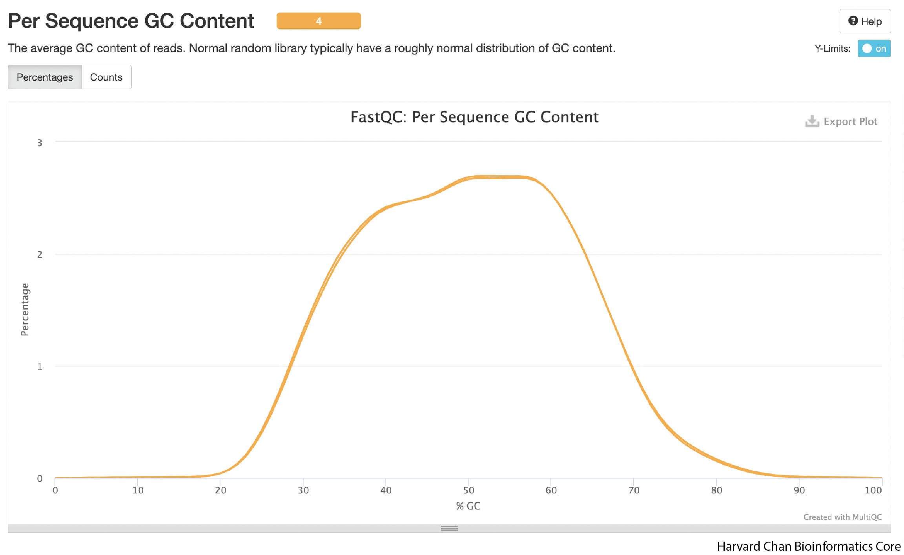
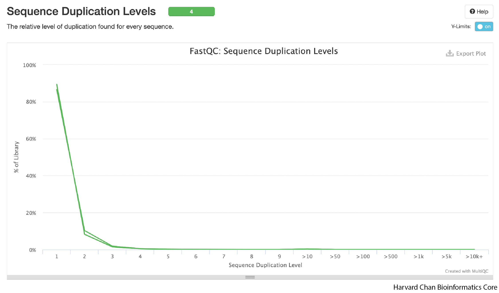
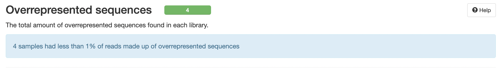

# Aggregating QC metrics with MultiQC

## Learning Objectives

- Run MultiQC
- Evaluate read alignment
- Intepret read QC metrics within `MultiQC` HTML report

## MultiQC

The goal of this lesson is to show you how to **combine numerical stats from multiple QC runs into a single HTML report**. To do this aggregation, we will introduce you to [MultiQC](https://multiqc.info/) -  a general use tool, perfect for summarising the output from numerous bioinformatics tools. Rather than having to sift through multiple reports from individual samples and different tools, we can use MultiQC to evaluate quality metrics conveniently within a single file!

<p align="center">

</p>

One nice feature of `MultiQC` is that it accepts many different file formats. It figures out which format was submitted and tailors the report to that type of analysis. For this workflow we will combine the following QC stats:

* FastQC
* Alignment QC from Picard

Collating our `MultiQC` results would be relatively quick to just run from the command-line, but it's best practice to write our steps to scripts so that we always have a record of what we did and how we created our reports. We will start by making sure we are in our scripts directory and writing a `sbatch` script in `vim` for submission:

```
cd ~/variant_calling/scripts/
vim multiqc_alignment_metrics_normal_tumor.sbatch
```

First, we will add our sheband line, description and `sbatch` directives

```
#!/bin/bash
# This sbatch script is for collating alignment metrics from FastQC and Picard using MultiQC

# Assign sbatch directives
#SBATCH -p priority
#SBATCH -t 0-00:10:00
#SBATCH -c 1
#SBATCH --mem 1G
#SBATCH -o multiqc_alignment_metrics_%j.out
#SBATCH -e multiqc_alignment_metrics_%j.err
```

Next, we will load our modules:

```
# Load modules
module load gcc/9.2.0
module load multiqc/1.21
```
> NOTE: `MultiQC` version 1.12 requires `gcc/9.2.0` on the O2 cluster.

Next, we will assign our variables:

```
# Assign variables
REPORTS_DIRECTORY=/home/${USER}/variant_calling/reports/
NORMAL_SAMPLE_NAME=syn3_normal
TUMOR_SAMPLE_NAME=syn3_tumor
REFERENCE=GRCh38.p7
NORMAL_PICARD_METRICS=${REPORTS_DIRECTORY}picard/${NORMAL_SAMPLE_NAME}/${NORMAL_SAMPLE_NAME}_${REFERENCE}.CollectAlignmentSummaryMetrics.txt
TUMOR_PICARD_METRICS=${REPORTS_DIRECTORY}picard/${TUMOR_SAMPLE_NAME}/${TUMOR_SAMPLE_NAME}_${REFERENCE}.CollectAlignmentSummaryMetrics.txt
NORMAL_FASTQC_1=${REPORTS_DIRECTORY}fastqc/${NORMAL_SAMPLE_NAME}_1_fastqc.zip
NORMAL_FASTQC_2=${REPORTS_DIRECTORY}fastqc/${NORMAL_SAMPLE_NAME}_2_fastqc.zip
TUMOR_FASTQC_1=${REPORTS_DIRECTORY}fastqc/${TUMOR_SAMPLE_NAME}_1_fastqc.zip
TUMOR_FASTQC_2=${REPORTS_DIRECTORY}fastqc/${TUMOR_SAMPLE_NAME}_2_fastqc.zip
OUTPUT_DIRECTORY=${REPORTS_DIRECTORY}/multiqc/
```

We also need to add the output directory:

```
# Create directory for output
mkdir -p $OUTPUT_DIRECTORY
```

Then, we will add **the command to run `MultiQC`**:

```
# Run MultiQC
multiqc \
  $NORMAL_PICARD_METRICS \
  $TUMOR_PICARD_METRICS \
  $NORMAL_FASTQC_1 \
  $NORMAL_FASTQC_2 \
  $TUMOR_FASTQC_1 \
  $TUMOR_FASTQC_2 \
  --outdir $OUTPUT_DIRECTORY
```

<details>
  <summary><b>Click here to see what our final <code>sbatch</code>code script for running <code>multiqc</code> should look like</b></summary> 
  <pre>
#!/bin/bash
# This sbatch script is for collating alignment metrics from FastQC and Picard using MultiQC<br>
# Assign sbatch directives
#SBATCH -p priority
#SBATCH -t 0-00:10:00
#SBATCH -c 1
#SBATCH --mem 1G
#SBATCH -o multiqc_alignment_metrics_%j.out
#SBATCH -e multiqc_alignment_metrics_%j.err<br>
# Load modules
module load gcc/9.2.0
module load multiqc/1.21<br>
# Assign variables
REPORTS_DIRECTORY=/home/${USER}/variant_calling/reports/
NORMAL_SAMPLE_NAME=syn3_normal
TUMOR_SAMPLE_NAME=syn3_tumor
REFERENCE=GRCh38.p7
NORMAL_PICARD_METRICS=${REPORTS_DIRECTORY}picard/${NORMAL_SAMPLE_NAME}/${NORMAL_SAMPLE_NAME}_${REFERENCE}.CollectAlignmentSummaryMetrics.txt
TUMOR_PICARD_METRICS=${REPORTS_DIRECTORY}picard/${TUMOR_SAMPLE_NAME}/${TUMOR_SAMPLE_NAME}_${REFERENCE}.CollectAlignmentSummaryMetrics.txt
NORMAL_FASTQC_1=${REPORTS_DIRECTORY}fastqc/${NORMAL_SAMPLE_NAME}_1_fastqc.zip
NORMAL_FASTQC_2=${REPORTS_DIRECTORY}fastqc/${NORMAL_SAMPLE_NAME}_2_fastqc.zip
TUMOR_FASTQC_1=${REPORTS_DIRECTORY}fastqc/${TUMOR_SAMPLE_NAME}_1_fastqc.zip
TUMOR_FASTQC_2=${REPORTS_DIRECTORY}fastqc/${TUMOR_SAMPLE_NAME}_2_fastqc.zip
OUTPUT_DIRECTORY=${REPORTS_DIRECTORY}/multiqc/<br>
# Create directory for output
mkdir -p $OUTPUT_DIRECTORY<br>
# Run MultiQC
multiqc \
  $NORMAL_PICARD_METRICS \
  $TUMOR_PICARD_METRICS \
  $NORMAL_FASTQC_1 \
  $NORMAL_FASTQC_2 \
  $TUMOR_FASTQC_1 \
  $TUMOR_FASTQC_2 \
  --outdir $OUTPUT_DIRECTORY
</pre>
</details>

### Submitting scripts for MultiQC
Like the previous step, we will need to check to ensure that the previous `Picard` step for collecting metrics for each sample is down before we can submit this script. To do this, we will check out `squeue`:

```
squeue -u $USER
```

* **If your `Picard` collect alignment metric steps are not completed** yet, **WAIT** until they have finished before submitting these jobs to `MultiQC`.
* **If your `Picard` collect alignment metric steps are completed and the only job you have running is your interactive job**, then submit this `MultiQC` job to collate the alignment metrics:

```
sbatch multiqc_alignment_metrics_normal_tumor.sbatch
```

This job should finish fairly quickly and then we can proceed to copying it over to our local computers so we can evaluate the alignment QC of our samples.


## Downloading MultiQC HTML Report with FileZilla

As we have [previous discussed with FASTQC](02_fastqc.md#evaluate-qc-metrics-from-fastqc), O2 is not designed to render HTML files. And like the FASTQC report, we will need a browser, such as Safari, Chrome, Firefox, etc., on our local computer to view the HTML report. Thus, we will need to download the HTML report from the cluster to our local computers and we are going to use `FileZilla` to help us download the report file.

In the right hand panel, navigate to where the HTML files are located on O2 `~/variant_calling/reports/multiqc/`. Then decide where you would like to copy those files to on your computer and move to that directory on the left hand panel.

Once you have found the HTML output for `MultiQC` **copy it over** by double clicking it or drag it over to right hand side panel. Once you have the HTML file copied over to your computer, you can leave the `FileZilla` interface. You can then locate the HTML file on your computer and open the HTML report up in a browser (`Chrome`, `Firefox`, `Safari`, etc.). 

## Inspect MultiQC HTML Report 

### General Statistics

Now we can evalute all of our `FastQC` and alignments metrics at once. The first table we are presented with gives us an overview of our sequencing and alignment.

<p align="center">

</p>

A few quick takeaways from this table is that it gives us an overview of our alignments:

  **1)** We had an alignment rate of 99% for both normal and tumor which is very good. 

  **2)** The level of duplicates is not high (<10%).
***Sergey* **
 Range of acceptable levels of duplicates if we are filtering them out?

  **3)** The GC-content of our sequencing is 49%. The average GC content of the human genome is ~41%, but GC-content is higher in genic regions than intergenic regions. Given that our sequencing represents whole exome sequencing rather than whole genome sequencing, a moderately elevated GC-content compared to the genome average seems reasonable. If we see GC-content that drasatically differs (more than ~10%) from our expectation then that could be a reason to pause and look for reasons for this divergence. 
  
  **4)** We can also see that we have ~49 million fragments for each sample, which should provide more than adequate depth for variant calling.
  ***Sergey***
  Recommendations on Depth for WES and WGS. My back of the envelope calculations for these 100-bp Paired end samples is that we have like 200X? Is that right

### Aligned Reads

The next figure in the report is a chart of the aligned reads. You can click on the "Percantages" tab if you'd rather see the alignments as a percentage. As we already covered in the General Statistics section, we are seeing an alignment rate of ~99%, which is very good.

<p align="center">

</p>

### Sequence Quality

As we continue down the report, we can skip a few figures until we get to the sequence quality figure. A few things we should know about this figure:
  
  1) The y-axis is PHRED score, which we discussed in the [`FastQC` lesson](04_fastqc.md) and the y-axis is position in the read. 
  
  2) Typically, the shape of these figures have a steep incline in the first few bases before plateauing and finally tapering off a bit. The shape should be mostly smooth. If we saw large, abrupt drops in quality this could be reason to contact your sequencing facility.
  
  3) The right read (or R2) often has low-quality than the left read (or R1) and this difference in quality if just an artifact of pair-end Illumina sequencing.

<p align="center">

</p>

The shape that we see is very typical of a good sequencing run. Imporantly. their aren't any sudden drops in read quality in these samples.

### Average Sequence Quality

The next plot highlights average sequence quality for a read. As opposed to the previous plot, the PHRED score is now on the x-axis.

<p align="center">

</p>

We can see that our average quality scores peak well-above 28 and they appear to be mostly unimodal. If the average PHRED score peak was lower or perhaps we saw a bimodal distribution for PHRED scores then we might have some concerns.

### Per Base Sequence Content

The next plot is a bit difficult to understand because the quality of the data is good. But each sample is on the y-axis and the position in the read is on the x-axis. The color (which is mostly dark grey in the example below) indicates base composition bias (%A, %G, %T or %C). Ideally, color at each position should be constant throughout the read. If, for instance, we saw a bright green band in the 56th position for one of the samples, that would indicate that the the 56th position for some reason had an overabundance of Adenine. In fact, if you look *very* closely at the left side of the plots, you may be able to barely see a few faintly colored bands. This is actually the result of some primer bias in the beginning of the sequence, but it's effect is quite small.

<p align="center">

</p>

As you scroll over the dark grey rectangles, it will tell you what the base composition is for that position in a particular sample. These samples look pretty good, but we will dive a bit deeper into base composition by clicking on each sample. 

#### Per Base Sequence Content

Once we have clicked on the first sample, it will produce a new plot featuring the base composition. In an ideal world, you would likely see some small primer bias at the beginning and then relatively flat lines for the rest of the positions.

<p align="center">

</p>

We can see the weak primer bias from the sequencing at the begining, but it base composition is relatively flat, which is exactly what we want to see in this plot. The next three samples look similar, but we have included included them in the dropdowns below.

<details>
  <summary><b>Click here to see the per base sequence content plot for the right reads of the normal sample</b></summary>
  <p align="center">
  
  </p>
<hr />
</details>
  
<details>
  <summary><b>Click here to see the per base sequence content plot for the left reads of the tumor sample</b></summary>
  <p align="center">
  
  </p>
<hr />
</details>

<details>
  <summary><b>Click here to see the per base sequence content plot for the right reads of the tumor sample</b></summary>
  <p align="center">
  
  </p>
<hr />
</details>

### GC Content Distribution

Similar to the previous plots on sequence content, we are mostly looking to make sure that there is a reasonably normally-shaped distribution around what the expected GC content is for a reference genome/exome. Strong skews, multi-modal shapes or aburpt spikes could indicate errors in sequencing or contamination. 

<p align="center">

</p>

In the above figure, we see the shape that we would expect to see. It is smooth, normally-centered around a GC-percentage reasonable for the human exome. We don't see any abrupt peaks and the curve looks mostly unimodal.

### Duplication Levels

This next plot is going to help us visualize the amount of duplicate sequence we see in the reads. This figure would ideally be strongly left-ward shifted with a tail that quickly tapers down. This would indicate that much of the sequence in the reads in not duplicated and is present in single copy.   

<p align="center">

</p>

This figure appears to be about what one would hope to see as most of the reads don't show high levels of duplication.

### Overrepresented Sequences

This table will display any overrepresented sequences and potential sources. It is not uncommon to get adaptor sequences in this table. In general, as long as their are only a handful or fewer overrepresented sequences with all of them being less than ~1%, then your sample should be fine. 

<p align="center">

</p>

These samples don't show any overrepresented sequences, which is great.

### Overall QC Impressions

The QC for this dataset looks pretty good. We have a high alignment to our reference genome. Our read qualities are good and the GC-content is within the range we would expect for our sample. There doesn't appear to be many duplicated or overpresented sequences. All of these signs point to having a high-quality dataset, which perhaps was expected from a *in silico* generated dataset.

## Important Considerations on QC Metrics

**1) Rarely will one single metric will tell you that there is something wrong about the data. Small deviations away from the "ideal" are normal and should mostly only be a concern if there are multiple deviations with moderate impact. Many of these metrics are somewhat redundant, so any problematic deviation should likely show up in multiple diagnostics.** For example, if you example the expected GC content for your sample is 41%, but your data comes back as 43%, that single metric on it's own is likely not too problematic. However, if the GC content comes back as 60%, there's only 40% alignment to the reference genome and there appears to be a multi-modal distribution in the GC content distribution, then you should definitely pause and evaluate sources of variation that could be creating this pattern.

**2) A poor QC report *DOES NOT* mean that you need to through out all of the data immediately.** Oftentimes, there are still salvagable data in a dataset that fails QC on some metrics. Perhaps it means you will need to remove adaptor contamination or other contaminants. While it is unfortunate to have to discard reads and weaken your depth for finding variants, having clean data will substanially help the analyses more accuarately call variants. Of course, some datasets are beyond salvagable, but these are generally rare. 

**3) As with any NGS QC analysis, be aware of the biological and technical aspects of your sample.** Perhaps your organism of interest or sample has some peculiar biological/technical aspect as this may or likely will come through in the QC analysis. This biological or technical aspect could skew some QC metrics or create patterns that we haven't shown here. For instance, our GC metrics were a bit elevated compared to the human genome, but we recalled that we are working from exome data and the human exome is more GC-rich than the rest of the genome, so our elevate GC percentages were reasonable. 


[Next Lesson >>](07_variant_calling.md)

[Back to Schedule](../schedule/README.md)


***

*This lesson has been developed by members of the teaching team at the [Harvard Chan Bioinformatics Core (HBC)](http://bioinformatics.sph.harvard.edu/). These are open access materials distributed under the terms of the [Creative Commons Attribution license](https://creativecommons.org/licenses/by/4.0/) (CC BY 4.0), which permits unrestricted use, distribution, and reproduction in any medium, provided the original author and source are credited.*
