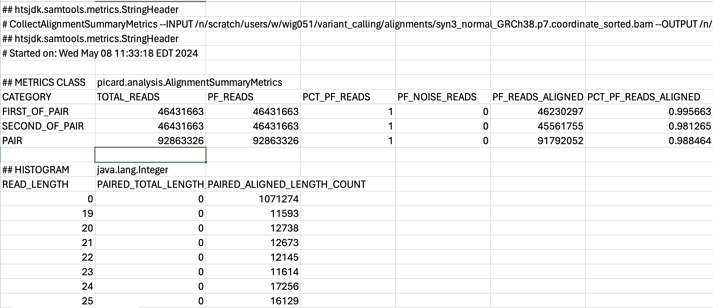

# Aggregating QC metrics with MultiQC

## Learning Objectives

- Run MultiQC
- Evaluate read alignment
- Intepret read QC metrics within `MultiQC` HTML report

## Running MultiQC

The goal of this lesson is to show you how to **combine numerical stats from multiple QC runs into a single HTML report**. To do this aggregation, we will introduce you to [MultiQC](https://multiqc.info/) -  a general use tool, perfect for summarising the output from numerous bioinformatics tools. Rather than having to sift through multiple reports from individual samples and different tools, we can use MultiQC to evaluate quality metrics conveniently within a single file!

<p align="center">

</p>

One nice feature of `MultiQC` is that it accepts many different file formats. It figures out which format was submitted and tailors the report to that type of analysis. For this workflow we will combine the following QC stats:

* FastQC
* Alignment QC from Picard

We have already discussed in great detail the FASTQC html report in a [previous lesson](02_fastqc.md). But we haven't yet looked at the output from Picard `CollectAlignmentSummaryMetrics`.

### Alignment QC Summary
Once your scripts from the previous lesson have finished running, we can take a look to see what kind of output was generated. In your reports directory you should see files with the extension `.CollectAlignmentSummaryMetrics.txt`. 

Let's use `less` to view it:

```bash
less ~/variant_calling/reports/picard/syn3_normal/syn3_normal_GRCh38.p7.CollectAlignmentSummaryMetrics.txt
```

This is a **tab-delimited file** which contains a header component, followed by a table with many columns. Each column lists a different metric and the associated value for this syn3_normal sample. It is difficult to view this in the terminal and so you can use the screenshot below to see the contents:

<p align="center">

</p>

To find out more about indidividual metrics we encourage you to peruse [the Picard documentation](https://broadinstitute.github.io/picard/picard-metric-definitions.html#AlignmentSummaryMetrics). This file format is not ideal for viewing and assessing manually. **We would benefit from visualizing the results rather than reading through this line by line.**
 

### Aggregating QC
Now, we could use MultiQC to just visualize the data from Picard `AlignmentSummaryMetrics` but that wouldn't be a very good use of the tool. Ideally the more data we can aggregate, the easier it is to evaluate the quality of our samples with data collated across multiple results and multiple samples.

`MultiQC` would be relatively quick to just run from the command-line, but it's best practice to write our steps to scripts so that we always have a record of what we did and how we created our reports. We will start by making sure we are in our scripts directory and writing a `sbatch` script in `vim` for submission:

```
cd ~/variant_calling/scripts/
vim multiqc_alignment_metrics_normal_tumor.sbatch
```

First, we will add our shebang line, description and `sbatch` directives

```
#!/bin/bash
# This sbatch script is for collating alignment metrics from FastQC and Picard using MultiQC

# Assign sbatch directives
#SBATCH -p priority
#SBATCH -t 0-00:10:00
#SBATCH -c 1
#SBATCH --mem 1G
#SBATCH -o multiqc_alignment_metrics_%j.out
#SBATCH -e multiqc_alignment_metrics_%j.err
```

Next, we will load our modules:

```
# Load modules
module load gcc/9.2.0
module load multiqc/1.21
```
> NOTE: `MultiQC` version 1.12 requires `gcc/9.2.0` on the O2 cluster.

Next, we will assign our variables:

```
# Assign variables
REPORTS_DIRECTORY=/home/${USER}/variant_calling/reports/
NORMAL_SAMPLE_NAME=syn3_normal
TUMOR_SAMPLE_NAME=syn3_tumor
REFERENCE=GRCh38.p7
NORMAL_PICARD_METRICS=${REPORTS_DIRECTORY}picard/${NORMAL_SAMPLE_NAME}/${NORMAL_SAMPLE_NAME}_${REFERENCE}.CollectAlignmentSummaryMetrics.txt
TUMOR_PICARD_METRICS=${REPORTS_DIRECTORY}picard/${TUMOR_SAMPLE_NAME}/${TUMOR_SAMPLE_NAME}_${REFERENCE}.CollectAlignmentSummaryMetrics.txt
NORMAL_FASTQC_1=${REPORTS_DIRECTORY}fastqc/${NORMAL_SAMPLE_NAME}_1_fastqc.zip
NORMAL_FASTQC_2=${REPORTS_DIRECTORY}fastqc/${NORMAL_SAMPLE_NAME}_2_fastqc.zip
TUMOR_FASTQC_1=${REPORTS_DIRECTORY}fastqc/${TUMOR_SAMPLE_NAME}_1_fastqc.zip
TUMOR_FASTQC_2=${REPORTS_DIRECTORY}fastqc/${TUMOR_SAMPLE_NAME}_2_fastqc.zip
OUTPUT_DIRECTORY=${REPORTS_DIRECTORY}/multiqc/
```

We also need to add the output directory:

```
# Create directory for output
mkdir -p $OUTPUT_DIRECTORY
```

Then, we will add **the command to run `MultiQC`**:

```
# Run MultiQC
multiqc \
  $NORMAL_PICARD_METRICS \
  $TUMOR_PICARD_METRICS \
  $NORMAL_FASTQC_1 \
  $NORMAL_FASTQC_2 \
  $TUMOR_FASTQC_1 \
  $TUMOR_FASTQC_2 \
  --outdir $OUTPUT_DIRECTORY
```

<details>
  <summary><b>Click here to see what our final <code>sbatch</code>code script for running <code>multiqc</code> should look like</b></summary> 
  <pre>
#!/bin/bash
# This sbatch script is for collating alignment metrics from FastQC and Picard using MultiQC<br>
# Assign sbatch directives
#SBATCH -p priority
#SBATCH -t 0-00:10:00
#SBATCH -c 1
#SBATCH --mem 1G
#SBATCH -o multiqc_alignment_metrics_%j.out
#SBATCH -e multiqc_alignment_metrics_%j.err<br>
# Load modules
module load gcc/9.2.0
module load multiqc/1.21<br>
# Assign variables
REPORTS_DIRECTORY=/home/${USER}/variant_calling/reports/
NORMAL_SAMPLE_NAME=syn3_normal
TUMOR_SAMPLE_NAME=syn3_tumor
REFERENCE=GRCh38.p7
NORMAL_PICARD_METRICS=${REPORTS_DIRECTORY}picard/${NORMAL_SAMPLE_NAME}/${NORMAL_SAMPLE_NAME}_${REFERENCE}.CollectAlignmentSummaryMetrics.txt
TUMOR_PICARD_METRICS=${REPORTS_DIRECTORY}picard/${TUMOR_SAMPLE_NAME}/${TUMOR_SAMPLE_NAME}_${REFERENCE}.CollectAlignmentSummaryMetrics.txt
NORMAL_FASTQC_1=${REPORTS_DIRECTORY}fastqc/${NORMAL_SAMPLE_NAME}_1_fastqc.zip
NORMAL_FASTQC_2=${REPORTS_DIRECTORY}fastqc/${NORMAL_SAMPLE_NAME}_2_fastqc.zip
TUMOR_FASTQC_1=${REPORTS_DIRECTORY}fastqc/${TUMOR_SAMPLE_NAME}_1_fastqc.zip
TUMOR_FASTQC_2=${REPORTS_DIRECTORY}fastqc/${TUMOR_SAMPLE_NAME}_2_fastqc.zip
OUTPUT_DIRECTORY=${REPORTS_DIRECTORY}/multiqc/<br>
# Create directory for output
mkdir -p $OUTPUT_DIRECTORY<br>
# Run MultiQC
multiqc \
  $NORMAL_PICARD_METRICS \
  $TUMOR_PICARD_METRICS \
  $NORMAL_FASTQC_1 \
  $NORMAL_FASTQC_2 \
  $TUMOR_FASTQC_1 \
  $TUMOR_FASTQC_2 \
  --outdir $OUTPUT_DIRECTORY
</pre>
</details>

### Submitting scripts for MultiQC
Like the previous step, we will need to check to ensure that the previous `Picard` step for collecting metrics for each sample is down before we can submit this script. To do this, we will check out `squeue`:

```bash
squeue -u $USER
```

If it is complete, we can go ahead and run our script.

```bash
sbatch multiqc_alignment_metrics_normal_tumor.sbatch
```

This job should finish fairly quickly. 

### Downloading MultiQC HTML Report with FileZilla
As we have [previously discussed with FASTQC](02_fastqc.md#evaluate-qc-metrics-from-fastqc), O2 is not designed to render HTML files. And like the FASTQC report, we will need a browser, such as Safari, Chrome, Firefox, etc., on our local computer to view the HTML report. Thus, we will need to download the HTML report from the cluster to our local computers and we are going to use `FileZilla` to help us download the report file.

In the right hand panel, navigate to where the HTML files are located on O2 `~/variant_calling/reports/multiqc/`. Then decide where you would like to copy those files to on your computer and move to that directory on the left hand panel.

Once you have found the HTML output for `MultiQC` **copy it over** by double clicking it or drag it over to right hand side panel. Once you have the HTML file copied over to your computer, you can leave the `FileZilla` interface. You can then locate the HTML file on your computer and open the HTML report up in a browser (`Chrome`, `Firefox`, `Safari`, etc.). 

## Evaluate MultiQC HTML Report 

### General Statistics

Now we can evalute all of our `FastQC` and alignments metrics at once. In the first table we are presented with gives us an overview of our sequencing and alignment.

<p align="center">

</p>

A few quick takeaways from this table is that it gives us an overview of our alignments:

  **1)** We had an alignment rate of 99% for both normal and tumor which is very good. 

  **2)** The level of duplicates is not high (<10%).
***Sergey* **
 Range of acceptable levels of duplicates if we are filtering them out?

  **3)** The GC-content of our sequencing is 49%. The average GC content of the human genome is ~41%, but GC-content is higher in genic regions than intergenic regions. Given that our sequencing represents whole exome sequencing rather than whole genome sequencing, a moderately elevated GC-content compared to the genome average seems reasonable. If we see GC-content that drasatically differs (more than ~10%) from our expectation then that could be a reason to pause and look for reasons for this divergence. 
  
  **4)** We can also see that we have ~49 million fragments for each sample, which should provide more than adequate depth for variant calling.
  ***Sergey***
  Recommendations on Depth for WES and WGS. My back of the envelope calculations for these 100-bp Paired end samples is that we have like 200X? Is that right

### Aligned Reads

The next figure in the report is a chart of the aligned reads. You can click on the "Percentages" tab if you'd rather see the alignments as a percentage. As we already covered in the General Statistics section, we are seeing an alignment rate of ~99%, which is very good.

<p align="center">

</p>

### FASTQC plots

As we continue down the report, we can see that the FastQC plots are present. We won't go in these in detail, as we have already explored them in a [previous lesson](02_fastqc.md#evaluate-qc-metrics-from-fastqc). What we will highlight is that all samples are aggregated in the plots. 

Use the sequence quality figure below as an example. Rather than a single line, we now observe two colored lines; each line representing a different sample. If you hover over the line with your mouse, you will see a text box appear to with a sample name label and quality score at each base. The advanatge to having all samples in a single plot is that you can more easily spot trends across samples within a dataset.

<p align="center">

</p>


## Overall QC Impressions

The QC for this dataset looks pretty good. We have a **high alignment to our reference genome. Our read qualities are good and the GC-content is within the range we would expect for our sample**. There doesn't appear to be many duplicated or overpresented sequences. All of these signs point to having a high-quality dataset, which perhaps was expected from a *in silico* generated dataset.

## Important Considerations on QC Metrics

**1) Rarely will one single metric will tell you that there is something wrong about the data. Small deviations away from the "ideal" are normal and should mostly only be a concern if there are multiple deviations with moderate impact. Many of these metrics are somewhat redundant, so any problematic deviation should likely show up in multiple diagnostics.** For example, if you example the expected GC content for your sample is 41%, but your data comes back as 43%, that single metric on it's own is likely not too problematic. However, if the GC content comes back as 60%, there's only 40% alignment to the reference genome and there appears to be a multi-modal distribution in the GC content distribution, then you should definitely pause and evaluate sources of variation that could be creating this pattern.

**2) A poor QC report *DOES NOT* mean that you need to through out all of the data immediately.** Oftentimes, there are still salvagable data in a dataset that fails QC on some metrics. Perhaps it means you will need to remove adaptor contamination or other contaminants. While it is unfortunate to have to discard reads and weaken your depth for finding variants, having clean data will substanially help the analyses more accuarately call variants. Of course, some datasets are beyond salvagable, but these are generally rare. 

**3) As with any NGS QC analysis, be aware of the biological and technical aspects of your sample.** Perhaps your organism of interest or sample has some peculiar biological/technical aspect as this may or likely will come through in the QC analysis. This biological or technical aspect could skew some QC metrics or create patterns that we haven't shown here. For instance, our GC metrics were a bit elevated compared to the human genome, but we recalled that we are working from exome data and the human exome is more GC-rich than the rest of the genome, so our elevate GC percentages were reasonable. 


[Next Lesson >>](07_variant_calling.md)

[Back to Schedule](../schedule/README.md)


***

*This lesson has been developed by members of the teaching team at the [Harvard Chan Bioinformatics Core (HBC)](http://bioinformatics.sph.harvard.edu/). These are open access materials distributed under the terms of the [Creative Commons Attribution license](https://creativecommons.org/licenses/by/4.0/) (CC BY 4.0), which permits unrestricted use, distribution, and reproduction in any medium, provided the original author and source are credited.*
