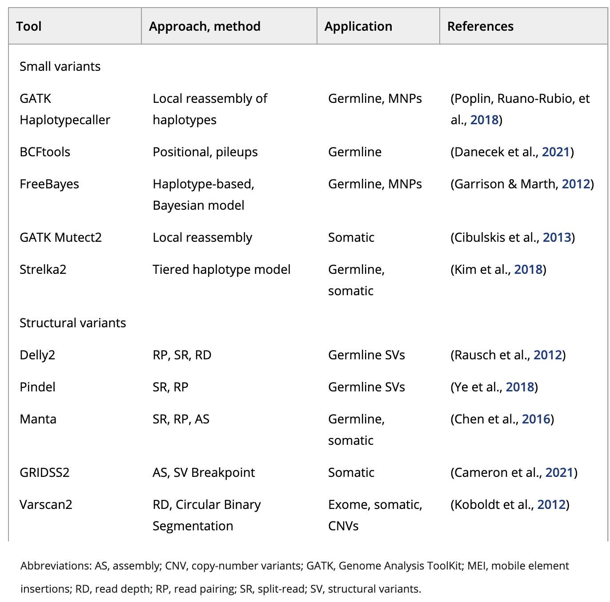

Approximate time: 45 minutes

## Learning Objectives

- Differentiate between germline and somatic variant calling
- Call somatics variants from `bam` files using `MuTect2`

# Variant Calling

<p align="center">

</p>


## Best practices for variant calling
Now that we have inspected our reads and alignments for high-quality QC and also formatted our alignments for variant calling. Dozens of variant calling tools for NGS data have been published, and choosing which one to use can be a daunting task. Accurate variant detection in the the human genome is a key requirement for diagnostics in clinical sequencing, and so you want to make sure you are **using the caller which is appropriate for your data and study design**.

<p align="center">
 <br>
  Image source: Zverinova S and Guryev V, 2021
</p>

### Germline versus Somatic Variant Calling

Variant calling can be broadly broken up into two groups, germline and somatic. These two types of variant calling methods have different assumptions regarding in the input data and thus are handled differently.

* **Germline** variant calling refers to the process of calling **variants that are ubiquitous across the organism** (i.e. almost all cells carry these variants) and these are the types of variants that can be passed through the germline. Germline variant calling for the most part expects at most two alleles in relatively equal frequencies. 

* **Somatic** variant calling refers to the process of calling **variants that differ between cells within a single organism** and these variants are not passed through the germline. Somatic variant calling is often used when studying the progression of various cancers. Somatic variant calling is more difficult than germline variant calling because low frequency variants and sequencing artifacts are difficult to distinguish from sequencing errors.

<p align="center">

</p>

In the above image we can see an example of a germline variant on the left. Approximately half of the reads support each allele in both the tumor and normal sample reads. When compared to the somatic variant on the right, where we observe no variants in the normal sample reads but there is a variant present in the tumor sample reads. 

**For this workshop, we have tumor/normal samples and so we will be calling somatic variants.**


### GATK Toolkit
[GATK (Genome Analysis Toolkit)](https://gatk.broadinstitute.org/hc/en-us/articles/360036194592-Getting-started-with-GATK4) is a popular open-source software package developed by the Broad Institute for analysis of high throughput sequencing (HTS) data. 
It was initially developed around 2007 to help analyze sequencing data from the 1000 Genomes Project. It was created with a focus on [best practices](https://gatk.broadinstitute.org/hc/en-us/articles/360035894711-About-the-GATK-Best-Practices) in variant discovery and genotyping from NGS data. New versions of GATK are regularly released by the Broad Institute as sequencing technologies and reference genomes are improved. 

<p align="center">

</p> 

GATK has tools for preprocessing, variant discovery, genotyping, and filtering of HTS data. It takes **aligned sequencing reads as input and outputs variant calls**. There are several different GATK Best Practices workflows tailored to particular applications depending on the type of variation of interest and the technology employed. 

In terms of variant discovery, GATK offers the following tools:

- [`HaplotypeCaller`](https://gatk.broadinstitute.org/hc/en-us/articles/5358864757787-HaplotypeCaller) can be used for germline SNPs and Indels
- [`MuTect2`](https://gatk.broadinstitute.org/hc/en-us/articles/5358911630107-Mutect2) can be used for somatic SNPs and Indels
- [`GermlineCNVCaller`](https://gatk.broadinstitute.org/hc/en-us/articles/5358874158235-GermlineCNVCaller) can be used for germline Copy Number Variants
- [Software for Structural Variants is currently in beta testing.](https://gatk.broadinstitute.org/hc/en-us/articles/5358824293659--Tool-Documentation-Index#StructuralVariantDiscovery)

**This course is going to focus on analyzing somatic SNPs, so we are going to use `MuTect2`.**


## MuTect2

### Basic workflow 
The alogrithm used for somatic variant discovery with Mutect2 is broken up into three major components:

- **Local Assembly** - The initial step is for Mutect2 to evaluates regions for somatic variations. Regions that surpass a log odds threshold for somatic variation comparing the existance and non-existance of a potential alternate allele are flagged as "active" regions and are slated for local reassembly and realignment. The local reassembly is done by creating a *de Bruijn* graph of the active region.
- **Haplotype Assembly** - From this *de Bruijn* graph, each haplotype is assembled and the haplotype spans the variant in question and connects two points in the reference genome.
- **Somatic Genotyping** - From here, most likely haplotypes are assembled and variants are called from these haplotypes. 

<p align="center">

</p>

MuTect2 can be run in **three different modes**: 

1. **Tumor-normal** mode: where a tumor sample is matched with a normal samples. **This is the mode we will be using.**
2. **Tumor-only** mode: where a single sample is used as input.
    * Note that it's ability to reliably call somatic variants is greatly diminished as it has difficulty distinguishing between high frequency variants and germline variants.
3. **Mitochondrial mode**: where specific parameters are added for appropriately calling on mitochondria. 

 
### Running MuTect2
Let's start or variant calling analysis by writing out a new `sbatch` submission script for `MuTect2`:

```bash
cd ~/variant_calling/scripts/
vim mutect2_normal_tumor.sbatch
```

Let's add our shebang line, script description and `sbatch` directives:

```bash
#!/bin/bash
# This sbatch script is for variant calling with GATK's MuTect2

# Assign sbatch directives
#SBATCH -p priority
#SBATCH -t 1-00:00:00
#SBATCH -c 1
#SBATCH --mem 16G
#SBATCH -o mutect2_variant_calling_normal_tumor_%j.out
#SBATCH -e mutect2_variant_calling_normal_tumor_%j.err
```

Next to add the `GATK4` module we are going to load:

```
# Load the GATK module
module load gatk/4.1.9.0
```

And now, we need to create our variables:

```
# Assign variables
REFERENCE_SEQUENCE=/n/groups/hbctraining/variant_calling/reference/GRCh38.p7.fa
REFERENCE_DICTIONARY=`echo ${REFERENCE_SEQUENCE%fa}dict`
NORMAL_SAMPLE_NAME=syn3_normal
NORMAL_BAM_FILE=/n/scratch/users/${USER:0:1}/${USER}/variant_calling/alignments/${NORMAL_SAMPLE_NAME}_GRCh38.p7.coordinate_sorted.bam
TUMOR_SAMPLE_NAME=syn3_tumor
TUMOR_BAM_FILE=/n/scratch/users/${USER:0:1}/${USER}/variant_calling/alignments/${TUMOR_SAMPLE_NAME}_GRCh38.p7.coordinate_sorted.bam
VCF_OUTPUT_FILE=/n/scratch/users/${USER:0:1}/${USER}/variant_calling/vcf_files/mutect2_${NORMAL_SAMPLE_NAME}_${TUMOR_SAMPLE_NAME}_GRCh38.p7-raw.vcf
```

<details>
  <summary><b>Click here if you used <code>samtools</code> instead of <code>Picard</code> to process the alignment files</b></summary>
  Very little needs to be edited to these variables to adapt them for the <code>samtools</code> output. However, the end of the file that was created in <code>samtools</code> was <code>.removed_duplicates.bam</code> rather than <code>.coordinate_sorted.bam</code>. As a result we need to edit the variables a bit. Change:<br>
  <pre>
  NORMAL_BAM_FILE=/n/scratch/users/${USER:0:1}/${USER}/variant_calling/alignments/${NORMAL_SAMPLE_NAME}_GRCh38.p7.coordinate_sorted.bam</pre>
  To:
  <pre>
  NORMAL_BAM_FILE=/n/scratch/users/${USER:0:1}/${USER}/variant_calling/alignments/${NORMAL_SAMPLE_NAME}_GRCh38.p7.removed_duplicates.bam</pre>
  And also change:
  <pre>
  TUMOR_BAM_FILE=/n/scratch/users/${USER:0:1}/${USER}/variant_calling/alignments/${TUMOR_SAMPLE_NAME}_GRCh38.p7.coordinate_sorted.bam</pre>
  To:
  <pre>
  TUMOR_BAM_FILE=/n/scratch/users/${USER:0:1}/${USER}/variant_calling/alignments/${TUMOR_SAMPLE_NAME}_GRCh38.p7.removed_duplicates.bam</pre>
  After those changeed have been made, the rest of the script should be the same.
<hr />
</details>

> **NOTE:** Sometimes when there are many input variables that re-use many of the same textual elements (i.e. paths, sample names and reference genome names), like we have above, it is sometimes cleaner, less typo-prone and more reproducible to assign those repeated items to variables and then use text manipulation tools and variable subsitution in `bash` to create the rest of the variables. In the above example, some of the lines of variable assignment (`REFERENCE_SEQUENCE`, `NORMAL_SAMPLE_NAME` and `TUMOR_SAMPLE_NAME`) are likely lines you might edit from run-to-run, but the other lines (`REFERENCE_DICTIONARY`, `NORMAL_BAM_FILE`, `TUMOR_BAM_FILE` and `VCF_OUTPUT_FILE`) will likely stay the same or similiar. Standardizing your paths and nomenclature will help you keep track of your files much easier.

Lastly, we need to add the `MuTect2` command:

```bash
# Run MuTect2
gatk Mutect2 \
  --sequence-dictionary $REFERENCE_DICTIONARY \
  --reference $REFERENCE_SEQUENCE \
  --input $NORMAL_BAM_FILE \
  --normal-sample $NORMAL_SAMPLE_NAME \
  --input $TUMOR_BAM_FILE \
  --tumor-sample $TUMOR_SAMPLE_NAME \
  --annotation ClippingRankSumTest --annotation DepthPerSampleHC --annotation MappingQualityRankSumTest --annotation MappingQualityZero --annotation QualByDepth --annotation ReadPosRankSumTest --annotation RMSMappingQuality --annotation FisherStrand --annotation MappingQuality --annotation DepthPerAlleleBySample --annotation Coverage \
  --output $VCF_OUTPUT_FILE
```

Let's breakdown this command:

- `--sequence-dictionary $REFERENCE_DICTIONARY`: `GATK` requires a sequence directory (`.dict`) file of the reference sequence. We have gone ahead and already created this for you.
- `--reference $REFERENCE_SEQUENCE`: This is the genome reference sequence.
- `--input $NORMAL_BAM_FILE`: This is the first `bam` file that we are providing GATK and it happens to be the normal sample
- `--normal-sample $NORMAL_SAMPLE_NAME`: This is the name of that normal sample and will be used as a column header in the VCF file
- `--input $TUMOR_BAM_FILE`: This is the second `bam` file that we are providing GATK and it happens to be the tumor sample
- `--tumor-sample $TUMOR_SAMPLE_NAME`: This is the name of that tumor sample and will be used as a column header in the VCF file

> **NOTE**: It is **VERY IMPORTANT** that the sample names (`--normal-sample $NORMAL_SAMPLE_NAME` and `--tumor-sample $TUMOR_SAMPLE_NAME`) are provided in the same order as the `--input` input BAM files!

- Parameters related to `--annotation`: These are a variety of additional annotations that we are going to add to the output VCF file. These are **not required for `MuTect2` to run**, but they provide additional details about our variants.
- `--output $VCF_OUTPUT_FILE`: This is our output VCF file

In order to run `MuTect2` we also **need to have a FASTA index file of our reference sequence in addition to our sequence dictionary**. Similarly to the sequence dictionary and `bwa` indicies, we have already created this index for you. However, we have two dropdowns below to walk you through how to do it, should you ever need to do it on your own.

> 
> <details>
>  <summary><b>Click here for the commands to create a sequence directory</b></summary>
>  We can create the required sequence dictionary in <code>Picard</code>. But first, let's double check we have the <code>Picard</code> module loaded:
>  <pre>
>  module load picard/2.27.5</pre>
>  
>  The command to do create the sequence dictionary is:<br>
>  <pre>
>  # YOU DON'T NEED TO RUN THIS
>  java -jar $PICARD/picard.jar CreateSequenceDictionary \
>  --REFERENCE /n/groups/hbctraining/variant_calling/reference/GRCh38.p7_genomic.fa
>  --OUTPUT /n/groups/hbctraining/variant_calling/reference/GRCh38.p7_genomic.dict</pre>
>  
>  The components of this command are:
>  <ul><li><code>java -jar $PICARD/picard.jar CreateSequenceDictionary</code> This calls the <code>CreateSequenceDictionary</code> command within <code>Picard</code></li>
>  <li><code>--REFERENCE /n/groups/hbctraining/variant_calling/reference/GRCh38.p7_genomic.fa</code> This is the reference sequence to create the sequence dictionary from.</li>
>  <li><code>--OUTPUT /n/groups/hbctraining/variant_calling/reference/GRCh38.p7_genomic.dict</code> This is the output sequence dictionary.</li></ul>
>   
> Like indexing, once you have created the sequence dictionary for a reference genome, you won't need to do it again.
> <hr />
> </details>


>
><details>
>  <summary><b>Click here for details for creating a FASTA index file in <code>samtools</code></b></summary>
>    <br>FASTA index files for reference sequences are fairly common requirements for a variety of NGS software packages. <code>Picard</code> currently does not feature an ability to create a FASTA index file. However, <code>samtools</code> is a very popular tool that is used for a variety of processes for processing BAM/SAM files and it also includes functionality for the creation of FASTA index files. First, we will need to load the <code>gcc</code> and <code>samtools</code> modules:
>  
>  <pre>
>  module load gcc/6.2.0
>  module load samtools/1.15.1</pre>
>  
>  The command for indexing a FASTA file is straightforward and should run pretty quickly:
>  <pre>
>    # YOU DON'T NEED TO RUN THIS
>    samtools faidx \
>    reference_sequence.fa</pre>
>  
>    We can breakdown this code:
>    <ul><li><code>samtools faidx</code> This calls the <code>faidx</code> software from <code>samtools</code></li>
>    <li><code>reference_sequence.fa</code> This is the reference sequence FASTA file that you would like to index</li></ul>
>  
>  Once the indexing is complete, then you should have a index file (<code>reference_sequence.fa.fai</code>) in same directory as your reference sequence <code>reference_sequence.fa</code>.
> <hr />
></details>

<details>
  <summary><b>Click here to see what our final <code>sbatch</code>code script for calling variants with <code>MuTect2</code> should look like</b></summary> 
  <pre>
#!/bin/bash
# This sbatch script is for variant calling with GATK's MuTect2<br>
# Assign sbatch directives
#SBATCH -p priority
#SBATCH -t 1-00:00:00
#SBATCH -c 1
#SBATCH --mem 16G
#SBATCH -o mutect2_variant_calling_normal_tumor_%j.out
#SBATCH -e mutect2_variant_calling_normal_tumor_%j.err<br>
# Load the GATK module
module load gatk/4.1.9.0<br>
# Assign variables
REFERENCE_SEQUENCE=/n/groups/hbctraining/variant_calling/reference/GRCh38.p7.fa
REFERENCE_DICTIONARY=`echo ${REFERENCE_SEQUENCE%fa}dict`
NORMAL_SAMPLE_NAME=syn3_normal
NORMAL_BAM_FILE=/n/scratch/users/${USER:0:1}/${USER}/variant_calling/alignments/${NORMAL_SAMPLE_NAME}_GRCh38.p7.coordinate_sorted.bam
TUMOR_SAMPLE_NAME=syn3_tumor
TUMOR_BAM_FILE=/n/scratch/users/${USER:0:1}/${USER}/variant_calling/alignments/${TUMOR_SAMPLE_NAME}_GRCh38.p7.coordinate_sorted.bam
VCF_OUTPUT_FILE=/n/scratch/users/${USER:0:1}/${USER}/variant_calling/vcf_files/mutect2_${NORMAL_SAMPLE_NAME}_${TUMOR_SAMPLE_NAME}_GRCh38.p7-raw.vcf<br>
# Run MuTect2
gatk Mutect2 \
  --sequence-dictionary $REFERENCE_DICTIONARY \
  --reference $REFERENCE_SEQUENCE \
  --input $NORMAL_BAM_FILE \
  --normal-sample $NORMAL_SAMPLE_NAME \
  --input $TUMOR_BAM_FILE \
  --tumor-sample $TUMOR_SAMPLE_NAME \
  --annotation ClippingRankSumTest --annotation DepthPerSampleHC --annotation MappingQualityRankSumTest --annotation MappingQualityZero --annotation QualByDepth --annotation ReadPosRankSumTest --annotation RMSMappingQuality --annotation FisherStrand --annotation MappingQuality --annotation DepthPerAlleleBySample --annotation Coverage \
  --output $VCF_OUTPUT_FILE
</pre>
</details>

You can submit your variant calling script to the cluster:

```bash
sbatch mutect2_normal_tumor.sbatch
```

### VCF (Variant Call Format)
The output from MuTect2 is a VCF file; the defacto file format for storing genetic variation. The Variant Call Format (VCF) is a standardized, **text-file format for describing variants identifed from a sequencing experiment**. This allows for downstream processes to be streamlined and also allows for researchers to easily collaborate and manipulate a shared set of variant calls. 

Since it is a text file, we can easily take a quick peek at our VCF file using the `less` command:

```bash
less /n/scratch/users/${USER:0:1}/${USER}/variant_calling/vcf_files/mutect2_syn3_normal_syn3_tumor_GRCh38.p7-raw.vcf
```

It's a bit overwhelming with so many lines of information! The figure below taken from the [TCGA VCF 1.1 Specification pages](https://docs.gdc.cancer.gov/Encyclopedia/pages/TCGA_VCF_1.1v2/) is helpful in summarizing the components of a VCF.

<p align="center">

</p>

A VCF file is composed of **three main parts**:

#### 1. Header 
This contains Meta-information Lines that provide supplemental information and they always **start with `##`**
  * Lines can be applicable to all variant records in the file (e.g., date of creation of file) OR
  * Lines can be specific to individual variants (e.g. flag to indicate whether a given variant exists in dbSNP)
    
#### 2. Fixed Fields 

A line starting with **a single `#`** and contains headers for all columns in the Body of the file. The following **eight mandatory fields** will be found in every VCF file:

- **CHROM** - Chromosome where the variant was found
- **POS** - A 1-based index for the position on the chromosome where the variant was found. For multibase variants, this corresponds to the first base's position.
- **ID** - If a SNP has an identifier (i.e. such as an rs number(s) from dbSNP), then it is put here. Otherwise, it will be a `.`.
- **REF** - The reference base(s) for the given position
- **ALT** - The variant base(s) for the given position. In the case of multiple variants present, they will be comma separated.
- **QUAL** - A PHRED-scaled quality score for the variant
- **FILTER** - A status of 'PASS' is given for any variant passing all filters. If a variant fails, then a semi-colon separated list will enumerate the filter(s) that the variant failed.
- **INFO** -  Additional information about the variant. Common catergories can be found in the table below:

| Abbreviation | Data Type |
|--------------|-----------|
| AF | Allele Frequency for the ALT allele |
| DP | Combined Depth across all samples |
| NS | Number of samples with data |


**"FORMAT" onwards are optional fields** and are included to encapsulate per-sample/genome genotype data.

* A colon-separated list of abbreviated catergories corresponding to the colon-separated genotype fields. Common catergories include:

| Abbreviation | Data Type |
|--------------|-----------|
| GT | Genotype |
| DP | Depth of the sample |
| GQ | Genotype Quality |
| HQ | Commma-separated list of Haplotype Qualities |


#### Body 
These are the data lines where the variant calls will be found with each field corresponding to its column in the header line.

> **NOTE**: For more detailed information on the VCF specification, **please see out file formats lesson** where the [VCF compartments are thoroughly described](file_formats_reference.md#variant-calling-file-formats).


## Discuss Common General Population Allele Frequencies?

gnomAD


## Additional Resources

[BroadE: GATK - Intro to Somatic Variant Discovery](https://www.youtube.com/watch?v=0q5_e2Nfph4)

[BroadE: GATK - Somatic SNVs and Indels](https://www.youtube.com/watch?v=T5IqadGoxow)

***

[Next Lesson >>](08_variant_filtering.md)

[Back to Schedule](../schedule/README.md)

***

*This lesson has been developed by members of the teaching team at the [Harvard Chan Bioinformatics Core (HBC)](http://bioinformatics.sph.harvard.edu/). These are open access materials distributed under the terms of the [Creative Commons Attribution license](https://creativecommons.org/licenses/by/4.0/) (CC BY 4.0), which permits unrestricted use, distribution, and reproduction in any medium, provided the original author and source are credited.*
