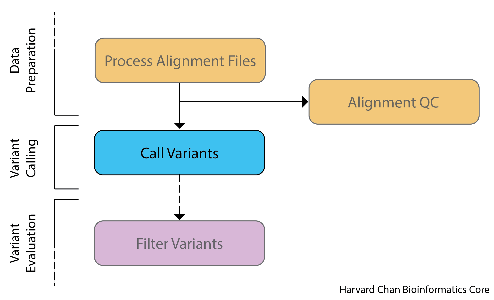
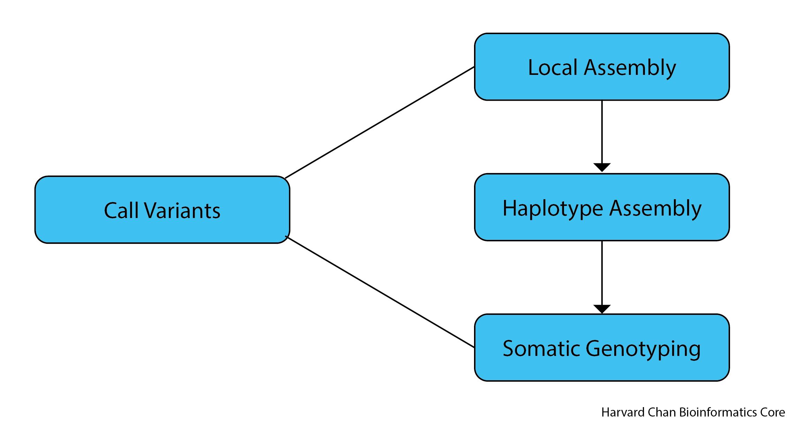

# Variant Calling

## Learning Objectives

- Differentiate between germline and somatic variant calling
- Call somatics variants from `bam` files using `MutTect2`

## Variant Calling Background

Now that we have inspected our reads and alignments for high-quality QC and also formatted our alignments for variant calling, we are now ready to begin using GATK to call our variants. **ADD MORE FLAVOR HERE**

<p align="center">

</p>

## Germline versus Somatic Variant Calling

Variant calling can be broadly broken up into two groups, germline and somatic. Germline variant calling refers to the process of calling variants that are ubiquitous across the organism (i.e. almost all cells carry these variants) and these are the types of variants that can be passed through the germline. Studies that evaluate population genetics are often concerned with germline variant calling. Somatic variant calling refers to the process of calling variants that differ between cells within a single organism and these variants are not passed through the germline. Somatic variant calling is often used when studying the progression of various cancers. These two types of variant calling methods have different assumptions regarding in the input data and thus are handled differently. 

For example, germline variant calling for the most part expects at most two alleles in relatively equal frequencies, while a single tumor sample could have various cancer lineages with various allele frequencies. This makes somatic variant calling more difficult than germline variant calling because low frequency variants and sequencing artifacts are difficult to distinguish from sequencing errors. Additionally, oftentimes within somatic variant calling, you are also trying to avoid calling the germline variants. The image below should help distinguish between germline and somatic variants:

<p align="center">

</p>

In the above image we can see an example of a germline variant on the left. Approximately half of the reads support each allele in both the tumor and normal sample reads. When compared to the somatic variant on the right, where we observe no variants in the normal sample reads but there is a variant present in the tumor sample reads. 

As you can also presume, high coverage is helpful for two reasons:

**1)** It helps distinguish sequencing errors and artifacts from true low frequency alleles in the tumor samples

**2)** It helps distinugish germline variants from somatic variants

## Types of variants that can be called

There are several different types variants that require their own consideration. These include:

- Single Nucleotide Polymorphisms (SNPs)
- Small Insertions/Deletions (Indels)
- Copy Number Variants (CNVs)
- Structural Variants (SVs)

Similarly to the tools in a workshop, variant calling for each of these types of variants requires tools created for it. [`GATK`](https://gatk.broadinstitute.org/hc/en-us) has packages that can address the needs of several of these:

- [`HaplotypeCaller`](https://gatk.broadinstitute.org/hc/en-us/articles/5358864757787-HaplotypeCaller) can be used for germline SNPs and Indels
- [`MuTect2`](https://gatk.broadinstitute.org/hc/en-us/articles/5358911630107-Mutect2) can be used for somatic SNPs and Indels
- [`GermlineCNVCaller`](https://gatk.broadinstitute.org/hc/en-us/articles/5358874158235-GermlineCNVCaller) can be used for germline Copy Number Variants
- [Software for Structural Variants is currently in beta testing.](https://gatk.broadinstitute.org/hc/en-us/articles/5358824293659--Tool-Documentation-Index#StructuralVariantDiscovery)

This course is going to focus on analyzing somatic SNPs, so we are going to use `MuTect2`.

## MuTect2

### Basic workflow

BREAK THIS UP
When using `MuTect2`, we will first re-evaluate the alignments of the normal and tumor samples and create "active regions" that appear to need a local re-assembly. During this process of local re-assembly the tumor sample's reads are interrogated to a higher degree for their quality than the normal samples and a *de Bruijn* graph of the region is created with an assembler. From here, most likely haplotypes are assembled and variants are called from these haplotypes. 

The alogrithm used for somatic variant discovery with Mutect2 is broken up into three major components:
- **Local Assembly** - The initial step is for Mutect2 to evaluates regions for somatic variations. Regions that surpass a log odds threshold for somatic variation comparing the existance and non-existance of a potential alternate allele are flagged as "active" regions and are slated for local reassembly and realignment. The local reassembly is done by creating a *de Bruijn* graph of the active region.
- **Haplotype Assembly** - From this *de Bruijn* graph, each haplotype is assembled and the haplotype spans the variant in question and connects two points in the reference genome.
- **Somatic Genotyping** - 

<p align="center">

</p>

## Variant Call Format

The [Variant Call Format (VCF)](https://samtools.github.io/hts-specs/VCFv4.2.pdf) is a standardized, text-file format for describing variants identifed from a sequencing experiment. This allows for downstream processes to be streamlined and also allows for researchers to easily collaborate and manipulate a shared set of variant calls. A VCF file is composed of three main parts:
- Meta-information Lines
- Header Line
- Data Lines

A sample VCF can be found below:

```
##fileformat=VCFv4.2
##FILTER=<ID=FAIL,Description="Fail the site if all alleles fail but for different reasons.">
##FILTER=<ID=PASS,Description="Site contains at least one allele that passes filters">
##FILTER=<ID=base_qual,Description="alt median base quality">
...
##FORMAT=<ID=AD,Number=R,Type=Integer,Description="Allelic depths for the ref and alt alleles in the order listed">
##FORMAT=<ID=AF,Number=A,Type=Float,Description="Allele fractions of alternate alleles in the tumor">
##FORMAT=<ID=DP,Number=1,Type=Integer,Description="Approximate read depth (reads with MQ=255 or with bad mates are filtered)">
...
##GATKCommandLine=<ID=FilterMutectCalls,CommandLine="FilterMutectCalls --output /n/scratch/users/<first_letter_of_user>/<user>/variant_calling/vcf_files/mutect2_syn3_normal_syn3_tumor_GRCh38.p7-filt.vcf --variant /n/scratch/users/<first_letter_of_user>/<user>/variant_calling/vcf_files/mutect2_syn3_normal_syn3_tumor_GRCh38.p7-raw.vcf --reference /n/groups/hbctraining/variant_calling/reference/GRCh38.p7.fa ... Version="4.1.9.0",Date="February 15, 2023 10:32:47 PM EST">
##GATKCommandLine=<ID=Mutect2,CommandLine="Mutect2 --tumor-sample syn3_tumor --normal-sample syn3_normal --output /n/scratch/users/<first_letter_of_user>/<user>/variant_calling/vcf_files/mutect2_syn3_normal_syn3_tumor_GRCh38.p7-raw.vcf --input /n/scratch/users/<first_letter_of_user>/<user>/variant_calling/alignments/syn3_normal_GRCh38.p7.coordinate_sorted.bam --input /n/scratch/users/<first_letter_of_user>/<user>/variant_calling/alignments/syn3_tumor_GRCh38.p7.coordinate_sorted.bam --reference /n/groups/hbctraining/variant_calling/reference/GRCh38.p7.fa --sequence-dictionary /n/groups/hbctraining/variant_calling/reference/GRCh38.p7.dict --annotation ClippingRankSumTest --annotation DepthPerSampleHC --annotation MappingQualityRankSumTest --annotation MappingQualityZero --annotation QualByDepth --annotation ReadPosRankSumTest --annotation RMSMappingQuality --annotation FisherStrand --annotation MappingQuality --annotation DepthPerAlleleBySample --annotation Coverage ... Version="4.1.9.0",Date="February 15, 2023 7:55:01 PM EST">
##INFO=<ID=AS_FilterStatus,Number=A,Type=String,Description="Filter status for each allele, as assessed by ApplyRecalibration. Note that the VCF filter field will reflect the most lenient/sensitive status across all alleles.">
##INFO=<ID=AS_SB_TABLE,Number=1,Type=String,Description="Allele-specific forward/reverse read counts for strand bias tests. Includes the reference and alleles separated by |.">
##INFO=<ID=AS_UNIQ_ALT_READ_COUNT,Number=A,Type=Integer,Description="Number of reads with unique start and mate end positions for each alt at a variant site">
...
##MutectVersion=2.2
##contig=<ID=1,length=248956422>
##contig=<ID=HSCHR1_CTG1_UNLOCALIZED,length=175055>
##contig=<ID=HSCHR1_CTG2_UNLOCALIZED,length=32032>
...
##filtering_status=These calls have been filtered by FilterMutectCalls to label false positives with a list of failed filters and true positives with PASS.
##normal_sample=syn3_normal
##source=FilterMutectCalls
##source=Mutect2
##tumor_sample=syn3_tumor
#CHROM  POS     ID      REF     ALT     QUAL    FILTER  INFO    FORMAT  syn3_normal     syn3_tumor
1       137221  .       T       G       .       normal_artifact;strand_bias;weak_evidence       AS_FilterStatus=weak_evidence,strand_bias;AS_SB_TABLE=44,40|0,6;ClippingRankSum=1.739;DP=91;ECNT=1;FS=15.787;GERMQ=93;MBQ=32,32;MFRL=334,339;MMQ=22,35;MPOS=26;MQ=30.08;MQ0=0;MQRankSum=1.446;NALOD=-4.708e+00;NLOD=2.44;POPAF=6.00;ReadPosRankSum=-0.866;TLOD=4.45     GT:AD:AF:DP:F1R2:F2R1:SB        0/0:40,3:0.089:43:21,2:18,1:22,18,0,3   0/1:44,3:0.081:47:25,1:18,2:22,22,0,3
1       186370  .       C       T       .       map_qual;normal_artifact;weak_evidence  AS_FilterStatus=weak_evidence,map_qual;AS_SB_TABLE=111,70|10,3;ClippingRankSum=1.928;DP=207;ECNT=1;FS=4.234;GERMQ=93;MBQ=33,31;MFRL=341,342;MMQ=25,25;MPOS=14;MQ=25.66;MQ0=0;MQRankSum=-0.158;NALOD=-7.956e+00;NLOD=10.68;POPAF=6.00;ReadPosRankSum=-1.732;TLOD=5.07    GT:AD:AF:DP:F1R2:F2R1:SB        0/0:96,7:0.075:103:45,4:50,3:56,40,6,1  0/1:85,6:0.067:91:42,1:43,4:55,30,4,2
1       187019  .       G       A       .       map_qual;normal_artifact;weak_evidence  AS_FilterStatus=weak_evidence,map_qual;AS_SB_TABLE=56,76|6,3;ClippingRankSum=-4.266;DP=149;ECNT=1;FS=7.413;GERMQ=93;MBQ=34,33;MFRL=344,351;MMQ=50,20;MPOS=1;MQ=42.64;MQ0=0;MQRankSum=-4.743;NALOD=-1.314e+00;NLOD=10.65;POPAF=6.00;ReadPosRankSum=-4.367;TLOD=4.26      GT:AD:AF:DP:F1R2:F2R1:SB        0/0:60,3:0.061:63:27,3:30,0:25,35,3,0   0/1:72,6:0.085:78:31,4:39,2:31,41,3,3
```

### Meta-information Lines

The first lines in a VCF file are called the ***meta-information lines*** and they always start with `##`. These lines contain information regarding how the file was made and what the file contains. The meta-information lines from the above example are:

```
##fileformat=VCFv4.2
##FILTER=<ID=FAIL,Description="Fail the site if all alleles fail but for different reasons.">
##FILTER=<ID=PASS,Description="Site contains at least one allele that passes filters">
##FILTER=<ID=base_qual,Description="alt median base quality">
...
##FORMAT=<ID=AD,Number=R,Type=Integer,Description="Allelic depths for the ref and alt alleles in the order listed">
##FORMAT=<ID=AF,Number=A,Type=Float,Description="Allele fractions of alternate alleles in the tumor">
##FORMAT=<ID=DP,Number=1,Type=Integer,Description="Approximate read depth (reads with MQ=255 or with bad mates are filtered)">
...
##GATKCommandLine=<ID=FilterMutectCalls,CommandLine="FilterMutectCalls --output /n/scratch3/users/<first_letter_of_user>/<user>/variant_calling/vcf_files/mutect2_syn3_normal_syn3_tumor_GRCh38.p7-filt.vcf --variant /n/scratch3/users/<first_letter_of_user>/<user>/variant_calling/vcf_files/mutect2_syn3_normal_syn3_tumor_GRCh38.p7-raw.vcf --reference /n/groups/hbctraining/variant_calling/reference/GRCh38.p7.fa ... Version="4.1.9.0",Date="February 15, 2023 10:32:47 PM EST">
##GATKCommandLine=<ID=Mutect2,CommandLine="Mutect2 --tumor-sample syn3_tumor --normal-sample syn3_normal --output /n/scratch3/users/<first_letter_of_user>/<user>/variant_calling/vcf_files/mutect2_syn3_normal_syn3_tumor_GRCh38.p7-raw.vcf --input /n/scratch3/users/<first_letter_of_user>/<user>/variant_calling/alignments/syn3_normal_GRCh38.p7.coordinate_sorted.bam --input /n/scratch3/users/<first_letter_of_user>/<user>/variant_calling/alignments/syn3_tumor_GRCh38.p7.coordinate_sorted.bam --reference /n/groups/hbctraining/variant_calling/reference/GRCh38.p7.fa --sequence-dictionary /n/groups/hbctraining/variant_calling/reference/GRCh38.p7.dict --annotation ClippingRankSumTest --annotation DepthPerSampleHC --annotation MappingQualityRankSumTest --annotation MappingQualityZero --annotation QualByDepth --annotation ReadPosRankSumTest --annotation RMSMappingQuality --annotation FisherStrand --annotation MappingQuality --annotation DepthPerAlleleBySample --annotation Coverage ... Version="4.1.9.0",Date="February 15, 2023 7:55:01 PM EST">
##INFO=<ID=AS_FilterStatus,Number=A,Type=String,Description="Filter status for each allele, as assessed by ApplyRecalibration. Note that the VCF filter field will reflect the most lenient/sensitive status across all alleles.">
##INFO=<ID=AS_SB_TABLE,Number=1,Type=String,Description="Allele-specific forward/reverse read counts for strand bias tests. Includes the reference and alleles separated by |.">
##INFO=<ID=AS_UNIQ_ALT_READ_COUNT,Number=A,Type=Integer,Description="Number of reads with unique start and mate end positions for each alt at a variant site">
...
##MutectVersion=2.2
##contig=<ID=1,length=248956422>
##contig=<ID=HSCHR1_CTG1_UNLOCALIZED,length=175055>
##contig=<ID=HSCHR1_CTG2_UNLOCALIZED,length=32032>
...
##filtering_status=These calls have been filtered by FilterMutectCalls to label false positives with a list of failed filters and true positives with PASS.
##normal_sample=syn3_normal
##source=FilterMutectCalls
##source=Mutect2
##tumor_sample=syn3_tumor
```

Let's analyze a few of the meta-information lines to understand what they are describing:

- The first line `##fileformat=VCFv4.2` is telling us the version of the VCF file. 

- The next sets of lines  starting with `##FILTER` can tell us about filters that we have applied and these can be seen in the `FILTER` field in the data lines (see below). The `ID` is what will appear in the `FILTER` field and the `Description` is a bit deeper description of what this filter tag means.

- Similiarly to our `##FILTER` lines, the `##FORMAT` lines can tell us about the format used in the `FORMAT` field. The `ID` is the abbreviation that will be seen in the `FORMAT` field and the `Description` is a bit deeper explaination of what the formatting is.

- This VCF file was made with two commands from the package `GATK` and so it has a pair of `##GATKCommandLine` lines. VCF files should list each command that was used to produce them. These lines should contain all of the parameters used to create the VCF files along with the version of the program used to create the VCF file.

- Like the `##FILTER` and `##FORMAT` fields prior, `##INFO` fields outline the abbreviations (the `ID`s) that can be found in the `INFO` field of the VCF file along with their `Description`.

- The `##MutectVersion=2.2` is just telling the user the version of the `GATK` package, `MuTect2`, that was used to make the variant calls.

- The `##contig` lines outline the name (`ID`) and length (`length`) of each contig in the reference sequence.

- The `##filtering_status` is a bit unique to `MuTect2`. We will discuss this process a bit more when we discuss [variant filtering](10_variant_filtering.md). In short, `MuTect2` has a "call everything, filter later" approach and this is signifying that the filtering step to add the FILTER tags to the FILTER fields has been done. Prior to this step this field read:

```
##filtering_status=Warning: unfiltered Mutect 2 calls.  Please run FilterMutectCalls to remove false positives.
```

- The `##normal_sample=syn3_normal` and `##tumor_sample=syn3_tumor` sample lines are defining which samples are our normal and tumor samples.

- The `##source=FilterMutectCalls` and `##source=Mutect2` lines give us a brief idea of the two software packages that have been run to create our VCF file, but these are not as in-depth as the `##GATKCommandLine` lines.


### Header Line

The header line is a single line between the meta-information lines and the data lines that provies a brief desciption of each field in the following data lines. The example header line looked like:

```
#CHROM  POS ID  REF ALT QUAL  FILTER  INFO  FORMAT  syn3_normal     syn3_tumor
```

The header line always starts with just a single `#` followed by eight mandatory fields:

- **CHROM** - Chromosome where the variant was found
- **POS** - A 1-based index for the position on the chromosome where the variant was found. For multibase variants, this corresponds to the first base's position.
- **ID** - If a SNP has an identifier (i.e. such as an rs number(s) from dbSNP), then it is put here. Otherwise, it will be a `.`.
- **REF** - The reference base(s) for the given position
- **ALT** - The variant base(s) for the given position. In the case of multiple variants present, they will be comma separated.
- **QUAL** - A PHRED-scaled quality score for the variant
- **FILTER** - A status of 'PASS' is given for any variant passing all filters. If a variant fails, then a semi-colon separated list will enumerate the filter(s) that the variant failed.
- **INFO** -  Additional information about the variant. Common catergories can be found in the table below:

| Abbreviation | Data Type |
|--------------|-----------|
| AF | Allele Frequency for the ALT allele |
| DP | Combined Depth across all samples |
| NS | Number of samples with data |

- **FORMAT** - A colon-separated list of abbreviated catergories corresponding to the colon-separated genotype fields. For example, this colon-separated list generally begins with `GT`, which stands for genotype. Thus, the first element in the subsequent genotype field(s) for each sample will be the inferred genotype. If the second element in the colon-sperated list is `GQ`, then the second element in each of the colon-separated genotype fieds will be a genotype quality score. Common catergories include:

| Abbreviation | Data Type |
|--------------|-----------|
| GT* | Genotype |
| DP | Depth of the sample |
| GQ | Genotype Quality |
| HQ | Commma-separated list of Haplotype Qualities |

\* The genotype field will have two integers for a diploid sample separated by either a `/` or a `|`. The integers correspond to the alleles with 0 being the reference allele, 1 being the first allele listed in the ALT field, 2 being the second allele listed in the ALT field, etc. A `/` denotes an unphased genotype, while `|` denotes a phased genotype.
- **Genotype Fields** - A colon-separated list of genotype information about a given sample that corresponds to the categories outlined in the FORMAT field. The fields will be equal to the number of samples investigated. In the case of the sample VCF, these are the fields titled `syn3_normal` and `syn3_tumor`.

The abbreviations for the INFO and FORMAT fields given in the aforementioned tables is not exhaustive. Generally, these abbreviations with be outlined in the meta-information lines at the top of the file or can be found on pages 5 and 6 of the [VCF manual](https://samtools.github.io/hts-specs/VCFv4.2.pdf).

### Data Lines

The data lines are where the variant calls will be found with each field corresponding to its column in the header line. 

```
1       137221  .       T       G       .       normal_artifact;strand_bias;weak_evidence       AS_FilterStatus=weak_evidence,strand_bias;AS_SB_TABLE=44,40|0,6;ClippingRankSum=1.739;DP=91;ECNT=1;FS=15.787;GERMQ=93;MBQ=32,32;MFRL=334,339;MMQ=22,35;MPOS=26;MQ=30.08;MQ0=0;MQRankSum=1.446;NALOD=-4.708e+00;NLOD=2.44;POPAF=6.00;ReadPosRankSum=-0.866;TLOD=4.45     GT:AD:AF:DP:F1R2:F2R1:SB        0/0:40,3:0.089:43:21,2:18,1:22,18,0,3   0/1:44,3:0.081:47:25,1:18,2:22,22,0,3
1       186370  .       C       T       .       map_qual;normal_artifact;weak_evidence  AS_FilterStatus=weak_evidence,map_qual;AS_SB_TABLE=111,70|10,3;ClippingRankSum=1.928;DP=207;ECNT=1;FS=4.234;GERMQ=93;MBQ=33,31;MFRL=341,342;MMQ=25,25;MPOS=14;MQ=25.66;MQ0=0;MQRankSum=-0.158;NALOD=-7.956e+00;NLOD=10.68;POPAF=6.00;ReadPosRankSum=-1.732;TLOD=5.07    GT:AD:AF:DP:F1R2:F2R1:SB        0/0:96,7:0.075:103:45,4:50,3:56,40,6,1  0/1:85,6:0.067:91:42,1:43,4:55,30,4,2
1       187019  .       G       A       .       map_qual;normal_artifact;weak_evidence  AS_FilterStatus=weak_evidence,map_qual;AS_SB_TABLE=56,76|6,3;ClippingRankSum=-4.266;DP=149;ECNT=1;FS=7.413;GERMQ=93;MBQ=34,33;MFRL=344,351;MMQ=50,20;MPOS=1;MQ=42.64;MQ0=0;MQRankSum=-4.743;NALOD=-1.314e+00;NLOD=10.65;POPAF=6.00;ReadPosRankSum=-4.367;TLOD=4.26      GT:AD:AF:DP:F1R2:F2R1:SB        0/0:60,3:0.061:63:27,3:30,0:25,35,3,0   0/1:72,6:0.085:78:31,4:39,2:31,41,3,3
...
1       1324300 .       G       A       .       PASS    AS_FilterStatus=SITE;AS_SB_TABLE=47,6|11,0;ClippingRankSum=0.390;DP=68;ECNT=1;FS=2.373;GERMQ=93;MBQ=27,27;MFRL=337,338;MMQ=60,60;MPOS=27;MQ=60.00;MQ0=0;MQRankSum=0.000;NALOD=1.54;NLOD=9.88;POPAF=6.00;ReadPosRankSum=-0.125;TLOD=24.65        GT:AD:AF:DP:F1R2:F2R1:SB        0/0:33,0:0.028:33:12,0:20,0:32,1,0,0    0/1:20,11:0.367:31:6,6:12,5:15,5,11,0
```

Let's analyze this last line more closely:

```
1       1324300 .       G       A       .       PASS    AS_FilterStatus=SITE;AS_SB_TABLE=47,6|11,0;ClippingRankSum=0.390;DP=68;ECNT=1;FS=2.373;GERMQ=93;MBQ=27,27;MFRL=337,338;MMQ=60,60;MPOS=27;MQ=60.00;MQ0=0;MQRankSum=0.000;NALOD=1.54;NLOD=9.88;POPAF=6.00;ReadPosRankSum=-0.125;TLOD=24.65        GT:AD:AF:DP:F1R2:F2R1:SB        0/0:33,0:0.028:33:12,0:20,0:32,1,0,0    0/1:20,11:0.367:31:6,6:12,5:15,5,11,0
```

This variant is on chromosome `1` at position `1324300`. It has a `.` in the third field because it hasn't been annotated with dbSNP yet, but that may change if we annotate this file. The reference allele in the position was a `G` and a variant allele, `A`, was found. The sixth field `.` signifies that it doesn't have a PHRED quality score associated with this variant. This variant passed all of the filters. For each sample we will have information on the genotype, allele depths listed in order, the alternate allele frequency, depth at this site, counts of reads in F1R2 pair orientation supporting each allele, counts of reads in F2R1 pair orientation supporting each allele and some statistics on strand bias. 

### Exercises

Let's analzye this sample VCF file found here `/n/groups/hbctraining/variant_calling/sample_data/sample.vcf`. First let's move into out `variant_calling` directory and copy over the file:

```
cd ~/variant_calling/
cp /n/groups/hbctraining/variant_calling/sample_data/sample.vcf .
```

**4.** Using `grep`, extract only the meta-information lines from the VCF file. 

**5.** Using `grep`, extract the lines containing the names of all of the software packages that were used in the creation of this VCF file?

**Bonus Challenge:** **6.** For the variant at position 806262 on chromosome 19, what is the reference allele?

## Workflow

Let's start writing out a new `sbatch` submission script for `MuTect2`:

```
cd ~/variant_calling/scripts/
vim mutect2_normal_tumor.sbatch
```

First, let's add our shebang line, script description and `sbatch` directive:

```
#!/bin/bash
# This sbatch script is for variant calling with GATK's MuTect2

# Assign sbatch directives
#SBATCH -p priority
#SBATCH -t 1-00:00:00
#SBATCH -c 1
#SBATCH --mem 16G
#SBATCH -o mutect2_variant_calling_normal_tumor_%j.out
#SBATCH -e mutect2_variant_calling_normal_tumor_%j.err
```

Next add the `GATK` module we are going to load:

```
# Load the GATK module
module load gatk/4.1.9.0
```

Next, we need to add our variables:

```
# Assign variables
REFERENCE_SEQUENCE=/n/groups/hbctraining/variant_calling/reference/GRCh38.p7.fa
REFERENCE_DICTIONARY=`echo ${REFERENCE_SEQUENCE%fa}dict`
NORMAL_SAMPLE_NAME=syn3_normal
NORMAL_BAM_FILE=/n/scratch/users/${USER:0:1}/${USER}/variant_calling/alignments/${NORMAL_SAMPLE_NAME}_GRCh38.p7.coordinate_sorted.bam
TUMOR_SAMPLE_NAME=syn3_tumor
TUMOR_BAM_FILE=/n/scratch/users/${USER:0:1}/${USER}/variant_calling/alignments/${TUMOR_SAMPLE_NAME}_GRCh38.p7.coordinate_sorted.bam
VCF_OUTPUT_FILE=/n/scratch/users/${USER:0:1}/${USER}/variant_calling/vcf_files/mutect2_${NORMAL_SAMPLE_NAME}_${TUMOR_SAMPLE_NAME}_GRCh38.p7-raw.vcf
```

<details>
  <summary><b>Click here if you used <code>samtools</code> instead of <code>Picard</code> to process the alignment files</b></summary>
  Very little needs to be edited to these variables to adapt them for the <code>samtools</code> output. However, the end of the file that was created in <code>samtools</code> was <code>.removed_duplicates.bam</code> rather than <code>.coordinate_sorted.bam</code>. As a result we need to edit the variables a bit. Change:<br>
  <pre>
  NORMAL_BAM_FILE=/n/scratch/users/${USER:0:1}/${USER}/variant_calling/alignments/${NORMAL_SAMPLE_NAME}_GRCh38.p7.coordinate_sorted.bam</pre>
  To:
  <pre>
  NORMAL_BAM_FILE=/n/scratch/users/${USER:0:1}/${USER}/variant_calling/alignments/${NORMAL_SAMPLE_NAME}_GRCh38.p7.removed_duplicates.bam</pre>
  And also change:
  <pre>
  TUMOR_BAM_FILE=/n/scratch/users/${USER:0:1}/${USER}/variant_calling/alignments/${TUMOR_SAMPLE_NAME}_GRCh38.p7.coordinate_sorted.bam</pre>
  To:
  <pre>
  TUMOR_BAM_FILE=/n/scratch/users/${USER:0:1}/${USER}/variant_calling/alignments/${TUMOR_SAMPLE_NAME}_GRCh38.p7.removed_duplicates.bam</pre>
  After those changeed have been made, the rest of the script should be the same.
<hr />
</details>

> NOTE: Sometimes when there are many input variables that re-use many of the same textual elements (i.e. paths, sample names and reference genome names), like we have above, it is sometimes cleaner, less typo-prone and more reproducible to assign those repeated items to variables and then use text manipulation tools and variable subsitution in `bash` to create the rest of the variables. In the above example, some of the lines of variable assignment (`REFERENCE_SEQUENCE`, `NORMAL_SAMPLE_NAME` and `TUMOR_SAMPLE_NAME`) are likely lines you might edit from run-to-run, but the other lines (`REFERENCE_DICTIONARY`, `NORMAL_BAM_FILE`, `TUMOR_BAM_FILE` and `VCF_OUTPUT_FILE`) will likely stay the same or similiar. Standardizing your paths and nomenclature will help you keep track of your files much easier.

Lastly, we need to add the `MuTect2` command:

```
# Run MuTect2
gatk Mutect2 \
  --sequence-dictionary $REFERENCE_DICTIONARY \
  --reference $REFERENCE_SEQUENCE \
  --input $NORMAL_BAM_FILE \
  --normal-sample $NORMAL_SAMPLE_NAME \
  --input $TUMOR_BAM_FILE \
  --tumor-sample $TUMOR_SAMPLE_NAME \
  --annotation ClippingRankSumTest --annotation DepthPerSampleHC --annotation MappingQualityRankSumTest --annotation MappingQualityZero --annotation QualByDepth --annotation ReadPosRankSumTest --annotation RMSMappingQuality --annotation FisherStrand --annotation MappingQuality --annotation DepthPerAlleleBySample --annotation Coverage \
  --output $VCF_OUTPUT_FILE
```

Let's breakdown this command:

- `gatk Mutect2` Calls the `Mutect2` package from `GATK`

- `--sequence-dictionary $REFERENCE_DICTIONARY` `GATK` requires a sequence directory (`.dict`) file of the reference sequence. We have gone ahead and already created this for you

<details>
  <summary><b>Click here for the commands to create a sequence directory</b></summary>
  We can create the required sequence dictionary in <code>Picard</code>. But first, let's double check we have the <code>Picard</code> module loaded:
  <pre>
  module load picard/2.27.5</pre>
  
  The command to do create the sequence dictionary is:<br>
  <pre>
  # YOU DON'T NEED TO RUN THIS
  java -jar $PICARD/picard.jar CreateSequenceDictionary \
  --REFERENCE /n/groups/hbctraining/variant_calling/reference/GRCh38.p7_genomic.fa
  --OUTPUT /n/groups/hbctraining/variant_calling/reference/GRCh38.p7_genomic.dict</pre>
  
  The components of this command are:
  <ul><li><code>java -jar $PICARD/picard.jar CreateSequenceDictionary</code> This calls the <code>CreateSequenceDictionary</code> command within <code>Picard</code></li>
  <li><code>--REFERENCE /n/groups/hbctraining/variant_calling/reference/GRCh38.p7_genomic.fa</code> This is the reference sequence to create the sequence dictionary from.</li>
  <li><code>--OUTPUT /n/groups/hbctraining/variant_calling/reference/GRCh38.p7_genomic.dict</code> This is the output sequence dictionary.</li></ul>
  
  Like indexing, once you have created the sequence dictionary for a reference genome, you won't need to do it again.
<hr />
</details>

- `--reference $REFERENCE_SEQUENCE` This is the genome reference sequence

- `--input $NORMAL_BAM_FILE` This is the first `bam` file that we are providing GATK and it happens to be the normal sample

- `--normal-sample $NORMAL_SAMPLE_NAME` This is the name of that normal sample and will be used as a column header in the VCF file

- `--input $TUMOR_BAM_FILE` This is the second `bam` file that we are providing GATK and it happens to be the tumor sample

- `--tumor-sample $TUMOR_SAMPLE_NAME` This is the name of that tumor sample and will be used as a column header in the VCF file

> NOTE: It is **VERY IMPORTANT** that the sample names (`--normal-sample $NORMAL_SAMPLE_NAME` and `--tumor-sample $TUMOR_SAMPLE_NAME`) are provided in the same order as the `--input` input BAM files!

- ```--annotation ClippingRankSumTest --annotation DepthPerSampleHC --annotation MappingQualityRankSumTest --annotation MappingQualityZero --annotation QualByDepth --annotation ReadPosRankSumTest --annotation RMSMappingQuality --annotation FisherStrand --annotation MappingQuality --annotation DepthPerAlleleBySample --annotation Coverage``` These are a variety of additional annotations that we are going to add to the output VCF file. These are not required for `MuTect2` to run, but they provide additional details about our variants.

- `--output $VCF_OUTPUT_FILE` This is our output VCF file

> NOTE: In order to run `MuTect2` we also need to have a FASTA index file of our reference sequence in addition to our sequence dictionary. Similarly to the sequence dictionary and `bwa` indicies, we have already created this index for you. However, the dropdown below will walk you through how to do it, should you ever need to do it on your own:
>
><details>
>  <summary><b>Click here for details for creating a FASTA index file in <code>samtools</code></b></summary>
>    <br>FASTA index files for reference sequences are fairly common requirements for a variety of NGS software packages. <code>Picard</code> currently does not feature an ability to create a FASTA index file. However, <code>samtools</code> is a very popular tool that is used for a variety of processes for processing BAM/SAM files and it also includes functionality for the creation of FASTA index files. First, we will need to load the <code>gcc</code> and <code>samtools</code> modules:
>  
>  <pre>
>  module load gcc/6.2.0
>  module load samtools/1.15.1</pre>
>  
>  The command for indexing a FASTA file is straightforward and should run pretty quickly:
>  <pre>
>    # YOU DON'T NEED TO RUN THIS
>    samtools faidx \
>    reference_sequence.fa</pre>
>  
>    We can breakdown this code:
>    <ul><li><code>samtools faidx</code> This calls the <code>faidx</code> software from <code>samtools</code></li>
>    <li><code>reference_sequence.fa</code> This is the reference sequence FASTA file that you would like to index</li></ul>
>  
>  Once the indexing is complete, then you should have a index file (<code>reference_sequence.fa.fai</code>) in same directory as your reference sequence <code>reference_sequence.fa</code>.
> <hr />
></details>

<details>
  <summary><b>Click here to see what our final <code>sbatch</code>code script for calling variants with <code>MuTect2</code> should look like</b></summary> 
  <pre>
#!/bin/bash
# This sbatch script is for variant calling with GATK's MuTect2<br>
# Assign sbatch directives
#SBATCH -p priority
#SBATCH -t 1-00:00:00
#SBATCH -c 1
#SBATCH --mem 16G
#SBATCH -o mutect2_variant_calling_normal_tumor_%j.out
#SBATCH -e mutect2_variant_calling_normal_tumor_%j.err<br>
# Load the GATK module
module load gatk/4.1.9.0<br>
# Assign variables
REFERENCE_SEQUENCE=/n/groups/hbctraining/variant_calling/reference/GRCh38.p7.fa
REFERENCE_DICTIONARY=`echo ${REFERENCE_SEQUENCE%fa}dict`
NORMAL_SAMPLE_NAME=syn3_normal
NORMAL_BAM_FILE=/n/scratch/users/${USER:0:1}/${USER}/variant_calling/alignments/${NORMAL_SAMPLE_NAME}_GRCh38.p7.coordinate_sorted.bam
TUMOR_SAMPLE_NAME=syn3_tumor
TUMOR_BAM_FILE=/n/scratch/users/${USER:0:1}/${USER}/variant_calling/alignments/${TUMOR_SAMPLE_NAME}_GRCh38.p7.coordinate_sorted.bam
VCF_OUTPUT_FILE=/n/scratch/users/${USER:0:1}/${USER}/variant_calling/vcf_files/mutect2_${NORMAL_SAMPLE_NAME}_${TUMOR_SAMPLE_NAME}_GRCh38.p7-raw.vcf<br>
# Run MuTect2
gatk Mutect2 \
  --sequence-dictionary $REFERENCE_DICTIONARY \
  --reference $REFERENCE_SEQUENCE \
  --input $NORMAL_BAM_FILE \
  --normal-sample $NORMAL_SAMPLE_NAME \
  --input $TUMOR_BAM_FILE \
  --tumor-sample $TUMOR_SAMPLE_NAME \
  --annotation ClippingRankSumTest --annotation DepthPerSampleHC --annotation MappingQualityRankSumTest --annotation MappingQualityZero --annotation QualByDepth --annotation ReadPosRankSumTest --annotation RMSMappingQuality --annotation FisherStrand --annotation MappingQuality --annotation DepthPerAlleleBySample --annotation Coverage \
  --output $VCF_OUTPUT_FILE
</pre>
</details>

You can submit your variant calling script to the cluster:

```bash
sbatch mutect2_normal_tumor.sbatch
```

## Tumor-only Mode

MuTect2 is capable of running without a matched normal sample, otherwise called "Tumor-only mode". However, it's ability to reliably call somatic variants is greatly diminished as it has difficulty distinguishing between high frequency variants and germline variants. 

## Discuss PoNs?

Panel of Normals are is a VCF of normal samples run through "tumor-only mode". If the variant is seen in multiple samples then this variant is included in the Panel of Normals. If these variants are then found in the tumor-sample then the variant is ignored. If panels of normal are used, then they should be gathered using a similiar sequencing design as the tumor samples.

## Discuss Common General Population Allele Frequencies?

gnomAD


## Additional Resources

[BroadE: GATK - Intro to Somatic Variant Discovery](https://www.youtube.com/watch?v=0q5_e2Nfph4)

[BroadE: GATK - Somatic SNVs and Indels](https://www.youtube.com/watch?v=T5IqadGoxow)

***

[Next Lesson >>](08_variant_filtering.md)

[Back to Schedule](../schedule/README.md)

***

*This lesson has been developed by members of the teaching team at the [Harvard Chan Bioinformatics Core (HBC)](http://bioinformatics.sph.harvard.edu/). These are open access materials distributed under the terms of the [Creative Commons Attribution license](https://creativecommons.org/licenses/by/4.0/) (CC BY 4.0), which permits unrestricted use, distribution, and reproduction in any medium, provided the original author and source are credited.*
