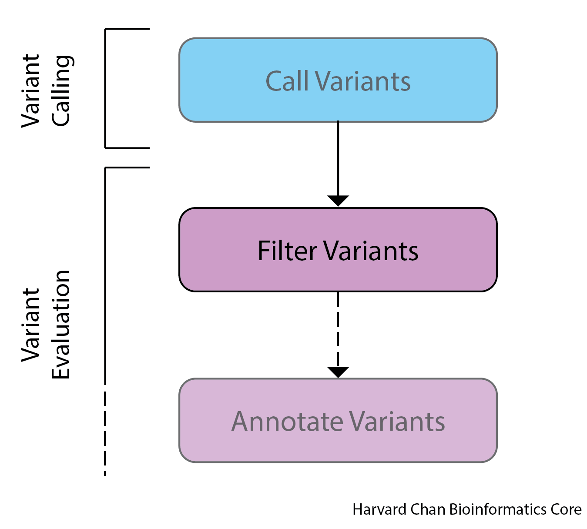

# Variant Filtering

## Learning Objectives

- Filter raw variant calls using `FilterMutectCells` to reduce errors
- Remove Low-Complexity Regions from the called variants using `SnpSift` to further reduce errors

## `FilterMutectCalls`

The output from `MuTect2` is a raw variant calling output. Many potential variants that are called are actually errors. The **calls need to be filtered to ensure against errors** such as:

- Technical artifacts
- Non-somatic mutations
- Sequencing Errors

<p align="center">

</p>

To perform the filtering, we will be using `FilterMutectCalls`, which utilizes both hard filtering thresholds and sophisticated machine learning models to comprehensively filter variants and reduce false positives.

* **Hard cut-offs**: MuTect2 applies hard filtering thresholds and variants must pass these thresholds. Some examples include:
     * QUAL (Quality score)
     * Depth of coverage
     * Variant allele frequency
     * Mapping quality
     * Artifact loci - Known problematic loci are filtered based on high false positive rates.
     * Clustered substitutions - Substitutions clustered together are more likely artifacts and are filtered.
  

* **Machine learning**: MuTect2 was trained on thousands of real and fake variants to learn patterns. It uses this knowledge to score each variant based on how likely it is to be real.
    * Employs probabilistic error models to characterize the probability distributions of various sequencing and alignment artifacts. This includes things like base quality scores, mapping quality, strand bias, etc.
    * For each raw variant call, MuTect2 calculates likelihoods of it being a real somatic mutation versus different error types based on the trained error models.
    * The quality score (QUAL) reported for each variant is based on the log-likelihood ratio of being a true mutation versus being an error. Higher scores indicate a variant is more likely real.


> NOTE: While we are not concerned with cross-sample contamination for this dataset, if you were concerned about cross-sample contamination, then you would need to run `CalculateContamination` program within `GATK` to obtain a contamination table. You can use this contamination table as input into `FilterMutectCells` with the `--contamination-table` option.
>

Once filtering is complete, **`FilterMutectCalls` will annotate the `FILTER` field** in the VCF file with whether the variant is passing with PASS or FAIL. 
* Variants with "PASS" in FILTER passed all filters and are the ones MuTect2 deems most likely to be real somatic variants.
* Variants with "FAIL" in the FILTER means that it did not pass MuTect2's internal filtering steps and quality checks.


### Running `FilterMutectCalls` 

Let's begin by navigating to our scripts directory and creating the `sbatch` submission script that we will be using for filtering our VCF file:

```
cd ~/variant_calling/scripts/
vim variant_filtering_normal_tumor.sbatch
```

The first step is to add our shebang line, description and `sbatch` directives: 

```
#!/bin/bash
# This sbatch script is for variant filtering

# Assign sbatch directives
#SBATCH -p priority
#SBATCH -t 0-00:10:00
#SBATCH -c 1
#SBATCH --mem 8G
#SBATCH -o variant_filtering_normal_tumor_%j.out
#SBATCH -e variant_filtering_normal_tumor_%j.err
```

Next, we need to add the modules that we will be loading:

```
# Load modules
module load gatk/4.1.9.0
module load snpEff/4.3g
```

Next, we will add our variables:

```
# Assign variables
REFERENCE_SEQUENCE=/n/groups/hbctraining/variant_calling/reference/GRCh38.p7.fa
RAW_VCF_FILE=/n/scratch/users/${USER:0:1}/${USER}/variant_calling/vcf_files/mutect2_syn3_normal_syn3_tumor_GRCh38.p7-raw.vcf
LCR_FILE=/n/groups/hbctraining/variant_calling/reference/LCR-hs38.bed
MUTECT_FILTERED_VCF=${RAW_VCF_FILE%raw.vcf}filt.vcf
PASSING_FILTER_VCF=${RAW_VCF_FILE%raw.vcf}pass-filt.vcf
LCR_FILTERED_VCF=${RAW_VCF_FILE%raw.vcf}pass-filt-LCR.vcf
```

Next, we can add the `FilterMutectCells` command:

```
# Filter Mutect Calls
gatk FilterMutectCalls \
  --reference $REFERENCE_SEQUENCE \
  --variant $RAW_VCF_FILE \
  --output $MUTECT_FILTERED_VCF
```

Let's breakdown this command:

- `gatk FilterMutectCalls` Calls the `FilterMutectCalls` package within `GATK`

- `--reference $REFERENCE_SEQUENCE` This is our reference genome

- `--variant $RAW_VCF_FILE` This is our raw VCF file from `MuTect2`

- `--output $MUTECT_FILTERED_VCF` This is our filtered output file from `FilterMutectCalls`

More information on `FilterMutectCalls` can be found [here](https://gatk.broadinstitute.org/hc/en-us/articles/360036856831-FilterMutectCalls) and a more technical guide to the filtering can be found [here](https://github.com/broadinstitute/gatk/blob/master/docs/mutect/mutect.pdf) in Section II.

## Filter VCF files for only variants with PASS in the FILTER field using SnpSift

Now, we are going to filter for only variants that had a FILTER result of `PASS`. To do this filtering we are going to use `SnpSift`, which is part of the [`SnpEff` and `SnpSift` suite](http://pcingola.github.io/SnpEff/) of tools. We will later be using `SnpEff` to annotate our variants and `SnpSift` to prioritize our variants, but for now we are just going to use `SnpSift` to filter out our variants. If some of the syntax for this command is unclear, that is fine. We are going to spend time covering the syntax later during the [Variant Prioritization section](13_variant_prioritization.md). Now, we can add our `SnpSift` command after the `FilterMutectCalls` command:

```
# Filter for only SNPs with PASS in the FILTER field
java -jar $SNPEFF/SnpSift.jar filter \
  -noLog \
  "( FILTER = 'PASS' )" \
  $MUTECT_FILTERED_VCF > $PASSING_FILTER_VCF
```

  - `java -jar $SNPEFF/SnpSift.jar filter` is a `java` packaged program, so it needs to be called with `java -jar` followed by the path where the JAR file is located on the cluster. `$SNPEFF` is just a bash variable that contains the path to JAR file. This calls the `filter` function within the `SnpSift` package
  
  - `-noLog` Does not report usage statistics to `SnpEff`'s servers. According to their [documentation](https://pcingola.github.io/SnpEff/se_commandline/#logging), it is so that they can monitor which features people are and aren't using. 
 
  - `"( FILTER = 'PASS' )"` This is the syntax that `SnpSift` uses to only retain variant calls with `PASS` in the `FILTER` field of the VCF file
 
  - `$MUTECT_FILTERED_VCF` This is the input VCF file
 
  - `> $PASSING_FILTER_VCF` This is the output VCF file

## Low-Complexity Regions

Low-complexity regions of the genome represent regions that have simple sequence repeats and variant callers are prone to make errors within these regions (see [Li, 2014](https://academic.oup.com/bioinformatics/article/30/20/2843/2422145)). Some insertions and deletions (Indels) are erroreously called within these low-complexity regions by various variant callers. They found:

> "low-complexity regions (LCRs), 2% of the human genome, harbor 80–90% of heterozygous INDEL calls and up to 60% of heterozygous SNPs" with false positive rates ranging from "10% to as high as 40%".

As a result of the high error rates in these low-complexity regions, it is recommended to remove of these regions until better methods for variant calling in low-complexity regions can become established. The file that holds out LCR regions is in BED format, so we need to breifly discuss this file format.

## BED Files

**B**rowser **E**xtensible **D**ata (BED) is a tab-delimited file format that contains information on genomic features. A BED file's first three columns (Chromosome, Starting Position and Ending Position) are required fields. Some BED files have additional columns but these are not required.

<p align="center">

</p>

It is important to note that BED files positioning have ***zero-based indexing***. 

### Exercise

**7.** Create a BED file within `~/variant_calling/` called `my_file.bed` and have it contain these three ranges:

Chromosome 1 from 84573 to 94573

Chromosome 2 from 465352 to 466352

Chromosome 19 from 111237 to 111238

***

### Using SnpSift to remove LCRs

The first step that one would need to do to remove LCRs would be to download them. We have already done this for you, but you can see the steps in the dropdown menu below:

<details>
  <summary><b>Click here to see how to download and format the LCR BED file</b></summary>
<h3>Downloading and Unpacking the BED files with LCRs</h3>
The BED file (explained below) containing the LCRs for GRCh38 and can be directly downloaded. However, we have already done this and formatted the BED file appropriately. If you are interested in this process, the steps are outlined below:

<pre>
# YOU DON'T NEED TO DO THIS
cd ~/variant_calling/
mkdir reference
cd reference
curl -o LCR-hs38_with_chr.bed.gz -L https://github.com/lh3/varcmp/blob/master/scripts/LCR-hs38.bed.gz?raw=true
</pre>

<code>curl</code> is a tool in <code>bash</code> that can download linked files from the Internet via the command line. <code>curl</code> is very similiar to <code>wget</code> and the differences between them are relatively minor and beyond the scope of this course. If you have experience or prefer <code>wget</code> feel free to use it instead, but for this example we will be using <code>curl</code>. Let's breifly discuss the <code>curl</code> command.
  
 <ul><li><code>curl</code> This calls the curl command.</li>
   
 <li><code>-o LCR-hs38_with_chr.bed.gz</code> By using the <code>-o</code> (lowercase O), you are telling <code>curl</code> to download it and give it the following filename. You could also use a path here if you didn't want to download it to your current directly like <code>-o /home/${USER}/variant_calling/reference/LCR-hs38_with_chr.bed.gz</code>. <b>Importantly</b>, The <code>-O</code> (uppercase O) option without a string after it tells <code>curl</code> to use the filename of the file as it is online, which happens to be <code>LCR-hs38.bed.gz</code>. However, this file has a query parameter <code>?raw=true</code> in the URL and if you were to download this with <code>-O</code> without <code>?raw=true</code> on the end of the link you would get an HTML document.  If you did include it, then your file would be named <code>LCR-hs38.bed.gz?raw=true</code> and you would need to rename it. Thus, for this case you probably should use <code>-o</code> over <code>-O</code> to make the download be more straightforward.</li>
   
 <li><code>-L https://github.com/lh3/varcmp/blob/master/scripts/LCR-hs38.bed.gz?raw=true</code> This is the link you would like to download from</li></ul>
  
 We can then unpack the gzipped files using the following command:
  
 <pre>
 # YOU DON'T NEED TO DO THIS
 gunzip -c LCR-hs38_with_chr.bed.gz > LCR-hs38_with_chr.bed</pre>

 
When we inspect our BED file we can see that it simply has the required 3 columns denoting the positioning of low-complexitiy regions in GRCh38.
 
<pre>
# YOU DON'T NEED TO DO THIS
less LCR-hs38_with_chr.bed</pre>

Unfortunately, this file is formatted with the chromosome names starting with <code>chr</code> and we would like to strip that off so that it is consistent with our chromosome numbering scheme. That can be easily done in <code>sed</code>:

<pre>
# YOU DON'T NEED TO DO THIS
sed 's/^chr//g' LCR-hs38_with_chr.bed &gt; LCR-hs38.bed
</pre>

We can break with command down:

<ul><li><code>sed</code> Calls the <code>sed</code> command</li>

<li><code>'s/^chr//g' LCR-hs38_with_chr.bed</code> This tells <code>sed</code> to replace all instances of a "chr" beginning a line (that's what the <code>^</code> tells <code>sed</code>) in the file <code>LCR-hs38_with_chr.bed</code> with nothing</li>

<li><code>&gt; LCR-hs38.bed</code> Write the output to this file</li></ul>
<hr />
</details>

#### Editing variant filtering script to include LCR filtering

In order to remove the LCRs from the VCF file, we will once again be using `SnpSift`. As we mentioned earlier, we will be discussing `SnpSift` at length in the [variant prioritization lesson](13_variant_prioritization.md), but for now were are going to focus on using the `intervals` command build into `SnpSift`. Let's go back to our scripts directory and edit our variant filtering script.

Add the `filter` command from `SnpSift` to our `sbatch` script in order remove all sites that overlap with the BED file:

```
# Filter LCR
java -jar $SNPEFF/SnpSift.jar intervals \
  -noLog \
  -x \
  -i $PASSING_FILTER_VCF \
  $LCR_FILE > $LCR_FILTERED_VCF
```

- `java -jar $SNPEFF/SnpSift.jar intervals` This calls the `intervals` package within `SnpSift`

- `-noLog` This does not report command usage to <code>SnpEff</code>'s server

- `-x` This option tells `SnpSift` to *exclude* sites found in the BED file. The default behavior of `SnpSift filter` is to only *include* sites found in the BED file.

- `-i $PASSING_FILTER_VCF` This is the VCF file that we would like to be filtered. It can either be `.gz` compressed or not. 

- `$LCR_FILE` This represents the BED file you want to use to filter your VCF file with. While in this case we only have one BED file, you can use multiple BED files if you have several filters that you wanted to apply. 

- `> $LCR_FILTERED_VCF` Lastly, this is just redirecting the output into a new, filtered VCF file.


[`bedtools`](https://bedtools.readthedocs.io/en/latest/index.html) is an useful suite of tools to use when handling BED files. It also has functionality for handling VCF files. A similar approach for filtering out low-complexity regions can also be done within the tool `bedtools` and is shown in a dropdown box below.

<details>
  <summary><b>Click here to see how to use <code>bedtools</code> to exclude sites</b></summary>

First, we will need to load the <code>bedtools</code> module:

<pre>
module load gcc/9.2.0
module load bedtools/2.30.0</pre>
  
The command for running <code>bedtools</code> to filter out low-complexity regions is:

<pre>
bedtools intersect \
  -header \
  -v \
  -a $PASSING_FILTER_VCF \
  -b $LCR_FILE > $LCR_FILTERED_VCF
</pre>
  
We can breakdown this command:
  
<ul><li><code>-header</code> This will maintain the header information from the <code>-a</code> file. However, it will not add the <code>bedtools</code> command to the header line like <code>SnpSift</code> does.</li>
  
<li><code>-v</code> Traditionally, <code>bedtools intersect</code> will report the intersection of the file following <code>-a</code> and the file following <code>-b</code>. However, the <code>-v</code> option alters this behavior to find positions in the <code>-a</code> file not in <code>-b</code> file.</li>
  
<li><code>-a $PASSING_FILTER_VCF</code> This is the VCF file that we want filtered</li>
  
<li><code>-b $LCR_FILE</code> This is the BED file containing genomic coordinates for sites in the VCF file to exclude</li>
  
<li><code>&gt; $LCR_FILTERED_VCF</code> Redirecting the output of this filtering command to a new file.</li></ul>

Both <code>bedtools</code> and <code>SnpSift</code> should result in the same variants passing filtering and the only difference is in the amount of metadata provided in the header lines where <code>SnpSift</code> provides the command that was used to produce that file, while <code>bedtools</code> does not. Because of this, one could argue that <code>SnpSift</code> is <i>slightly</i> better for this purpose than <code>bedtools</code>. However, much like the <code>samtools</code> versus <code>Picard</code> discussion we had in the BAM alignment procressing lesson, it is mostly up to personal preference.
<hr />
</details>

<details>
  <summary><b>Click here to see what our final <code>sbatch</code>code script for filtering our called variants should look like</b></summary> 
  <pre>
#!/bin/bash
# This sbatch script is for variant filtering<br>
# Assign sbatch directives
#SBATCH -p priority
#SBATCH -t 0-00:10:00
#SBATCH -c 1
#SBATCH --mem 8G
#SBATCH -o variant_filtering_normal_tumor_%j.out
#SBATCH -e variant_filtering_normal_tumor_%j.err<br>
# Load modules
module load gatk/4.1.9.0
module load snpEff/4.3g<br>
# Assign variables
REFERENCE_SEQUENCE=/n/groups/hbctraining/variant_calling/reference/GRCh38.p7.fa
RAW_VCF_FILE=/n/scratch/users/${USER:0:1}/${USER}/variant_calling/vcf_files/mutect2_syn3_normal_syn3_tumor_GRCh38.p7-raw.vcf
LCR_FILE=/n/groups/hbctraining/variant_calling/reference/LCR-hs38.bed
MUTECT_FILTERED_VCF=${RAW_VCF_FILE%raw.vcf}filt.vcf
PASSING_FILTER_VCF=${RAW_VCF_FILE%raw.vcf}pass-filt.vcf
LCR_FILTERED_VCF=${RAW_VCF_FILE%raw.vcf}pass-filt-LCR.vcf<br>
# Filter Mutect Calls
gatk FilterMutectCalls \
  --reference $REFERENCE_SEQUENCE \
  --variant $RAW_VCF_FILE \
  --output $MUTECT_FILTERED_VCF<br>
# Filter for only SNPs with PASS in the FILTER field
java -jar $SNPEFF/SnpSift.jar filter \
  -noLog \
  "( FILTER = 'PASS' )" \
  $MUTECT_FILTERED_VCF > $PASSING_FILTER_VCF<br>
# Filter LCR
java -jar $SNPEFF/SnpSift.jar intervals \
  -noLog \
  -x \
  -i $PASSING_FILTER_VCF \
  $LCR_FILE > $LCR_FILTERED_VCF
</pre>
</details>

We can now submit our `sbatch` script:

```
sbatch variant_filtering_normal_tumor.sbatch
```

## Inspecting Filtered VCF File

Once it has completed, which should be quick, we can look at the output VCF file and note a few items that have been added to the meta-information lines:

```
less /n/scratch/users/${USER:0:1}/${USER}/variant_calling/vcf_files/mutect2_syn3_normal_syn3_tumor_GRCh38.p7-LCR-filt.vcf
```

Scroll down the VCF file past all of the contigs and you should see a line starting with:

```
##filtering_status=These calls have been filtered by FilterMutectCalls to label false positives with a list of failed filters and true positives with PASS.
```

Let's inspect these lines a little:

```
##filtering_status=These calls have been filtered by FilterMutectCalls to label false positives with a list of failed filters and true positives with PASS.
##normal_sample=syn3-normal
##source=FilterMutectCalls
##source=Mutect2
##tumor_sample=syn3-tumor
##SnpSiftVersion="SnpSift 4.3g (build 2016-11-28 08:32), by Pablo Cingolani"
##SnpSiftCmd="SnpSift filter '( FILTER = 'PASS' )' /n/scratch3/users/${USER:0:1}/$USER/variant_calling/vcf_files/mutect2_syn3_normal_syn3_tumor_GRCh38.p7-filt.vcf"
##SnpSiftVersion="SnpSift 4.3g (build 2016-11-28 08:32), by Pablo Cingolani"
##SnpSiftCmd="SnpSift int -x -i /n/scratch/users/${USER:0:1}/$USER/variant_calling/vcf_files/mutect2_syn3_normal_syn3_tumor_GRCh38.p7-pass-filt.vcf /n/groups/hbctraining/variant_calling/reference/LCR-hs38.bed"
```

The first five lines have been added to our VCF file by `GATK`. They give information on the programs that have been run on the data, which is listed on the `##source=` lines. These lines also define the column header in the VCF file that corresponds to the normal (`##normal_sample=`) and tumor sample (`##tumor_sample=`). The next four lines tell us about our `SnpSift` commands:

`##SnpSiftVersion=` states the version of SnpSift that was used to produce this file.

`##SnpSiftCmd=` provides the `filter` and `intervals` commands that were used by `SnpSift` to carry out the filtering.

---

Now, we have successfuly filtered our raw VCF file to only include high-qulaity variant calls, we are ready to begin annotating our variants.

[Next lesson >>](09_variant_annotation.md)

[Back to Schedule](../schedule/README.md)


***

*This lesson has been developed by members of the teaching team at the [Harvard Chan Bioinformatics Core (HBC)](http://bioinformatics.sph.harvard.edu/). These are open access materials distributed under the terms of the [Creative Commons Attribution license](https://creativecommons.org/licenses/by/4.0/) (CC BY 4.0), which permits unrestricted use, distribution, and reproduction in any medium, provided the original author and source are credited.*
