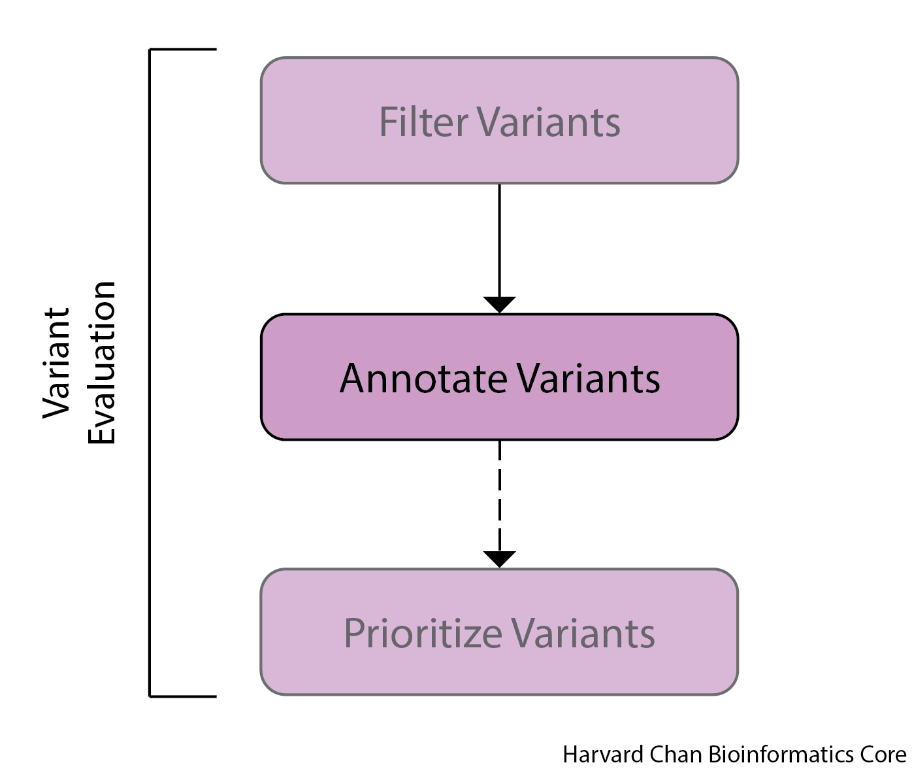

# Variant Annotation

## Learning Objectives

- Annotate a VCF file for functional impacts with `SnpEff`
- Differentiate between an unannotated and annotated VCF file

## Introduction

Now that we have a filtered VCF file for our samples, we want to annotate those variants to figure out what impacts they could have on our samples. For example, we could be interested to know if a given mutation is in the 5' UTR or alters a stop codon for a given gene model. In order to do these types of analyses, we have to merge our variants with annotated transcript information and we will use `SnpEff` to do this. `SnpEff` is extremely fast and also is bundled with `SnpSift`, which we will use downstream to prioritize our variants. 

<p align="center">

</p>

## SnpEff

[SnpEff](http://pcingola.github.io/SnpEff/) uses transcriptome annotations to predict the functional impacts of mutations in a VCF file and will modify the INFO file of the VCF file to carry the predicted functional impacts.

### Databases

Thie first step in annotating your VCF file is finding the appropriate SnpEff database to use so that the annotations are consistent with your version of the reference genome. These databases hold the gene model information that is critical for annotating a variant. `SnpEff` has tens of thousands of genome databases pre-built that you can use and they represent many publicly availible genomes. In the rare case that your genome is not represented, you can build one to use by following the instructions [here](http://pcingola.github.io/SnpEff/se_build_db/). However, unless you are working with a rare organism or an unpublished reference genome, it is highly unlikely that you will need to build the database yourself. To see if your genome of interest is in the `SnpEff` database, we first need to load the the `SnpEff` module:

```
module load snpEff/4.3g
```

Now that you had loaded the `SnpEff` module, you can use the following command to display all of the currently availible genomes and pipe them into a `less` buffer page:

```
java -jar $SNPEFF/snpEff.jar databases | less
```

The first column is the database name and the second column in the `Genus_species` for the organism. There is also a link to where the database can be downloaded at but it can mostly be ignored as SnpEff will download it if it needs it automatically. As you can see there are tens of thousands of these pre-built genomes. So let's exit the `less` buffer page and see which GRCh databases are availible:

```
java -jar $SNPEFF/snpEff.jar databases | grep "GRCh" 
```

We can see that this build of SnpEff has five possible GRCh databases that we can use for annotation, including one for GRCh38.p7 called GRCh38.p7.RefSeq. Now that we have found the database that we would like to use for our analysis, we can run `SnpEff`.

### Running SnpEff

Before we get into `SnpEff` we need to discuss cancer-mode in `SnpEff`. In order to run `SnpEff` in cancer-mode, we need to do two things:

**1)** Understand what cancer-mode is

**2)** Format our VCF file accordingly to acommodate for cancer-mode

#### Understanding Cancer-mode

Let's assume a given position in the reference genome has a Thymine. However, since their is variation amongst humans, the individual sampled actually has a variant, Adenine, in this position. Complicating matters even more, a tumor sample from this individual could have a Guanine in this position. In this case, the VCF record for this position would have the REF field as T, and the ALT field as A,G. It is important to note that the REF field ***ALWAYS*** stays as the base found in the reference genome. The REF field should not be changed to A! However, when `SnpEff` comes along to annotate it, it is going to think there has been a T -> A transversion and also a T -> G transversion, when in reality it has been a A -> G transition. Thus, we would like `SnpEff` to appropiately annotate this and to do so, we need to use cancer-mode. A more detailed explaination of `SnpEff`'s cancer-mode can be found on their [website](http://pcingola.github.io/SnpEff/se_cansersamples/).

#### Setting up Cancer-mode

In order to run cancer-mode, we will need to append our VCF file with an additional header line that contains information that `SnpEff` can use when determining, which sample is the normal sample and which sample is the tumor sample. We are going to do this by appending the header lines with a package within `bcftools`, which was created by the same person who created `samtools`. First, move to your `scripts` directory and create a new file named `syn3_normal_syn3_tumor_pedigree_header.txt` using `vim`:

```
cd ~/variant_calling/scripts/
vim syn3_normal_syn3_tumor_pedigree_header.txt
```

Once inside this file, we just need to add this text to the file:

```
##PEDIGREE=<Derived=syn3_tumor,Original=syn3_normal>
```

Then save and exit the file.

Next, we can start writing our `sbatch` submission script named `variant_annotation_normal_tumor.sbatch` using `vim`.:

```
vim variant_annotation_normal_tumor.sbatch
```

Once inside insert mode, can can enter the shebang line, description and `SBATCH` directives:

```
#!/bin/bash
# Using SnpEff to annotate our variants

# Assign sbatch directives
#SBATCH -p priority
#SBATCH -t 0-02:00:00
#SBATCH -c 1
#SBATCH --mem 8G
#SBATCH -o variant_annotation_syn3_normal_syn3_tumor_%j.out
#SBATCH -e variant_annotation_syn3_normal_syn3_tumor_%j.err
```

Next, we will add the line to load the modules that we will need: 

```
# Load modules
module load gcc/9.2.0
module load bcftools/1.14
module load snpEff/4.3g
```

Also, we will add our variables:

```
# Assign variables
REPORTS_DIRECTORY=/home/$USER/variant_calling/reports/snpeff/
SAMPLE_NAME=mutect2_syn3_normal_syn3_tumor
REFERENCE_SEQUENCE_NAME=GRCh38.p7
CSV_STATS=`echo -e "${REPORTS_DIRECTORY}annotation_${SAMPLE_NAME}_${REFERENCE_SEQUENCE_NAME}-effects-stats.csv"`
HTML_REPORT=`echo -e "${REPORTS_DIRECTORY}annotation_${SAMPLE_NAME}_${REFERENCE_SEQUENCE_NAME}-effects-stats.html"`
REFERENCE_DATABASE=GRCh38.p7.RefSeq
DATADIR=/n/groups/hbctraining/variant_calling/reference/snpeff/data/
FILTERED_VCF_FILE=/n/scratch3/users/${USER:0:1}/${USER}/variant_calling/vcf_files/${SAMPLE_NAME}_${REFERENCE_SEQUENCE_NAME}-pass-filt-LCR.vcf
PEDIGREE_HEADER_FILE=/home/$USER/variant_calling/scripts/syn3_normal_syn3_tumor_pedigree_header.txt
FILTERED_VCF_FILE_WITH_PEDIGREE_HEADER=${FILTERED_VCF_FILE%.vcf}.pedigree_header.vcf
SNPEFF_ANNOTATED_VCF_FILE=${FILTERED_VCF_FILE_WITH_PEDIGREE_HEADER%.vcf}.snpeff.vcf
DBSNP_DATABASE=/n/groups/hbctraining/variant_calling/reference/GRCh38.p7.dbSNP.vcf.gz
DBSNP_ANNOTATED_VCF_FILE=${SNPEFF_ANNOTATED_VCF_FILE%.vcf}.dbSNP.vcf
```

Next, we need to create a directory to hold our reports:

```
# Create reports directory
mkdir -p $REPORTS_DIRECTORY
```

Next, we can add our `bcftools` command to append the header line required for cancer-mode in `SnpEff` to our VCF file:

```
# Append Header
bcftools annotate \
--header-lines $PEDIGREE_HEADER_FILE \
$FILTERED_VCF_FILE \
> $FILTERED_VCF_FILE_WITH_PEDIGREE_HEADER
```

Here is what each part of that command does:

  - `bcftools annotate` This calls the `annotate` function within `bcftools`
  - `--header-lines $PEDIGREE_HEADER_FILE` This is the header information that we want to append to the end of the VCF file's header lines
  - `$FILTERED_VCF_FILE` This is our input VCF file without the appended header
  - `> $FILTERED_VCF_FILE_WITH_PEDIGREE_HEADER` This is the output file with the appended header

Next, we need to add out `SnpEff` command:

```
# Run SnpEff
java -jar -Xmx4g $SNPEFF/snpEff.jar  eff \
-dataDir $DATADIR \
-cancer \
-noLog \
-csvStats $CSV_STATS \
-s $HTML_REPORT \
$REFERENCE_DATABASE \
$FILTERED_VCF_FILE_WITH_PEDIGREE_HEADER \
> $SNPEFF_ANNOTATED_VCF_FILE
```

Let's breakdown this command and discuss each argument:

- `java -jar $SNPEFF/snpEff.jar  eff` `Snpeff` This calls the `eff` package within `SnpEff` to annotate variants.

- `-dataDir $DATADIR` This is the path to the data directory that holds the `SnpEff` annotations

- `-cancer` Performs cancer-mode 

- `-noLog` This does not report command usage to <code>SnpEff</code>'s server

- `-csvStats $CSV_STATS` This produces a flat-text file with summary statistics regarding the variants annotated. (Optional)

- `-s $HTML_REPORT` This creates an HTML file with summary statistics regarding the variants annotated. This HTML file is mostly just an HTML stylized version of the CSV file above. (Optional)

- `$REFERENCE_DATABASE` This is the `SnpEff` database we are going to use for the annotation.

- `$FILTERED_VCF_FILE_WITH_PEDIGREE_HEADER` This is the input VCF file to be annotated

- `> $SNPEFF_ANNOTATED_VCF_FILE` The output of `SnpEff` will be redirected into this VCF file.

### Annotate SNPs with dbSNP

In addition to adding the annotations that `SnpEff` provides regarding types of mutations, we can also add annotations from dbSNP regarding our variants. These annotations will add lots of information to the `INFO` field, but it will also populate the `ID` field in the VCF file with the dbSNP ID for each variant, if it exists. In order to do these annotations, we need to have access to a dbSNP VCF file with the annotations along with an index of the VCF file (a `.tbi` file). There are two ways to provide these annotations:

**1)** Using `SnpSift`, which is part of the `SnpEff` package 

**2)** Using `bcftools`

We are going to use the `SnpSift` approach because it is faster, but either method is acceptable. The `bcftools` method will be availible in a dropdown menu at the end of this section.

Similarly to indexing a BAM file to provide faster look-up speeds, VCF files also have indices that typically take the form of `.tbi` files. VCF index files are typically made in a software package called [`tabix`](http://www.htslib.org/doc/tabix.html). We have already downloaded the dbSNP VCF file and indexed it for you. However, if you would like to see that process it can be found in the dropdown menu below.

<details>
  <summary><b>Click here to see how to obtain the dbSNP VCF file and how to index it with <code>tabix</code></b></summary>
  The first step is that we need to download out dbSNP VCF file from the NCBI FTP site. We can do this with a <code>curl</code> command like: 

<pre>
# YOU DO NOT NEED TO DO THIS
curl -o GRCh38.p7.dbSNP.vcf.gz -L https://ftp.ncbi.nih.gov/snp/organisms/human_9606_b151_GRCh38p7/VCF/00-All.vcf.gz
</pre>

We used the <code>curl</code> command earlier when demonstrating how you could download the LCR BED file. But as a refresher, we can breakdown this command:
    
<ul><li><code>curl</code> This calls the <code>curl</code> option</li>
  <li><code>-o GRCh38.p7.dbSNP.vcf.gz</code> This tells <code>curl</code> what we want the downloaded file to be named</li>
  <li><code>-L https://ftp.ncbi.nih.gov/snp/organisms/human_9606_b151_GRCh38p7/VCF/00-All.vcf.gz</code> This is the linked file we want to download</li></ul>
    
Next, we are going to index this file. While it is not necesscary for us to index this VCF file when using <code>SnpSift</code>, it does speed up the annotation. Importantly, <code>bcftools</code> <b><i>DOES REQUIRE</i></b> this index file and it also will require files that are indexed to also be compressed in <code>.gz</code> format. As a result we are going to leave, our file <code>GRCh38.p7.dbSNP.vcf.gz</code> compressed because:
    <ol><li>There is no need to uncompress it</li>
      <li>It will take up more space on the cluster if we do uncompress it</li>
      <li>Both <code>SnpSift</code> and <code>bcftools</code> can work from the compressed version</li></ol>

We are going to be using <code>tabix</code>, which is part of the <code>HTSlib</code> module. First, we will need to load the <code>HTSlib</code> module, which also requires us to load the <code>gcc</code> module as well:
    
<pre>
module load gcc/9.2.0
module load htslib/1.14
</pre>
    
In order to index our dbSNP file using <code>tabix</code>, we just need to run the following command:
    
<pre>
# YOU DO NOT NEED TO DO THIS
tabix GRCh38.p7.dbSNP.vcf.gz
</pre>

We can break down this command as:
    <ul><li><code>tabix</code> This is the command we use to call <code>tabix</code></li>
     <li><code>GRCh38.p7.dbSNP.vcf.gz</code> This is the VCF file we want to index.</li></ul>
    
After this finishes, we can see that we now have a <code>GRCh38.p7.dbSNP.vcf.gz.tbi</code> file in addition to our <code>GRCh38.p7.dbSNP.vcf.gz</code> file.
<hr />
</details>

Let's go ahead and add the `SnpSift` line that we are going to use to annotate our VCF file:

```
# Use dbSNP VCF to annotate our VCF
java -jar $SNPEFF/SnpSift.jar annotate \
$DBSNP_DATABASE \
-tabix \
-noLog \
$SNPEFF_ANNOTATED_VCF_FILE \
> $DBSNP_ANNOTATED_VCF_FILE
```

Let's discuss each part of this command:

- `java -jar $SNPEFF/SnpSift.jar annotate` This calls the `annotate` function within the `SnpSift` package

- `$DBSNP_DATABASE` This is the dbSNP database that we want to use for annotations

- `-tabix` This is letting `SnpSift` know that the dbSNP database has a VCF index that it can use to speed up the annotation

- `-noLog` This does not report command usage to <code>SnpEff</code>'s server

- `$SNPEFF_ANNOTATED_VCF_FILE` This is the input VCF file we want to be annotated

- `> $DBSNP_ANNOTATED_VCF_FILE` This is the dbSNP annotated output VCF file

<details>
  <summary><b>Click here to see how to annotate our VCF file with the dbSNP annotation in <code>bcftools</code></b></summary>
The first thing we are going to need to do is load the modules that we will be using:<br>
<pre>
module load gcc/9.2.0
module load bcftools/1.14
</pre>
Assuming we have already indexed our dbSNP VCF file, the first thing that we are going to need to do is compress the VCF file that we wish to annotate with:
<pre>
gzip -c $SNPEFF_ANNOTATED_VCF_FILE &gt; ${SNPEFF_ANNOTATED_VCF_FILE}.gz
</pre>
Let's talk about this command:<br>
  <ul><li><code>gzip</code> This calls the function we are going to use for the compression</li>
    <li><code>-c</code> This is an option that keeps the original file. Otherwise, when the compression happens, the uncompressed file is removed</li>
    <li><code>$SNPEFF_ANNOTATED_VCF_FILE</code> This is the file that we want to compress</li>
    <li><code>&gt; ${SNPEFF_ANNOTATED_VCF_FILE}.gz</code> This is the compressed output file</li></ul><br>
Now we are ready to annotate the VCF file with the dbSNP annotations. The command to do so is:
<pre>
bcftools annotate \
-a $DBSNP_DATABASE \
-c ID,INFO \
-O v \
-o $DBSNP_ANNOTATED_VCF_FILE \
${SNPEFF_ANNOTATED_VCF_FILE}.gz
</pre>
Let's explain each part of this command:
  <ul><li><code>bcftools annotate</code> This calls the <code>annotate</code> function within <code>bcftools</code></li>
    <li><code>-a $DBSNP_DATABASE</code> This provides the dbSNP VCF to use for the annotations</li>
    <li><code>-c ID,INFO</code> These are the fileds we would like to add information to from our dbSNP file</li>
    <li><code>-O v</code> This is the output format. The options for this are:
      <table>
        <tr>
          <th>Abbreviation</th>
          <th>Output Format</th>
        </tr>
        <tr>
          <td>b</td>
          <td>Compressed BCF file</td>
        </tr>
        <tr>
          <td>u</td>
          <td>Uncompressed BCF file</td>
        </tr>
        <tr>
          <td>z</td>
          <td>Compressed VCF file</td>
        </tr>
        <tr>
          <td>v</td>
          <td>Uncompressed VCF file</td>
        </tr>
      </table></li>
    <li><code>-o $DBSNP_ANNOTATED_VCF_FILE</code> This is the dbSNP annotated output VCF file</li>
    <li><code>${SNPEFF_ANNOTATED_VCF_FILE}.gz</code> This is the input VCF file</li></ul>
<hr />
</details>

This final script should look like:

```
#!/bin/bash
# Using SnpEff to annotate our variants

# Assign sbatch directives
#SBATCH -p priority
#SBATCH -t 0-02:00:00
#SBATCH -c 1
#SBATCH --mem 8G
#SBATCH -o variant_annotation_syn3_normal_syn3_tumor_%j.out
#SBATCH -e variant_annotation_syn3_normal_syn3_tumor_%j.err

# Load modules
module load gcc/9.2.0
module load bcftools/1.14
module load snpEff/4.3g

# Assign variables
REPORTS_DIRECTORY=/home/$USER/variant_calling/reports/snpeff/
SAMPLE_NAME=mutect2_syn3_normal_syn3_tumor
REFERENCE_SEQUENCE_NAME=GRCh38.p7
CSV_STATS=`echo -e "${REPORTS_DIRECTORY}annotation_${SAMPLE_NAME}_${REFERENCE_SEQUENCE_NAME}-effects-stats.csv"`
HTML_REPORT=`echo -e "${REPORTS_DIRECTORY}annotation_${SAMPLE_NAME}_${REFERENCE_SEQUENCE_NAME}-effects-stats.html"`
REFERENCE_DATABASE=GRCh38.p7.RefSeq
DATADIR=/n/groups/hbctraining/variant_calling/reference/snpeff/data/
FILTERED_VCF_FILE=/n/scratch3/users/${USER:0:1}/${USER}/variant_calling/vcf_files/${SAMPLE_NAME}_${REFERENCE_SEQUENCE_NAME}-pass-filt-LCR.vcf
PEDIGREE_HEADER_FILE=/home/$USER/variant_calling/scripts/syn3_normal_syn3_tumor_pedigree_header.txt
FILTERED_VCF_FILE_WITH_PEDIGREE_HEADER=${FILTERED_VCF_FILE%.vcf}.pedigree_header.vcf
SNPEFF_ANNOTATED_VCF_FILE=${FILTERED_VCF_FILE_WITH_PEDIGREE_HEADER%.vcf}.snpeff.vcf
DBSNP_DATABASE=/n/groups/hbctraining/variant_calling/reference/GRCh38.p7.dbSNP.vcf.gz
DBSNP_ANNOTATED_VCF_FILE=${SNPEFF_ANNOTATED_VCF_FILE%.vcf}.dbSNP.vcf

# Create reports directory
mkdir -p $REPORTS_DIRECTORY

# Append Header
bcftools annotate \
--header-lines $PEDIGREE_HEADER_FILE \
$FILTERED_VCF_FILE \
> $FILTERED_VCF_FILE_WITH_PEDIGREE_HEADER

# Run SnpEff
java -jar -Xmx4g $SNPEFF/snpEff.jar  eff \
-dataDir $DATADIR \
-cancer \
-noLog \
-csvStats $CSV_STATS \
-s $HTML_REPORT \
$REFERENCE_DATABASE \
$FILTERED_VCF_FILE_WITH_PEDIGREE_HEADER \
> $SNPEFF_ANNOTATED_VCF_FILE

# Use dbSNP VCF to annotate our VCF
java -jar $SNPEFF/SnpSift.jar annotate \
$DBSNP_DATABASE \
-tabix \
-noLog \
$SNPEFF_ANNOTATED_VCF_FILE \
> $DBSNP_ANNOTATED_VCF_FILE
```

Submit this script using:

```
sbatch variant_annotation_normal_tumor.sbatch
```

### Output

Let's take a look at our output from `SnpEff` now to see how our VCF file has been modified to include variant annotations. Let's open up our annotated VCF file in `less`:

```
less /n/scratch3/users/${USER:0:1}/$USER/variant_calling/vcf_files/mutect2_syn3_normal_syn3_tumor_GRCh38.p7-pass-filt-LCR.pedigree_header.snpeff.dbSNP.vcf 
```

Scroll down to right before your variants are and you will notice that `SnpEff` has inserted two lines into your VCF file. First, it has inserted:

`##SnpEffVersion="4.3g (build 2016-11-28 08:31), by Pablo Cingolani"`

This is just a bit of extra metadata on your VCF file letting you know the version of `SnpEff` that was used to generate this VCF file. While it is best practice to have your code for annotating a VCF file archived in a script  like we have done, you could encounter a situation where you've either lost this script or you are analyzing someone else's work and need to know which version of `SnpEff` they used and you can find it here. 

```
##SnpEffCmd="SnpEff  -cancer -csvStats /home/$USER/variant_calling/reports/snpeff/annotation_mutect2_syn3_normal_syn3_tumor_GRCh38.p7-effects-stats.csv -s /home/$USER/variant_calling/reports/snpeff/annotation_mutect2_syn3_normal_syn3_tumor_GRCh38.p7-effects-stats.html GRCh38.p7.RefSeq /n/scratch3/users/${USER:0:1}/$USER/variant_calling/vcf_files/mutect2_syn3_normal_syn3_tumor_GRCh38.p7-pass-filt-LCR.pedigree_header.vcf "
```

This tells you the command that was used by SnpEff (without the redirect) to create this SnpEff annotated file. Thus, between the aforementioned version line and this line, you should be able to reproduce the annotation of any SnpEff annotation as long as the annotation database is part of the built-in databases.

Let's go ahead and compare the first entry of the filtered VCF file with the annotated VCF file:

#### Filtered VCF

```
1       1324300 .       G       A       .       PASS    AS_FilterStatus=SITE;AS_SB_TABLE=47,6|11,0;ClippingRankSum=0.390;DP=68;ECNT=1;FS=2.373;GERMQ=93;MBQ=27,27;MFRL=337,338;MMQ=60,60;MPOS=27;MQ=60.00;MQ0=0;MQRankSum=0.000;NALOD=1.54;NLOD=9.88;POPAF=6.00;ReadPosRankSum=-0.125;TLOD=24.65        GT:AD:AF:DP:F1R2:F2R1:SB        0/0:33,0:0.028:33:12,0:20,0:32,1,0,0    0/1:20,11:0.367:31:6,6:12,5:15,5,11,0
```

#### Annotated VCF

```
1       1324300 .       G       A       .       PASS    AS_FilterStatus=SITE;AS_SB_TABLE=47,6|11,0;ClippingRankSum=0.39;DP=68;ECNT=1;FS=2.373;GERMQ=93;MBQ=27,27;MFRL=337,338;MMQ=60,60;MPOS=27;MQ=60;MQ0=0;MQRankSum=0;NALOD=1.54;NLOD=9.88;POPAF=6;ReadPosRankSum=-0.125;TLOD=24.65;ANN=A|upstream_gene_variant|MODIFIER|CPTP|CPTP|transcript|NM_001029885.1|protein_coding||c.-2611G>A|||||463|,A|upstream_gene_variant|MODIFIER|CPTP|CPTP|transcript|XM_005244802.1|protein_coding||c.-3008G>A|||||456|,A|upstream_gene_variant|MODIFIER|CPTP|CPTP|transcript|XM_005244801.3|protein_coding||c.-2611G>A|||||843|,A|upstream_gene_variant|MODIFIER|CPTP|CPTP|transcript|XM_011542200.2|protein_coding||c.-2611G>A|||||1315|,A|intron_variant|MODIFIER|CPSF3L|CPSF3L|transcript|XM_011541647.1|protein_coding|1/18|c.28+281C>T||||||,A|intron_variant|MODIFIER|CPSF3L|CPSF3L|transcript|NM_001256456.1|protein_coding|1/18|c.-428+281C>T||||||,A|intron_variant|MODIFIER|CPSF3L|CPSF3L|transcript|NM_001256460.1|protein_coding|1/17|c.-167+281C>T||||||,A|intron_variant|MODIFIER|CPSF3L|CPSF3L|transcript|NM_001256462.1|protein_coding|1/14|c.28+281C>T||||||,A|intron_variant|MODIFIER|CPSF3L|CPSF3L|transcript|NM_001256463.1|protein_coding|1/14|c.28+281C>T||||||,A|intron_variant|MODIFIER|CPSF3L|CPSF3L|transcript|NM_017871.5|protein_coding|1/16|c.28+281C>T||||||,A|intron_variant|MODIFIER|CPSF3L|CPSF3L|transcript|XM_017001558.1|protein_coding|1/18|c.-438+281C>T||||||,A|intron_variant|MODIFIER|CPSF3L|CPSF3L|transcript|XM_017001557.1|protein_coding|1/17|c.-361+281C>T||||||,A|intron_variant|MODIFIER|CPSF3L|CPSF3L|transcript|XM_011541648.1|protein_coding|1/18|c.-91+281C>T||||||,A|intron_variant|MODIFIER|CPSF3L|CPSF3L|transcript|XM_011541650.1|protein_coding|1/16|c.-254+281C>T||||||  GT:AD:AF:DP:F1R2:F2R1:SB        0/0:33,0:0.028:33:12,0:20,0:32,1,0,0    0/1:20,11:0.367:31:6,6:12,5:15,5,11,0
```

You can see that the only difference between these files is that we have appended onto the `INFO` field. This appendage contains lots of information such as the type of modification it is, the gene symbol of the gene modified and the accession number of the transcript modified. Because gene models overlap, you may have a single variant that alters multiple transcript models. In this case, each alteration will be separated by a `,`. We can also see that this SNP was not part of the dbSNP database that we had and thus it didn't have its `ID` field annotated with its dbSNP ID.

Now that we have successfully annotated our variants, let's talk about automating this whole process in the next lesson!


[Next lesson >>](10_variant_prioritization.md)

[Back to Schedule](../schedule/README.md)

***

*This lesson has been developed by members of the teaching team at the [Harvard Chan Bioinformatics Core (HBC)](http://bioinformatics.sph.harvard.edu/). These are open access materials distributed under the terms of the [Creative Commons Attribution license](https://creativecommons.org/licenses/by/4.0/) (CC BY 4.0), which permits unrestricted use, distribution, and reproduction in any medium, provided the original author and source are credited.*
