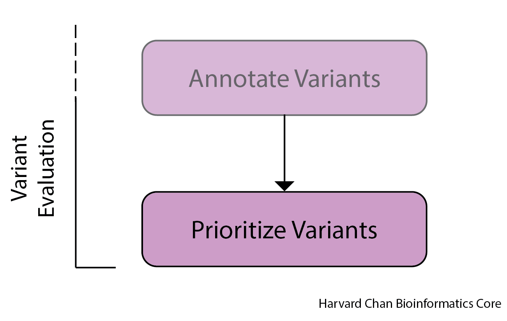

# Variant Prioritization

## Learning Objectives

- Filter records in a VCF file for various effects/impacts
- Extract fields of interest from VCF file

## Prioritizing Variants

Now that we have annotated and filtered our variants, we are likely interested in subsetting our variants to find those of most interest to our study. Perhaps we are interested in finding variants that substantially disrupt a transcript, such as a variant causing a premature stop codon, or just find all of the missense mutations in the sample. `SnpSift` is part of the `SnpEff` suite and it is built explicitly for this purpose.

<p align="center">

</p>

Let's start by discussing some of the ways you can filter your data with `SnpSift`.

## Filter

### Fields

First, you can filter your SnpEff annotated VCF file based upon the first seven fields of the VCF file:

- **CHROM**
- **POS**
- **ID**
- **REF** 
- **ALT** 
- **QUAL**
- **FILTER**

Let's go ahead and do our first `SnpSift` command to extract variants, but before we do let's move to the directory with our VCF files and load the `SnpEff` module:

```
cd /n/scratch/users/${USER:0:1}/$USER/variant_calling/vcf_files/
module load snpEff/4.3g
```

Now that we have loaded the `SnpEff` module we can utilize the `SnpSift` to find all of the variants on Chromosome `1` and pipe the output into `less`:

```
java -jar $SNPEFF/SnpSift.jar filter -noLog "( CHROM = '1' )" mutect2_syn3_normal_syn3_tumor_GRCh38.p7-pass-filt-LCR.pedigree_header.snpeff.dbSNP.vcf  | less
```

Let's break down the syntax a bit:

- `java -jar $SNPEFF/SnpSift.jar filter` This calls the `filter` package within `SnpSift`

- `-noLog` This does not report command usage to `SnpEff`'s server

- `"( CHROM = '1' )"` This is the syntax needed to extract variants on Chromosome `1`. The left side of the equals sign corresponds to the VCF field you wish to filter by and the right side is the string you would like to match

- `mutect2_syn3_normal_syn3_tumor_GRCh38.p7-pass-filt-LCR.pedigree_header.snpeff.dbSNP.vcf` This is the input VCF file. Importantly, this needs to go at the end

- `| less` Piping the output into a `less` buffer page for inspection

#### Revisiting "( FILTER = 'PASS' )"

Now, we that we have a basic understanding of some of the syntax used in `SnpSift`, we can revisit the [filtering command that we used earlier](https://github.com/hbctraining/variant_analysis/blob/main/lessons/10_variant_filtering.md#filter-vcf-files-for-only-variants-with-pass-in-the-filter-field-using-snpsift). There we used:

```
# Filter for only SNPs with PASS in the FILTER field
java -jar $SNPEFF/SnpSift.jar filter \
-noLog \
"( FILTER = 'PASS' )" \
$MUTECT_FILTERED_VCF > $PASSING_FILTER_VCF
```

As we can see here, we are telling `SnpSift` to look at the `FILTER` field and requiring the output to have the value of `PASS` there.

### Multiple Filters

It is likely that you could want to filter on multiple criteria. You can do that by separating the filter criteria with either and `&` (and) or `|` (or).

For example, let's consider a case where you want to filter your filter for any variant on Chromosome `1` ***OR*** Chromosome `2`. That might look like:

```
java -jar $SNPEFF/SnpSift.jar filter "( CHROM = '1' ) | ( CHROM = '2' )" mutect2_syn3_normal_syn3_tumor_GRCh38.p7-pass-filt-LCR.pedigree_header.snpeff.dbSNP.vcf  | less
```

>Note: The `"( CHROM = '1' ) | ( CHROM = '2' )"` syntax allows us to filter for Chromosome `1` **or** Chromosome `2` by using the `|` to separate our criteria within the double quotes. While you might be most familiar with the `|` symbol as the pipe command in `bash`, it is not uncommon in other instances or languages like `R` for it to stand for "or". In fact, in bash, "or" is `||`, so it is closely related. The important point here is that the `|` within the double quotes stands for "or" when using `SnpSift` and it is not a pipe.

Alternatively, we could be interested in variants on Chromosome `1` between positions `1000000` and `2000000`. It would look like:

```
java -jar $SNPEFF/SnpSift.jar filter -noLog "( CHROM = '1' ) & ( POS > 1000000 ) & ( POS < 2000000 )" mutect2_syn3_normal_syn3_tumor_GRCh38.p7-pass-filt-LCR.pedigree_header.snpeff.dbSNP.vcf   | less
```

### INFO Field

`SnpSift` also allows the user to filter based upon the `INFO` field. This is particularly helpful since `SnpEff`'s annotations are placed into the `INFO` field. There are many `INFO` field filters that one can apply, but we will discuss some of the more popular ones. Filtering the `INFO` will importantly always begin with an `ANN` in the filtering criteria.

#### Gene

If you are interested in all of the variants corresponding to a single gene of interest, you can filter by the gene name, in this case `CPSF3L`:

```
java -jar $SNPEFF/SnpSift.jar filter -noLog "( ANN[*].GENE = 'CPSF3L' )" mutect2_syn3_normal_syn3_tumor_GRCh38.p7-pass-filt-LCR.pedigree_header.snpeff.dbSNP.vcf   | less
```

To filter by the gene name you will need `"( ANN[*].GENE = 'INSERT_GENE_NAME' )"`. 

> NOTE: When handling multiple valued fields (i.e., fields with commas), `SnpSift` uses a 0-based index to describe those elements. In the example below, we can see that the first four `ANN` fields are for the gene `CPTP` before we get to the annotations for `CPSF3L`. So instead if you have used `"( ANN[0].GENE = 'CPSF3L' )"` instead of `"( ANN[*].GENE = 'CPSF3L' )"`, then it will only return the entries which have `"CPSF3L"` in the first `GENE` annotation field and exclude the example below. The `*` tell `SnpSift` to extract the record if "any" annotations corresponds to `CPSF3L`. For most cases, you will want to use the `*`, but you should understand why it is there.
> ```
> 1       1324300 .       G       A       .       PASS    AS_FilterStatus=SITE;AS_SB_TABLE=47,6|11,0;ClippingRankSum=0.39;DP=68;ECNT=1;FS=2.373;GERMQ=93;MBQ=27,27;MFRL=337,338;MMQ=60,60;MPOS=27;MQ=60;MQ0=0;MQRankSum=0;NALOD=1.54;NLOD=9.88;POPAF=6;ReadPosRankSum=-0.125;TLOD=24.65;ANN=A|upstream_gene_variant|MODIFIER|CPTP|CPTP|transcript|NM_001029885.1|protein_coding||c.-2611G>A|||||463|,A|upstream_gene_variant|MODIFIER|CPTP|CPTP|transcript|XM_005244802.1|protein_coding||c.-3008G>A|||||456|,A|upstream_gene_variant|MODIFIER|CPTP|CPTP|transcript|XM_005244801.3|protein_coding||c.-2611G>A|||||843|,A|upstream_gene_variant|MODIFIER|CPTP|CPTP|transcript|XM_011542200.2|protein_coding||c.-2611G>A|||||1315|,A|intron_variant|MODIFIER|CPSF3L|CPSF3L|transcript|XM_011541647.1|protein_coding|1/18|c.28+281C>T||||||,A|intron_variant|MODIFIER|CPSF3L|CPSF3L|transcript|NM_001256456.1|protein_coding|1/18|c.-428+281C>T||||||,A|intron_variant|MODIFIER|CPSF3L|CPSF3L|transcript|NM_001256460.1|protein_coding|1/17|c.-167+281C>T||||||,A|intron_variant|MODIFIER|CPSF3L|CPSF3L|transcript|NM_001256462.1|protein_coding|1/14|c.28+281C>T||||||,A|intron_variant|MODIFIER|CPSF3L|CPSF3L|transcript|NM_001256463.1|protein_coding|1/14|c.28+281C>T||||||,A|intron_variant|MODIFIER|CPSF3L|CPSF3L|transcript|NM_017871.5|protein_coding|1/16|c.28+281C>T||||||,A|intron_variant|MODIFIER|CPSF3L|CPSF3L|transcript|XM_017001558.1|protein_coding|1/18|c.-438+281C>T||||||,A|intron_variant|MODIFIER|CPSF3L|CPSF3L|transcript|XM_017001557.1|protein_coding|1/17|c.-361+281C>T||||||,A|intron_variant|MODIFIER|CPSF3L|CPSF3L|transcript|XM_011541648.1|protein_coding|1/18|c.-91+281C>T||||||,A|intron_variant|MODIFIER|CPSF3L|CPSF3L|transcript|XM_011541650.1|protein_coding|1/16|c.-254+281C>T||||||  GT:AD:AF:DP:F1R2:F2R1:SB        0/0:33,0:0.028:33:12,0:20,0:32,1,0,0    0/1:20,11:0.367:31:6,6:12,5:15,5,11,0
> ```

#### Effects

It is also quite common to want to filter your output by the effects the variants have on the annotated gene models. The syntax for this is quite similar to the example for genes:

```
java -jar $SNPEFF/SnpSift.jar filter -noLog "( ANN[*].EFFECT has 'missense_variant' )" mutect2_syn3_normal_syn3_tumor_GRCh38.p7-pass-filt-LCR.pedigree_header.snpeff.dbSNP.vcf  | less
```

To filter by a variant effect, the filter syntax is `"( ANN[*].EFFECT has 'VARIANT_EFFECT' )"`

> Note: Importantly, notice the use of `has` instead of `=` here. Sometimes effects field will contain multiple effects such as `missense_variant&splice_donor_variant`. Using `ANN[*].EFFECT = missense_variant` here ***WILL NOT*** return this line, because the line is not equal to `missense_variant`, however `ANN[*].EFFECT has missense_variant` ***WILL*** return this line. Oftentimes for effects, one would be interested in the `has` query as opposed to the `=` one.

There are many different variant effects and some of the more common ones are:

- `missense_variant` for missense/non-synonymous variants 

- `frameshift_variant` for frameshift variants

- `stop_gain` for nonsense variants

- `stop_lost` for variants that lose a stop codon

- `start_gain` for variants that gain a start codon

- `start_lost` for variants that lose a start codon

- `synonymous_variant` for synonymous/silent variants

- `splice_donor_variant` for a variant in the splice donor site

- `splice_acceptor_variant` for a variant in the splice acceptor site

- `5_prime_UTR_variant` for a variant in the 5' untranslated region 

- `3_prime_UTR_variant` for a variant in the 3' untranslated region 

Many more effects can be found [here](https://pcingola.github.io/SnpEff/se_inputoutput/#effect-prediction-details).

#### Impacts

`SnpEff` also predicts the deleterious nature of a variant by binning it into one of several categories:

- `HIGH` These are variants that will almost certainly have a deleterious impact on the transcript. Examples of this would be the loss or gain of a stop codon or a frameshift mutation. 

- `MODERATE` These are variants where the impact may have a deleterious impact on the transcript. Examples of this would be missense/non-synonymous variants and in-frame deletions/insertions.

- `LOW` These are variants that are unlikely to have a deleterious impact on the transcript. Examples of this would be silent/synonymous variants and alterations between different stop codons.

- `MODIFER` These variants are typically in non-coding regions and their impacts are difficult to assertain. 

More information on these categories can be found [here](https://pcingola.github.io/SnpEff/se_inputoutput/#impact-prediction) and a complete listing of the categories for each effect can be found [here](https://pcingola.github.io/SnpEff/se_inputoutput/#effect-prediction-details). 

Let's go ahead and filter out all of our `HIGH` impact muations:

```
java -jar $SNPEFF/SnpSift.jar filter -noLog "( ANN[*].IMPACT has 'HIGH' )"  mutect2_syn3_normal_syn3_tumor_GRCh38.p7-pass-filt-LCR.pedigree_header.snpeff.dbSNP.vcf  | less
```

> ***Note:*** Similarly to `EFFECT`, oftentimes you will want to use `has` rather than `=`.

Let's go ahead and redirect the output of these "high-impact" mutations to a new VCF file:

```
java -jar $SNPEFF/SnpSift.jar filter -noLog "( ANN[*].IMPACT has 'HIGH' )"  mutect2_syn3_normal_syn3_tumor_GRCh38.p7-pass-filt-LCR.pedigree_header.snpeff.dbSNP.vcf  > mutect2_syn3_normal_syn3_tumor_GRCh38.p7-pass-filt-LCR.pedigree_header.snpeff.dbSNP.high_impact.vcf 
```

#### Other ANN fields

In addition to `GENE`, `EFFECT` and `IMPACT`, there are a whole host of other `ANN` fields. Some of the other `ANN` fields that we will come across later are:

- `TRID` - Transcript ID or NCBI accesssion number
- `HGVS_P` - The alteration in protein notation
- `HGVS_C` - The alteration in DNA notation

A full list of `ANN` fields can be found [here](http://pcingola.github.io/SnpEff/ss_filter/#snpeff-ann-fields).

## vcfEffOnePerLine

A useful tool within the `SnpSift` toolkit is the `perl` script named `vcfEffOnePerLine.pl`. This script allows the user to separate each effect onto its own line instead of having them lumped into a single line. In order to utilize this script we need to pipe the output of our `filter` command into `$SNPEFF/scripts/vcfEffOnePerLine.pl`. We can use it on our previous example to demonstrate (be patient, it might take ~15 seconds to run):

```
java -jar $SNPEFF/SnpSift.jar filter -noLog "( ANN[*].IMPACT has 'HIGH' )"  mutect2_syn3_normal_syn3_tumor_GRCh38.p7-pass-filt-LCR.pedigree_header.snpeff.dbSNP.vcf | $SNPEFF/scripts/vcfEffOnePerLine.pl | less
```

Now, we can see that each variant has a separate entry depending on its effect.

```
1	6471577	.	A	ACTCACGTGCAAGCATCACACCGGCACGC	.	PASS	AS_FilterStatus=SITE;AS_SB_TABLE=49,52|6,4;ClippingRankSum=-1.498;DP=119;ECNT=1;FS=2.779;GERMQ=93;MBQ=32,32;MFRL=341,338;MMQ=60,60;MPOS=20;MQ=60;MQ0=0;MQRankSum=0;NALOD=1.82;NLOD=19.17;POPAF=6;ReadPosRankSum=-1.659;TLOD=33.37;LOF=(PLEKHG5|PLEKHG5|8|1.00);NMD=(PLEKHG5|PLEKHG5|8|1.00);ANN=ACTCACGTGCAAGCATCACACCGGCACGC|frameshift_variant&stop_gained|HIGH|PLEKHG5|PLEKHG5|transcript|NM_001265592.1|protein_coding|13/22|c.1428_1429insGCGTGCCGGTGTGATGCTTGCACGTGAG|p.Trp477fs|1493/4794|1428/3258|476/1085||	GT:AD:AF:DP:F1R2:F2R1:SB	0/0:63,0:0.015:63:37,0:25,0:33,30,0,0	0/1:38,10:0.216:48:19,5:17,4:16,22,6,4
1	6471577	.	A	ACTCACGTGCAAGCATCACACCGGCACGC	.	PASS	AS_FilterStatus=SITE;AS_SB_TABLE=49,52|6,4;ClippingRankSum=-1.498;DP=119;ECNT=1;FS=2.779;GERMQ=93;MBQ=32,32;MFRL=341,338;MMQ=60,60;MPOS=20;MQ=60;MQ0=0;MQRankSum=0;NALOD=1.82;NLOD=19.17;POPAF=6;ReadPosRankSum=-1.659;TLOD=33.37;LOF=(PLEKHG5|PLEKHG5|8|1.00);NMD=(PLEKHG5|PLEKHG5|8|1.00);ANN=ACTCACGTGCAAGCATCACACCGGCACGC|frameshift_variant&stop_gained|HIGH|PLEKHG5|PLEKHG5|transcript|NM_001265593.1|protein_coding|12/21|c.1398_1399insGCGTGCCGGTGTGATGCTTGCACGTGAG|p.Trp467fs|1424/4725|1398/3228|466/1075||	GT:AD:AF:DP:F1R2:F2R1:SB	0/0:63,0:0.015:63:37,0:25,0:33,30,0,0	0/1:38,10:0.216:48:19,5:17,4:16,22,6,4
1	6471577	.	A	ACTCACGTGCAAGCATCACACCGGCACGC	.	PASS	AS_FilterStatus=SITE;AS_SB_TABLE=49,52|6,4;ClippingRankSum=-1.498;DP=119;ECNT=1;FS=2.779;GERMQ=93;MBQ=32,32;MFRL=341,338;MMQ=60,60;MPOS=20;MQ=60;MQ0=0;MQRankSum=0;NALOD=1.82;NLOD=19.17;POPAF=6;ReadPosRankSum=-1.659;TLOD=33.37;LOF=(PLEKHG5|PLEKHG5|8|1.00);NMD=(PLEKHG5|PLEKHG5|8|1.00);ANN=ACTCACGTGCAAGCATCACACCGGCACGC|frameshift_variant&stop_gained|HIGH|PLEKHG5|PLEKHG5|transcript|NM_001042665.1|protein_coding|12/21|c.1191_1192insGCGTGCCGGTGTGATGCTTGCACGTGAG|p.Trp398fs|1397/4698|1191/3021|397/1006||	GT:AD:AF:DP:F1R2:F2R1:SB	0/0:63,0:0.015:63:37,0:25,0:33,30,0,0	0/1:38,10:0.216:48:19,5:17,4:16,22,6,4
1	6471577	.	A	ACTCACGTGCAAGCATCACACCGGCACGC	.	PASS	AS_FilterStatus=SITE;AS_SB_TABLE=49,52|6,4;ClippingRankSum=-1.498;DP=119;ECNT=1;FS=2.779;GERMQ=93;MBQ=32,32;MFRL=341,338;MMQ=60,60;MPOS=20;MQ=60;MQ0=0;MQRankSum=0;NALOD=1.82;NLOD=19.17;POPAF=6;ReadPosRankSum=-1.659;TLOD=33.37;LOF=(PLEKHG5|PLEKHG5|8|1.00);NMD=(PLEKHG5|PLEKHG5|8|1.00);ANN=ACTCACGTGCAAGCATCACACCGGCACGC|frameshift_variant&stop_gained|HIGH|PLEKHG5|PLEKHG5|transcript|NM_001042664.1|protein_coding|12/21|c.1191_1192insGCGTGCCGGTGTGATGCTTGCACGTGAG|p.Trp398fs|1414/4715|1191/3021|397/1006||	GT:AD:AF:DP:F1R2:F2R1:SB	0/0:63,0:0.015:63:37,0:25,0:33,30,0,0	0/1:38,10:0.216:48:19,5:17,4:16,22,6,4
1	6471577	.	A	ACTCACGTGCAAGCATCACACCGGCACGC	.	PASS	AS_FilterStatus=SITE;AS_SB_TABLE=49,52|6,4;ClippingRankSum=-1.498;DP=119;ECNT=1;FS=2.779;GERMQ=93;MBQ=32,32;MFRL=341,338;MMQ=60,60;MPOS=20;MQ=60;MQ0=0;MQRankSum=0;NALOD=1.82;NLOD=19.17;POPAF=6;ReadPosRankSum=-1.659;TLOD=33.37;LOF=(PLEKHG5|PLEKHG5|8|1.00);NMD=(PLEKHG5|PLEKHG5|8|1.00);ANN=ACTCACGTGCAAGCATCACACCGGCACGC|frameshift_variant&stop_gained|HIGH|PLEKHG5|PLEKHG5|transcript|NM_001265594.1|protein_coding|12/22|c.1191_1192insGCGTGCCGGTGTGATGCTTGCACGTGAG|p.Trp398fs|1428/4529|1191/2793|397/930||	GT:AD:AF:DP:F1R2:F2R1:SB	0/0:63,0:0.015:63:37,0:25,0:33,30,0,0	0/1:38,10:0.216:48:19,5:17,4:16,22,6,4
1	6471577	.	A	ACTCACGTGCAAGCATCACACCGGCACGC	.	PASS	AS_FilterStatus=SITE;AS_SB_TABLE=49,52|6,4;ClippingRankSum=-1.498;DP=119;ECNT=1;FS=2.779;GERMQ=93;MBQ=32,32;MFRL=341,338;MMQ=60,60;MPOS=20;MQ=60;MQ0=0;MQRankSum=0;NALOD=1.82;NLOD=19.17;POPAF=6;ReadPosRankSum=-1.659;TLOD=33.37;LOF=(PLEKHG5|PLEKHG5|8|1.00);NMD=(PLEKHG5|PLEKHG5|8|1.00);ANN=ACTCACGTGCAAGCATCACACCGGCACGC|frameshift_variant&stop_gained|HIGH|PLEKHG5|PLEKHG5|transcript|NM_020631.4|protein_coding|12/21|c.1191_1192insGCGTGCCGGTGTGATGCTTGCACGTGAG|p.Trp398fs|1343/4644|1191/3021|397/1006||	GT:AD:AF:DP:F1R2:F2R1:SB	0/0:63,0:0.015:63:37,0:25,0:33,30,0,0	0/1:38,10:0.216:48:19,5:17,4:16,22,6,4
1	6471577	.	A	ACTCACGTGCAAGCATCACACCGGCACGC	.	PASS	AS_FilterStatus=SITE;AS_SB_TABLE=49,52|6,4;ClippingRankSum=-1.498;DP=119;ECNT=1;FS=2.779;GERMQ=93;MBQ=32,32;MFRL=341,338;MMQ=60,60;MPOS=20;MQ=60;MQ0=0;MQRankSum=0;NALOD=1.82;NLOD=19.17;POPAF=6;ReadPosRankSum=-1.659;TLOD=33.37;LOF=(PLEKHG5|PLEKHG5|8|1.00);NMD=(PLEKHG5|PLEKHG5|8|1.00);ANN=ACTCACGTGCAAGCATCACACCGGCACGC|frameshift_variant&stop_gained|HIGH|PLEKHG5|PLEKHG5|transcript|NM_001042663.1|protein_coding|13/22|c.1359_1360insGCGTGCCGGTGTGATGCTTGCACGTGAG|p.Trp454fs|1460/4761|1359/3189|453/1062||	GT:AD:AF:DP:F1R2:F2R1:SB	0/0:63,0:0.015:63:37,0:25,0:33,30,0,0	0/1:38,10:0.216:48:19,5:17,4:16,22,6,4
1	6471577	.	A	ACTCACGTGCAAGCATCACACCGGCACGC	.	PASS	AS_FilterStatus=SITE;AS_SB_TABLE=49,52|6,4;ClippingRankSum=-1.498;DP=119;ECNT=1;FS=2.779;GERMQ=93;MBQ=32,32;MFRL=341,338;MMQ=60,60;MPOS=20;MQ=60;MQ0=0;MQRankSum=0;NALOD=1.82;NLOD=19.17;POPAF=6;ReadPosRankSum=-1.659;TLOD=33.37;LOF=(PLEKHG5|PLEKHG5|8|1.00);NMD=(PLEKHG5|PLEKHG5|8|1.00);ANN=ACTCACGTGCAAGCATCACACCGGCACGC|frameshift_variant&stop_gained|HIGH|PLEKHG5|PLEKHG5|transcript|NM_198681.3|protein_coding|13/22|c.1422_1423insGCGTGCCGGTGTGATGCTTGCACGTGAG|p.Trp475fs|1972/5273|1422/3252|474/1083||	GT:AD:AF:DP:F1R2:F2R1:SB	0/0:63,0:0.015:63:37,0:25,0:33,30,0,0	0/1:38,10:0.216:48:19,5:17,4:16,22,6,4
```

Which was previously:

```
1	6471577	.	A	ACTCACGTGCAAGCATCACACCGGCACGC	.	PASS	AS_FilterStatus=SITE;AS_SB_TABLE=49,52|6,4;ClippingRankSum=-1.498;DP=119;ECNT=1;FS=2.779;GERMQ=93;MBQ=32,32;MFRL=341,338;MMQ=60,60;MPOS=20;MQ=60;MQ0=0;MQRankSum=0;NALOD=1.82;NLOD=19.17;POPAF=6;ReadPosRankSum=-1.659;TLOD=33.37;ANN=ACTCACGTGCAAGCATCACACCGGCACGC|frameshift_variant&stop_gained|HIGH|PLEKHG5|PLEKHG5|transcript|NM_001265592.1|protein_coding|13/22|c.1428_1429insGCGTGCCGGTGTGATGCTTGCACGTGAG|p.Trp477fs|1493/4794|1428/3258|476/1085||,ACTCACGTGCAAGCATCACACCGGCACGC|frameshift_variant&stop_gained|HIGH|PLEKHG5|PLEKHG5|transcript|NM_001265593.1|protein_coding|12/21|c.1398_1399insGCGTGCCGGTGTGATGCTTGCACGTGAG|p.Trp467fs|1424/4725|1398/3228|466/1075||,ACTCACGTGCAAGCATCACACCGGCACGC|frameshift_variant&stop_gained|HIGH|PLEKHG5|PLEKHG5|transcript|NM_001042665.1|protein_coding|12/21|c.1191_1192insGCGTGCCGGTGTGATGCTTGCACGTGAG|p.Trp398fs|1397/4698|1191/3021|397/1006||,ACTCACGTGCAAGCATCACACCGGCACGC|frameshift_variant&stop_gained|HIGH|PLEKHG5|PLEKHG5|transcript|NM_001042664.1|protein_coding|12/21|c.1191_1192insGCGTGCCGGTGTGATGCTTGCACGTGAG|p.Trp398fs|1414/4715|1191/3021|397/1006||,ACTCACGTGCAAGCATCACACCGGCACGC|frameshift_variant&stop_gained|HIGH|PLEKHG5|PLEKHG5|transcript|NM_001265594.1|protein_coding|12/22|c.1191_1192insGCGTGCCGGTGTGATGCTTGCACGTGAG|p.Trp398fs|1428/4529|1191/2793|397/930||,ACTCACGTGCAAGCATCACACCGGCACGC|frameshift_variant&stop_gained|HIGH|PLEKHG5|PLEKHG5|transcript|NM_020631.4|protein_coding|12/21|c.1191_1192insGCGTGCCGGTGTGATGCTTGCACGTGAG|p.Trp398fs|1343/4644|1191/3021|397/1006||,ACTCACGTGCAAGCATCACACCGGCACGC|frameshift_variant&stop_gained|HIGH|PLEKHG5|PLEKHG5|transcript|NM_001042663.1|protein_coding|13/22|c.1359_1360insGCGTGCCGGTGTGATGCTTGCACGTGAG|p.Trp454fs|1460/4761|1359/3189|453/1062||,ACTCACGTGCAAGCATCACACCGGCACGC|frameshift_variant&stop_gained|HIGH|PLEKHG5|PLEKHG5|transcript|NM_198681.3|protein_coding|13/22|c.1422_1423insGCGTGCCGGTGTGATGCTTGCACGTGAG|p.Trp475fs|1972/5273|1422/3252|474/1083||;LOF=(PLEKHG5|PLEKHG5|8|1.00);NMD=(PLEKHG5|PLEKHG5|8|1.00)	GT:AD:AF:DP:F1R2:F2R1:SB	0/0:63,0:0.015:63:37,0:25,0:33,30,0,0	0/1:38,10:0.216:48:19,5:17,4:16,22,6,4
```

This step is particularly helpful for cleaning up the files for use in the next step, `extractFields`.

## extractFields

Lastly, we have another extremely useful feature of `SnpSift`: the `extractFields` command. This allows us to parse the VCF file and print only the fields we are interested in. 

If we wanted to parse out the missense mutations, create a single line for each effect, then extract the fields for chromosome, position, and gene ID, as well as the alteration in terms of protein and DNA space, and also the predicted effect, then we could create an output like that using:

```
java -jar $SNPEFF/SnpSift.jar filter \
-noLog \
"( ANN[*].EFFECT has 'missense_variant' )"  \
mutect2_syn3_normal_syn3_tumor_GRCh38.p7-pass-filt-LCR.pedigree_header.snpeff.dbSNP.vcf  | \
$SNPEFF/scripts/vcfEffOnePerLine.pl | \
java -jar $SNPEFF/SnpSift.jar extractFields \
- \
"CHROM" "POS" "ANN[*].GENE" "ANN[*].TRID" "EFF[*].HGVS_P" "ANN[*].HGVS_C" "ANN[*].EFFECT" | less
```

Let's break down this command:

- `java -jar $SNPEFF/SnpSift.jar filter` This calls the `filter` package within `SnpSift`

- `-noLog` This does not report command usage to `SnpEff`'s server

- `"( ANN[*].EFFECT has 'missense_variant' )"` Filter for lines where `missense_variant` is in ***ANY*** annotation

- `mutect2_syn3_normal_syn3_tumor_GRCh38.p7-pass-filt-LCR.pedigree_header.snpeff.dbSNP.vcf |` This is our input file and then pipe this output

- `$SNPEFF/scripts/vcfEffOnePerLine.pl` Place each effect on its own line and pipe this output

- `java -jar $SNPEFF/SnpSift.jar extractFields` This calls the `extractFields` package within `SnpSift`

- `-` The use of `-` is very commonly used to define the input as coming from standard input, or in other words, the input is being piped into the command

- `"CHROM" "POS" "ANN[*].GENE" "ANN[*].TRID" "EFF[*].HGVS_P" "ANN[*].HGVS_C" "ANN[*].EFFECT"` This is defining the fields that we would like to filter for

Notice, however, that some of the fields don't correspond to a `missense_variant`. This is because when we initially extracted sites we filtered sites where at least one effect was a `missense_variant`, then we separated the variants into separate lines before extracting our fields of interest. At this point if we wanted to only keep the missense variant lines, so we can pipe the output into a simple `grep` command:

```
java -jar $SNPEFF/SnpSift.jar filter \
-noLog \
"( ANN[*].EFFECT has 'missense_variant' )"  \
mutect2_syn3_normal_syn3_tumor_GRCh38.p7-pass-filt-LCR.pedigree_header.snpeff.dbSNP.vcf  | \
$SNPEFF/scripts/vcfEffOnePerLine.pl | \
java -jar $SNPEFF/SnpSift.jar extractFields \
- \
"CHROM" "POS" "ANN[*].GENE" "ANN[*].TRID" "EFF[*].HGVS_P" "ANN[*].HGVS_C" "ANN[*].EFFECT" | \
grep 'missense_variant' | less
```

This provides us with an clean, organized, tab-delimited table of our output. 

## Exercises

**1)** Extract from `mutect2_syn3_normal_syn3_tumor_GRCh38.p7-pass-filt-LCR.pedigree_header.snpeff.dbSNP.vcf ` all of the `MODERATE`-impact mutations on Chromosome 12.

**2)** Pipe the output from **Exercise 1)** into a command to only display one line for each effect.

**3)** Pipe the output from **Exercise 2)** into a command to extract the chromosome, position, gene, and effect.

**4)** Redirect the output from **Exercise 3)** into a new file called `mutect2_syn3_normal_syn3_tumor_GRCh38.p7-pass-filt-LCR.pedigree_header.snpeff.dbSNP.chr12_moderate-impact.txt`


[Next Lesson >>](11_IGV.md)

[Back to Schedule](../schedule/README.md)


***

*This lesson has been developed by members of the teaching team at the [Harvard Chan Bioinformatics Core (HBC)](http://bioinformatics.sph.harvard.edu/). These are open access materials distributed under the terms of the [Creative Commons Attribution license](https://creativecommons.org/licenses/by/4.0/) (CC BY 4.0), which permits unrestricted use, distribution, and reproduction in any medium, provided the original author and source are credited.*
