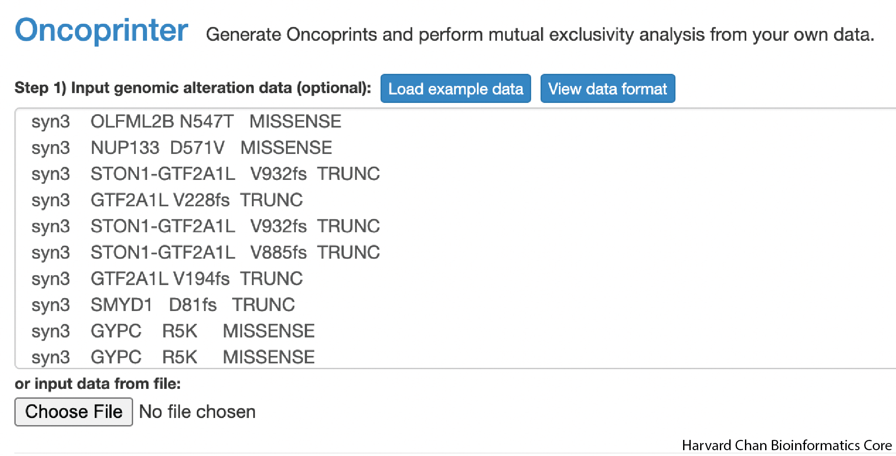
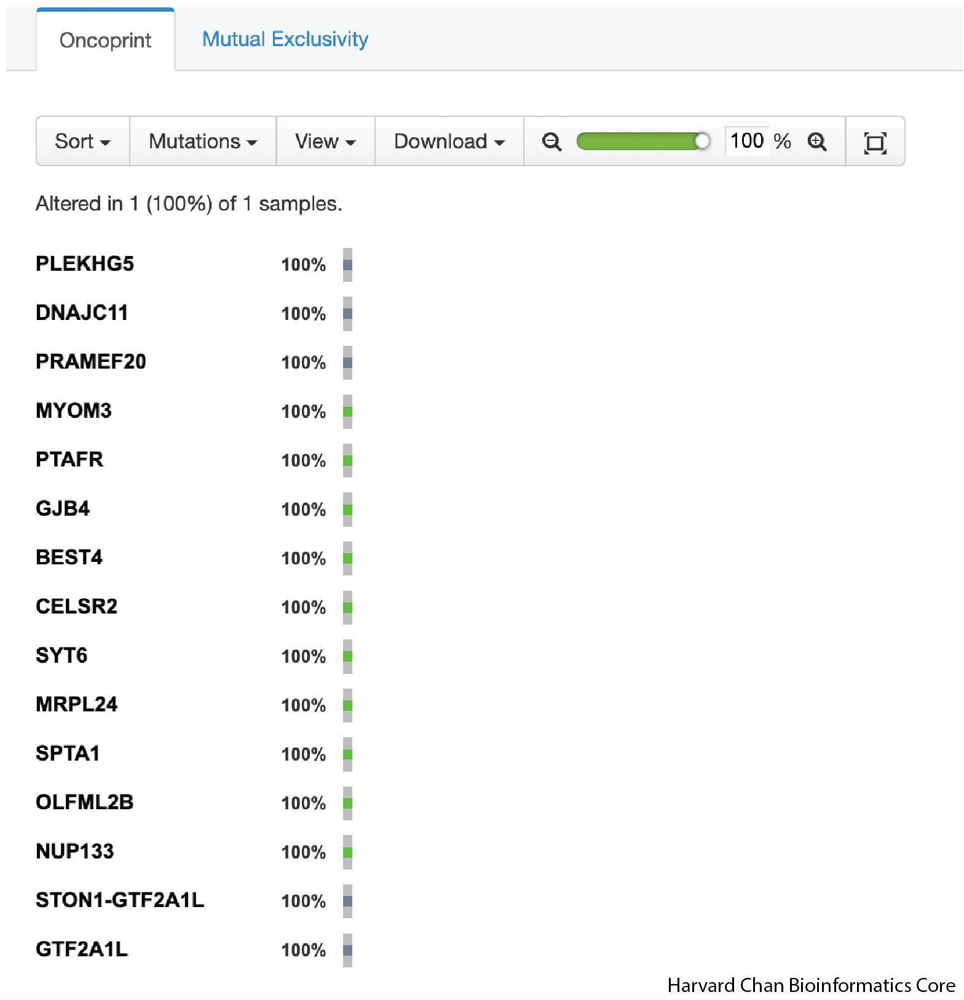
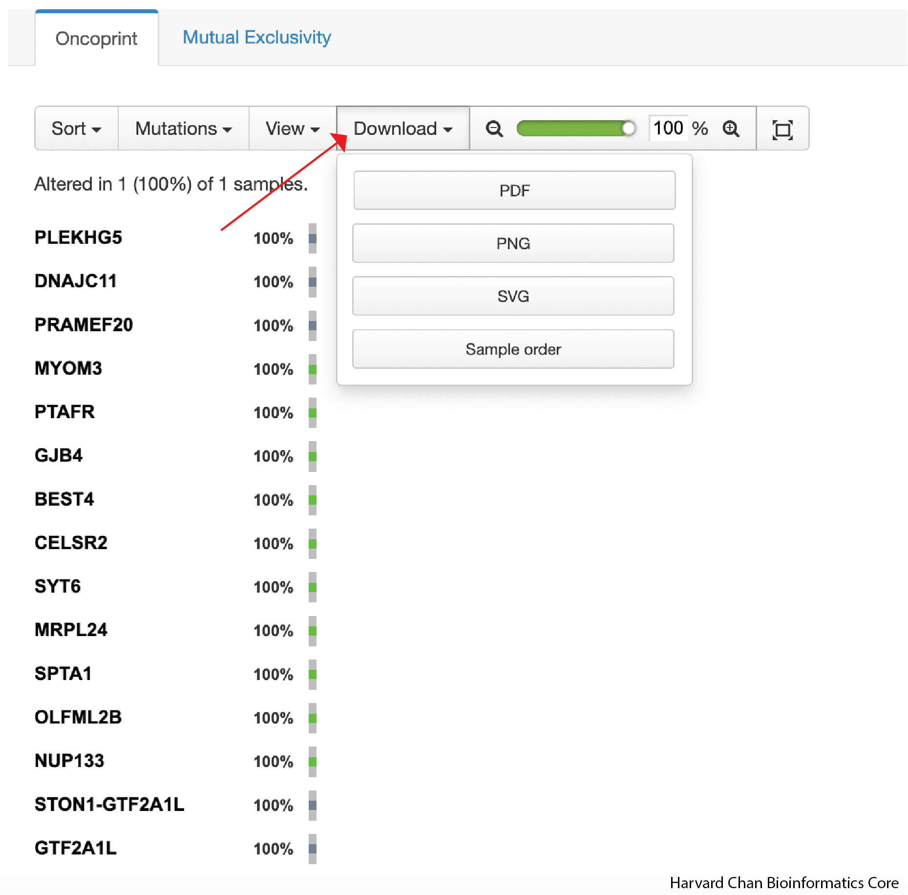
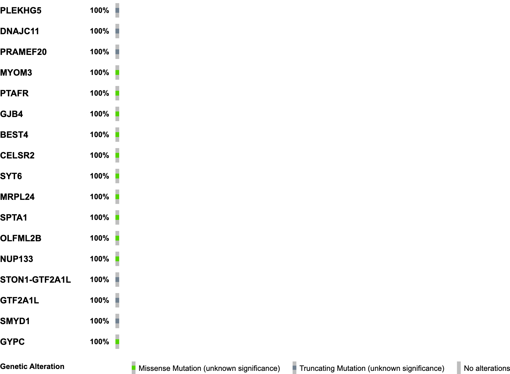

Approximate time: 15 minutes

## Learning Objectives

- Create oncoprint on cBioPortal using data analyzed in class 

## Oncoprints


<p align="center">

</p>

An Oncoprint is a visual summary of the genomic alterations for a set of genes across a set of samples. Oncoprints can visualize alterations in:

- Copy Number
- Insertions/deletions
- SNPs
- And more

There are several tools for creating Oncoprints, such as [oncoplot within maftools](https://bioconductor.org/packages/devel/bioc/vignettes/maftools/inst/doc/oncoplots.html) but in this workshop, we are going to use the [Oncoprinter resource on cBioPortal](https://www.cbioportal.org/oncoprinter).

## Wrangling our data for an Oncoprint

The first step in using the Oncoprinter for our data is to fortmat the data in the form that the Oncoprinter will recognize. The Oncoprinter is expecting our input to have four columns:

- Name of the sample
- Gene Symbol
- Description of the alteration event
  - If it is a mutation, then a description of the amino acid change
  - If it is a copy number variant, then is it a amplification or deletion
- Classification of the variant
  - `MISSENSE` for missense mutations
  - `INFRAME` for inframe mutations
  - `TRUNC` for truncation mutations (frameshift mutations and stop codon gains)
  - `PROMOTER` for promoter mutations
  - `OTHER` for any other kind of mutations

In our code below we are just going to focus on missense, frameshift, stop codon gain and inframe mutations. However, for your data, you could be interested in other types of mutational events, so please modify the code as needed. We are going to move into our scripts directory and create a bash script to wrangle our VCF into the format required by Oncoprinter: 

> Note: There is a great resource from the Human Genome Variation Society describing much of the nomenclature used to describe varaints [here](https://www.hgvs.org/mutnomen/recs-prot.html).

```
cd ~/variant_calling/scripts/
vim VCF_to_oncoprint.sh
```

We can copy and paste this code into our bash script:

```
#!/bin/bash
# This script was wrttien by the Training Team at the Harvard Chan Bioinformatics Core on June 6th, 2024  as part of training materials for the Introduction to Variant Analysis workshop.
# This is a working sample of code you might want to consider, when developing an Oncoprint for use in cBioPortal's Oncoprinter.
# You may need to alter this code for your needs.
# USAGE: sh VCF_to_oncoprint.sh <INPUT_VCF_FILE> <SAMPLE_NAME>

# Assign variable for input and output
INPUT_VCF_FILE=$1
SAMPLE_NAME=$2
OUTPUT_FILE=${INPUT_VCF_FILE%vcf}oncoprint.txt

# Load SnpEff
module load snpEff/4.3g

java -jar $SNPEFF/SnpSift.jar filter \
  -noLog \
  "( ANN[*].EFFECT has 'missense_variant' ) | ( ANN[*].EFFECT has 'stop_gain' ) | ( ANN[*].EFFECT has 'frameshift_variant' ) | ( ANN[*].EFFECT has 'inframe_insertion' ) | ( ANN[*].EFFECT has 'inframe_deletion' ) " \
  $INPUT_VCF_FILE  | \
  $SNPEFF/scripts/vcfEffOnePerLine.pl | \
  java -jar $SNPEFF/SnpSift.jar extractFields \
  - \
  "ANN[*].GENE"  "ANN[*].HGVS_P"  "ANN[*].EFFECT" |  \
  awk -v sample_name=$SAMPLE_NAME  'NR>1 {print sample_name,$1,$2,$3}' | \
  grep -E "missense_variant|stop_gain|frameshift_variant|inframe_insertion|inframe_deletion" | \
  awk '{sub(/p\./, "", $3); print}' | \
  awk '{sub(/Phe/, "F", $3); print}' | \
  awk '{sub(/Leu/, "L", $3); print}' | \
  awk '{sub(/Ile/, "I", $3); print}' | \
  awk '{sub(/Met/, "M", $3); print}' | \
  awk '{sub(/Val/, "V", $3); print}' | \
  awk '{sub(/Ser/, "S", $3); print}' | \
  awk '{sub(/Pro/, "P", $3); print}' | \
  awk '{sub(/Thr/, "T", $3); print}' | \
  awk '{sub(/Ala/, "A", $3); print}' | \
  awk '{sub(/Tyr/, "Y", $3); print}' | \
  awk '{sub(/His/, "H", $3); print}' | \
  awk '{sub(/Gln/, "Q", $3); print}' | \
  awk '{sub(/Asn/, "N", $3); print}' | \
  awk '{sub(/Lys/, "K", $3); print}' | \
  awk '{sub(/Asp/, "D", $3); print}' | \
  awk '{sub(/Glu/, "E", $3); print}' | \
  awk '{sub(/Cys/, "C", $3); print}' | \
  awk '{sub(/Trp/, "W", $3); print}' | \
  awk '{sub(/Arg/, "R", $3); print}' | \
  awk '{sub(/Gly/, "G", $3); print}' | \
  awk 'BEGIN { OFS="\t" } {print $1,$2,$3,$4}' | \
  sed 's/frameshift_variant.*/TRUNC/g' | \
  sed 's/stop_gain.*/TRUNC/g' | \
  sed 's/inframe_insertion.*/INFRAME/g' | \
  sed 's/inframe_deletion.*/INFRAME/g' | \
  sed 's/missense_variant.*/MISSENSE/g' > $OUTPUT_FILE
```

There are four main parts to the above code:

- Extracting genes amino acid alteration and SnpEff effect from the VCF file like we have previously practiced using SnpSift
- Adding a sample name column
- Altering the 3-letter amino acid abbreviations to single-letter abbreviations (this is optional)
- Changing the SnpEff effects into the format that Oncoprinter recognizes 

In order to run the code, we will need to execute:

```
sh VCF_to_oncoprint.sh /n/scratch/users/${USER:0:1}/${USER}/variant_calling/vcf_files/mutect2_syn3_normal_syn3_tumor_hg38-pass-filt-LCR.pedigree_header.snpeff.dbSNP.vcf  syn3
```

We can now inspect our new Oncoprinter formatted text file with:

```
less /n/scratch/users/${USER:0:1}/${USER}/variant_calling/vcf_files/mutect2_syn3_normal_syn3_tumor_hg38-pass-filt-LCR.pedigree_header.snpeff.dbSNP.oncoprint.txt
```

Once you have done this for a given sample, you would use the `cat` command to combine all of your samples together into a single text file. However, we will just be working with a single sample in this example since we don't have access to other samples.

During this process, you would also likely subset the output to your genes of interest. In order to simulate this, we are going going to grab the first handful of genes in the output to copy and paste into the Oncoprinter input field:

<p align="center">

</p>

Once you have placed the input into the Oncoprinter's input field, you can scroll to the bottom of the page and clikc the the `Submit` button. This will generate an Oncoprint for you.

<p align="center">

</p>

In order to export the Oncoprint, you can click on the `Download` dropdown and select the file format that you'd like to use:

<p align="center">

</p>

Once we have downloaded it, we can inspect it on our computer. It should look like:

<p align="center">

</p>

We have now made our first Oncoprint! If you would like to see what a Oncoprint might look like with more samples, you can return to the input page and click on `Load example data` and repeat the process. This example data has more samples than our single example dataset and has a more robust set of annotations, so it can give you a sense for the types of anotations that you can include in your Oncoprint and how to properly format those annotations. 

[Back to Schedule](../schedule/README.md)

***

*This lesson has been developed by members of the teaching team at the [Harvard Chan Bioinformatics Core (HBC)](http://bioinformatics.sph.harvard.edu/). These are open access materials distributed under the terms of the [Creative Commons Attribution license](https://creativecommons.org/licenses/by/4.0/) (CC BY 4.0), which permits unrestricted use, distribution, and reproduction in any medium, provided the original author and source are credited.*
