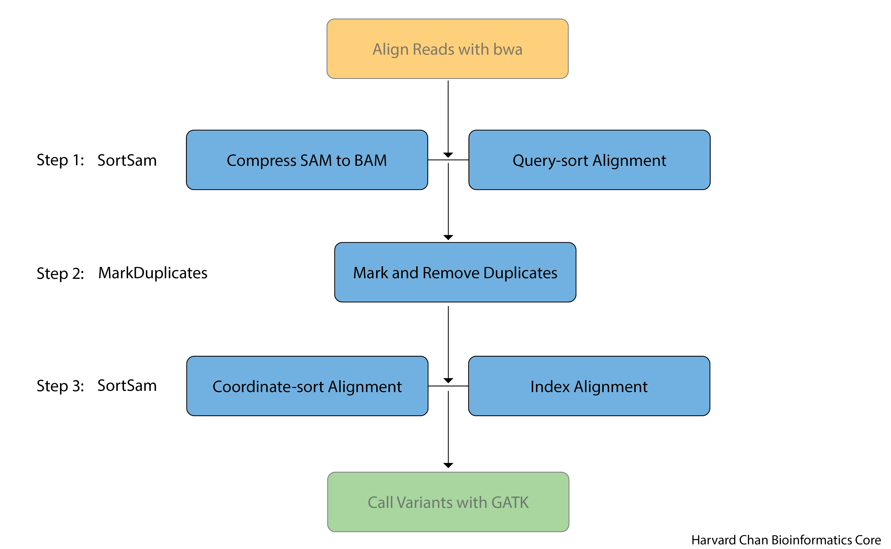

# Learning objectives

- Differentiate between query-sorted and coordinate-sorted alignment files
- Describe and remove duplicate reads
- Process a raw SAM file for input into a BAM for GATK

# Alignment file processing with `samtools` and `Picard`

The processing of the alignment files (SAM/BAM files) can be done either with [`samtools`](https://github.com/samtools/samtools) or [`Picard`](https://broadinstitute.github.io/picard/) and they are for the most part interchangable. The arguments for either are below:

`samtools`
- The software we will be using to call variants (GATK) can be picky about how the files are formatted and so you need to be careful about the formatting as to not produce an error in GATK
- More user-friendly
- Multi-threaded

`Picard`
- Maintained by the Broad Institute, so it has excellent integration with GATK (also maintained by the Broad Institute)
- Written in Java and the error messages are not as easily interpretable 
- Single-threaded

If implemented correctly, they largely provide the same output. In this workshop, we will be using `Picard`, but the `samtools` code will be provided in a dropdown for each section if you would like to know how to do the step in `samtools`.

## Pipeline for processing alignment file with `Picard`

Before we start processing our alignment SAM file provided by `bwa`, let's briefly discuss the steps that we will be doing in this pipeline. Several goals need to be accomplished:

1) **Compress SAM file to BAM file.** The output of `bwa` is a SAM file and it is human readbale. However, it is quite large and we need to compress it to a binary version (BAM) which is much smaller.
2) **Query-sort our alignment file.** Alignment file are initally ordered by the order of the reads in the FASTQ file, which is not particularly useful. `Picard` can more exhaustively look for duplicates if the file is sorted by read-name (query-sorted). We will discuss **query**-sorted and **coordinate**-sorted alignment files soon.
3) **Mark and Remove Duplicates.** Duplicates can introduce bias into our analysis so it is considered best practice to remove them prior to variant calling.
4) **Coordinate-sort our alignment file.** Most downstream software packages require that alignment files be **coordinate**-sorted, so we will need to re-sort our alignment file by **coordinates** now that we have remove the duplicates.
5) **Index the alignment file.** Like the index for a book, indicies for alignment files help direct downstream software packages to where to they can find specific reads. Many software packages require the alignment file that you are analyzing to have an index file, usually with the same name as you alignment file, with the additional `.bai` (BAM-index) extension. Both `Picard` and `samtools` have a way of integrating this indexing as part of their sorting protocols and that is what we will be using. However, both packages have commands for indexing a BAM file independent of their sorting protocol ([BuildBamIndex](https://gatk.broadinstitute.org/hc/en-us/articles/360037057932-BuildBamIndex-Picard-) for `Picard` and [index](http://www.htslib.org/doc/samtools-index.html) for `samtools`).

Below is a flow chart of the `Picard` pipeline that we will be using:

<p align="center">

</p>

## Creating our `sbatch` script

Let's go ahead and start making a new `sbatch` within `vim`:

```
cd ~/variant_calling/scripts/
vim picard_alignment_processing_normal.sbatch
```

Start the `sbatch` script with our shebang line, description of the script and our `sbatch` directives. 

```
#!/bin/bash
# This sbatch script is for processing the alignment output from bwa and preparing it for use in GATK using Picard 

# Assign sbatch directives
#SBATCH -p priority
#SBATCH -t 0-04:00:00
#SBATCH -c 1
#SBATCH --mem 32G
#SBATCH -o picard_alignment_processing_normal_%j.out
#SBATCH -e picard_alignment_processing_normal_%j.err
```

Load the `Picard` module: 

```
# Load module
module load picard/2.8.0
```

**Note: `Picard` is one of the pieces of software that does NOT require gcc/6.2.0 to also be loaded** 

Next, let's define some variables that we will be using:

```
# Assign file paths to variables
SAM_FILE=/n/scratch3/users/${USER:0:1}/${USER}/variant_calling/alignments/syn3_normal_GRCh38.p7.sam
REPORTS_DIRECTORY=/home/${USER}/variant_calling/reports/picard/syn3_normal/
SAMPLE_NAME=`basename $SAM_FILE _GRCh38.p7.sam`
QUERY_SORTED_BAM_FILE=`echo ${SAM_FILE%sam}query_sorted.bam`
REMOVE_DUPLICATES_BAM_FILE=`echo ${SAM_FILE%sam}remove_duplicates.bam`
METRICS_FILE=${REPORTS_DIRECTORY}/${SAMPLE_NAME}.remove_duplicates_metrics.txt
COORDINATE_SORTED_BAM_FILE=`echo ${SAM_FILE%sam}coordinate_sorted.bam`
```

Make a directory to hold the `Picard` reports:

```
# Make reports directory
mkdir -p $REPORTS_DIRECTORY
```

## Sorting and Removing Duplicates

In order to appropriately flag and remove duplicates, we first need to ***query*** sort our SAM file. Oftentimes, when people discuss sorted BAM/SAM files, they are refering to **coordinate**-sorted BAM/SAM files. 

- **Query**-sorted BAM/SAM files are sorted based upon their read names and order lexiographically
- **Coordinate**-sorted BAM/SAM files are sorted by their sequence name (chromosome/linkage group/scaffold) and position 

<p align="center">

</p>

`Picard` can mark and remove duplicates in either coordinate-sorted or query-sorted BAM/SAM files, however, if the alignments are query-sorted it can test secondary alignments for duplicates. A brief discussion of this nuance is discussed in the [`MarkDuplicates` manual of `Picard`](https://gatk.broadinstitute.org/hc/en-us/articles/360037052812-MarkDuplicates-Picard-). As a result, we will first **query**-sort our SAM file and convert it to a BAM file:

### Query-sort the Alignment File

With our reads aligned to the reference, we would see if we opened up the SAM file that the alignments are in the order they were processed by `bwa` and not in any particular order that would be useful for downstream analyses. So, we are going to ***sort them into order by query (read) name*** for the downstream `MarkDuplicates` tool. As a reminder, we are going to sort our BAM file by **coordinates** later in the processing and when people discuss a "sorted BAM/SAM" file they are usually referring to a BAM/SAM file that is **coordinate**-sorted.

Additionally, while SAM files are nice due to their human readability, they are typically quite large files and it is not an efficient use of space on the cluster. Fortunately, there is a binary compression version of SAM called BAM. While we sort the reads, we are going to use to convert our SAM file to a BAM file. We don't need to specify this SAM-to-BAM conversion explicitly, because `Picard` will make this change by interpretting the file extensions that we provide in the `INPUT` and `OUTPUT` file options.

```
# Query-sort alginment file and convert to BAM
java -jar $PICARD/picard-2.8.0.jar SortSam \
INPUT=$SAM_FILE \
OUTPUT=$QUERY_SORTED_BAM_FILE \
SORT_ORDER=queryname
```

The components of this command are:

- `java -jar $PICARD/picard-2.8.0.jar SortSam ` Calls `Picard`'s `SortSam` software package

- `INPUT=$SAM_FILE` This is where we provide the SAM input file

- `OUTPUT=$QUERY_SORTED_BAM_FILE` This is the BAM output file. Because the extension is `.bam` rather than `.sam`, `Picard` will recognize this and create the output as a BAM file rather than the SAM inoput we have provided it.

- `SORT_ORDER=queryname` The method with which we would like the file to be sorted. The options here are either `queryname` or `coordinate`.

### Mark and Remove Duplicates

An important step in processing a BAM file is to mark and remove PCR duplicates. These PCR duplicates can introduce artifacts because regions that have preferential PCR amplification could be over-represented. These reads are flagged by having identical mapping locations in the BAM file. Importantly, it is impossible to distinguish between PCR duplicates and identical fragments. However, one can reduce the latter by doing paired-end sequencing and providing appropriate amounts of input material. 

<p align="center">

</p>

Now we will add the command to our script that allows us to mark and remove duplicates in `Picard`:

```
# Mark and remove duplicates
java -jar $PICARD/picard-2.8.0.jar MarkDuplicates \
INPUT=$QUERY_SORTED_BAM_FILE \
OUTPUT=$REMOVE_DUPLICATES_BAM_FILE \
METRICS_FILE=$METRICS_FILE \
REMOVE_DUPLICATES=true
```

The componetns of this command are:

- `java -jar $PICARD/picard-2.8.0.jar MarkDuplicates` Calls `Picard`'s `MarkDuplicates` program

- `INPUT=$QUERY_SORTED_BAM_FILE` Uses our query-sorted BAM file as input

- `OUTPUT=$REMOVE_DUPLICATES_BAM_FILE` Write the output to a BAM file

- `METRICS_FILE=$METRICS_FILE` Creates a metrics file (required by `Picard MarkDuplicates`)

- `REMOVE_DUPLICATES=true` Not only are we going to mark/flag our duplicates, we can also remove them. By setting the `REMOVE_DUPLICATES` parameter equal to `true` to can remove the duplicates.

### Coordinate-sort the Alignment File

For most downstream processes, coordinate-sorted alignment files are required. As a result, we will need to change our alignemnt file from being **query**-sorted to being **coordinate**-sorted and we will once again use the `SortSam` command within `Picard` to accomplish this. Since this BAM file will be the final BAM file that we make and will use for downstream analyses, we will need to create an index for it. The command we will be using for **coordinate**-sorting and indexing out BAM file is:

```
# Coordinate-sort BAM file and create BAM index file
java -jar $PICARD/picard-2.8.0.jar SortSam \
INPUT=$REMOVE_DUPLICATES_BAM_FILE \
OUTPUT=$COORDINATE_SORTED_BAM_FILE \
SORT_ORDER=coordinate \
CREATE_INDEX=true
```

The components of this command are:

- `java -jar $PICARD/picard-2.8.0.jar SortSam` Calls `Picard`'s `SortSam` program

- `INPUT=$REMOVE_DUPLICATES_BAM_FILE` Our BAM file once we have removed our duplicates. **NOTE: Even though the software is called `SortSam`, it can use BAM or SAM files as input and also BAM or SAM files as output.**

- `OUTPUT=COORDINATE_SORTED_BAM_FILE` Our BAM output file sorted by coordinates.

- `CREATE_INDEX=true` Setting the `CREATE_INDEX` equal to `true` will create an index of the final BAM output. The index creation can also be accomplished by using the `BuildBamIndex` command within `Picard`, but this `CREATE_INDEX` functionality is built into many `Picard` functions, so you can often use it at the last stage of processing your BAM file to save having to run `BuildBamIndex` after.

---

Your final `sbatch` script for `Picard` should look like:

```
#!/bin/bash
# This sbatch script is for processing the alignment output from bwa and preparing it for use in GATK using Picard 

# Assign sbatch directives
#SBATCH -p priority
#SBATCH -t 0-04:00:00
#SBATCH -c 1
#SBATCH --mem 32G
#SBATCH -o picard_alignment_processing_normal_%j.out
#SBATCH -e picard_alignment_processing_normal_%j.err

# Load module
module load picard/2.8.0

# Assign file paths to variables
SAM_FILE=/n/scratch3/users/${USER:0:1}/${USER}/variant_calling/alignments/syn3_normal_GRCh38.p7.sam
REPORTS_DIRECTORY=/home/${USER}/variant_calling/reports/picard/syn3_normal/
SAMPLE_NAME=`basename $SAM_FILE _GRCh38.p7.sam`
QUERY_SORTED_BAM_FILE=`echo ${SAM_FILE%sam}query_sorted.bam`
REMOVE_DUPLICATES_BAM_FILE=`echo ${SAM_FILE%sam}remove_duplicates.bam`
METRICS_FILE=${REPORTS_DIRECTORY}/${SAMPLE_NAME}.remove_duplicates_metrics.txt
COORDINATE_SORTED_BAM_FILE=`echo ${SAM_FILE%sam}coordinate_sorted.bam`

# Make reports directory
mkdir -p $REPORTS_DIRECTORY

# Query-sort alginment file and convert to BAM
java -jar $PICARD/picard-2.8.0.jar SortSam \
INPUT=$SAM_FILE \
OUTPUT=$QUERY_SORTED_BAM_FILE \
SORT_ORDER=queryname

# Mark and remove duplicates
java -jar $PICARD/picard-2.8.0.jar MarkDuplicates \
INPUT=$QUERY_SORTED_BAM_FILE \
OUTPUT=$REMOVE_DUPLICATES_BAM_FILE \
METRICS_FILE=$METRICS_FILE \
REMOVE_DUPLICATES=true

# Coordinate-sort BAM file and create BAM index file
java -jar $PICARD/picard-2.8.0.jar SortSam \
INPUT=$REMOVE_DUPLICATES_BAM_FILE \
OUTPUT=$COORDINATE_SORTED_BAM_FILE \
SORT_ORDER=coordinate \
CREATE_INDEX=true
```

<details>
  <summary>Click here for alignment file processing using <code>Samtools</code></summary>
<br><code>Samtools</code> is another popular tools used for processing BAM/SAM files. The output from <code>Samtools</code> compared to <code>Picard</code> is laregly the same. Below is the pipeline and explanation for how you would carry out the similar SAM/BAM processing steps within <code>Samtools</code>.<br>
<p align="center">

</p>
<br><ol><li><details>
    <summary>Click here for setting up a <code>sbatch</code> script BAM/SAM Processing for the <code>Samtools</code> pipeline</summary>
<h2>Setting up <code>sbatch</code> Script</h2>
First we are going to need to set-up our <code>sbatch</code> submission script with our shebang line, <code>sbatch</code> directives, modules to load and file variables.
<pre>
#!/bin/bash
# This sbatch script is for processing the alignment output from bwa and preparing it for use in GATK using Samtools<br>
# Assign sbatch directives
#SBATCH -p priority
#SBATCH -t 0-04:00:00
#SBATCH -c 8
#SBATCH --mem 16G
#SBATCH -o samtools_processing_normal_%j.out
#SBATCH -e samtools_processing_normal_%j.err<br>
# Load modules
module load gcc/6.2.0
module load samtools/1.15.1<br>
SAM_FILE=/n/scratch3/users/${USER:0:1}/${USER}/variant_calling/alignments/normal_GRCh38.p7.sam
QUERY_SORTED_BAM_FILE=`echo ${SAM_FILE%sam}query_sorted.bam`
FIXMATE_BAM_FILE=`echo ${QUERY_SORTED_BAM_FILE%query_sorted.bam}fixmates.bam`
COORDINATE_SORTED_BAM_FILE=`echo ${QUERY_SORTED_BAM_FILE%query_sorted.bam}coordinate_sorted.bam`
FINAL_BAM_FILE=`echo ${QUERY_SORTED_BAM_FILE%query_sorted.bam}final.bam`<br>
</pre>
</details></li>

<li><details>
    <summary>Click here for <b>Query</b>-sorting a SAM file and converting it to BAM for the <code>Samtools</code> pipeline</summary>
Similarly to <code>Picard</code>, we are going to need to initally <b>query</b>-sort our alignment. We are also going to be converting the SAM file into a BAM file at this step. Also similarly to <code>Picard</code>, we don't need to specify that our input or output files are BAM or SAM files. <code>Samtools</code> will use the extensions you provide it in your file names as guidance for whether you are providing it a BAM/SAM and whether you want the output to be a BAM/SAM file. Below is the code we will use to <b>query</b>-sort our SAM file and convert it into a BAM file:<br>
    
<pre>
# Sort SAM file and convert it to a query name sorted BAM file
samtools sort \
-@ 8 \
-n \
-o $QUERY_SORTED_BAM_FILE \
$SAM_FILE
</pre>
    
The components of this line of code are:
    
<ul><li><code>samtools sort</code> This calls the sort function within <code>samtools</code>.</li>

<li><code>-@ 8</code> This tells <code>samtools</code> to use 8 threads when it multithreads this task. Since we requested 8 cores for this <code>sbatch</code> submission, let's go ahead and use them all.</li>

<li><code>-n</code> This argument tells <code>samtools sort</code> to sort by read name as opposed the the default sorting which is done by coordinate.</li>

<li><code>-O bam</code> This is declaring the output format of `bam`.</li>

<li><code>-o $QUERY_SORTED_BAM_FILE</code> This is a <code>bash</code> variable that holds the path to the output file of the <code>samtools sort</code> command.</li>

<li><code>$SAM_FILE</code> This is a <code>bash</code> variable holding the path to the input SAM file.</li></ul>
</details></li>

<li><details>    
<summary>Click here for fixing mate information for the <code>Samtools</code> pipeline</summary>
Next, we are going to add more mate-pair information to the alignments including the insert size and mate pair coordinates. It is important to note with this command that <code>samtools</code> relies on positional parameters for assigning the the input and output BAM files. In this case the input BAM file (<code>$QUERY_SORTED_BAM_FILE</code>) needs to come before the output file (<code>$FIXMATE_BAM_FILE</code>):
    
<pre>
# Score mates
samtools fixmate \
-m \
$QUERY_SORTED_BAM_FILE \
$FIXMATE_BAM_FILE   
</pre>

The parts of this command are:

<ul><li><code>samtools fixmate</code> This calls the <code>fixmate</code> command in <code>samtools</code></li>

<li><code>-m</code> This will add the mate score tag that will be critically important later for <code>samtools markdup</code></li>

<li><code>$QUERY_SORTED_BAM_FILE</code> Bash variable that holds the path to the input file</li>

<li><code>$FIXMATE_BAM_FILE</code> Bash variable that holds the path to the input file</li></ul>
</details></li>

<li><details>
<summary>Click here for <b>coordinate</b>-sorting a BAM file for the <code>Samtools</code> pipeline</summary>
    
Now that we have added the <code>fixmate</code> information, we need to <b>coordinate</b>-sort the BAM file. We can do that by: 

<pre>
# Sort BAM file by coordinate   
samtools sort \
-@ 8 \
-o $COORDINATE_SORTED_BAM_FILE \
$FIXMATE_BAM_FILE
</pre>

We have gone through all of the these paramters already in the previous <code>samtools sort</code> command. The only difference in this command is that we are not using the <code>-n</code> option, which tell <code>samtools</code> to sort by read name. Now, we are sorting by coordinates, the default setting.
</details></li>
    
<li><details>
<summary>Click here for marking and removing duplicates for the <code>Samtools</code> pipeline</summary>

<pre>
# Mark and remove duplicates and then index the output file
samtools markdup \
-r \
--write-index \
-@ 8 \
$COORDINATE_SORTED_BAM_FILE \
${REMOVED_DUPLICATES_BAM_FILE}##idx##${REMOVED_DUPLICATES_BAM_FILE}.bai
</pre> 

The components of this command are:    
    
<ul><li><code>samtools markdup</code> calls the mark duplicates software in <code>samtools</code></li>
    
<li><code>-r</code> removes the duplicate reads</li>
    
<li><code>--write-index</code> writes an index file (see next section for more information on BAM index files) of the output</li>
    
<li><code>-@ 8</code> sets that we will be using 8 threads</li>
    
<li><code>$BAM_FILE</code> this is out BAM input file</li>
    
<li><code>${REMOVED_DUPLICATES_BAM_FILE}##idx##${REMOVED_DUPLICATES_BAM_FILE}.bai</code>This has two parts:
<ol><li>The first part (<code>${REMOVED_DUPLICATES_BAM_FILE}</code>) is our BAM output file with the duplicates removed from it</li>
<li>The second part (<code>##idx##${REMOVED_DUPLICATES_BAM_FILE}.bai</code>) is a shortcut to creating a <code>.bai</code> index of the BAM file. If we use the <code>--write-index</code> option without this second part, it will create a <code>.csi</code> index file. <code>.bai</code> index files are a specific type of <code>.csi</code> files, so we need to specify it with the second part of this command to ensure that a <code>.bai</code> index file is created rather than a <code>.csi</code> index file.</li></ol></li></ul>
</details></li>

<li><details>
<summary>Click here for the final <code>sbatch</code> script to do the BAM/SAM processing for the <code>Samtools</code> pipeline</summary>

The final script should look like:
    
<pre>
#!/bin/bash
# This sbatch script is for processing the alignment output from bwa and preparing it for use in GATK using Samtools<br>
# Assign sbatch directives
#SBATCH -p priority
#SBATCH -t 0-04:00:00
#SBATCH -c 8
#SBATCH --mem 16G
#SBATCH -o samtools_processing_normal_%j.out
#SBATCH -e samtools_processing_normal_%j.err<br>
# Load modules
module load gcc/6.2.0
module load samtools/1.15.1<br>
SAM_FILE=/n/scratch3/users/${USER:0:1}/${USER}/variant_calling/alignments/normal_GRCh38.p7.sam
QUERY_SORTED_BAM_FILE=`echo ${SAM_FILE%sam}query_sorted.bam`
FIXMATE_BAM_FILE=`echo ${QUERY_SORTED_BAM_FILE%query_sorted.bam}fixmates.bam`
COORDINATE_SORTED_BAM_FILE=`echo ${QUERY_SORTED_BAM_FILE%query_sorted.bam}coordinate_sorted.bam`
FINAL_BAM_FILE=`echo ${QUERY_SORTED_BAM_FILE%query_sorted.bam}final.bam`<br>
# Sort SAM file and convert it to a query name sorted BAM file
samtools sort \
-@ 8 \
-n \
-o $QUERY_SORTED_BAM_FILE \
$SAM_FILE<br>
# Score mates
samtools fixmate \
-m \
$QUERY_SORTED_BAM_FILE \
$FIXMATE_BAM_FILE<br>
# Sort BAM file by coordinate   
samtools sort \
-@ 8 \
-o $COORDINATE_SORTED_BAM_FILE \
$FIXMATE_BAM_FILE<br>
# Mark and remove duplicates and then index the output file
samtools markdup \
-r \
--write-index \
-@ 8 \
$COORDINATE_SORTED_BAM_FILE \
${REMOVED_DUPLICATES_BAM_FILE}##idx##${REMOVED_DUPLICATES_BAM_FILE}.bai<br>
</pre>
</details></li>
</details>


<details>
<summary>Click here for information on indexing a <code>BAM</code> file</summary>

<br>Many software packages want an index of your BAM file in order to facilitate fast look-ups of a BAM file. While not all software packages that use a BAM file will require this, many will and thus it is a good practice to index your BAM file while processing it. In our previous line of <code>Picard</code> command, we provided it with the <code>CREATE_INDEX=true</code> option, so it automatically created an index for us after <b>coordinate</b>-sorting our BAM file. If for some reason we needed to create an BAM-index for a <b>coordinate</b>-sorted BAM file, we would run a command that looks like this:

<pre>
# SKIP THIS STEP
# Index the BAM file
java -jar $PICARD/picard-2.8.0.jar BuildBamIndex \
INPUT=$BAM_FILE
</pre>
    
The components of this command are:

<ul><li><code>java -jar $PICARD/picard-2.8.0.jar BuildBamIndex</code> This calls the <code>BuildBamIndex</code> tools within <code>Picard</code></li>
    
<li><code>INPUT=$BAM_FILE</code> This is the BAM file that you wish to index.</li></ul>

<b>NOTE: BAM indexes can only be made from coordinate-sorted BAM files.</b>    

<details>
<summary>Click here for BAM-Indexing within <code>Samtools</code></summary>
    
In the previous step, we have already indexed our BAM file. But if for some reason we needed to index a BAM file, the command to index a BAM file with <code>samtools</code> would be:

<pre>
#### SKIP THIS STEP
# Index the BAM file
samtools index \
$BAM_FILE
</pre>

The components of this command are:
    
<ul><li><code>samtools index</code> Calls the <code>index</code> function within <code>samtools</code></li>

<li><code>$BAM_FILE</code> This is a `bash` variable that holds the path to the BAM file that we want to index.</li>

We don't need to provide an output file for <code>samtools index</code>, by default it will generate a new file using the same path and filename as the BAM file, but add `.bai` as the extension to denote that it is a BAM-index file.
</details>
</details>

The tool we will be using for variant calling is called `GATK` and it was developed and maintained by the Broad Institute. The Broad Institute also maintains a tool that does many of the functions that `samtools` does and it is called `Picard`. In the dropdown below, we show the command you can use for sorting a SAM file in `Picard`. 

## Creating the Tumor SAM/BAM procressing
    
Similarly to the `bwa` script, we will now need use `sed` to create a `sbtach` script that will be used for processing the tumor SAM file into a BAM file that can be used as input to GATK. The `sed` command to do this would be:
  
```
sed 's/normal/tumor/g' picard_alignment_processing_normal.sbatch > picard_alignment_processing_tumor.sbatch  
```

As a result your tumor `Picard` processing script should look like:
  
```
#!/bin/bash
# This sbatch script is for processing the alignment output from bwa and preparing it for use in GATK using Picard 

# Assign sbatch directives
#SBATCH -p priority
#SBATCH -t 0-04:00:00
#SBATCH -c 1
#SBATCH --mem 32G
#SBATCH -o picard_alignment_processing_tumor_%j.out
#SBATCH -e picard_alignment_processing_tumor_%j.err

module load picard/2.8.0

# Assign file paths to variables
SAM_FILE=/n/scratch3/users/${USER:0:1}/${USER}/variant_calling/alignments/syn3_tumor_GRCh38.p7.sam
REPORTS_DIRECTORY=/home/${USER}/variant_calling/reports/picard/syn3_tumor/
SAMPLE_NAME=`basename $SAM_FILE _GRCh38.p7.sam`
QUERY_SORTED_BAM_FILE=`echo ${SAM_FILE%sam}query_sorted.bam`
REMOVE_DUPLICATES_BAM_FILE=`echo ${SAM_FILE%sam}remove_duplicates.bam`
METRICS_FILE=${REPORTS_DIRECTORY}/${SAMPLE_NAME}.remove_duplicates_metrics.txt
COORDINATE_SORTED_BAM_FILE=`echo ${SAM_FILE%sam}coordinate_sorted.bam`

# Make reports directory
mkdir -p $REPORTS_DIRECTORY

# Query-sort alginment file and convert to BAM
java -jar $PICARD/picard-2.8.0.jar SortSam \
INPUT=$SAM_FILE \
OUTPUT=$QUERY_SORTED_BAM_FILE \
SORT_ORDER=queryname

# Mark and remove duplicates
java -jar $PICARD/picard-2.8.0.jar MarkDuplicates \
INPUT=$QUERY_SORTED_BAM_FILE \
OUTPUT=$REMOVE_DUPLICATES_BAM_FILE \
METRICS_FILE=$METRICS_FILE \
REMOVE_DUPLICATES=true

# Coordinate-sort BAM file and create BAM index file
java -jar $PICARD/picard-2.8.0.jar SortSam \
INPUT=$REMOVE_DUPLICATES_BAM_FILE \
OUTPUT=$COORDINATE_SORTED_BAM_FILE \
SORT_ORDER=coordinate \
CREATE_INDEX=true
```  

# Submitting `Picard` processing
  
Now we are ready to submit our normal and tumor `Picard` processing scripts to the O2 cluster. However, we might have a problem. If you managed to go quickly into this lesson from the previous lesson, your `bwa` alignment scripts may still be running and your SAM files are not complete yet!
  
First, we need to check the status of our `bwa` scripts and we can do this with the command:
  
```
squeue -u $USER
```
  
__***If you have `bwa` jobs still running,***__ then wait for them to complete (less than 2 hours) before continuing. There are ways to queue jobs together in SLURM using the `--dependency` option in `sbatch`. We will go over this in the automation lesson, but for now just hang tight until your jobs have finished.
  
__***If the only job running is your interactive job,***__ then it should be time to start your `Picard` processing scripts. You can go ahead and submit your `sbatch` scripts for `Picard` processing with:
  
```
sbatch picard_alignment_processing_normal.sbatch
sbatch picard_alignment_processing_tumor.sbatch
```
  
[Next Lesson >>>](alignment_QC.md)

[Back to Schedule](../schedule/README.md)
  
***

*This lesson has been developed by members of the teaching team at the [Harvard Chan Bioinformatics Core (HBC)](http://bioinformatics.sph.harvard.edu/). These are open access materials distributed under the terms of the [Creative Commons Attribution license](https://creativecommons.org/licenses/by/4.0/) (CC BY 4.0), which permits unrestricted use, distribution, and reproduction in any medium, provided the original author and source are credited.*
