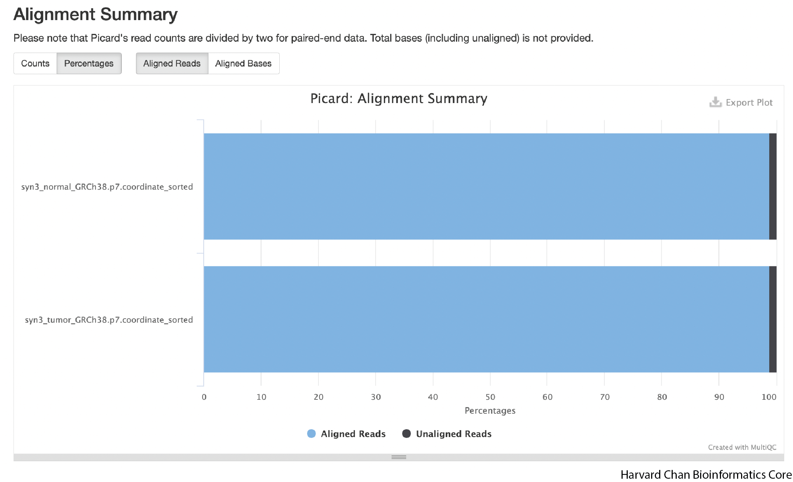
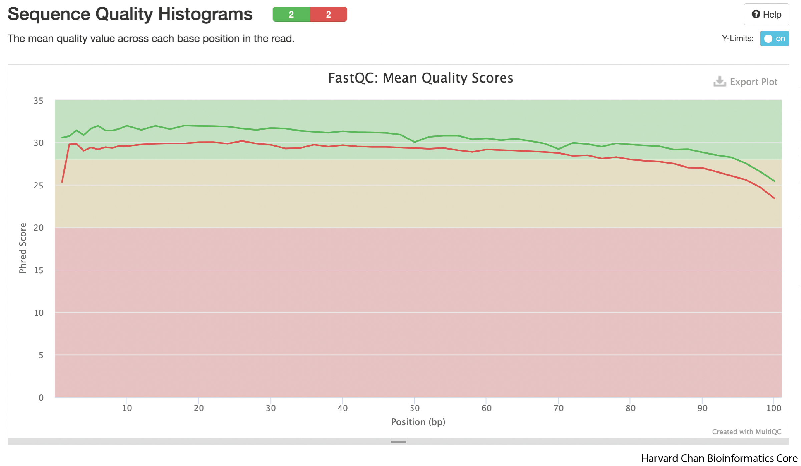
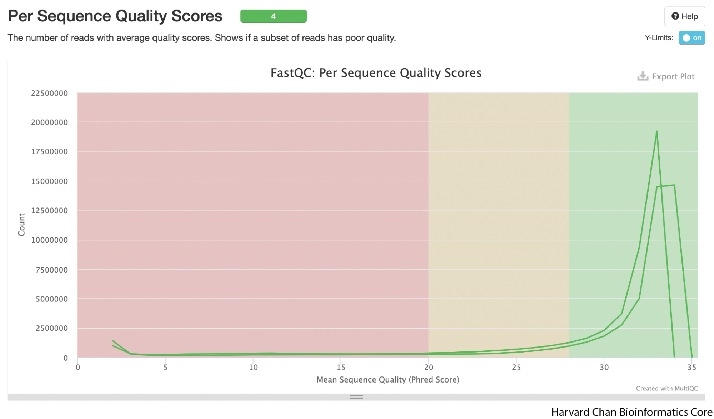
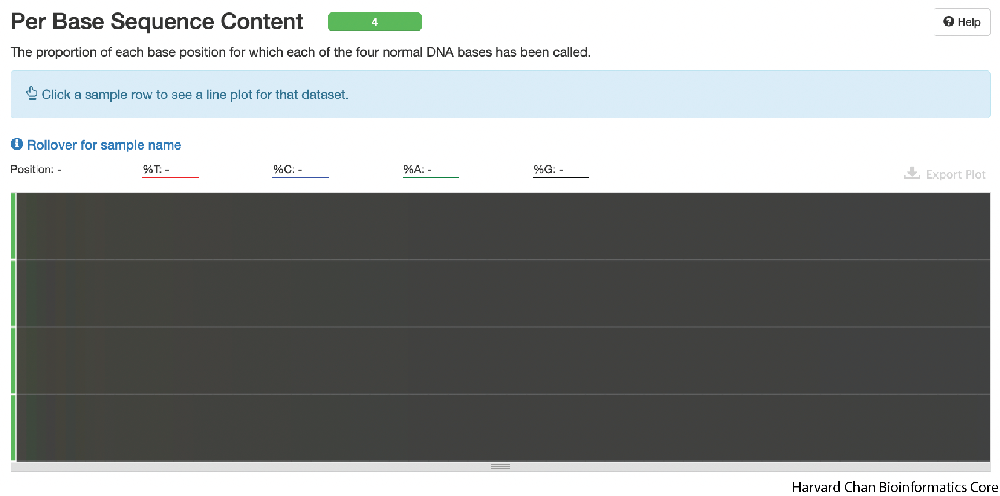
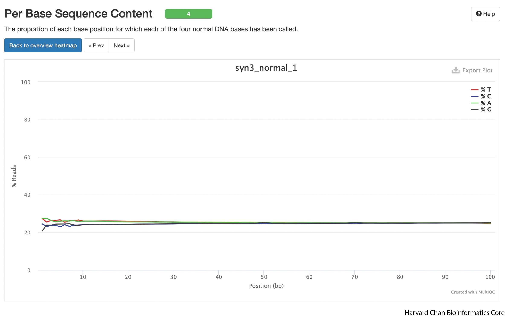
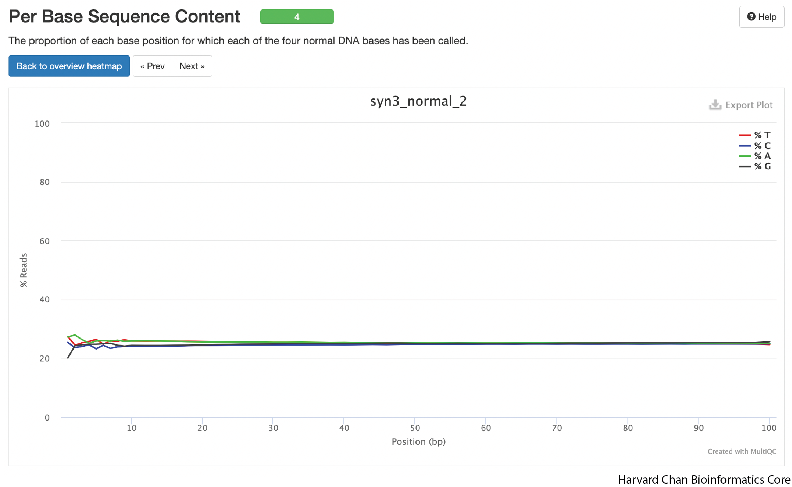
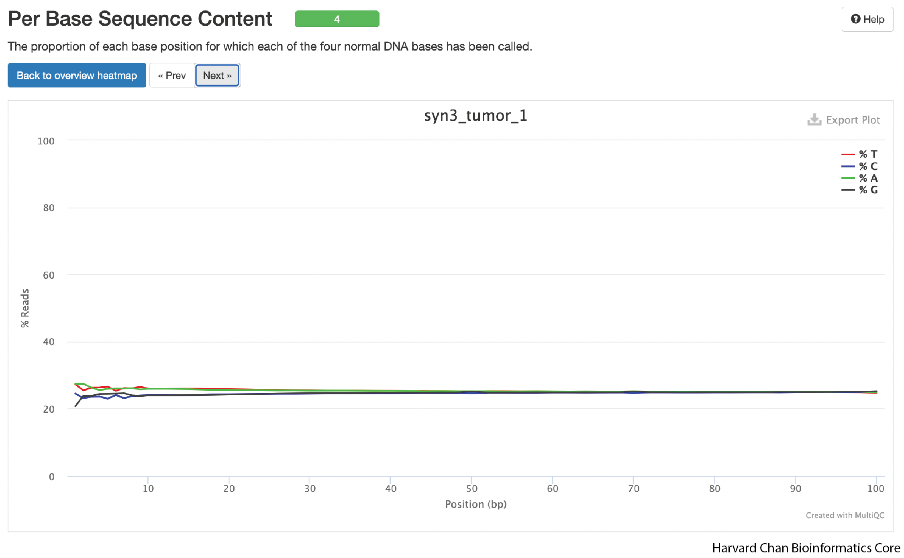
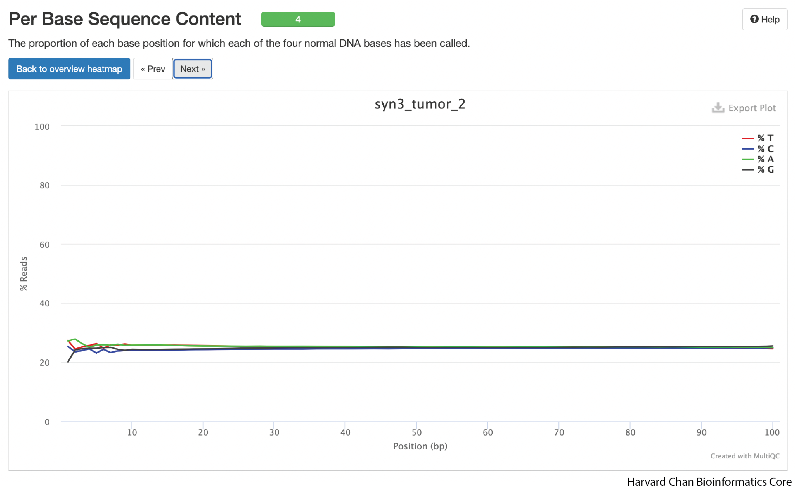

# Evaluating `MultiQC` Report

## Learning Objectives

- Interpret FastQC figures for read quality
- Evaluate read alignment

## Downloading `MultiQC` HTML Report with `FileZilla`

While the O2 cluster cluster is fantastic at many things, it is not designed to render HTML files. For that we will need a browser, such as Safari, Chrome, Firefox, etc., on our local computer. Thus, we will need to download the HTML report from the cluster to our local computers. There are ways to do this from the command line using tools like `scp` and `rsync`, however, we are going to use `FileZilla` which has an easy-to-use GUI to help us.

### Filezilla - Step 1

Open up *FileZilla*, and click on the File tab. Choose 'Site Manager'.

### Filezilla - Step 2

Within the 'Site Manager' window, do the following: 

1. Click on 'New Site', and name it something intuitive (e.g. O2)
2. Host: transfer.rc.hms.harvard.edu 
3. Protocol: SFTP - SSH File Transfer Protocol
4. Logon Type: Normal
5. User: Username (i.e rc_trainingXX) 
6. Password: O2 password
7. Click 'Connect'

> NOTE: While using the temporary training accounts on the O2 cluster, two-factor authentication ***IS NOT*** required. However, if you explore this lesson when using your personal account, two-factor authentication ***IS*** required. 
> 
> In order to connect your laptop using FileZilla to the O2 cluster, follow steps 1-7 as outlined above. Once you have clicked 'Connect', you will receive a Duo push notification (but no indication in Filezilla) which you must approve within the short time window. Following Duo approval, FileZilla will connect to the O2 cluster.

### FileZilla Interface

You will see messages printed in the message window in the top window pane, giving a you an indication of whether or not you have successfully connected to O2. Next, if this if your first time using Filezilla we recommend that you take some time to get familiar withe the basics of the interface. This [tutorial](https://wiki.filezilla-project.org/FileZilla_Client_Tutorial_(en)) is a helpful resource.

You will see two panels in the interface. On the left hand side you will see your the files in your laptop and on the right hand side you have your home directory on O2. Both panels have a directory tree at the top and a detailed listing of the selected directory's contents underneath. In the right hand panel, navigate to where the HTML files are located on O2 `~/variant_calling/reports/`. Then decide where you would like to copy those files to on your computer and move to that directory on the left hand panel.

Once you have found the HTML output for `MultiQC` **copy it over** by double clicking it or drag it over to right hand side panel. Once you have the HTML file copied over to your computer, you can leave the `FileZilla` interface. You can then locate the HTML file on your computer and open the HTML report up in a browser (`Chrome`, `Firefox`, `Safari`, etc.). 

## Inspect `MultiQC` HTML Report 

### General Statistics

Now we can evalute all of our `FastQC` and alignments metrics at once. The first table we are presented with gives us an overview of our sequencing and alignment.

A few quick takeaways from this table is that it gives us an overview of our alignments:

  1) We had an alignment rate of 99% for both normal and tumor which is very good. 
  2) The level of duplicates is not high (<10%).
*Sergey* 
 Range of acceptable levels of duplicates if we are filtering them out?

  3) The GC-content of our sequencing is 49%. The average GC content of the human genome is ~41%, but GC-content is higher in genic regions than intergenic regions. Given that our sequencing represents whole exome sequencing rather than whole genome sequencing, a moderately elevated GC-content compared to the genome average seems reasonable. If we see GC-content that drasatically differs (more than ~10%) from our expectation then that could be a reason to pause and look for reasons for this divergence. 
  4) We can also see that we have ~49 million fragments for each sample, which should provide more than adequate depth for variant calling.
  *Sergey*
  Recommendations on Depth for WES and WGS. My back of the envelope calculations for these 100-bp Paired end samples is that we have like 200X? Is that right

### Aligned Reads

The next figure in the report is a chart of the aligned reads. You can click on the "Percantages" tab if you'd rather see the alignments as a percentage. As we already covered in the General Statistics section, we are seeing an alignment rate of ~99%, which is very good.

### Sequence Quality

As we continue down the report, we can skip a few figures until we get to the sequence quality figure. A few things we should know about these figures. 
  1) The y-axis is PHRED score, which we discussed in the `FastQC` lesson and the y-axis is position in the read. 
  2) Typically, the shape of these figures have a steep incline in the first few bases before plateauing and finally tapering off a bit. The shape should be mostly smooth. If we saw large, abrupt drops in quality this could be reason to contact your sequencing facility.
  3) The right read (or R2) often has low-quality than the left read (or R1) and this difference in quality if just an artifact of pair-end Illumina sequencing.

The shape that we see is very typical of a good sequencing run. Imporantly their aren't any sudden drops in read quality in these samples.

### Average Sequence Quality

The next plot highlights average sequence quality for a read. As opposed to the previous plot, the PHRED score is now on the x-axis.

We can see that our average quality scores peak well-above 28 and they appear to be mostly unimodal. If the average PHRED score peak was lower or perhaps we saw a bimodal distribution for PHRED scores then we might have some concerns.

### Per Base Sequence Content

The next plot is a bit difficult to understand because the quality of the data is good. But each sample is on the y-axis and the position in the read is on the x-axis. The color (which is mostly dark grey in the example below) indicates base composition bias (%A, %G, %T or %C). Ideally, color at each position should be constant throughout the read. If, for instance, we saw a bright green band in the 56th position for one of the samples, that would indicate that the the 56th position for some reason had an overabundance of Adenine. In fact, if you look *very* closely at the left side of the plots, you may be able to barely see a few faintly colored bands. This is actually the result of some primer bias in the beginning of the sequence, but it's effect is quite small.

As you scroll over the dark grey rectangles, it will tell you what the base composition is for that position in a particular sample. These samples look pretty good, but we will dive a bit deeper into base composition by clicking on each sample. 

#### Per Base Sequence Content

Once we have clicked on the first sample, it will produce a new plot featuring the base composition. In an ideal world, you would likely see some small primer bias at the beginning and then relatively flat lines for the rest of the positions.

We can see the weak primer bias from the sequencing at the begining, but it base composition is relatively flat, which is exactly what we want to see in this plot. The next three samples look similar, but we have included included them in the dropdowns below.

  
Click here to see the per base sequence content plot for the right reads of the normal sample

  

  
  

  

  
Click here to see the per base sequence content plot for the left reads of the tumor sample

  

  
  

  
Click here to see the per base sequence content plot for the right reads of the tumor sample

  

  
  

[Next Lesson >>>](variant_calling.md)

[Back to Schedule](../schedule/README.md)

***

*This lesson has been developed by members of the teaching team at the [Harvard Chan Bioinformatics Core (HBC)](http://bioinformatics.sph.harvard.edu/). These are open access materials distributed under the terms of the [Creative Commons Attribution license](https://creativecommons.org/licenses/by/4.0/) (CC BY 4.0), which permits unrestricted use, distribution, and reproduction in any medium, provided the original author and source are credited.*
