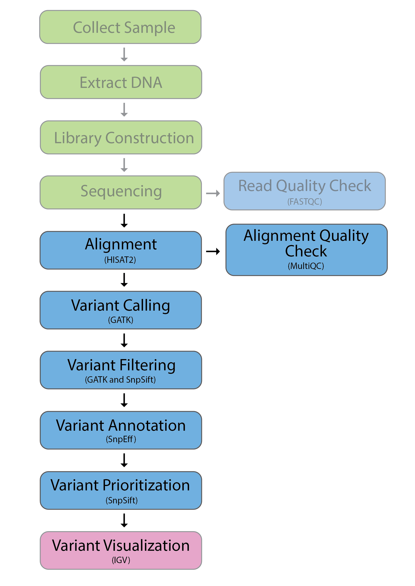
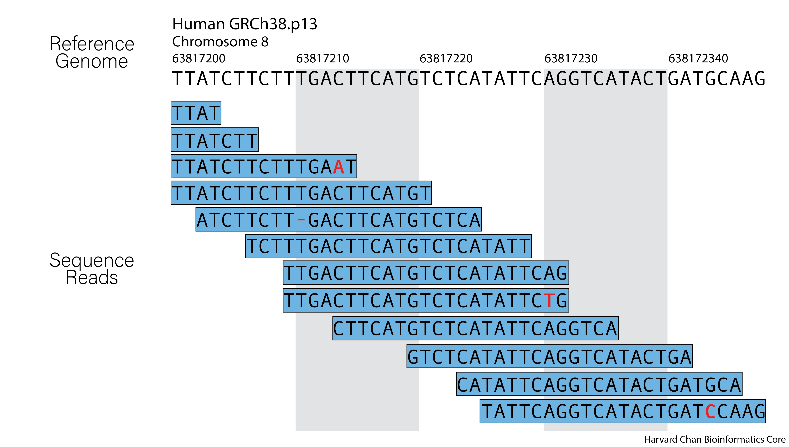

# Sequence Alignment Theory

## Learning Objectives

- Enumerate difficulties with alignment
- Create an `sbatch` script to align reads

<p align="center">

</p>

## Understanding Alignment

Sequence Read Alignment may appear to be a simple task at first glance. One has set of reads where each read represents a small section of the genome and therefore, it would simply appear that one just needs to evaluate each read and assign it to a location in the genome matching that sequence. However, this task is complicated by a multitude of factors including:

- Errors in the sequencing reads
- Errors in the reference genome
- Repetitive areas of the genome
- Variants in the sample

<p align="center">

</p>

However, likely the largest and most difficult part of this task is creating an alignment algorithm that can account for these factors and still provide alignment for ***millions*** of reads within a reasonable time frame. There are a multitude of alignment tools availible today, including [bwa](https://bio-bwa.sourceforge.net), [HISAT2](http://daehwankimlab.github.io/hisat2/) and [STAR](https://github.com/alexdobin/STAR). Many of them has strengths and weakness and are more appropriate for a certain type of analysis. In this course, we will be using `bwa`. 

## `bwa`

Many modern alignment tools rely on the Burrows-Wheeler Transform as part of their alignment and `bwa` does as well. `bwa` runs in several parts:

1. Create an index of the reference sequence (done once)
    1. Create a Suffix Array Index
    2. Generate a Burrows-Wheeler Transform from the suffix array
2. Query reads against the index to get their alignments

> The Burrows-Wheeler Transform and Suffix Arrays are outside of the scope of this course, but a great place to get information on these methods are on [Dr. Ben Langmead's YouTube Channel](https://www.youtube.com/user/BenLangmead/videos). Dr. Langmead developed the algorithm for a similar alignment tool, Bowtie, and he makes many useful videos explaining how the components of these alignment tools work. 

<details> 
<summary>Click here for details on creating a <code>bwa</code> index</summary>

While we will be using an index that has already been made for us, if you need to create and index for a reference sequence using <code>bwa</code>, the steps for this are laid out below.

<ol><b><li>Navigate to your reference sequence directory</b>

<pre>
cd ~/path/to/reference/sequence/directory/
</pre></li>

<b><li>Create a `bwa` index</b>

<pre>
bwa index reference_sequence.fasta
</pre></li></ol>

This process may take up to 30+ minutes to run depending on the reference sequence size. The output of this command will produce five files:

<ul><li><code>reference_sequence.fasta.sa</code> This is the binary version of the Suffix Array Index</li>
<li><code>reference_sequence.fasta.bwt</code> This is the binary version of the Burrows-Wheeler Transform of the reference sequence</li>
<li><code>reference_sequence.fasta.pac</code> A special binary compression of the reference sequence</li>
<li><code>reference_sequence.fasta.ann</code> Notations regarding the reference sequence</li>
<li><code>reference_sequence.fasta.amb</code> Notations regarding base ambiguities (mostly Ns, but also other base ambiguities) in the reference sequence</li></ul>
</details>

### Setting up our `sbatch` Submission Script for alignment

Now that we have indexed the reference sequence, we can align sequence reads to our indexed reference sequence. To align reads to the reference sequence, we will need to create and `sbatch` submission script in `vim`.

```
cd ~/variant_calling/scripts/

vim bwa_alignment_normal.sbatch
```

Now that we have opened up `vim` we need to enter `insert-mode` by pressing `i`. Once in `insert-mode`, we can copy and paste the following shebang line and `sbatch` directives:

```
#!/bin/bash
# This script is for aligning sequencing reads against a reference genome using bwa

# Assign sbatch directives
#SBATCH -p priority
#SBATCH -t 0-04:00:00
#SBATCH -c 8
#SBATCH --mem 16G
#SBATCH -o bwa_alignment_normal_%j.out
#SBATCH -e bwa_alignment_normal_%j.err
```
Next, we need to add the modules that we will be using in this command:

```
# Load modules
module load gcc/6.2.0
module load bwa/0.7.17
```

> Remember that on O2, many of the common tools were compiled using `GCC` version 6.2.0, so to be able to access them, we first need to load the `GCC` module.

> Also, you can see that we also loaded the `samtools` version 1.15.1 module. That is not required for alignment, however, this script will have a few steps after alignment that will require `samtools`. It is common to load all modules at the top of a `sbtach` submission script. The only exception to this practice happen in the rare case that they are dependency conflicts between modules. In this case, you may see people loading/unloading/swapping modules within their `sbatch` scripts.

Now that we have the module load command for `bwa` in our SBATCH script, we are going to declare some bash variables that we are going to use:

```
# Assign files to bash variables
REFERENCE_SEQUENCE=/n/groups/hbctraining/variant_calling/reference/GRCh38.p7_genomic.fa
LEFT_READS=/home/$USER/variant_calling/raw_data/syn3_normal_1.fq.gz
RIGHT_READS=`echo ${LEFT_READS%1.fq.gz}2.fq.gz`
REFERENCE_SEQUENCE_NAME=`basename $REFERENCE_SEQUENCE _genomic.fa`
SAMPLE_NAME=`basename $LEFT_READS _1.fq.gz`
SAM_FILE=/n/scratch3/users/${USER:0:1}/${USER}/variant_calling/alignments/${SAMPLE_NAME}_${REFERENCE_SEQUENCE_NAME}.sam
```

Some of these variable assignment are straightforward and are simply assigning paths to known files to `bash` variables. However, `$RIGHT_READS` uses the string manipulation we discussed in the `FastQC` lesson in order to swap the last parts of their filename. 

We also uses `basename` is parse out the path from a file and when coupled with an argument after the filename, it will trim the end of the file as well as we can see with `$REFERENCE_SEQUENCE_NAME` and `$SAMPLE_NAME`
  
# Short Read Alignment

Now that we have added the bash variables to our `sbatch` submission script, we can now add our command for running `bwa`:

```
# Align reads with bwa
bwa mem \
-M \
-t 8 \
-R "@RG\tID:$SAMPLE_NAME\tPL:illumina\tPU:$SAMPLE_NAME\tSM:$SAMPLE_NAME" \
$REFERENCE_SEQUENCE \
$LEFT_READS \
$RIGHT_READS \
-o $SAM_FILE
```

Let's breakdown this `bwa` command.

- `mem` This is the specific tools we want to use within `bwa` and this is one of the tools that `bwa` provides for alignment.

- `-M` This will mark shorter split hits as secondary

- `-t 8` We are going to take advantage of multithreading. In order to do this, we need to specifiy the number of ***t***hreads. We are going to use 8.

- `-R "@RG\tID:$SAMPLE_NAME\tPL:illumina\tPU:$SAMPLE_NAME\tSM:$SAMPLE_NAME" \` This adds what is called Read Group information. Some software packages, such as `GATK`, require Read Groups, while others are agnostic towards them. However, they can provide important metadata about your reads and thus it is considered best practice to include Read Group Information at the alignment step. This Read Group information consists of several fields separated by tab-characters (\t), including:

    - **ID**: This is the identification for a given batch of reads. This ***MUST*** be unique to your experiment. 

    - **PL**: This is the platform that the sequencing was run on. For aligning Illumina reads, you should use "illumina" here.

    - **PU**: This is the platform unit and it is ideally supposed to hold `<FLOWCELL_BARCODE>.<LANE>.<SAMPLE_BARCODE>`, where `<FLOWCELL_BARCODE>` is the barcode of the flowcell, `<LANE>` is the lane the data was run on and `<SAMPLE_BARCODE>` is supposed to be a library/sample specific identifer. In some software packages **PU** can take precedence over the **ID** field. If you don't happen to have the `<FLOWCELL_BARCODE>.<LANE>.<SAMPLE_BARCODE>`, just make this field something useful that will help identify the sample. In this case, we didn't have that information so we are re-using the **ID** field here. 

    - **SM**: This is to mark which *sample* your reads are coming from. Note, this does not need to be unique like the **ID** field, since you may have multiple Read Group **ID**s coming from a single sample. For example, you may be merging alignment (BAM/SAM) files that originated from the same individual, but we sequenced on different lanes or machines. In this case, those would have different Read Group **ID**s, but the same **SM** value.

    - More information about Read Groups and some fields we didn't discuss can be found [here](https://gatk.broadinstitute.org/hc/en-us/articles/360035890671-Read-groups).
  
- `$REFERENCE_SEQUENCE` This calls the variable that holds the path to our reference sequence (`/n/groups/hbctraining/variant_calling/reference/GRCh38.p7_genomic.fa`).
  
- `$LEFT_READS` and `$RIGHT_READS` These are variables with paths to the FASTQ sequence read files that we wish to align (`~/variant_calling/fastq_files/synthetic_challenge_set3_normal_NGv3_1.fq.gz` and `~/variant_calling/fastq_files/synthetic_challenge_set3_normal_NGv3_2.fq.gz`). In this case you can see that the reads are paired-end reads because 1) we have provided two sets of reads and 2) they have `_1`/`_2` right before the `.fq`/`.fastq` extension. This is a very common annotation for pair-end reads. Alternatively, sometimes they might also be annotated as `_R1`/`_R2`, but once again, they will almost always be placed right before the `.fq`/`.fastq` extension. We can also, note that these reads are currently compressed with gzip as annotated by the `.gz` extension. This is not a problem as `bwa` can read both gzip compressed and uncompressed FASTQ files.

- `-o $SAM_FILE` This calls a variable that holds the path to your output file (`~/variant_calling/alignments/normal_GRCh38.p7.sam`) where your alignments written. Notice this is a SAM file (an uncompressed alignment file).

Now you have written your command to run `bwa` you are ready to run alignment. However, there are a few steps that we are going to add to the script so that they run immediately after the alignemnt finishes.

### Submitting `sbatch` bwa script

Now your `sbatch` script for `bwa` should look like this:

```
#!/bin/bash
# This script is for aligning sequencing reads against a reference genome using bwa

# Assign sbatch directives
#SBATCH -p priority
#SBATCH -t 0-04:00:00
#SBATCH -c 8
#SBATCH --mem 16G
#SBATCH -o bwa_alignment_normal_%j.out
#SBATCH -e bwa_alignment_normal_%j.err

# Load modules
module load gcc/6.2.0
module load bwa/0.7.17

# Assign files to bash variables
REFERENCE_SEQUENCE=/n/groups/hbctraining/variant_calling/reference/GRCh38.p7_genomic.fa
LEFT_READS=/home/$USER/variant_calling/raw_data/syn3_normal_1.fq.gz
RIGHT_READS=`echo ${LEFT_READS%1.fq.gz}2.fq.gz`
REFERENCE_SEQUENCE_NAME=`basename $REFERENCE_SEQUENCE _genomic.fa`
SAMPLE_NAME=`basename $LEFT_READS _1.fq.gz`
SAM_FILE=/n/scratch3/users/${USER:0:1}/${USER}/variant_calling/alignments/${SAMPLE_NAME}_${REFERENCE_SEQUENCE_NAME}.sam

# Align reads with bwa
bwa mem \
-M \
-t 8 \
-R "@RG\tID:$SAMPLE_NAME\tPL:illumina\tPU:$SAMPLE_NAME\tSM:$SAMPLE_NAME" \ \
$REFERENCE_SEQUENCE \
$LEFT_READS \
$RIGHT_READS \
-o $SAM_FILE
```

If so, go ahead and submit the our `sbatch` script to the cluster:

```
sbatch bwa_alignment_normal.sbatch
```

## Creating Tumor `sbatch` script

Now we are going to replace all of the instances of "normal" with "tumor" using a `sed` command just like we did in the previous `FastQC` exercise. Therefore, we can call `sed` and redirect the output to a file called `bwa_alignment_tumor.sbatch` using:

```
sed 's/normal/tumor/g' bwa_alignment_tumor.sbatch >  bwa_alignment_tumor.sbatch
```

If we look at the output with:

```
cat bwa_alignment_tumor.sbatch 
```

Then it should look like this:

```
#!/bin/bash
# This script is for aligning sequencing reads against a reference genome using bwa

# Assign sbatch directives
#SBATCH -p priority
#SBATCH -t 0-04:00:00
#SBATCH -c 8
#SBATCH --mem 16G
#SBATCH -o bwa_alignment_tumor_%j.out
#SBATCH -e bwa_alignment_tumor_%j.err

# Load modules
module load gcc/6.2.0
module load bwa/0.7.17

# Assign files to bash variables
REFERENCE_SEQUENCE=/n/groups/hbctraining/variant_calling/reference/GRCh38.p7_genomic.fa
LEFT_READS=/home/$USER/variant_calling/raw_data/syn3_tumor_1.fq.gz
RIGHT_READS=`echo ${LEFT_READS%1.fq.gz}2.fq.gz`
REFERENCE_SEQUENCE_NAME=`basename $REFERENCE_SEQUENCE _genomic.fa`
SAMPLE_NAME=`basename $LEFT_READS _1.fq.gz`
SAM_FILE=/n/scratch3/users/${USER:0:1}/${USER}/variant_calling/alignments/${SAMPLE_NAME}_${REFERENCE_SEQUENCE_NAME}.sam

# Align reads with bwa
bwa mem \
-M \
-t 8 \
-R '@RG\tID:syn3-tumor\tPL:illumina\tPU:syn3-tumor\tSM:syn3-tumor' \
$REFERENCE_SEQUENCE \
$LEFT_READS \
$RIGHT_READS \
-o $SAM_FILE
```

Once we have created this script we can go ahead and submit it for processing:

```
sbatch bwa_alignment_tumor.sbatch 
```

[Next Lesson >>>](alignment_file_processing.md)

[Back to Schedule](../schedule/README.md)

***

*This lesson has been developed by members of the teaching team at the [Harvard Chan Bioinformatics Core (HBC)](http://bioinformatics.sph.harvard.edu/). These are open access materials distributed under the terms of the [Creative Commons Attribution license](https://creativecommons.org/licenses/by/4.0/) (CC BY 4.0), which permits unrestricted use, distribution, and reproduction in any medium, provided the original author and source are credited.*
